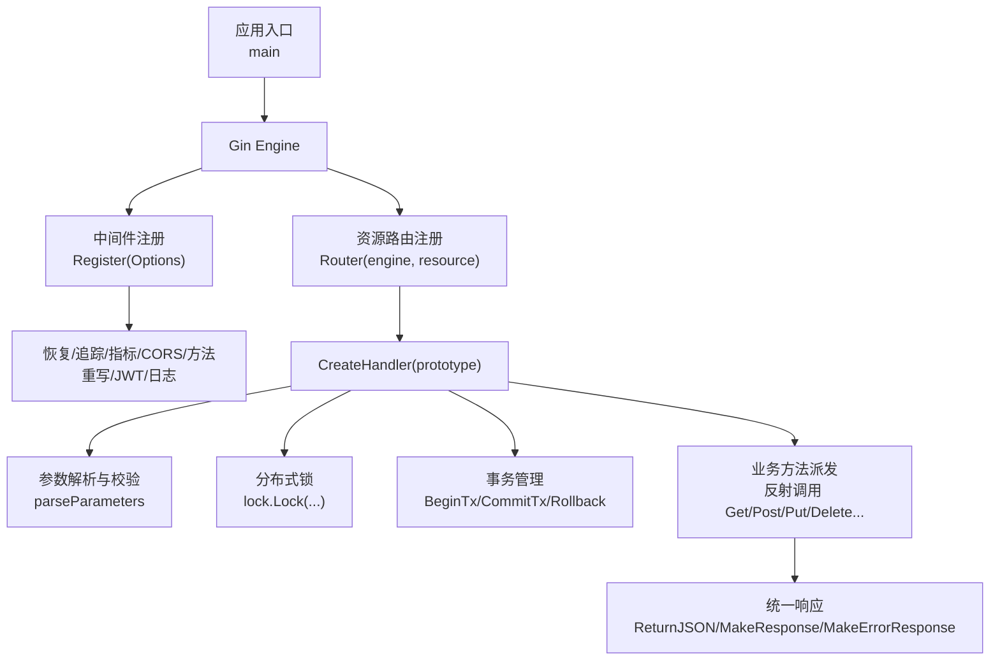
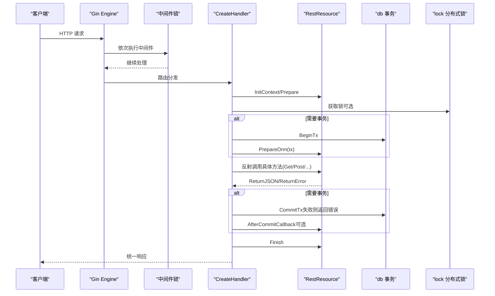
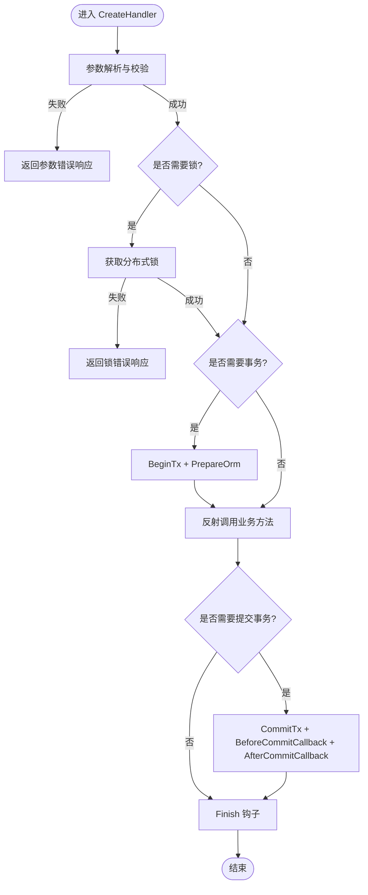
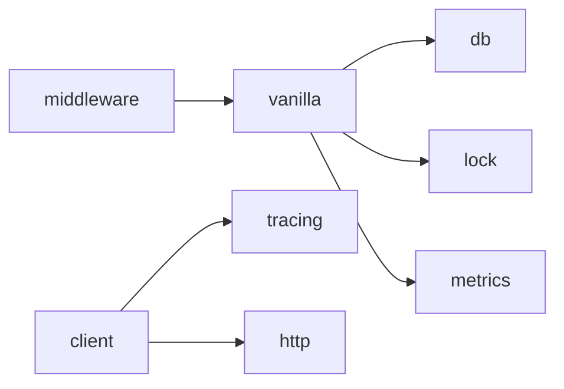

# API 参考

<cite>
**本文引用的文件**
- [README.md](file://README.md)
- [go.mod](file://go.mod)
- [rest_resource.go](file://vanilla/rest_resource.go)
- [handler.go](file://vanilla/handler.go)
- [response.go](file://vanilla/response.go)
- [error.go](file://vanilla/error.go)
- [router.go](file://vanilla/router.go)
- [parameters.go](file://vanilla/parameters.go)
- [register.go](file://middleware/register.go)
- [db.go](file://db/db.go)
- [lock.go](file://lock/lock.go)
- [jwt.go](file://auth/jwt.go)
- [resource.go](file://client/resource.go)
</cite>

## 目录
1. [简介](#简介)
2. [项目结构](#项目结构)
3. [核心组件](#核心组件)
4. [架构总览](#架构总览)
5. [详细组件分析](#详细组件分析)
6. [依赖关系分析](#依赖关系分析)
7. [性能考量](#性能考量)
8. [故障排查指南](#故障排查指南)
9. [结论](#结论)
10. [附录](#附录)

## 简介
本 API 参考文档面向使用 Carina 框架的开发者，系统化梳理并记录所有公共接口与配置项，重点包括：
- RestResource 接口及默认实现、参数校验与响应封装
- BusinessContext 注入与事务生命周期
- 中间件注册选项（CORS、JWT、Metrics、Tracing、Lock）
- 数据库连接与事务工具
- 分布式锁能力
- JWT 认证与解析
- 服务间 HTTP 客户端（带重试与链路追踪）
- 错误码定义与错误处理模式
- 版本兼容性与迁移建议

该文档严格基于仓库中的源码实现进行整理，确保与实际代码一致。

## 项目结构
Carina 以“声明式资源 + 约定式路由”为核心，围绕 vanilla 包提供 REST 资源基类、参数校验、统一响应、事务与锁集成；通过 middleware 提供可插拔的横切能力；db、lock、auth、client 等子包提供基础设施能力。



图表来源
- [register.go:28-71](file://middleware/register.go#L28-L71)
- [router.go:16-64](file://vanilla/router.go#L16-L64)
- [handler.go:29-142](file://vanilla/handler.go#L29-L142)
- [parameters.go:12-128](file://vanilla/parameters.go#L12-L128)
- [response.go:13-55](file://vanilla/response.go#L13-L55)

章节来源
- [README.md:1-154](file://README.md#L1-L154)
- [go.mod:1-20](file://go.mod#L1-L20)

## 核心组件
本节聚焦于框架对外暴露的核心 API 与配置，涵盖接口签名、参数、返回值、行为说明与注意事项。

### RestResource 接口与默认实现
- 接口职责
  - Resource(): string — 返回点分资源名，用于生成路由路径
  - GetAlias(): []string — 自定义 URL 别名
  - GetParameters(): map[string][]string — 按 HTTP Method 声明参数与类型，支持可选前缀 "?"
  - DisableTx(): bool — 是否关闭事务（默认 GET 关闭）
  - GetLockKey(): string — 分布式锁 key
  - GetLockOption(): *lock.LockOption — 锁选项
  - PrepareOrm(db *gorm.DB) — 事务开启前的 ORM 准备钩子
  - GetBusinessContext() context.Context — 获取业务上下文（由中间件注入）
  - IsForDevTest(): bool — 是否为开发测试资源
  - EnableHTMLResource(): bool — 是否启用 HTML 资源
  - InitContext(c *gin.Context) / Prepare() / Finish() — Gin 生命周期钩子

- 默认实现要点
  - 请求上下文初始化、参数缓存、过滤器缓存
  - 参数读取辅助：GetString/GetInt/GetFloat/GetBool/GetJSON/GetJSONArray/GetIntArray/StringArray
  - 过滤器获取：GetFilters()
  - 响应封装：ReturnJSON/ReturnJSONWithCallback/ReturnError
  - 全局提交前回调：SetBeforeCommitCallback/GetBeforeCommitCallback

- 注意事项
  - 每请求创建独立实例，避免共享可变状态
  - 非 GET 请求默认开启事务，GET 默认关闭
  - 若未设置 BusinessCtx，将回退到 gin.Context.Request.Context()

章节来源
- [rest_resource.go:13-132](file://vanilla/rest_resource.go#L13-L132)
- [rest_resource.go:134-283](file://vanilla/rest_resource.go#L134-L283)

### 处理器 CreateHandler
- 职责
  - 启动时预计算资源元数据（方法、参数、锁 key、是否禁用事务）
  - 每请求创建实例，执行参数解析与校验
  - 根据 GetLockKey 加锁（失败返回统一错误响应）
  - 根据 DisableTx 决定是否开启事务（含 PrepareOrm 钩子）
  - 反射派发到具体方法（不存在则返回 405）
  - 提交事务（触发全局提交前回调与 AfterCommitCallback）
  - 记录指标与耗时

- 错误处理
  - 参数校验失败：返回统一错误响应
  - 锁获取失败：返回统一错误响应
  - 事务 Begin/Commit 失败：返回统一错误响应
  - 方法不存在：返回 405 错误响应

章节来源
- [handler.go:15-171](file://vanilla/handler.go#L15-L171)

### 参数解析与校验 parseParameters
- 支持类型
  - string、int、float、bool、json、json-raw、json-array
- 可选参数
  - 以 "?" 前缀表示可选
- 过滤器协议
  - 自动识别 __f-字段-操作符 形式的查询参数
  - 支持 in/notin/range 等特殊操作符，值可为数组或字符串
- 校验失败
  - 返回统一错误响应（包含参数名、类型与内部错误信息）

章节来源
- [parameters.go:12-146](file://vanilla/parameters.go#L12-L146)

### 路由注册 Router
- 约定式路由
  - 标准路径：/account/corp/
  - API 路径：/account/api/corp/
  - 别名路径：通过 GetAlias() 自定义
- 注册方法
  - 为每个路径注册 GET/POST/PUT/DELETE/PATCH
- 开发测试资源
  - 可通过环境变量控制是否注册开发测试资源

章节来源
- [router.go:11-70](file://vanilla/router.go#L11-L70)

### 中间件注册 Register
- 选项 Options
  - CORSOrigins: []string — 允许的跨域源
  - JWTSecret: string — JWT 密钥（空则跳过认证）
  - EnableTx: bool — 是否启用自动事务（由 handler 控制）
  - EnableLock: bool — 是否启用分布式锁（由 handler 控制）
  - EnableMetrics: bool — 是否启用 Prometheus 指标
  - EnableTracing: bool — 是否启用 OpenTelemetry 链路追踪
  - SkipJWTPaths: []string — 跳过 JWT 认证的 URL 前缀
  - Extra: []gin.HandlerFunc — 项目自定义中间件（在内置之后挂载）
- 挂载顺序
  - Recovery → Tracing → Metrics → CORS → MethodOverride → JWTAuth → Extra → RequestLog

章节来源
- [register.go:7-72](file://middleware/register.go#L7-L72)

### 数据库与事务 db
- 初始化
  - Init(dialector, *Options) — 全局单例初始化，支持连接池配置
- 获取 DB
  - GetDB() — 未初始化会 panic
  - GetDBWithContext(ctx) — 优先返回事务中的 DB，否则返回全局 DB
- 事务注入
  - ContextWithTx(ctx, tx) / TxFromContext(ctx) — 通过 context 传递事务
  - WithTransaction(ctx, fn) — 自动 Begin/Commit/Rollback，panic 时回滚
- 注意
  - 必须在任何 DB 功能使用前调用 Init

章节来源
- [db.go:12-119](file://db/db.go#L12-L119)

### 分布式锁 lock
- 引擎接口 ILock
  - Lock(key string, opts ...*LockOption) (*Mutex, error)
- 实现
  - DummyLock：开发环境空实现
  - RedisLock：基于 redsync 的 Redis 实现
- 全局初始化
  - InitDummy()：默认空锁
  - InitRedis(client)：使用 go-redis 客户端初始化
- 使用
  - Lock(key, opts...)：使用全局引擎加锁

章节来源
- [lock.go:1-70](file://lock/lock.go#L1-L70)

### JWT 认证 auth
- 初始化
  - Init(secret string)：设置 HMAC-SHA256 密钥
- 编解码
  - Encode(userId, authUserId, tokenType int, days int) (string, error)
  - Decode(tokenString string) (*Claims, error)
- 解析用户
  - ParseUserId(tokenString string) (userId int, authUserId int, err error)
- 错误
  - ErrInvalidToken、ErrTokenExpired

章节来源
- [jwt.go:1-93](file://auth/jwt.go#L1-L93)

### 服务间调用 client.Resource
- 初始化
  - Init(serviceName, serviceMode, apiServerHost string)
- 客户端
  - NewResource(ctx) *Resource
  - DisableRetry() *Resource
  - Get/Post/Put/Delete(service, resource, data Map) (*ResourceResponse, error)
- 特性
  - 自动携带 JWT（从 context 或 CustomJWTToken）
  - 自动注入 tracing span 并传播 trace context
  - 默认重试次数 3 次（可禁用）
  - 统一构造 URL 与 query params，PUT/DELETE 通过 _method 重写

章节来源
- [resource.go:18-225](file://client/resource.go#L18-L225)

### 统一响应 response
- 结构 Response
  - Code: int32
  - Data: interface{}
  - ErrCode: string
  - ErrMsg: string
  - InnerErrMsg: string
  - MachineInfo: Map（机器信息）
- 构造器
  - MakeResponse(data)
  - MakeResponseWithCode(code, data)
  - MakeErrorResponse(code, errCode, errMsg, innerErrMsgs...)

章节来源
- [response.go:7-55](file://vanilla/response.go#L7-L55)

### 错误模型 error
- 类型
  - ErrorTypeBusiness：业务错误（正常流程）
  - ErrorTypeSystem：系统错误（需关注）
- BusinessError
  - Type、ErrCode、ErrMsg、needPushToSentry
  - Error()、IsPanicError()、NoPush()、IsNeedPush()
- 工厂
  - NewBusinessError(code, msg)
  - NewBusinessErrorFromError(err)
  - NewSystemError(code, msg)

章节来源
- [error.go:5-76](file://vanilla/error.go#L5-L76)

## 架构总览
下图展示了从请求进入至响应返回的关键流程，包括参数校验、锁、事务、业务方法与统一响应。



图表来源
- [handler.go:42-142](file://vanilla/handler.go#L42-L142)
- [parameters.go:12-128](file://vanilla/parameters.go#L12-L128)
- [lock.go:66-69](file://lock/lock.go#L66-L69)
- [db.go:93-115](file://db/db.go#L93-L115)

## 详细组件分析

### RestResource 接口与默认实现
- 设计模式
  - 组合与钩子：通过内嵌 RestResource 获得参数解析、响应封装、过滤器等能力
  - 生命周期：InitContext → Prepare → 业务方法 → Finish
- 复杂度与性能
  - 参数解析在 handler 中集中处理，减少重复逻辑
  - 每请求新建实例，避免并发竞争
- 依赖关系
  - 依赖 gin.Context、db、lock、metrics 等模块

```mermaid
classDiagram
class RestResourceInterface {
+Resource() string
+GetAlias() []string
+GetParameters() map[string][]string
+DisableTx() bool
+GetLockKey() string
+GetLockOption() *LockOption
+PrepareOrm(db) void
+GetBusinessContext() Context
+IsForDevTest() bool
+EnableHTMLResource() bool
+InitContext(c) void
+Prepare() void
+Finish() void
}
class RestResource {
+Ctx *gin.Context
+Name2JSON map[string]map[string]interface{}
+Name2JSONArray map[string][]interface{}
+Name2RAWJSON map[string]interface{}
+Filters map[string]interface{}
+AfterCommitCallback func()
+BusinessCtx Context
+InitContext(c) void
+Prepare() void
+Finish() void
+GetString(key) string
+GetInt(key) (int,bool)
+GetFloat(key) (float64,bool)
+GetBool(key) (bool,bool)
+GetJSON(key) map[string]interface{}
+GetJSONArray(key) []interface{}
+GetIntArray(key) []int
+GetStringArray(key) []string
+GetFilters() map[string]interface{}
+ReturnJSON(response) void
+ReturnJSONWithCallback(response,callback) void
+ReturnError(code,errCode,errMsg) void
}
RestResourceInterface <|.. RestResource : "实现"
```

图表来源
- [rest_resource.go:13-132](file://vanilla/rest_resource.go#L13-L132)
- [rest_resource.go:134-283](file://vanilla/rest_resource.go#L134-L283)

章节来源
- [rest_resource.go:13-283](file://vanilla/rest_resource.go#L13-L283)

### 处理器 CreateHandler 流程
- 关键步骤
  - 参数解析与校验
  - 分布式锁获取
  - 事务开启与 PrepareOrm
  - 反射派发到具体方法
  - 事务提交与回调
  - 指标记录与耗时统计
- 异常与错误
  - 参数校验失败、锁获取失败、事务失败、方法不存在均返回统一错误响应



图表来源
- [handler.go:42-142](file://vanilla/handler.go#L42-L142)
- [parameters.go:12-128](file://vanilla/parameters.go#L12-L128)
- [lock.go:66-69](file://lock/lock.go#L66-L69)
- [db.go:93-115](file://db/db.go#L93-L115)

章节来源
- [handler.go:29-171](file://vanilla/handler.go#L29-L171)

### 参数解析与过滤器协议
- 参数类型与可选标记
  - string/int/float/bool/json/json-raw/json-array
  - "?" 前缀表示可选
- 过滤器协议
  - __f-字段-操作符，支持 in/notin/range
  - 自动解析为 Filters 供业务层使用
- 校验失败
  - 返回统一错误响应，包含参数名、类型与内部错误信息

章节来源
- [parameters.go:12-146](file://vanilla/parameters.go#L12-L146)

### 路由与资源注册
- 约定式路径
  - 标准路径与 API 路径自动生成
  - 别名路径通过 GetAlias() 扩展
- 开发测试资源
  - 可通过环境变量控制是否注册

章节来源
- [router.go:11-70](file://vanilla/router.go#L11-L70)

### 中间件与配置
- 中间件顺序与开关
  - Recovery/Tracing/Metrics/CORS/MethodOverride/JWTAuth/Extra/RequestLog
- 配置项
  - CORSOrigins、JWTSecret、EnableTx、EnableLock、EnableMetrics、EnableTracing、SkipJWTPaths、Extra

章节来源
- [register.go:7-72](file://middleware/register.go#L7-L72)

### 数据库与事务
- 初始化与获取
  - Init、GetDB、GetDBWithContext
- 事务工具
  - ContextWithTx、TxFromContext、WithTransaction
- 注意事项
  - 未初始化会 panic
  - 建议在业务层通过 GetDBWithContext 获取 DB，自动感知事务

章节来源
- [db.go:12-119](file://db/db.go#L12-L119)

### 分布式锁
- 引擎选择
  - DummyLock（开发）、RedisLock（生产）
- 初始化
  - InitDummy、InitRedis
- 使用
  - Lock(key, opts...)

章节来源
- [lock.go:1-70](file://lock/lock.go#L1-L70)

### JWT 认证
- 初始化与编解码
  - Init、Encode、Decode
- 用户解析
  - ParseUserId
- 错误
  - ErrInvalidToken、ErrTokenExpired

章节来源
- [jwt.go:1-93](file://auth/jwt.go#L1-L93)

### 服务间调用客户端
- 初始化与客户端
  - Init、NewResource、DisableRetry
- 方法
  - Get/Post/Put/Delete
- 特性
  - 自动携带 JWT、tracing 注入与传播、默认重试

章节来源
- [resource.go:18-225](file://client/resource.go#L18-L225)

### 统一响应与错误
- 响应结构
  - Response（code/data/errCode/errMsg/innerErrMsg/machineInfo）
- 构造器
  - MakeResponse、MakeResponseWithCode、MakeErrorResponse
- 错误模型
  - BusinessError（业务/系统）、NewBusinessError、NewSystemError

章节来源
- [response.go:7-55](file://vanilla/response.go#L7-L55)
- [error.go:5-76](file://vanilla/error.go#L5-L76)

## 依赖关系分析
- 模块耦合
  - vanilla 包依赖 db、lock、metrics、machine
  - middleware 依赖各中间件实现
  - client 依赖 tracing 与 http
- 外部依赖
  - Gin、GORM、redsync、JWT、Prometheus、OpenTelemetry、Viper、Redis



图表来源
- [go.mod:5-20](file://go.mod#L5-L20)
- [handler.go:1-171](file://vanilla/handler.go#L1-L171)
- [register.go:1-72](file://middleware/register.go#L1-L72)
- [resource.go:1-225](file://client/resource.go#L1-L225)

章节来源
- [go.mod:1-87](file://go.mod#L1-L87)

## 性能考量
- 参数解析与校验在处理器中集中执行，减少重复开销
- 每请求创建资源实例，避免并发竞争
- 事务仅在非 GET 请求开启，降低读多写少场景的开销
- 分布式锁按需启用，避免不必要的阻塞
- 指标与追踪可按需启用，减少运行时开销
- 服务间调用默认重试 3 次，可根据业务调整

[本节为通用指导，不直接分析具体文件]

## 故障排查指南
- 参数校验失败
  - 检查 GetParameters 声明与传入参数类型
  - 查看返回的错误响应中的 errCode 与 errMsg
- 锁获取失败
  - 检查 Redis 连接与锁配置
  - 确认锁 key 是否合理
- 事务失败
  - 检查数据库连接与 SQL 语句
  - 关注 Begin/Commit 错误响应
- JWT 认证失败
  - 检查密钥初始化与 token 有效性
  - 区分过期与无效 token 错误
- 服务间调用失败
  - 检查 APIServerHost、service、resource 路径
  - 查看 tracing 与重试情况

章节来源
- [parameters.go:125-128](file://vanilla/parameters.go#L125-L128)
- [handler.go:54-81](file://vanilla/handler.go#L54-L81)
- [jwt.go:11-14](file://auth/jwt.go#L11-L14)
- [resource.go:113-225](file://client/resource.go#L113-L225)

## 结论
Carina 通过声明式资源与约定式路由，结合中间件与基础设施能力，提供了完整的微服务基础框架。开发者只需关注业务逻辑，即可获得参数校验、事务、锁、认证、指标与追踪等能力。遵循本文档的 API 规范与最佳实践，可快速构建稳定可靠的微服务。

[本节为总结性内容，不直接分析具体文件]

## 附录

### 版本兼容性与迁移指南
- 版本策略
  - 遵循 Semver：bug 修复 patch、新增能力 minor、破坏性变更 major
  - 公共 API 从 Deprecated 到删除至少跨 2 个 minor 版本
- 迁移建议
  - 升级 minor 版本通常无需改动
  - 升级 major 版本需对照变更清单调整代码
  - 关注 RestResource 接口契约变更（编译期断言保证）

章节来源
- [README.md:137-148](file://README.md#L137-L148)

### 使用示例指引
- 资源编写
  - 内嵌 RestResource，实现 Resource/GetParameters 等方法
  - 使用 GetString/GetInt/GetJSON 等辅助方法获取参数
  - 使用 ReturnJSON/ReturnError 返回统一响应
- 路由注册
  - 使用 Router(engine, resource) 注册资源
- 中间件注册
  - 使用 Register(engine, Options) 一站式注册中间件
- 数据库与事务
  - 使用 db.Init 初始化，业务层通过 GetDBWithContext 获取 DB
- 分布式锁
  - 使用 lock.InitRedis 或 lock.InitDummy，资源中通过 GetLockKey 声明锁
- JWT 认证
  - 使用 auth.Init 设置密钥，中间件自动注入业务上下文
- 服务间调用
  - 使用 client.Init 初始化，Resource.Get/Post/Put/Delete 发起调用

章节来源
- [README.md:27-136](file://README.md#L27-L136)
- [rest_resource.go:134-283](file://vanilla/rest_resource.go#L134-L283)
- [router.go:16-64](file://vanilla/router.go#L16-L64)
- [register.go:28-72](file://middleware/register.go#L28-L72)
- [db.go:25-119](file://db/db.go#L25-L119)
- [lock.go:51-69](file://lock/lock.go#L51-L69)
- [jwt.go:18-93](file://auth/jwt.go#L18-L93)
- [resource.go:39-225](file://client/resource.go#L39-L225)