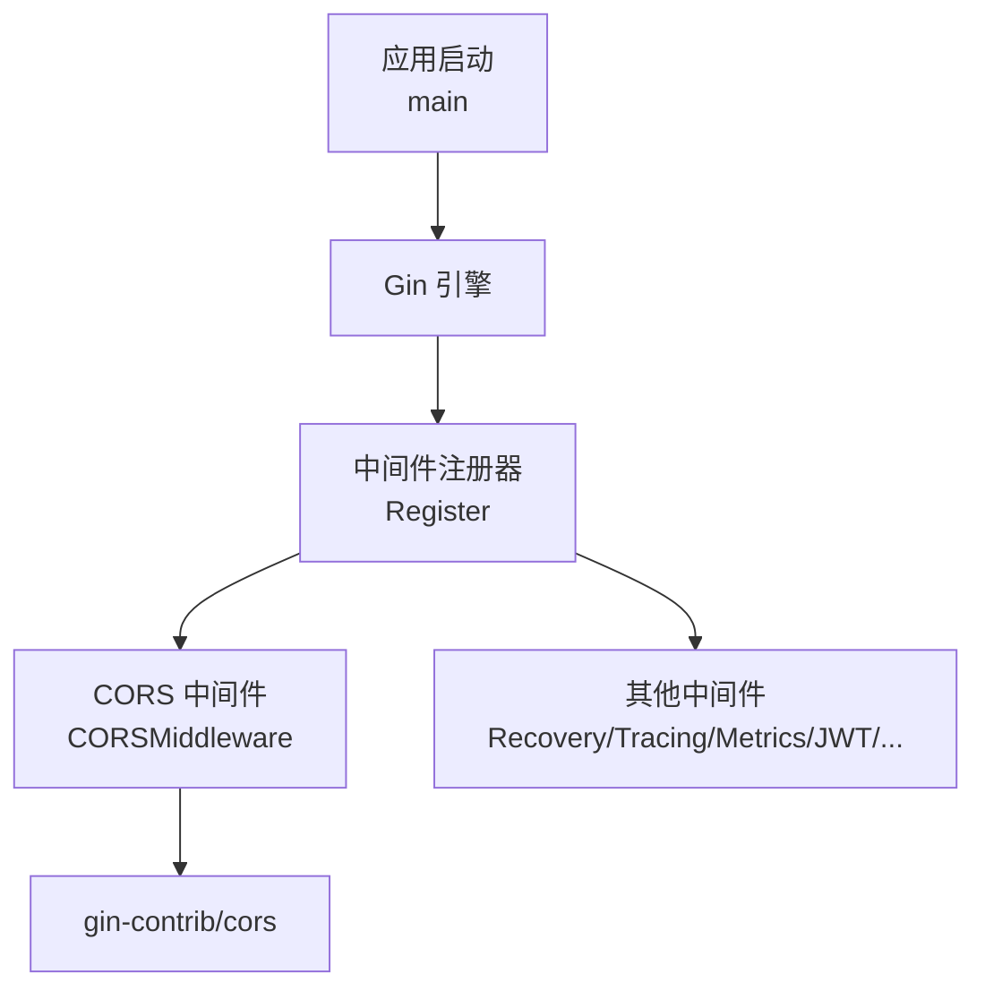
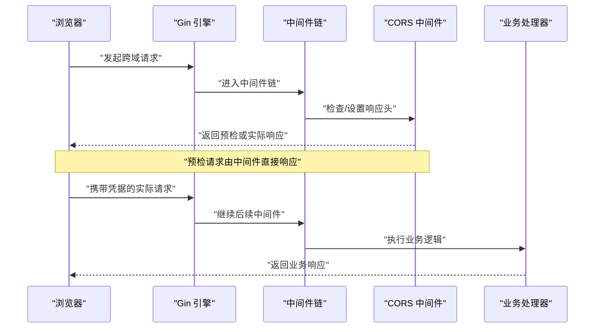
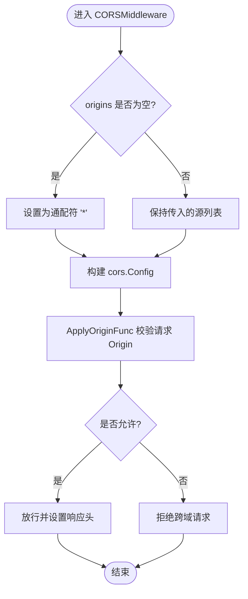
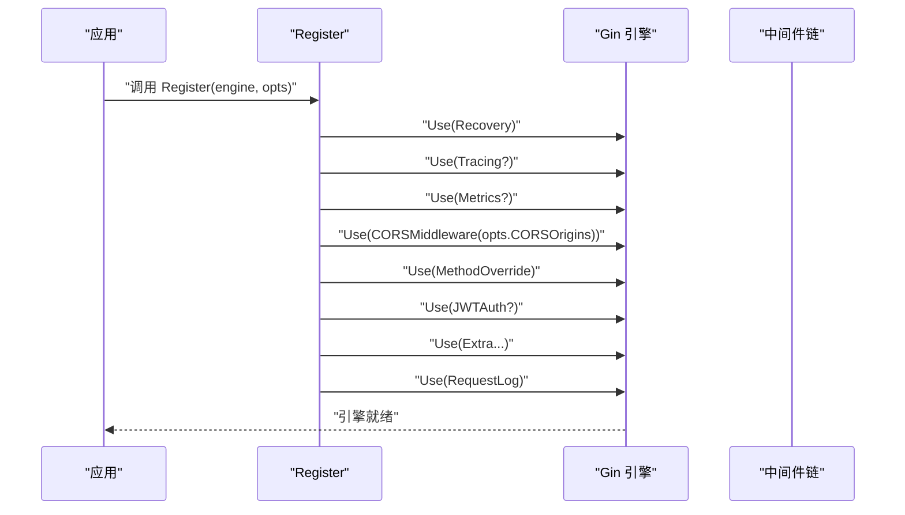
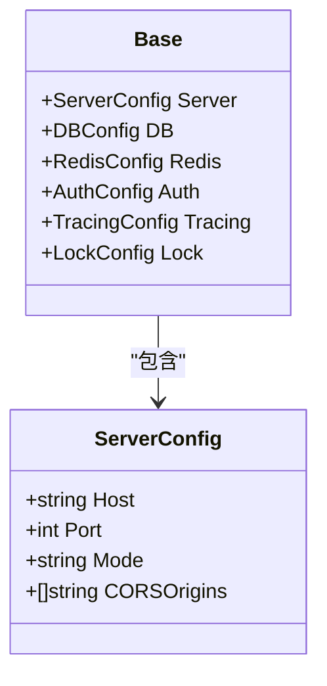
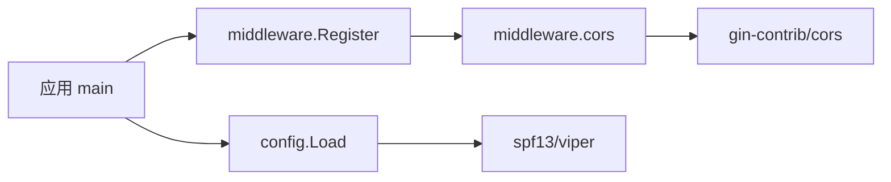

# CORS 中间件

<cite>
**本文引用的文件**
- [middleware/cors.go](file://middleware/cors.go)
- [middleware/register.go](file://middleware/register.go)
- [config/types.go](file://config/types.go)
- [config/config.go](file://config/config.go)
- [README.md](file://README.md)
</cite>

## 目录
1. [简介](#简介)
2. [项目结构](#项目结构)
3. [核心组件](#核心组件)
4. [架构总览](#架构总览)
5. [详细组件分析](#详细组件分析)
6. [依赖关系分析](#依赖关系分析)
7. [性能与缓存](#性能与缓存)
8. [故障诊断与排错](#故障诊断与排错)
9. [结论](#结论)
10. [附录：不同环境的配置示例](#附录不同环境的配置示例)

## 简介
本文件面向跨域资源共享（CORS）中间件的实现与使用，结合代码仓库中的实际实现，解释其工作原理、安全考量、配置项含义以及在不同部署环境下的使用方法。该中间件基于 gin-contrib/cors 构建，提供可配置的允许源、方法、头部、凭据、预检缓存等能力，并通过统一的中间件注册入口集成到 Gin 引擎中。

## 项目结构
与 CORS 相关的代码主要分布在以下位置：
- 中间件实现：middleware/cors.go
- 中间件统一注册：middleware/register.go
- 配置结构定义：config/types.go
- 配置加载机制：config/config.go
- 快速开始示例：README.md

图表来源
- [middleware/register.go:28-71](file://middleware/register.go#L28-L71)
- [middleware/cors.go:11-39](file://middleware/cors.go#L11-L39)

章节来源
- [middleware/register.go:28-71](file://middleware/register.go#L28-L71)
- [middleware/cors.go:11-39](file://middleware/cors.go#L11-L39)

## 核心组件
- CORSMiddleware：创建并返回一个 Gin 中间件函数，内部封装 gin-contrib/cors 的配置。
- CORSMiddlewareWithOrigins：便捷构造器，用于显式传入允许的源列表。
- Register：一站式注册所有内置中间件，其中包含 CORS 中间件的挂载顺序和参数传递。

关键要点
- 当未指定或为空时，默认允许所有源（通配符）。
- 支持自定义 AllowOriginFunc，用于在运行时校验请求 Origin。
- 默认启用凭据（AllowCredentials=true），需配合精确的源白名单使用。
- 预检请求缓存时间 MaxAge=12 小时，减少重复预检开销。

章节来源
- [middleware/cors.go:11-44](file://middleware/cors.go#L11-L44)
- [middleware/register.go:28-71](file://middleware/register.go#L28-L71)

## 架构总览
CORS 中间件在请求处理链中的位置如下：
- 最外层 Recovery（捕获 panic）
- 可选 Tracing（链路追踪）
- 可选 Metrics（指标统计）
- CORS（跨域处理）
- MethodOverride（方法重写）
- JWT Auth（认证）
- Extra（自定义中间件）
- RequestLog（请求日志）

图表来源
- [middleware/register.go:28-71](file://middleware/register.go#L28-L71)
- [middleware/cors.go:11-39](file://middleware/cors.go#L11-L39)

## 详细组件分析

### CORSMiddleware 实现解析
- 允许源（AllowOrigins）：若传入为空则退化为通配符；同时通过 AllowOriginFunc 进行二次校验，确保行为一致。
- 允许方法（AllowMethods）：覆盖常用 HTTP 方法与 OPTIONS。
- 允许头部（AllowHeaders）：包含常见业务与鉴权相关头部。
- 暴露头部（ExposeHeaders）：仅暴露 Content-Length。
- 凭据（AllowCredentials）：默认开启，便于携带 Cookie/Authorization。
- 预检缓存（MaxAge）：12 小时，降低预检频率。
- 其他开关：允许通配符、浏览器扩展、WebSocket。

图表来源
- [middleware/cors.go:11-39](file://middleware/cors.go#L11-L39)

章节来源
- [middleware/cors.go:11-39](file://middleware/cors.go#L11-L39)

### 中间件注册与挂载顺序
- Register 将 CORS 中间件作为第 4 个中间件挂载，位于 Metrics 之后、MethodOverride 之前。
- 通过 Options.CORSOrigins 注入允许源列表，若为空则按中间件内部默认策略处理。

图表来源
- [middleware/register.go:28-71](file://middleware/register.go#L28-L71)

章节来源
- [middleware/register.go:28-71](file://middleware/register.go#L28-L71)

### 配置结构与加载
- ServerConfig 包含 CORSOrigins 字段，映射自配置文件键 cors_origins。
- config.Load 支持环境变量覆盖与环境特定配置文件合并（GO_ENV）。
- README 展示了如何将 cfg.Server.CORSOrigins 传递给中间件注册。

图表来源
- [config/types.go:3-53](file://config/types.go#L3-L53)

章节来源
- [config/types.go:3-53](file://config/types.go#L3-L53)
- [config/config.go:11-60](file://config/config.go#L11-L60)
- [README.md:43-73](file://README.md#L43-L73)

## 依赖关系分析
- 中间件层依赖 gin-contrib/cors 与 gin-gonic/gin。
- 配置层依赖 spf13/viper 进行 YAML 与环境变量加载。
- 应用通过 middleware.Register 将配置注入中间件，形成松耦合的装配方式。

图表来源
- [middleware/register.go:28-71](file://middleware/register.go#L28-L71)
- [middleware/cors.go:1-9](file://middleware/cors.go#L1-L9)
- [config/config.go:1-60](file://config/config.go#L1-L60)

章节来源
- [middleware/register.go:28-71](file://middleware/register.go#L28-L71)
- [middleware/cors.go:1-9](file://middleware/cors.go#L1-L9)
- [config/config.go:1-60](file://config/config.go#L1-L60)

## 性能与缓存
- 预检请求缓存：MaxAge 设置为 12 小时，浏览器会缓存预检结果，显著减少重复 OPTIONS 请求。
- 允许通配符与浏览器扩展：提升兼容性，但生产环境建议限制为具体域名以提升安全性。
- 最小化暴露头部：仅暴露必要头部，减少信息泄露风险。

[本节为通用性能讨论，不直接分析具体文件]

## 故障诊断与排错
常见问题与排查步骤：
- 浏览器控制台出现“跨域错误”
  - 检查请求的 Origin 是否在允许源列表中（或为通配符）。
  - 确认 AllowCredentials 已启用且源为精确域名（非通配符）时，浏览器要求源必须明确匹配。
  - 检查请求头是否包含在 AllowHeaders 中。
- 预检请求失败
  - 确认服务器正确响应了 OPTIONS 请求，并设置了 Access-Control-Allow-Methods 与 Access-Control-Allow-Headers。
  - 观察浏览器缓存的预检结果是否与当前配置一致（MaxAge=12h）。
- 凭据无法携带
  - 若启用了 AllowCredentials，请确保 AllowOrigins 不为通配符，且前端设置 withCredentials=true。
- WebSocket 跨域
  - 中间件已启用 AllowWebSockets，仍需确保上游代理（如 Nginx）正确转发并保留必要的跨域头。

章节来源
- [middleware/cors.go:11-39](file://middleware/cors.go#L11-L39)
- [middleware/register.go:28-71](file://middleware/register.go#L28-L71)

## 结论
该 CORS 中间件以简洁的方式提供了常用的跨域能力，并通过统一的注册入口与配置结构实现了灵活的环境适配。生产环境中应谨慎使用通配符，优先采用精确的源白名单，并结合合理的头部与方法限制，确保安全与性能的平衡。

[本节为总结性内容，不直接分析具体文件]

## 附录：不同环境的配置示例
以下为不同部署环境下如何配置 CORS 的建议与步骤（基于仓库提供的配置结构与加载机制）：

- 开发环境
  - 目标：快速联调，允许本地任意来源访问。
  - 配置建议：
    - 在配置文件中设置 server.cors_origins 为空数组或不配置，使中间件默认允许所有源。
    - 或通过环境变量覆盖（依据 viper 的 AutomaticEnv 行为）。
  - 参考路径：
    - [config/types.go:3-53](file://config/types.go#L3-L53)
    - [config/config.go:11-60](file://config/config.go#L11-L60)
    - [middleware/cors.go:11-39](file://middleware/cors.go#L11-L39)

- 测试环境
  - 目标：限定可信的前端域名集合，避免误用通配符。
  - 配置建议：
    - 在配置文件中设置 server.cors_origins 为多个受信任的域名列表。
    - 可通过 GO_ENV 切换不同的环境配置文件进行覆盖。
  - 参考路径：
    - [config/types.go:3-53](file://config/types.go#L3-L53)
    - [config/config.go:11-60](file://config/config.go#L11-L60)
    - [middleware/register.go:28-71](file://middleware/register.go#L28-L71)

- 生产环境
  - 目标：严格的安全策略，最小权限原则。
  - 配置建议：
    - 明确列出允许的前端域名（不含通配符），并确保 AllowCredentials=true 时源为精确匹配。
    - 限制 AllowMethods 与 AllowHeaders 为业务所需的最小集合。
    - 监控预检请求数量与失败率，必要时调整 MaxAge。
  - 参考路径：
    - [middleware/cors.go:11-39](file://middleware/cors.go#L11-L39)
    - [middleware/register.go:28-71](file://middleware/register.go#L28-L71)
    - [README.md:43-73](file://README.md#L43-L73)

[本节为概念性指导，不直接展示代码片段]