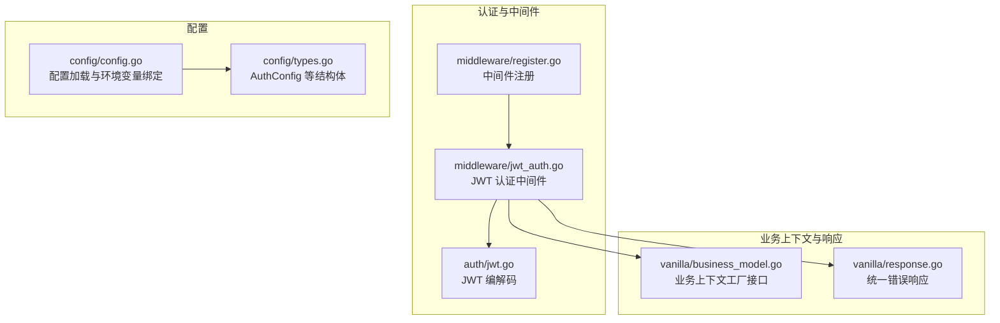
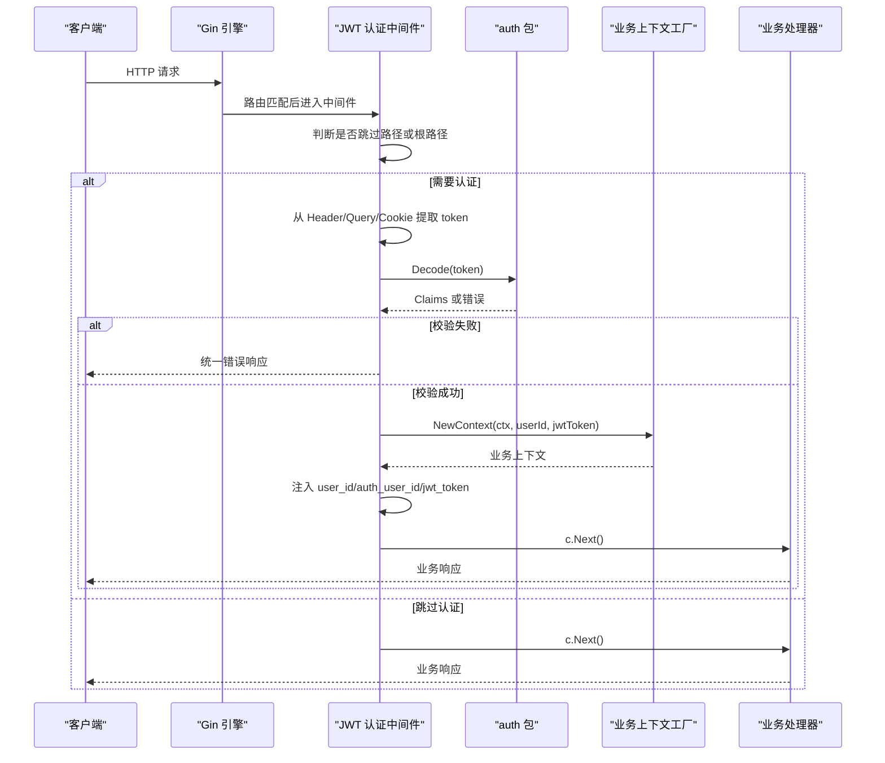
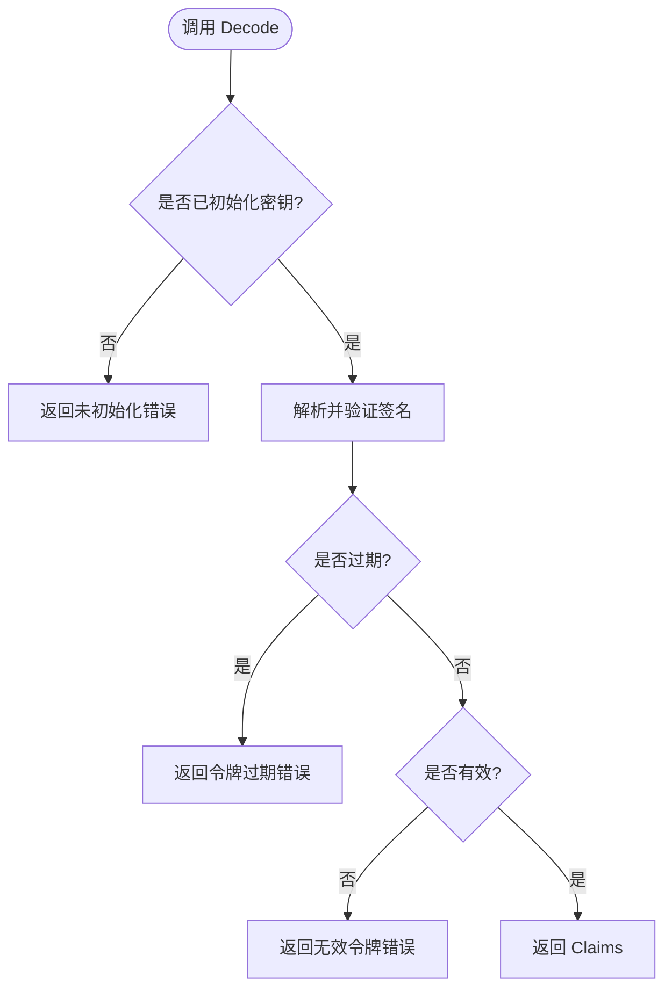
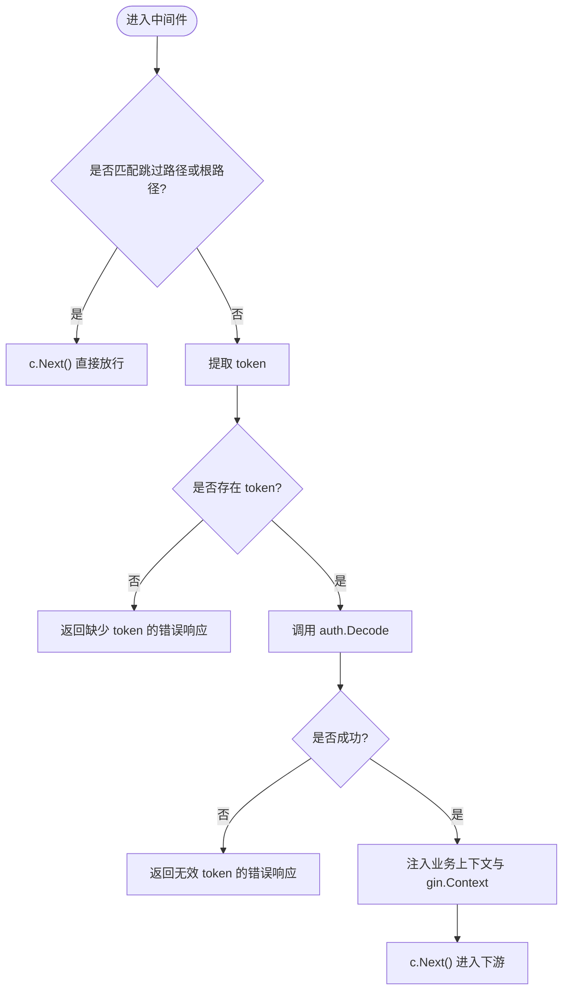
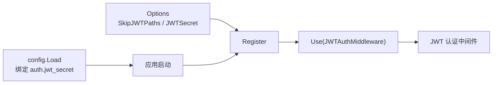
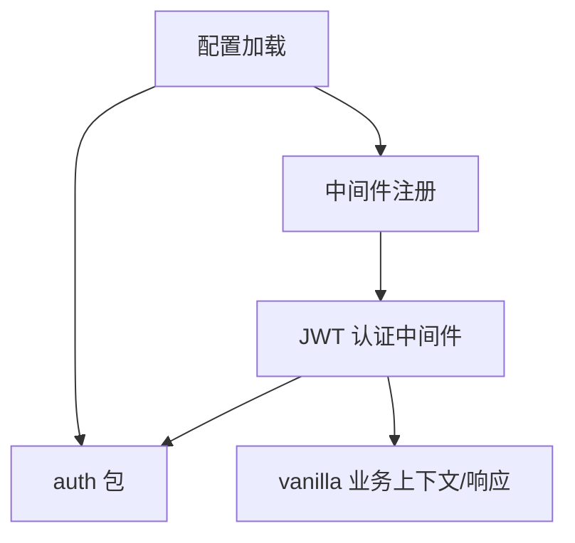

# JWT 认证中间件

<cite>
**本文引用的文件**
- [middleware/jwt_auth.go](file://middleware/jwt_auth.go)
- [auth/jwt.go](file://auth/jwt.go)
- [config/config.go](file://config/config.go)
- [config/types.go](file://config/types.go)
- [middleware/register.go](file://middleware/register.go)
- [vanilla/business_model.go](file://vanilla/business_model.go)
- [vanilla/response.go](file://vanilla/response.go)
</cite>

## 目录
1. [简介](#简介)
2. [项目结构](#项目结构)
3. [核心组件](#核心组件)
4. [架构总览](#架构总览)
5. [详细组件分析](#详细组件分析)
6. [依赖关系分析](#依赖关系分析)
7. [性能与扩展性](#性能与扩展性)
8. [故障排查指南](#故障排查指南)
9. [结论](#结论)
10. [附录：最佳实践与安全建议](#附录最佳实践与安全建议)

## 简介
本文件面向使用 Carina 框架的开发者，系统性说明 JWT 认证中间件的实现原理、配置方式与使用场景。重点覆盖：
- JWT 令牌的生成、解析与校验流程
- 用户上下文注入机制（业务上下文与 gin.Context）
- 权限控制思路与扩展点
- SkipJWTPaths 的配置与典型用法
- 令牌过期处理、错误响应格式
- 安全加固建议与常见漏洞防护

## 项目结构
JWT 认证相关代码分布在以下模块：
- auth：JWT 编解码、密钥初始化、自定义 Claims
- middleware：Gin 中间件，负责提取 token、鉴权、注入上下文
- config：集中式配置加载，包含 auth.jwt_secret 环境变量绑定
- vanilla：业务上下文工厂接口与统一响应结构

图表来源
- [middleware/jwt_auth.go:13-62](file://middleware/jwt_auth.go#L13-L62)
- [auth/jwt.go:18-74](file://auth/jwt.go#L18-L74)
- [middleware/register.go:28-71](file://middleware/register.go#L28-L71)
- [config/config.go:21-60](file://config/config.go#L21-L60)
- [config/types.go:25-28](file://config/types.go#L25-L28)
- [vanilla/business_model.go:50-71](file://vanilla/business_model.go#L50-L71)
- [vanilla/response.go:41-54](file://vanilla/response.go#L41-L54)

章节来源
- [middleware/jwt_auth.go:13-62](file://middleware/jwt_auth.go#L13-L62)
- [auth/jwt.go:18-74](file://auth/jwt.go#L18-L74)
- [middleware/register.go:28-71](file://middleware/register.go#L28-L71)
- [config/config.go:21-60](file://config/config.go#L21-L60)
- [config/types.go:25-28](file://config/types.go#L25-L28)
- [vanilla/business_model.go:50-71](file://vanilla/business_model.go#L50-L71)
- [vanilla/response.go:41-54](file://vanilla/response.go#L41-L54)

## 核心组件
- JWT 编解码库封装（auth）
  - 提供 Init、Encode、Decode、ParseUserId
  - 使用 HMAC-SHA256 签名，支持过期时间设置
  - 定义 Claims 包含 UserId、AuthUserId、Type 及标准字段
- Gin 认证中间件（middleware）
  - 从 AUTHORIZATION、_jwt query、_jwt cookie 中按优先级提取 token
  - 跳过指定路径与根路径
  - 调用 auth.Decode 校验并注入业务上下文与 gin.Context
  - 统一错误响应格式
- 配置系统（config）
  - 通过 viper 加载 YAML 与环境变量
  - 敏感字段 auth.jwt_secret 支持环境变量覆盖
- 业务上下文（vanilla）
  - 暴露 IBusinessContextFactory 接口，允许项目自定义注入逻辑
  - 提供 Set/Get 工厂方法，供中间件在运行时获取

章节来源
- [auth/jwt.go:18-92](file://auth/jwt.go#L18-L92)
- [middleware/jwt_auth.go:13-80](file://middleware/jwt_auth.go#L13-L80)
- [config/config.go:21-60](file://config/config.go#L21-L60)
- [config/types.go:25-28](file://config/types.go#L25-L28)
- [vanilla/business_model.go:50-71](file://vanilla/business_model.go#L50-L71)

## 架构总览
下图展示了请求进入后的认证流程：中间件拦截 → 提取 token → 校验 → 注入上下文 → 继续后续处理。

图表来源
- [middleware/jwt_auth.go:16-61](file://middleware/jwt_auth.go#L16-L61)
- [auth/jwt.go:52-74](file://auth/jwt.go#L52-L74)
- [vanilla/business_model.go:50-71](file://vanilla/business_model.go#L50-L71)

## 详细组件分析

### JWT 编解码（auth）
- 密钥管理
  - 全局密钥通过 Init 设置，未初始化时 Encode/Decode 会返回错误
- 令牌生成
  - Encode 接受 userId、authUserId、tokenType、有效期天数；默认 365 天
  - 使用 HS256 签名，写入 ExpiresAt、IssuedAt
- 令牌校验
  - Decode 强制要求 HMAC 算法，拒绝其他算法
  - 将 jwt.ErrTokenExpired 转换为 ErrTokenExpired，其它错误包装为 ErrInvalidToken
- 便捷解析
  - ParseUserId 根据 Type 返回不同的 userId/authUserId 组合

图表来源
- [auth/jwt.go:52-74](file://auth/jwt.go#L52-L74)

章节来源
- [auth/jwt.go:18-92](file://auth/jwt.go#L18-L92)

### JWT 认证中间件（middleware）
- 跳过策略
  - 支持传入 skipPaths 列表，若请求路径以任一前缀匹配则跳过认证
  - 根路径 "/" 始终跳过认证
- Token 提取顺序
  1) AUTHORIZATION header
  2) _jwt query 参数
  3) _jwt cookie
- 认证流程
  - 缺失 token：返回统一错误响应
  - 解析失败：返回统一错误响应
  - 成功：注入业务上下文与 gin.Context 键值
- 上下文注入
  - 通过 vanilla 的业务上下文工厂注入可定制内容
  - 同时向 gin.Context 注入 user_id、auth_user_id、jwt_token

图表来源
- [middleware/jwt_auth.go:16-61](file://middleware/jwt_auth.go#L16-L61)
- [middleware/jwt_auth.go:64-80](file://middleware/jwt_auth.go#L64-L80)

章节来源
- [middleware/jwt_auth.go:13-80](file://middleware/jwt_auth.go#L13-L80)

### 配置与注册（config + register）
- 配置加载
  - 使用 viper 读取基础配置文件与环境覆盖
  - 敏感字段 auth.jwt_secret 可通过环境变量覆盖
- 中间件注册
  - Register 函数按固定顺序挂载内置中间件
  - 当 opts.JWTSecret 非空时启用 JWT 认证中间件，并传入 opts.SkipJWTPaths

图表来源
- [middleware/register.go:7-26](file://middleware/register.go#L7-L26)
- [middleware/register.go:28-71](file://middleware/register.go#L28-L71)
- [config/config.go:21-60](file://config/config.go#L21-L60)
- [config/types.go:25-28](file://config/types.go#L25-L28)

章节来源
- [middleware/register.go:7-71](file://middleware/register.go#L7-L71)
- [config/config.go:21-60](file://config/config.go#L21-L60)
- [config/types.go:25-28](file://config/types.go#L25-L28)

### 业务上下文与权限控制
- 业务上下文工厂
  - 通过 vanilla 暴露的 IBusinessContextFactory 接口，由项目实现 NewContext
  - 中间件在认证成功时调用工厂，将 userId 与 jwtToken 传入，用于后续业务层访问
- 权限控制建议
  - 在业务上下文中附加角色、租户、资源范围等元数据
  - 在业务处理器或专用权限中间件中基于上下文进行细粒度授权
  - 结合数据库或缓存中的权限模型做动态校验

章节来源
- [vanilla/business_model.go:50-71](file://vanilla/business_model.go#L50-L71)
- [middleware/jwt_auth.go:49-58](file://middleware/jwt_auth.go#L49-L58)

## 依赖关系分析
- 中间件依赖
  - 依赖 auth 包进行 JWT 校验
  - 依赖 vanilla 的业务上下文工厂与统一响应
- 配置依赖
  - 应用启动时需调用 config.Load 并将 auth.jwt_secret 注入到 auth.Init
- 注册依赖
  - 通过 Options 控制是否启用 JWT 以及跳过路径

图表来源
- [middleware/jwt_auth.go:13-61](file://middleware/jwt_auth.go#L13-L61)
- [middleware/register.go:28-71](file://middleware/register.go#L28-L71)
- [config/config.go:21-60](file://config/config.go#L21-L60)

章节来源
- [middleware/jwt_auth.go:13-61](file://middleware/jwt_auth.go#L13-L61)
- [middleware/register.go:28-71](file://middleware/register.go#L28-L71)
- [config/config.go:21-60](file://config/config.go#L21-L60)

## 性能与扩展性
- 性能特性
  - JWT 校验为 CPU 密集型但轻量，HS256 签名验证开销低
  - 无网络 IO，适合高频鉴权场景
- 可扩展点
  - 业务上下文工厂可注入任意业务信息（如租户、角色、设备指纹）
  - 可在中间件链中追加权限检查中间件，实现 RBAC/ABAC
- 优化建议
  - 合理设置令牌有效期，避免过长导致撤销困难
  - 对高频接口可结合本地缓存减少重复解析（注意一致性）

[本节为通用指导，不直接分析具体文件]

## 故障排查指南
- 常见问题
  - 未初始化密钥：调用 auth.Init 后再使用 Encode/Decode
  - 令牌缺失：检查请求是否携带 AUTHORIZATION/_jwt/_jwt cookie
  - 令牌无效：确认签名密钥一致且未篡改
  - 令牌过期：客户端应实现刷新流程
- 错误响应格式
  - 统一使用 MakeErrorResponse 构造响应，包含 code、errCode、errMsg、innerErrMsg
  - 认证失败时返回固定 errCode（如 missing_token、invalid_jwt_token），便于前端统一处理

章节来源
- [auth/jwt.go:18-21](file://auth/jwt.go#L18-L21)
- [auth/jwt.go:52-74](file://auth/jwt.go#L52-L74)
- [middleware/jwt_auth.go:33-47](file://middleware/jwt_auth.go#L33-L47)
- [vanilla/response.go:41-54](file://vanilla/response.go#L41-L54)

## 结论
该 JWT 认证中间件提供了开箱即用的鉴权能力：灵活的跳过策略、多源 token 提取、统一的错误响应与可扩展的业务上下文注入。配合配置系统的敏感字段环境变量覆盖，可满足生产环境的安全与运维需求。建议在业务层结合权限模型实现细粒度控制，并通过合理的令牌生命周期管理与刷新策略提升用户体验。

[本节为总结，不直接分析具体文件]

## 附录：最佳实践与安全建议

- 令牌生成与刷新
  - 使用 Encode 生成短期有效的访问令牌，服务端保存签发时间与类型
  - 实现刷新接口：校验旧令牌有效性后颁发新令牌，必要时记录刷新历史
  - 对于高敏操作可引入二次确认或短时效令牌
- 令牌撤销
  - 当前实现未内置黑名单；可在 Redis 中维护已撤销令牌集合（key=token，value=exp）
  - 校验时先查黑名单再验签，注意并发与过期清理
- 安全加固
  - 仅允许 HS256 算法（已强制），防止算法混淆攻击
  - 严格校验签名密钥，生产环境通过环境变量注入，禁止硬编码
  - 限制 _jwt 查询参数仅在可信内网或特定场景使用，优先使用 Authorization 头或 HttpOnly Cookie
  - 开启 HTTPS，避免中间人窃取令牌
- 过期处理
  - Decode 会将过期错误映射为 ErrTokenExpired，上层可据此引导刷新
  - 客户端应缓存令牌并提前刷新，降低过期概率
- 错误响应
  - 统一使用 MakeErrorResponse，确保前端能识别 errCode 并给出友好提示
  - 日志中避免记录完整令牌，仅记录必要标识

[本节为通用指导，不直接分析具体文件]