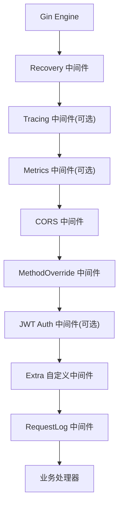
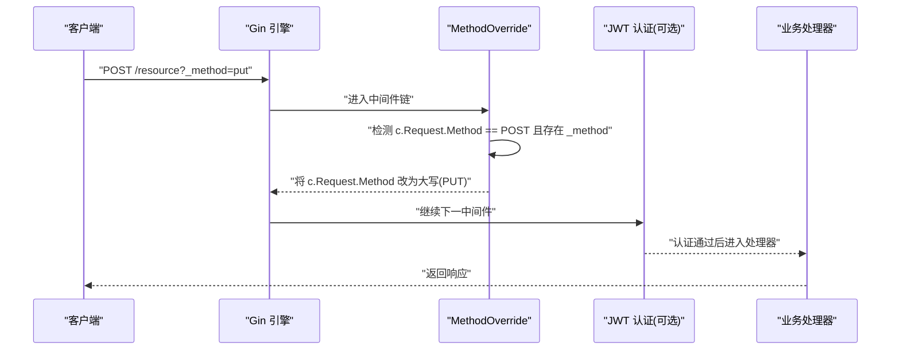
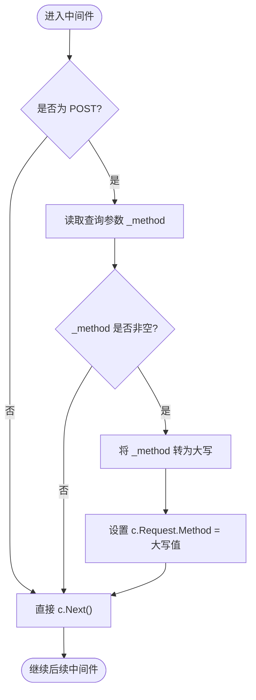
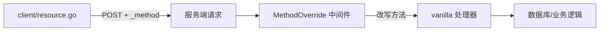

# Method Override 中间件

<cite>
**本文引用的文件**
- [middleware/method_override.go](file://middleware/method_override.go)
- [middleware/register.go](file://middleware/register.go)
- [client/resource.go](file://client/resource.go)
- [ARCHITECTURE.md](file://ARCHITECTURE.md)
- [README.md](file://README.md)
</cite>

## 目录
1. [简介](#简介)
2. [项目结构](#项目结构)
3. [核心组件](#核心组件)
4. [架构总览](#架构总览)
5. [详细组件分析](#详细组件分析)
6. [依赖关系分析](#依赖关系分析)
7. [性能考量](#性能考量)
8. [故障排查指南](#故障排查指南)
9. [结论](#结论)
10. [附录](#附录)

## 简介
Method Override 中间件用于在 HTTP 请求进入业务处理之前，根据查询参数 _method 重写请求的 HTTP 方法。该机制主要用于兼容 HTML 表单仅支持 GET/POST 的限制，使 RESTful API 能够以 POST + _method=PUT/DELETE 的方式实现更新与删除操作。本框架将该中间件作为内置能力之一，默认按固定顺序挂载到 Gin 引擎中，确保在认证、日志等前后环节正确生效。

## 项目结构
- 中间件位于 middleware 包，提供统一注册入口 register.go，集中管理中间件的挂载顺序与开关。
- MethodOverrideMiddleware 的实现位于 method_override.go，逻辑极简：仅在 POST 请求且存在 _method 查询参数时，将 c.Request.Method 改写为大写形式。
- 客户端 resource.go 在服务间调用时，对 PUT/DELETE 使用 POST + _method 参数进行模拟，保证跨服务调用也能遵循同一约定。
- 架构文档 ARCHITECTURE.md 明确了请求生命周期中 MethodOverride 的位置（CORS 之后、JWT Auth 之前），便于理解其在整体流程中的作用。

图表来源
- [middleware/register.go:28-71](file://middleware/register.go#L28-L71)
- [ARCHITECTURE.md:47-72](file://ARCHITECTURE.md#L47-L72)

章节来源
- [middleware/register.go:28-71](file://middleware/register.go#L28-L71)
- [ARCHITECTURE.md:47-72](file://ARCHITECTURE.md#L47-L72)

## 核心组件
- MethodOverrideMiddleware：核心实现，负责读取 _method 并改写请求方法。
- Register：一站式注册所有中间件，明确 MethodOverride 的挂载位置与顺序。
- client/resource.go：内部服务调用方，对 PUT/DELETE 采用 POST + _method 的兼容策略。

章节来源
- [middleware/method_override.go:9-20](file://middleware/method_override.go#L9-L20)
- [middleware/register.go:28-71](file://middleware/register.go#L28-L71)
- [client/resource.go:170-192](file://client/resource.go#L170-L192)

## 架构总览
MethodOverride 处于请求生命周期的早期阶段，位于 CORS 之后、JWT 认证之前。这意味着：
- 跨域预检与响应头设置不受方法重写影响；
- 后续 JWT 认证与业务路由均基于重写后的方法进行判断与派发；
- 事务与锁等机制在 vanilla 层依据最终方法决定是否开启或跳过。

图表来源
- [middleware/method_override.go:11-19](file://middleware/method_override.go#L11-L19)
- [middleware/register.go:53-62](file://middleware/register.go#L53-L62)
- [ARCHITECTURE.md:47-72](file://ARCHITECTURE.md#L47-L72)

## 详细组件分析

### MethodOverride 中间件工作原理
- 触发条件：仅当原始请求方法为 POST 时才会考虑 _method 参数。
- 参数来源：从 URL 查询参数中读取 _method。
- 重写规则：若 _method 非空，则将 c.Request.Method 设置为 _method 的大写形式。
- 执行时机：在中间件链中尽早执行，确保后续中间件与处理器看到的方法已更新。

图表来源
- [middleware/method_override.go:11-19](file://middleware/method_override.go#L11-L19)

章节来源
- [middleware/method_override.go:9-20](file://middleware/method_override.go#L9-L20)

### 支持的 HTTP 方法与重写规则
- 支持的重写目标方法：由 _method 的值决定，代码将其转换为大写后写入 Request.Method。因此常见 REST 方法如 PUT、DELETE、PATCH 均可通过 _method 传递。
- 限制：仅当原始请求为 POST 时才允许重写；GET 请求不会被 _method 改变。
- 大小写不敏感：无论 _method 传入小写还是大写，最终都会统一为大写。

章节来源
- [middleware/method_override.go:11-19](file://middleware/method_override.go#L11-L19)

### 客户端兼容性与服务间调用
- 客户端 resource.go 在服务间调用时，对 PUT/DELETE 采用 POST + _method 参数的形式发送，确保下游服务能按预期识别方法。
- 对于 GET 请求，客户端直接使用 GET 方法，不会注入 _method。
- 这种设计保证了浏览器表单与内部服务调用的一致性：均以 POST + _method 模拟非 GET 方法。

章节来源
- [client/resource.go:170-192](file://client/resource.go#L170-L192)

### 在请求生命周期中的位置
- 根据架构说明，MethodOverride 位于 CORS 之后、JWT 认证之前。这样既不影响跨域处理，又确保认证与路由基于最终方法执行。
- 此顺序也意味着：如果业务需要基于“真实方法”做鉴权或限流，应在 MethodOverride 之后配置相应中间件。

章节来源
- [ARCHITECTURE.md:47-72](file://ARCHITECTURE.md#L47-L72)
- [middleware/register.go:53-62](file://middleware/register.go#L53-L62)

## 依赖关系分析
- MethodOverride 仅依赖 Gin 上下文与标准库字符串处理，无外部复杂依赖。
- 通过 register.go 统一挂载，与其他中间件形成清晰的单向依赖链。
- 客户端 resource.go 与服务端 MethodOverride 共同约定 _method 协议，构成隐式契约。

图表来源
- [client/resource.go:170-192](file://client/resource.go#L170-L192)
- [middleware/method_override.go:11-19](file://middleware/method_override.go#L11-L19)

章节来源
- [middleware/register.go:28-71](file://middleware/register.go#L28-L71)
- [client/resource.go:170-192](file://client/resource.go#L170-L192)

## 性能考量
- 开销极低：仅一次方法判断与可能的字符串大写转换，时间复杂度 O(1)。
- 内存占用极小：不引入额外对象分配，仅修改请求对象的 Method 字段。
- 建议：在高并发场景下无需特殊优化；如需统计 _method 使用情况，可在 Metrics 中间件中记录。

[本节为通用性能指导，不直接分析具体文件]

## 故障排查指南
- 现象：PUT/DELETE 请求被当作 POST 处理
  - 检查客户端是否正确设置 _method 参数（PUT/DELETE）；
  - 确认请求确实为 POST 且包含 _method；
  - 查看中间件顺序，确保 MethodOverride 未被错误覆盖或跳过。
- 现象：GET 请求被意外改写
  - 确认原始请求不是 POST；MethodOverride 仅对 POST 生效；
  - 检查是否有其他中间件或代理篡改了请求方法。
- 现象：方法未匹配导致 405
  - 确认资源处理器是否实现了对应方法（Get/Post/Put/Delete）；
  - 检查 vanilla 层的反射派发逻辑与方法名映射。

章节来源
- [middleware/method_override.go:11-19](file://middleware/method_override.go#L11-L19)
- [client/resource.go:170-192](file://client/resource.go#L170-L192)
- [ARCHITECTURE.md:47-72](file://ARCHITECTURE.md#L47-L72)

## 结论
MethodOverride 中间件以最小改动实现了 RESTful 方法的兼容，解决了 HTML 表单与浏览器环境对非 GET/POST 方法的支持限制。通过统一的 _method 约定，服务端与客户端保持一致的请求语义，简化了跨服务调用与前端集成的复杂度。结合框架的中间件顺序与生命周期，该方法重写在安全、可观测性与可维护性方面具备良好基础。

[本节为总结性内容，不直接分析具体文件]

## 附录

### RESTful API 设计与客户端兼容性建议
- 服务端
  - 保持 MethodOverride 在 CORS 之后、JWT 之前，确保跨域与认证流程稳定；
  - 在业务层对 PUT/DELETE 的参数校验与权限控制与 POST 保持一致；
  - 避免对 _method 参数进行业务逻辑依赖，仅将其视为方法指示。
- 客户端
  - 对 PUT/DELETE 使用 POST + _method 参数；
  - 对 GET 请求不使用 _method；
  - 保持 Content-Type 与数据格式一致，便于服务端解析。

章节来源
- [middleware/register.go:53-62](file://middleware/register.go#L53-L62)
- [client/resource.go:170-192](file://client/resource.go#L170-L192)

### 安全注意事项与最佳实践
- 输入验证
  - 虽然中间件会将 _method 转为大写，但建议在业务层对 _method 的值进行白名单校验（如 PUT/DELETE/PATCH），防止非法方法注入；
  - 对关键写操作（PUT/DELETE）增加权限校验与审计日志。
- 防重放与幂等
  - 对幂等操作（如 DELETE）建议结合唯一请求 ID 或资源版本控制，避免重复提交；
  - 对高价值写操作启用速率限制与风控策略。
- 可观测性
  - 在 Metrics 或 Tracing 中记录实际方法与重写后的方法，便于问题定位；
  - 对异常路径（如 405）进行告警与采样。
- 兼容性
  - 保持 _method 协议稳定，避免破坏既有客户端；
  - 升级时提供迁移指南与灰度发布策略。

章节来源
- [ARCHITECTURE.md:47-72](file://ARCHITECTURE.md#L47-L72)
- [README.md:19-74](file://README.md#L19-L74)