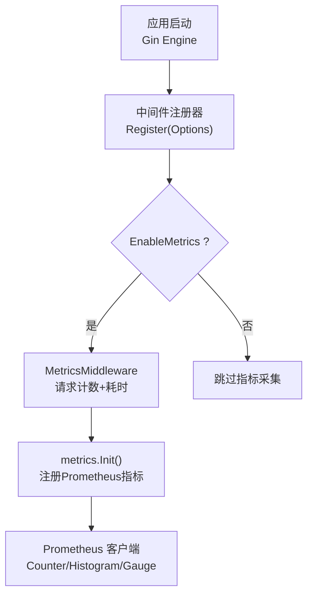
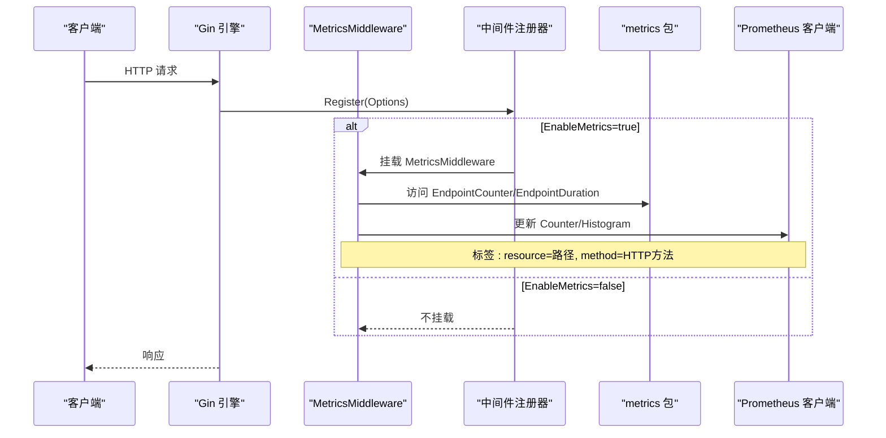
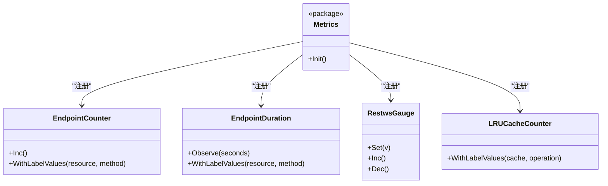
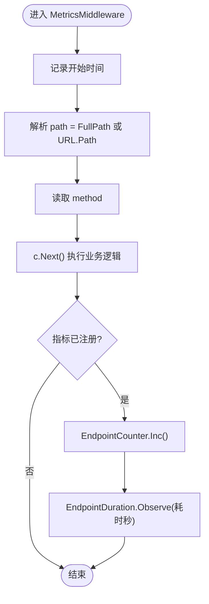
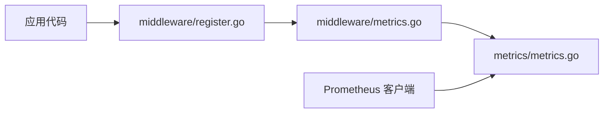

# Metrics 中间件

<cite>
**本文引用的文件**
- [metrics/metrics.go](file://metrics/metrics.go)
- [middleware/metrics.go](file://middleware/metrics.go)
- [middleware/register.go](file://middleware/register.go)
- [README.md](file://README.md)
- [go.mod](file://go.mod)
</cite>

## 目录
1. [简介](#简介)
2. [项目结构](#项目结构)
3. [核心组件](#核心组件)
4. [架构总览](#架构总览)
5. [详细组件分析](#详细组件分析)
6. [依赖关系分析](#依赖关系分析)
7. [性能考量](#性能考量)
8. [故障排查指南](#故障排查指南)
9. [结论](#结论)
10. [附录：部署与运维实践](#附录部署与运维实践)

## 简介
本文件面向 Carina 框架中的 Metrics 中间件，系统性说明 Prometheus 指标收集机制、内置指标定义与采集流程、如何扩展自定义指标、监控面板配置建议、告警规则与容量规划方法，并提供实际部署示例与运维最佳实践。该能力基于 Gin 中间件链集成，配合 Prometheus 客户端库实现请求级可观测性。

## 项目结构
Carina 将“指标定义”与“指标采集”解耦：
- metrics 包负责集中注册并暴露所有 Prometheus 指标（Counter/Gauge/Histogram/Vec），提供幂等初始化入口。
- middleware 包提供 MetricsMiddleware，在请求处理前后自动记录请求计数与耗时。
- 通过统一的中间件注册器 Options.EnableMetrics 开关控制是否启用指标采集。

图表来源
- [middleware/register.go:28-51](file://middleware/register.go#L28-L51)
- [middleware/metrics.go:10-29](file://middleware/metrics.go#L10-L29)
- [metrics/metrics.go:35-106](file://metrics/metrics.go#L35-L106)

章节来源
- [README.md:1-18](file://README.md#L1-L18)
- [middleware/register.go:7-26](file://middleware/register.go#L7-L26)

## 核心组件
- 指标定义与注册（metrics 包）
  - 使用 promauto 在进程启动时一次性注册所有指标，保证线程安全与幂等。
  - 包含按资源+方法的请求计数与耗时直方图、服务间调用统计、Panic/业务错误/重试计数、WebSocket 连接数与错误、LRU 缓存操作计数等。
- 指标采集（middleware 包）
  - MetricsMiddleware 在每个请求进入和返回时分别增加请求计数与记录耗时，标签为路径与方法。
- 中间件开关（register 包）
  - 通过 Options.EnableMetrics 控制是否挂载 MetricsMiddleware。

章节来源
- [metrics/metrics.go:10-33](file://metrics/metrics.go#L10-L33)
- [metrics/metrics.go:35-106](file://metrics/metrics.go#L35-L106)
- [middleware/metrics.go:10-29](file://middleware/metrics.go#L10-L29)
- [middleware/register.go:7-26](file://middleware/register.go#L7-L26)

## 架构总览
下图展示了从请求进入到指标落盘的完整链路，以及各组件之间的依赖关系。

图表来源
- [middleware/register.go:28-51](file://middleware/register.go#L28-L51)
- [middleware/metrics.go:10-29](file://middleware/metrics.go#L10-L29)
- [metrics/metrics.go:35-106](file://metrics/metrics.go#L35-L106)

## 详细组件分析

### 指标定义与生命周期（metrics 包）
- 设计要点
  - 使用 sync.Once 确保指标仅注册一次，避免重复注册导致冲突。
  - 采用 promauto 简化注册过程，统一命名空间前缀便于区分。
  - 指标类型选择：
    - CounterVec：累计型指标，如请求总数、错误数、重试次数。
    - HistogramVec：分布型指标，用于请求耗时分布。
    - Gauge：瞬时值，如当前 WebSocket 连接数。
- 关键指标概览
  - 端点请求计数：按 resource、method 维度统计。
  - 端点请求耗时：按 resource、method 维度统计，使用默认桶。
  - 按来源服务调用计数：支持 service 维度。
  - 远程端点调用计数：包含本地/远端方法与资源维度。
  - Panic/业务错误/重试计数：全局计数器。
  - WebSocket 连接数与错误计数：Gauge 与带 stage 标签的 CounterVec。
  - LRU 缓存操作计数：带 cache、operation 标签。

图表来源
- [metrics/metrics.go:35-106](file://metrics/metrics.go#L35-L106)

章节来源
- [metrics/metrics.go:10-33](file://metrics/metrics.go#L10-L33)
- [metrics/metrics.go:35-106](file://metrics/metrics.go#L35-L106)

### 指标采集中间件（middleware/metrics.go）
- 行为说明
  - 在进入处理器前记录时间起点，获取路由 path 与 HTTP method。
  - 调用 c.Next() 执行业务逻辑。
  - 结束后若指标已注册，则增加请求计数并记录耗时。
- 健壮性
  - 对指标指针进行 nil 检查，避免未初始化时的空指针风险。
  - 当 FullPath 为空时回退到 URL.Path，兼容未匹配路由场景。

图表来源
- [middleware/metrics.go:10-29](file://middleware/metrics.go#L10-L29)

章节来源
- [middleware/metrics.go:10-29](file://middleware/metrics.go#L10-L29)

### 中间件注册与开关（middleware/register.go）
- 注册顺序
  - Recovery → Tracing（可选）→ Metrics（可选）→ CORS → MethodOverride → JWT Auth（可选）→ Extra → RequestLog。
- 开关策略
  - Options.EnableMetrics 控制是否挂载 MetricsMiddleware。
  - 新增字段保持零值默认行为，向后兼容。

章节来源
- [middleware/register.go:7-26](file://middleware/register.go#L7-L26)
- [middleware/register.go:28-51](file://middleware/register.go#L28-L51)

## 依赖关系分析
- 外部依赖
  - Prometheus 客户端库：prometheus/client_golang，用于指标定义与采集。
  - Gin 框架：作为 Web 中间件载体。
- 内部依赖
  - middleware/metrics 依赖 metrics 包提供的指标实例。
  - middleware/register 提供统一注册入口，协调各中间件启用状态。

图表来源
- [middleware/metrics.go:1-8](file://middleware/metrics.go#L1-L8)
- [metrics/metrics.go:1-8](file://metrics/metrics.go#L1-L8)
- [middleware/register.go:1-5](file://middleware/register.go#L1-L5)

章节来源
- [go.mod:5-20](file://go.mod#L5-L20)

## 性能考量
- 指标开销
  - CounterVec/HistogramVec 的标签组合会随维度增长而放大内存占用；应谨慎选择高基数标签（如用户 ID、请求 ID）。
  - 直方图默认桶适合通用场景；如需更细粒度分位，可在指标定义处调整桶范围。
- 采集时机
  - 中间件在请求完成后统一记录，避免阻塞业务主路径；耗时统计覆盖整个处理器执行时间。
- 并发安全
  - 指标注册使用 sync.Once 保证唯一性；Prometheus 客户端内部已做并发安全处理。
- 建议
  - 对高频接口优先使用低基数字段（resource、method）作为标签。
  - 避免在热点路径中频繁创建新指标或动态添加标签值。

[本节为通用性能指导，不直接分析具体文件]

## 故障排查指南
- 现象：指标未上报
  - 检查是否在应用启动时调用了 metrics.Init() 以完成指标注册。
  - 检查 Options.EnableMetrics 是否为 true，确保 MetricsMiddleware 被挂载。
- 现象：指标缺失标签或路径为空
  - 确认路由是否注册成功；当 FullPath 为空时会回退到 URL.Path。
- 现象：内存增长异常
  - 排查是否存在高基数标签（例如用户 ID、设备 ID）导致的指标爆炸。
- 现象：重复注册报错
  - 确保 Init() 仅调用一次；利用 sync.Once 保护。

章节来源
- [metrics/metrics.go:35-106](file://metrics/metrics.go#L35-L106)
- [middleware/metrics.go:10-29](file://middleware/metrics.go#L10-L29)
- [middleware/register.go:28-51](file://middleware/register.go#L28-L51)

## 结论
Carina 的 Metrics 中间件以最小侵入方式提供了请求级可观测性：通过集中式指标注册与中间件自动采集，实现对端点请求量、耗时、错误、重试、WebSocket 连接与缓存操作的全面监控。结合 Prometheus 生态，可快速构建可视化面板与告警规则，支撑线上稳定性保障与容量规划。

[本节为总结性内容，不直接分析具体文件]

## 附录：部署与运维实践

### 启用与集成步骤
- 在应用启动阶段
  - 加载配置并初始化基础设施（数据库、缓存等）。
  - 创建 Gin Engine 并通过 Register 注册中间件，设置 Options.EnableMetrics=true。
- 指标暴露
  - 使用 Prometheus 客户端提供的 /metrics 端点暴露指标（由客户端库默认提供）。
- 采集与展示
  - 配置 Prometheus 抓取目标为应用的 /metrics。
  - 在 Grafana 中导入或自建仪表盘，基于 carina_* 系列指标构建视图。

章节来源
- [README.md:27-74](file://README.md#L27-L74)
- [middleware/register.go:28-51](file://middleware/register.go#L28-L51)

### 内置指标清单与用途
- 端点请求计数：carina_endpoint_requests_total（resource、method）
  - 用途：观察各接口 QPS、峰值与趋势。
- 端点请求耗时：carina_endpoint_duration_seconds（resource、method）
  - 用途：评估接口延迟分布，定位慢请求。
- 按来源服务调用计数：carina_endpoint_call_by_service_total（resource、method、source_service）
  - 用途：服务间流量分析与依赖健康度。
- 远程端点调用计数：carina_remote_endpoint_call_total（local_method、local_resource、method、service、remote_resource）
  - 用途：跨服务调用质量与失败率监控。
- Panic 计数：carina_panic_total
  - 用途：系统稳定性预警。
- 业务错误计数：carina_business_error_total
  - 用途：业务异常趋势与根因定位。
- 资源重试计数：carina_resource_retry_total
  - 用途：评估重试策略有效性与下游压力。
- WebSocket 连接数：carina_restws_connections
  - 用途：长连接资源水位监控。
- WebSocket 错误计数：carina_restws_error_total（stage）
  - 用途：WS 生命周期错误定位。
- LRU 缓存操作计数：carina_lru_cache_total（cache、operation）
  - 用途：缓存命中率与淘汰情况。

章节来源
- [metrics/metrics.go:35-106](file://metrics/metrics.go#L35-L106)

### 自定义指标添加方法
- 在 metrics 包中新增指标变量并使用 promauto 注册，遵循现有命名规范与标签约定。
- 在合适的业务位置调用相应指标的更新方法（Inc/Obs/Set 等）。
- 若需按维度细分，优先选择低基数字段作为标签，避免指标爆炸。

章节来源
- [metrics/metrics.go:35-106](file://metrics/metrics.go#L35-L106)

### 监控面板配置建议
- 基础面板
  - 接口 QPS 与错误率：基于 carina_endpoint_requests_total 与错误相关指标。
  - 接口延迟分布：基于 carina_endpoint_duration_seconds 的分位值（p50/p95/p99）。
- 服务间调用
  - 调用成功率与延迟：基于远程端点调用指标。
- 资源水位
  - WebSocket 连接数与错误：基于 WS 相关指标。
  - 缓存命中率与淘汰：基于 LRU 缓存指标。

[本节为概念性配置建议，不直接分析具体文件]

### 告警规则设置
- 可用性
  - 接口错误率突增：基于错误计数与请求计数的比率阈值。
- 性能
  - 接口延迟升高：基于直方图分位值超过阈值。
- 稳定性
  - Panic 计数上升：单位时间内非零增量即触发。
- 容量
  - WebSocket 连接数接近上限：接近预设阈值时预警。
- 缓存
  - 缓存命中率下降：基于 LRU 操作指标计算命中率低于阈值。

[本节为概念性告警建议，不直接分析具体文件]

### 容量规划建议
- 基于历史 QPS 与延迟分布，预估 CPU/内存/网络带宽需求。
- 针对高基数标签的接口，限制标签维度或采样上报，防止指标存储膨胀。
- 对慢接口进行专项优化，必要时拆分或异步化。
- 建立容量基线与弹性伸缩策略，结合告警自动扩缩容。

[本节为通用容量规划建议，不直接分析具体文件]