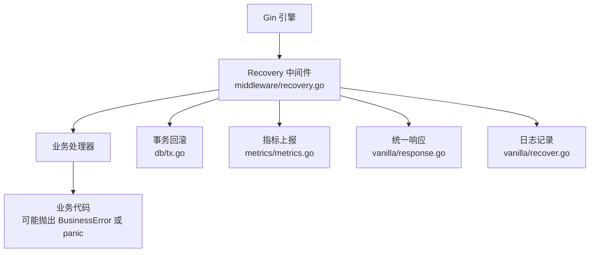
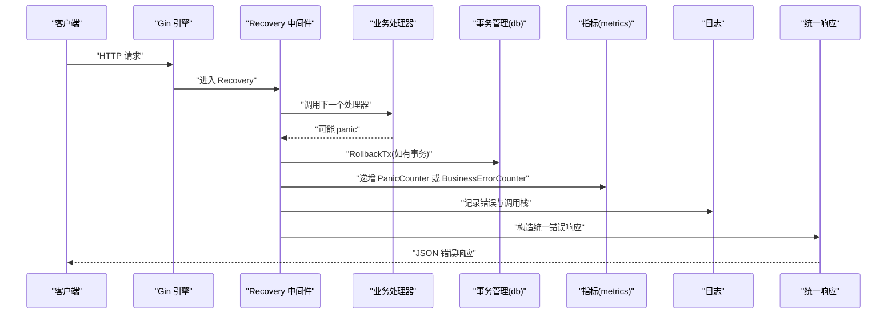
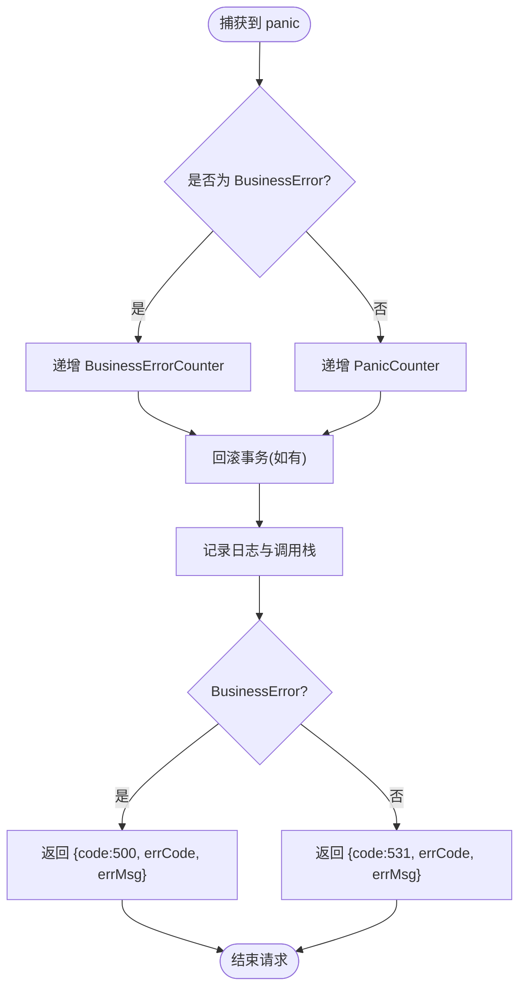
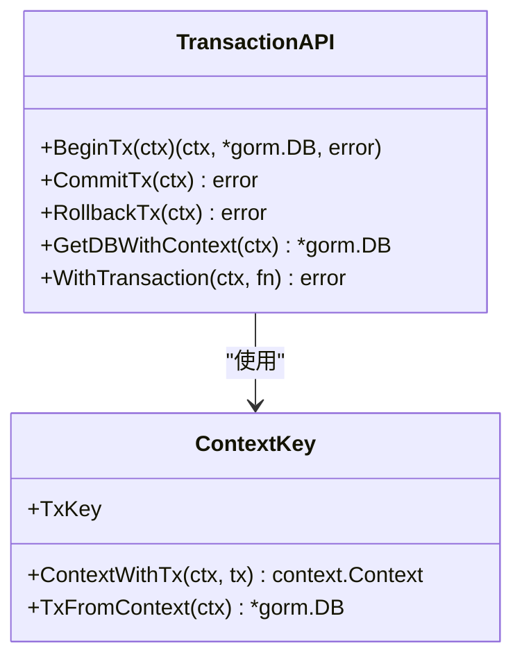
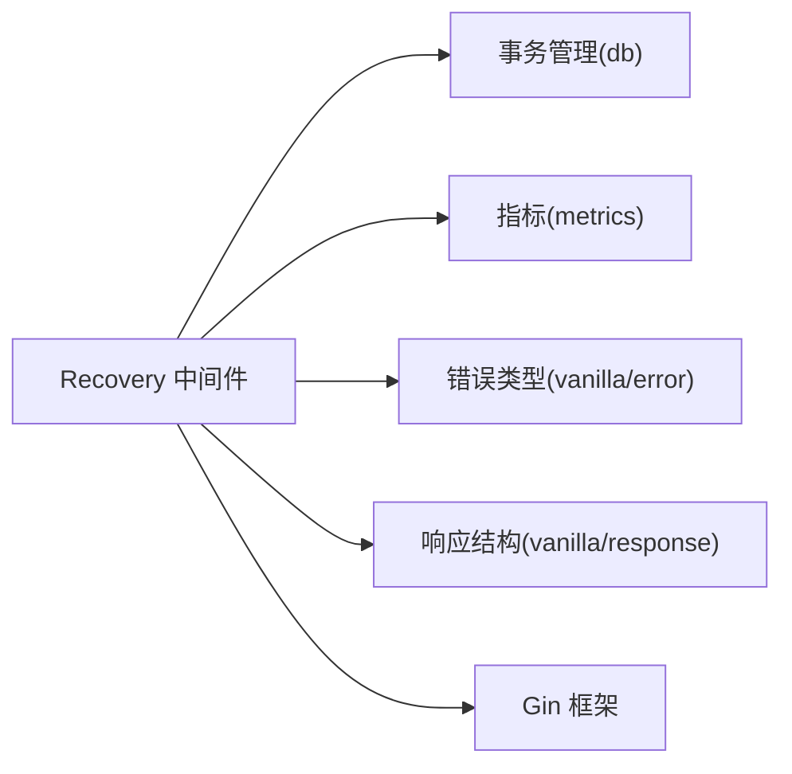

# Recovery 中间件

<cite>
**本文引用的文件**
- [middleware/recovery.go](file://middleware/recovery.go)
- [vanilla/recover.go](file://vanilla/recover.go)
- [db/tx.go](file://db/tx.go)
- [db/db.go](file://db/db.go)
- [vanilla/error.go](file://vanilla/error.go)
- [vanilla/response.go](file://vanilla/response.go)
- [metrics/metrics.go](file://metrics/metrics.go)
- [middleware/register.go](file://middleware/register.go)
- [README.md](file://README.md)
</cite>

## 目录
1. [简介](#简介)
2. [项目结构](#项目结构)
3. [核心组件](#核心组件)
4. [架构总览](#架构总览)
5. [详细组件分析](#详细组件分析)
6. [依赖关系分析](#依赖关系分析)
7. [性能考虑](#性能考虑)
8. [故障排查指南](#故障排查指南)
9. [结论](#结论)
10. [附录：使用示例与最佳实践](#附录使用示例与最佳实践)

## 简介
Recovery 中间件用于在 HTTP 请求处理过程中捕获 panic，确保事务一致性、统一错误响应和可观测性。其核心职责包括：
- 捕获 panic（含业务异常与系统异常）
- 自动回滚当前请求的事务（若存在）
- 记录指标与日志（包含调用栈）
- 返回统一的错误响应格式

该中间件通过最外层挂载，保证所有后续中间件和业务逻辑的异常都能被捕获并安全处理。

## 项目结构
Recovery 能力由以下模块协作实现：
- middleware/recovery.go：对外暴露 Gin 中间件入口
- vanilla/recover.go：核心 panic 捕获、事务回滚、指标上报、日志与响应
- db/tx.go：基于 context 的事务提交/回滚 API
- db/db.go：全局 DB 初始化、context 注入事务、WithTransaction 封装
- vanilla/error.go：BusinessError 类型与错误分类
- vanilla/response.go：统一响应结构
- metrics/metrics.go：Prometheus 指标定义（panic、业务错误计数）
- middleware/register.go：中间件注册顺序（Recovery 必须最外层）



**图表来源**
- [middleware/recovery.go:9-12](file://middleware/recovery.go#L9-L12)
- [vanilla/recover.go:18-66](file://vanilla/recover.go#L18-L66)
- [db/tx.go:30-37](file://db/tx.go#L30-L37)
- [metrics/metrics.go:67-78](file://metrics/metrics.go#L67-L78)
- [vanilla/response.go:13-21](file://vanilla/response.go#L13-L21)

**章节来源**
- [middleware/recovery.go:9-12](file://middleware/recovery.go#L9-L12)
- [middleware/register.go:28-41](file://middleware/register.go#L28-L41)

## 核心组件
- Recovery 中间件入口：将核心逻辑委托给 vanilla.RecoverPanic
- Panic 捕获与恢复：defer + recover 捕获 panic，避免进程崩溃
- 事务回滚：从请求上下文提取事务并执行 Rollback
- 指标统计：区分系统级 panic 与业务错误，分别递增计数器
- 日志记录：输出错误类型、请求方法与路径、完整调用栈
- 统一响应：根据错误类型返回标准 JSON 结构

**章节来源**
- [vanilla/recover.go:18-66](file://vanilla/recover.go#L18-L66)
- [db/tx.go:30-37](file://db/tx.go#L30-L37)
- [metrics/metrics.go:67-78](file://metrics/metrics.go#L67-L78)
- [vanilla/response.go:13-21](file://vanilla/response.go#L13-L21)

## 架构总览
Recovery 中间件位于中间件链的最外层，确保任何后续中间件或业务逻辑抛出的 panic 都能被捕获。其处理流程如下：



**图表来源**
- [vanilla/recover.go:18-66](file://vanilla/recover.go#L18-L66)
- [db/tx.go:30-37](file://db/tx.go#L30-L37)
- [metrics/metrics.go:67-78](file://metrics/metrics.go#L67-L78)
- [vanilla/response.go:13-21](file://vanilla/response.go#L13-L21)

## 详细组件分析

### Panic 捕获机制
- 使用 defer + recover 捕获 panic，确保即使业务代码未做异常处理也能安全降级
- 支持两种错误类型：
  - 业务错误：BusinessError，携带 ErrCode 与 ErrMsg，用于正常业务流程中的可控异常
  - 系统错误：非 BusinessError 的 panic，代表不可预期的系统级异常
- 对不同类型的错误进行差异化处理：
  - 业务错误：返回 code=500，errCode 与 errMsg 来自 BusinessError
  - 系统错误：返回 code=531，errCode 与 errMsg 为 panic 原始信息



**图表来源**
- [vanilla/recover.go:18-66](file://vanilla/recover.go#L18-L66)
- [metrics/metrics.go:67-78](file://metrics/metrics.go#L67-L78)

**章节来源**
- [vanilla/recover.go:18-66](file://vanilla/recover.go#L18-L66)

### 事务回滚策略
- 从请求上下文获取事务句柄，若存在则执行 Rollback
- 与 WithTransaction 配合：业务层可通过 WithTransaction 包裹一组数据库操作，发生 panic 时自动回滚
- 无事务时回滚操作为空操作，不影响正常流程



**图表来源**
- [db/tx.go:10-37](file://db/tx.go#L10-L37)
- [db/db.go:68-115](file://db/db.go#L68-L115)

**章节来源**
- [db/tx.go:30-37](file://db/tx.go#L30-L37)
- [db/db.go:93-115](file://db/db.go#L93-L115)

### 错误处理策略
- 业务错误：通过 panic(BusinessError) 抛出，Recovery 捕获后返回标准错误响应
- 系统错误：任何非 BusinessError 的 panic 均视为系统错误，返回不同 code
- 错误分类影响指标统计与告警策略（如是否推送 Sentry）

**章节来源**
- [vanilla/error.go:15-75](file://vanilla/error.go#L15-L75)
- [vanilla/recover.go:28-60](file://vanilla/recover.go#L28-L60)

### 日志记录格式
- 日志前缀区分：[BusinessError] 或 [Panic]
- 包含请求方法与路径，便于定位问题
- 附带完整调用栈，便于调试与分析

**章节来源**
- [vanilla/recover.go:68-80](file://vanilla/recover.go#L68-L80)

### 响应格式
- 统一 Response 结构包含：
  - code：状态码（成功 200，业务错误 500，系统错误 531）
  - data：成功数据
  - errCode：错误码
  - errMsg：错误消息
  - innerErrMsg：内部错误详情（可选）
  - _pod：机器信息

**章节来源**
- [vanilla/response.go:13-21](file://vanilla/response.go#L13-L21)
- [vanilla/recover.go:48-60](file://vanilla/recover.go#L48-L60)

## 依赖关系分析
Recovery 中间件依赖以下模块：
- db：事务管理，提供 RollbackTx
- metrics：指标统计，提供 PanicCounter 与 BusinessErrorCounter
- vanilla：错误类型与响应结构
- gin：HTTP 框架，提供 Context 与 Handler 机制



**图表来源**
- [vanilla/recover.go:3-12](file://vanilla/recover.go#L3-L12)
- [db/tx.go:30-37](file://db/tx.go#L30-L37)
- [metrics/metrics.go:67-78](file://metrics/metrics.go#L67-L78)

**章节来源**
- [vanilla/recover.go:3-12](file://vanilla/recover.go#L3-L12)
- [middleware/register.go:28-41](file://middleware/register.go#L28-L41)

## 性能考虑
- 最小开销：panic 仅在异常路径触发，正常请求不受影响
- 调用栈采集：仅在 panic 时采集，避免常规请求的性能损耗
- 指标上报：使用 Prometheus 计数器，增量操作开销极低
- 事务回滚：仅在有事务时执行，无事务时空操作
- 建议：在生产环境启用指标收集以便监控 panic 频率

**章节来源**
- [metrics/metrics.go:67-78](file://metrics/metrics.go#L67-L78)
- [vanilla/recover.go:68-80](file://vanilla/recover.go#L68-L80)

## 故障排查指南
常见问题与解决方案：
- 未初始化数据库：确保在应用启动时调用 db.Init
- 事务未回滚：检查是否正确传递 context 并使用 GetDBWithContext
- 指标未上报：确认 metrics.Init 已调用且 Prometheus 端点可访问
- 日志缺失：检查日志级别与输出配置

排查步骤：
1. 查看日志中的 [BusinessError] 或 [Panic] 前缀
2. 分析调用栈定位具体错误位置
3. 检查对应接口是否处于事务中
4. 验证指标面板中 panic 计数是否增长

**章节来源**
- [db/db.go:25-50](file://db/db.go#L25-L50)
- [vanilla/recover.go:68-80](file://vanilla/recover.go#L68-L80)
- [metrics/metrics.go:35-106](file://metrics/metrics.go#L35-L106)

## 结论
Recovery 中间件提供了健壮的异常处理能力，确保服务在高负载下的稳定性。通过统一的事务回滚、错误响应和可观测性支持，开发者可以专注于业务逻辑而无需担心异常处理的复杂性。建议在生产环境中始终启用该中间件，并结合指标监控及时发现潜在问题。

## 附录：使用示例与最佳实践

### 中间件注册
在应用启动时注册中间件，Recovery 必须位于最外层：

```go
// 参考注册顺序
engine.Use(middleware.RecoveryMiddleware()) // 最外层
// 其他中间件...
```

**章节来源**
- [middleware/register.go:28-41](file://middleware/register.go#L28-L41)

### 业务错误抛出
在业务逻辑中抛出 BusinessError：

```go
// 参考用法
panic(vanilla.NewBusinessError("corp:not_found", "企业不存在"))
```

**章节来源**
- [README.md:98-112](file://README.md#L98-L112)
- [vanilla/error.go:44-52](file://vanilla/error.go#L44-L52)

### 事务使用
使用 WithTransaction 包裹数据库操作：

```go
// 参考用法
err := db.WithTransaction(ctx, func(tx *gorm.DB) error {
    // 数据库操作
    return nil
})
```

**章节来源**
- [db/db.go:93-115](file://db/db.go#L93-L115)

### 自定义错误处理器
如需扩展错误处理逻辑，可在 vanilla.RecoverPanic 基础上包装：

```go
// 扩展思路
func CustomRecovery() gin.HandlerFunc {
    base := vanilla.RecoverPanic()
    return func(c *gin.Context) {
        defer func() {
            if err := recover(); err != nil {
                // 自定义处理逻辑
                // ...
            }
        }()
        base(c)
    }
}
```

**章节来源**
- [vanilla/recover.go:18-66](file://vanilla/recover.go#L18-L66)

### 性能优化建议
- 避免在 panic 路径中进行昂贵的操作
- 合理设置日志级别，生产环境减少详细日志
- 定期分析指标面板，关注 panic 趋势
- 使用分布式追踪定位慢查询和异常热点

**章节来源**
- [metrics/metrics.go:67-78](file://metrics/metrics.go#L67-L78)
- [vanilla/recover.go:68-80](file://vanilla/recover.go#L68-L80)