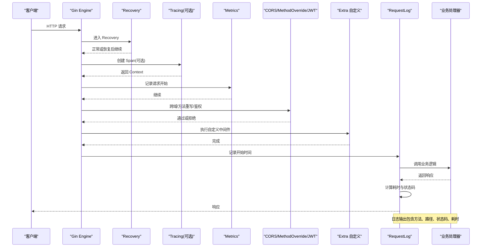
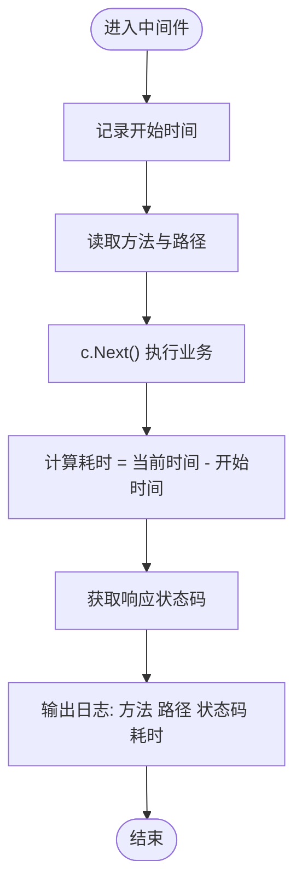
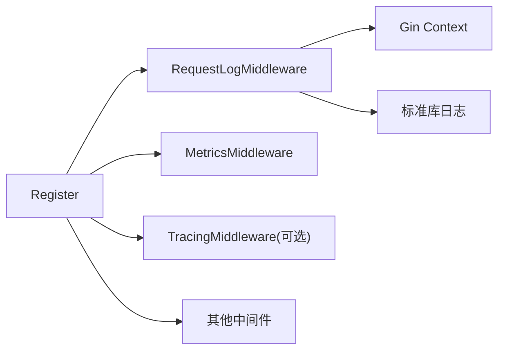

# Request Log 中间件

<cite>
**本文引用的文件**
- [middleware/request_log.go](file://middleware/request_log.go)
- [middleware/register.go](file://middleware/register.go)
- [vanilla/handler.go](file://vanilla/handler.go)
- [metrics/metrics.go](file://metrics/metrics.go)
- [tracing/tracing.go](file://tracing/tracing.go)
- [config/config.go](file://config/config.go)
- [config/types.go](file://config/types.go)
</cite>

## 目录
1. [简介](#简介)
2. [项目结构](#项目结构)
3. [核心组件](#核心组件)
4. [架构总览](#架构总览)
5. [详细组件分析](#详细组件分析)
6. [依赖关系分析](#依赖关系分析)
7. [性能考量](#性能考量)
8. [故障排查指南](#故障排查指南)
9. [结论](#结论)
10. [附录](#附录)

## 简介
本文件围绕 Request Log 中间件，系统化说明请求日志的记录格式、字段含义与输出方式；结合现有配置体系说明日志级别与敏感信息过滤策略；给出基于 Prometheus 指标与 OpenTelemetry 追踪的聚合、分析与告警集成方案；并提供日志轮转、存储策略与合规性建议。文档同时提供可操作的优化路径，帮助在生产环境获得高吞吐、低开销且可观测的请求日志能力。

## 项目结构
Request Log 中间件位于 middleware 包，作为 Gin 请求处理链的一部分被统一注册。它与 Metrics、Tracing、Recovery 等内置中间件协同工作，形成“捕获异常 → 链路追踪 → 指标采集 → 跨域/方法重写 → 认证 → 自定义扩展 → 请求日志”的标准处理顺序。

```mermaid
graph TB
A["Gin Engine"] --> B["RecoveryMiddleware"]
B --> C{"EnableTracing?"}
C --> |是| D["TracingMiddleware"]
C --> |否| E["MetricsMiddleware"]
D --> E
E --> F["CORSMiddleware"]
F --> G["MethodOverrideMiddleware"]
G --> H{"JWTSecret != \"\"?"}
H --> |是| I["JWTAuthMiddleware"]
H --> |否| J["Extra 自定义中间件"]
I --> J
J --> K["RequestLogMiddleware"]
```

图示来源
- [middleware/register.go:28-71](file://middleware/register.go#L28-L71)

章节来源
- [middleware/register.go:28-71](file://middleware/register.go#L28-L71)

## 核心组件
- RequestLogMiddleware：记录每次请求的方法、路径、状态码与耗时，并输出到标准日志。
- Register：集中注册所有中间件，确保执行顺序稳定可控。
- Metrics：按资源与方法维度统计请求数与耗时，便于监控与告警。
- Tracing：可选的分布式链路追踪，为请求打点与关联上下文。
- Config：统一的配置加载机制，支持环境变量覆盖与敏感字段保护。

章节来源
- [middleware/request_log.go:10-23](file://middleware/request_log.go#L10-L23)
- [middleware/register.go:28-71](file://middleware/register.go#L28-L71)
- [metrics/metrics.go:35-106](file://metrics/metrics.go#L35-L106)
- [tracing/tracing.go:25-74](file://tracing/tracing.go#L25-L74)
- [config/config.go:11-60](file://config/config.go#L11-L60)

## 架构总览
下图展示了单次请求从进入引擎到落盘日志的关键路径，以及各组件的职责边界。



图示来源
- [middleware/register.go:28-71](file://middleware/register.go#L28-L71)
- [middleware/request_log.go:10-23](file://middleware/request_log.go#L10-L23)
- [vanilla/handler.go:29-141](file://vanilla/handler.go#L29-L141)
- [metrics/metrics.go:10-33](file://metrics/metrics.go#L10-L33)
- [tracing/tracing.go:25-74](file://tracing/tracing.go#L25-L74)

## 详细组件分析

### RequestLogMiddleware 实现要点
- 记录时机：在 c.Next() 前后分别记录开始时间与结束时间，用于计算请求耗时。
- 记录内容：HTTP 方法、URL Path、响应状态码、耗时。
- 输出方式：使用标准库 log.Printf 输出固定前缀的文本行，便于统一收集。
- 位置与顺序：在中间件链末尾注册，确保能捕获最终响应状态码。



图示来源
- [middleware/request_log.go:10-23](file://middleware/request_log.go#L10-L23)

章节来源
- [middleware/request_log.go:10-23](file://middleware/request_log.go#L10-L23)

### 日志格式与字段说明
- 输出格式：一行文本，包含固定前缀标识、HTTP 方法、URL 路径、状态码、耗时。
- 字段含义：
  - 方法：GET/POST/PUT/DELETE/PATCH/OPTIONS/HEAD
  - 路径：请求 URL 的路径部分（不含查询参数）
  - 状态码：服务端写入的最终 HTTP 状态码
  - 耗时：请求处理总耗时（纳秒级精度，Go time.Duration 默认字符串表示）
- 可读性与机器解析：
  - 适合人类快速浏览，也便于通过正则/分隔符进行日志解析。
  - 如需结构化日志（JSON），可在上层日志框架中统一格式化。

章节来源
- [middleware/request_log.go:10-23](file://middleware/request_log.go#L10-L23)

### 日志级别配置
- 当前实现：未暴露日志级别开关，始终输出。
- 建议实践：
  - 将日志输出接入统一日志框架（如 zap/logrus），并通过配置文件控制级别。
  - 利用 config 模块的环境变量覆盖能力，动态调整不同环境的日志级别。
  - 在 Register 中根据配置决定是否启用 RequestLogMiddleware。

章节来源
- [config/config.go:11-60](file://config/config.go#L11-L60)
- [middleware/register.go:28-71](file://middleware/register.go#L28-L71)

### 敏感信息过滤
- 当前实现：仅记录 URL 路径，不包含查询参数与请求体，天然避免泄露敏感参数。
- 建议实践：
  - 若后续扩展记录 Query/Header/Body，应增加白名单/脱敏规则，对密码、令牌、身份证号等字段进行掩码或丢弃。
  - 结合 JWT 中间件的 SkipJWTPaths，对健康检查、回调等非敏感路径降低日志粒度。

章节来源
- [middleware/request_log.go:10-23](file://middleware/request_log.go#L10-L23)
- [middleware/register.go:28-71](file://middleware/register.go#L28-L71)

### 性能优化策略
- 最小化 IO：当前使用标准库日志，I/O 开销较低；在高并发场景建议接入异步日志器或缓冲写入。
- 采样与降级：
  - 对高频接口可按比例采样记录，减少日志量。
  - 在错误率升高时自动提升日志级别，辅助定位问题。
- 指标替代：对于高频统计类需求，优先使用 Metrics（见下节），而非写日志。

章节来源
- [metrics/metrics.go:35-106](file://metrics/metrics.go#L35-L106)
- [vanilla/handler.go:97-141](file://vanilla/handler.go#L97-L141)

### 日志聚合、分析与告警集成
- 指标采集（Prometheus）：
  - 已提供 EndpointCounter 与 EndpointDuration，按资源与方法维度统计请求数与耗时，可用于 QPS、P95/P99 延迟、错误率等看板与告警。
  - 建议在服务启动时调用 metrics.Init() 注册指标。
- 链路追踪（OpenTelemetry）：
  - 通过 TracingConfig 启用 OTLP 导出，设置采样率以平衡成本与可观测性。
  - 将 trace_id 注入日志，便于跨系统关联。
- 日志聚合：
  - 将标准输出重定向至日志收集器（如 Filebeat/Fluent Bit/Vector），再汇聚到 ELK/Loki 等平台。
  - 对日志行定义解析规则，提取方法、路径、状态码、耗时等字段，构建索引与仪表盘。
- 告警策略：
  - 基于指标：QPS 突降、错误率上升、延迟分位超标。
  - 基于日志：特定路径频繁 5xx、慢请求阈值、敏感关键字命中。

章节来源
- [metrics/metrics.go:35-106](file://metrics/metrics.go#L35-L106)
- [tracing/tracing.go:25-74](file://tracing/tracing.go#L25-L74)
- [config/types.go:30-35](file://config/types.go#L30-L35)

### 日志轮转、存储策略与合规性
- 日志轮转：
  - 推荐由外部日志采集器负责轮转（按大小/时间），避免应用层复杂化。
  - 若应用内轮转，需考虑多进程/容器重启时的原子写入与幂等。
- 存储策略：
  - 热数据保留较短周期（如 7-14 天），冷数据归档至对象存储或数据湖。
  - 对高吞吐接口采用分层存储：近实时查询走索引，历史分析走列存。
- 合规性：
  - 遵循最小必要原则，不记录用户隐私与敏感数据。
  - 对审计要求高的场景，开启不可篡改存储与访问审计。
  - 跨境传输与留存期限需符合当地法规。

[本节为通用实践建议，无需代码来源]

## 依赖关系分析
RequestLogMiddleware 依赖 Gin 上下文与标准库日志；与 Metrics、Tracing 无直接耦合，但共享同一请求生命周期。Register 保证中间件顺序，使日志能捕获最终响应状态码。



图示来源
- [middleware/request_log.go:10-23](file://middleware/request_log.go#L10-L23)
- [middleware/register.go:28-71](file://middleware/register.go#L28-L71)

章节来源
- [middleware/register.go:28-71](file://middleware/register.go#L28-L71)
- [middleware/request_log.go:10-23](file://middleware/request_log.go#L10-L23)

## 性能考量
- 日志写入频率：每个请求一次，开销较小；但在极高 QPS 下仍需评估 I/O 瓶颈。
- 指标优先：对高频统计（QPS、延迟分布）优先使用 Prometheus 指标，避免日志风暴。
- 采样与分级：
  - 生产环境可对成功请求采样，失败请求全量记录。
  - 结合模式（debug/release/test）调整日志级别。
- 上下文传递：通过 Tracing 注入 trace_id，减少重复日志字段，提高关联效率。

章节来源
- [metrics/metrics.go:35-106](file://metrics/metrics.go#L35-L106)
- [tracing/tracing.go:25-74](file://tracing/tracing.go#L25-L74)
- [config/types.go:3-9](file://config/types.go#L3-L9)

## 故障排查指南
- 无法看到日志：
  - 确认中间件已注册（Register 末尾会挂载 RequestLog）。
  - 检查标准输出是否被重定向或收集器是否正常采集。
- 状态码不准确：
  - 确保没有提前写出响应或拦截器修改了 Writer。
  - 确认业务处理器正确设置状态码。
- 性能抖动：
  - 观察 Metrics 的 EndpointDuration，定位慢接口。
  - 临时关闭非关键中间件或降低日志级别验证影响。
- 敏感信息泄露风险：
  - 审查后续扩展是否记录了 Header/Body/Query。
  - 增加脱敏规则与白名单。

章节来源
- [middleware/register.go:28-71](file://middleware/register.go#L28-L71)
- [vanilla/handler.go:29-141](file://vanilla/handler.go#L29-L141)
- [metrics/metrics.go:35-106](file://metrics/metrics.go#L35-L106)

## 结论
RequestLog 中间件提供了简洁可靠的请求日志能力，配合 Metrics 与 Tracing 可实现完整的可观测性闭环。建议在生产环境中：
- 将日志接入统一平台并进行结构化解析；
- 使用指标承载高频统计，日志聚焦异常与审计；
- 通过配置与环境变量管理日志级别与采样策略；
- 制定轮转、存储与合规策略，保障数据安全与成本可控。

[本节为总结性内容，无需代码来源]

## 附录

### 与现有组件的协作要点
- 中间件顺序：Recovery → Tracing → Metrics → CORS/MethodOverride/JWT → Extra → RequestLog。
- 指标与追踪：
  - 指标：EndpointCounter、EndpointDuration 等，用于监控与告警。
  - 追踪：OTLP 导出，支持采样与上下文传播。
- 配置：
  - 通过 Base 结构组合 server/db/redis/auth/tracing/lock 等配置项。
  - 支持环境变量覆盖敏感字段，增强安全性。

章节来源
- [middleware/register.go:28-71](file://middleware/register.go#L28-L71)
- [metrics/metrics.go:35-106](file://metrics/metrics.go#L35-L106)
- [tracing/tracing.go:25-74](file://tracing/tracing.go#L25-L74)
- [config/types.go:45-53](file://config/types.go#L45-L53)
- [config/config.go:11-60](file://config/config.go#L11-L60)