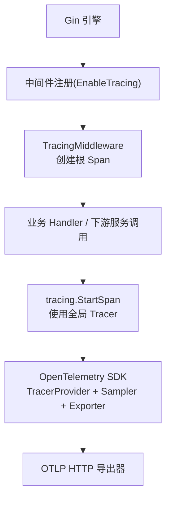
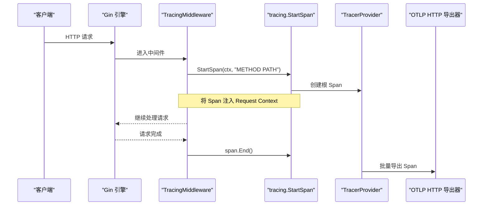
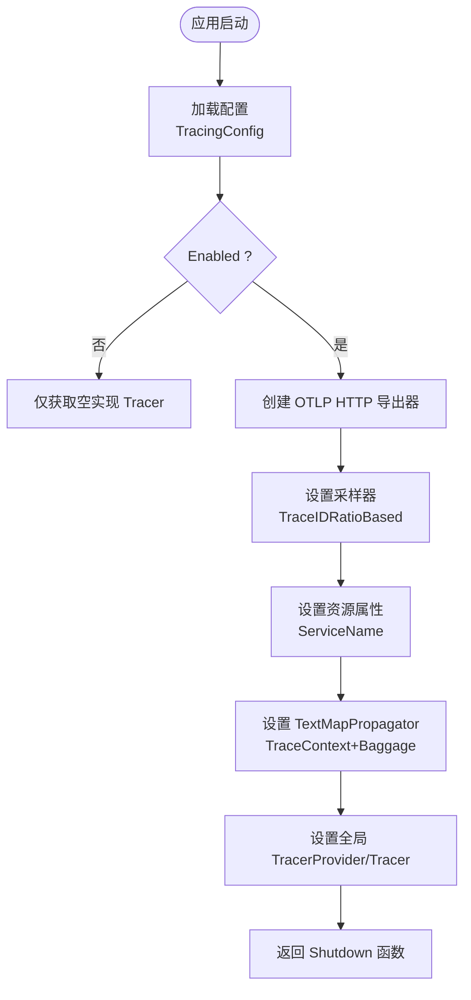
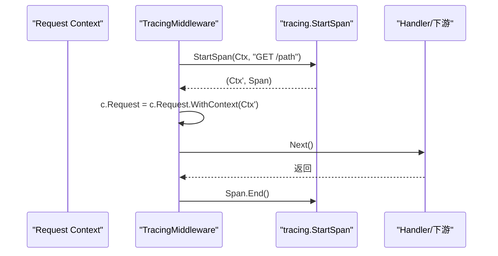
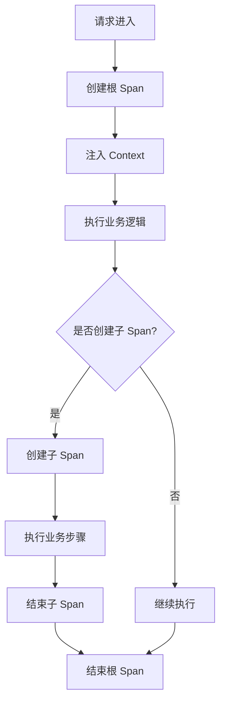
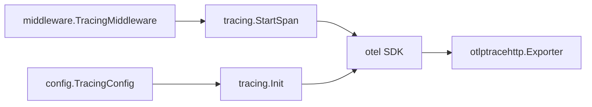

# Tracing 中间件

<cite>
**本文引用的文件**
- [tracing/tracing.go](file://tracing/tracing.go)
- [middleware/tracing.go](file://middleware/tracing.go)
- [middleware/register.go](file://middleware/register.go)
- [config/types.go](file://config/types.go)
- [config/config.go](file://config/config.go)
- [ARCHITECTURE.md](file://ARCHITECTURE.md)
</cite>

## 目录
1. [简介](#简介)
2. [项目结构](#项目结构)
3. [核心组件](#核心组件)
4. [架构总览](#架构总览)
5. [详细组件分析](#详细组件分析)
6. [依赖关系分析](#依赖关系分析)
7. [性能考量](#性能考量)
8. [故障排查指南](#故障排查指南)
9. [结论](#结论)
10. [附录](#附录)

## 简介
本文件聚焦于 Carina 框架中的 Tracing 中间件与 OpenTelemetry 集成，系统性说明 span 的创建、传播与结束流程；梳理追踪配置项、采样策略与导出器设置；给出与 Jaeger、Zipkin 等系统的对接方式；并提供性能影响分析与调试技巧。内容基于仓库中 tracing 与 middleware 模块的实际实现进行解读。

## 项目结构
Tracing 能力由两个关键部分组成：
- tracing 包：负责 OpenTelemetry 初始化、全局 Tracer 管理、Span 创建入口。
- middleware 包：提供 Gin 中间件，在请求进入时创建根 Span，并将上下文向下传递。

图表来源
- [middleware/register.go:28-46](file://middleware/register.go#L28-L46)
- [middleware/tracing.go:10-20](file://middleware/tracing.go#L10-L20)
- [tracing/tracing.go:25-60](file://tracing/tracing.go#L25-L60)

章节来源
- [ARCHITECTURE.md:14-45](file://ARCHITECTURE.md#L14-L45)
- [middleware/register.go:28-46](file://middleware/register.go#L28-L46)

## 核心组件
- 追踪初始化（Init）：根据配置启用/禁用追踪，创建 OTLP HTTP 导出器、TracerProvider、采样器、资源信息，并设置全局 TextMapPropagator。
- 全局 Tracer（Tracer）：返回已初始化的全局 Tracer，未初始化时回退到默认名称。
- Span 创建（StartSpan）：从 context 启动新 Span，供中间件或业务代码使用。
- Gin 中间件（TracingMiddleware）：为每个请求创建根 Span，自动注入 context 并保证结束时关闭。

章节来源
- [tracing/tracing.go:18-74](file://tracing/tracing.go#L18-L74)
- [middleware/tracing.go:10-20](file://middleware/tracing.go#L10-L20)

## 架构总览
下图展示了请求生命周期中追踪的参与点与数据流向：

图表来源
- [middleware/tracing.go:10-20](file://middleware/tracing.go#L10-L20)
- [tracing/tracing.go:25-60](file://tracing/tracing.go#L25-L60)

## 详细组件分析

### 组件一：Tracing 初始化与配置
- 功能要点
  - 通过 Options 控制是否启用追踪、指定 OTLP Endpoint、设置采样率。
  - 当未启用时，直接获取一个无实际导出的 Tracer，避免额外开销。
  - 启用时创建 OTLP HTTP 导出器，配置 TracerProvider，设置采样策略（TraceIDRatioBased），注入服务名等资源信息。
  - 设置全局 TextMapPropagator，组合 TraceContext 与 Baggage，以支持跨进程/跨服务的链路传播。
  - 返回 Shutdown 函数用于优雅关闭。

- 配置选项
  - Enabled：是否启用追踪。
  - Endpoint：OTLP HTTP 端点，如 "localhost:4318"。
  - SampleRate：采样比例，范围 0.0~1.0，默认最小值兜底为 0.1。

- 与配置系统的结合
  - 框架提供 TracingConfig 结构体，包含 enabled、endpoint、sample_rate 字段，便于通过配置文件加载。
  - 配置加载器支持环境变量覆盖与环境特定配置合并。

图表来源
- [tracing/tracing.go:25-60](file://tracing/tracing.go#L25-L60)
- [config/types.go:30-35](file://config/types.go#L30-L35)
- [config/config.go:21-59](file://config/config.go#L21-L59)

章节来源
- [tracing/tracing.go:18-74](file://tracing/tracing.go#L18-L74)
- [config/types.go:30-35](file://config/types.go#L30-L35)
- [config/config.go:21-59](file://config/config.go#L21-L59)

### 组件二：Gin 中间件 TracingMiddleware
- 行为说明
  - 为每个请求构造操作名 "METHOD PATH"。
  - 调用 tracing.StartSpan 创建根 Span，并将 Span 注入 Request Context。
  - 使用 defer 确保请求结束后关闭 Span。
  - 后续中间件与 Handler 均可从 Context 读取当前 Span，实现链路传播。

- 挂载位置
  - 在 Register 中，当 EnableTracing 为真时挂载，位于 Recovery 之后、Metrics 之前，确保捕获异常且可统计。

图表来源
- [middleware/tracing.go:10-20](file://middleware/tracing.go#L10-L20)
- [tracing/tracing.go:71-74](file://tracing/tracing.go#L71-L74)

章节来源
- [middleware/tracing.go:10-20](file://middleware/tracing.go#L10-L20)
- [middleware/register.go:28-46](file://middleware/register.go#L28-L46)

### 组件三：Span 的创建、传播与结束
- 创建
  - 中间件在请求入口处创建根 Span，命名约定为 "METHOD PATH"。
  - 业务代码可通过 tracing.StartSpan 创建子 Span，用于标记关键步骤。
- 传播
  - 通过 TextMapPropagator 组合 TraceContext 与 Baggage，跨进程/网络调用时可自动携带链路上下文。
  - 若需在服务间调用中透传，需在出站 HTTP 客户端中注入 Propagator（框架 client 层具备 tracing 能力）。
- 结束
  - 中间件使用 defer 确保 Span 结束；业务侧创建的子 Span 也应在合适时机结束。

图表来源
- [middleware/tracing.go:10-20](file://middleware/tracing.go#L10-L20)
- [tracing/tracing.go:71-74](file://tracing/tracing.go#L71-L74)

章节来源
- [middleware/tracing.go:10-20](file://middleware/tracing.go#L10-L20)
- [tracing/tracing.go:25-74](file://tracing/tracing.go#L25-L74)

### 组件四：与 Jaeger、Zipkin 等追踪系统对接
- 导出协议
  - 当前实现使用 OTLP HTTP 导出器，因此只需将后端配置为接收 OTLP HTTP 即可。
- 对接建议
  - Jaeger：启用 Jaeger Agent 或 Collector 的 OTLP HTTP 端口，将 Endpoint 指向该地址。
  - Zipkin：启用 Zipkin 的 OTLP HTTP 接收端（或兼容 OTLP 的网关），将 Endpoint 指向对应地址。
- 注意事项
  - 确保网络可达、端口开放、TLS/认证策略与部署环境一致。
  - 采样率需根据流量与存储成本调优。

章节来源
- [tracing/tracing.go:32-38](file://tracing/tracing.go#L32-L38)
- [config/types.go:30-35](file://config/types.go#L30-L35)

## 依赖关系分析
- 模块耦合
  - middleware.TracingMiddleware 依赖 tracing.StartSpan。
  - tracing.Init 依赖 OpenTelemetry SDK 与 OTLP HTTP 导出器。
  - 配置通过 config.TracingConfig 注入，便于外部化。
- 依赖方向
  - middleware → tracing → otel/sdk/exporters
  - config 提供结构化配置，不反向依赖 tracing/middleware。

图表来源
- [middleware/tracing.go:10-20](file://middleware/tracing.go#L10-L20)
- [tracing/tracing.go:25-60](file://tracing/tracing.go#L25-L60)
- [config/types.go:30-35](file://config/types.go#L30-L35)

章节来源
- [middleware/register.go:28-46](file://middleware/register.go#L28-L46)
- [tracing/tracing.go:25-60](file://tracing/tracing.go#L25-L60)

## 性能考量
- 采样策略
  - 使用 TraceIDRatioBased 按比例采样，降低高流量下的导出压力。
  - 默认最小值为 0.1，可根据 QPS 与存储容量调整。
- 批处理导出
  - 通过 WithBatcher 批量发送 Span，减少网络与序列化开销。
- 资源标注
  - 设置 ServiceName 等属性，有助于在追踪系统中快速定位服务。
- 中间件顺序
  - 置于 Recovery 之后、Metrics 之前，既保证异常可捕获，又便于统计。
- 建议
  - 生产环境合理设置采样率，避免全量导出导致性能抖动。
  - 对热点接口可考虑更细粒度的采样策略（例如按路径或状态码）。

[本节为通用性能指导，不直接分析具体文件]

## 故障排查指南
- 常见问题
  - 未启用追踪：Ensure EnableTracing 为 true 且 Init 已调用。
  - 无法导出：检查 Endpoint 是否正确、网络连通性、防火墙策略。
  - 采样过低：提高 SampleRate，观察链路覆盖率。
  - 上下文丢失：确认下游调用是否透传 Propagator（HTTP 客户端需注入）。
- 调试技巧
  - 开启本地 OTLP 接收端（如 Jaeger Agent/Collector、Zipkin OTLP 接收端）验证数据。
  - 逐步缩小采样率，定位高开销路径。
  - 在关键业务处添加子 Span，细化耗时分布。
  - 关注 Shutdown 调用，确保进程退出时正确释放资源。

章节来源
- [tracing/tracing.go:25-60](file://tracing/tracing.go#L25-L60)
- [middleware/tracing.go:10-20](file://middleware/tracing.go#L10-L20)

## 结论
Carina 的 Tracing 中间件基于 OpenTelemetry 提供了开箱即用的链路追踪能力：通过统一的初始化入口、灵活的采样与导出配置、以及标准的上下文传播机制，能够无缝对接 Jaeger、Zipkin 等主流追踪系统。配合合理的采样策略与批处理导出，可在保障可观测性的同时控制性能开销。建议在项目中按需启用、精细调参，并结合业务特征优化采样与 Span 粒度。

[本节为总结性内容，不直接分析具体文件]

## 附录

### 配置项速查
- TracingConfig
  - enabled：是否启用追踪
  - endpoint：OTLP HTTP 端点
  - sample_rate：采样比例（0.0~1.0）

章节来源
- [config/types.go:30-35](file://config/types.go#L30-L35)

### 中间件启用方式
- 在 Register 中设置 EnableTracing 为 true 以启用 Tracing 中间件。

章节来源
- [middleware/register.go:28-46](file://middleware/register.go#L28-L46)