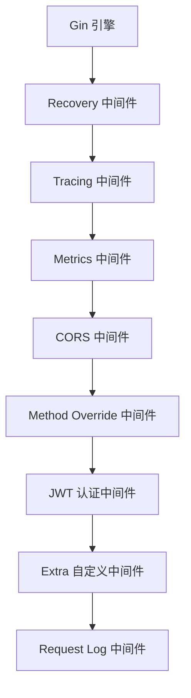
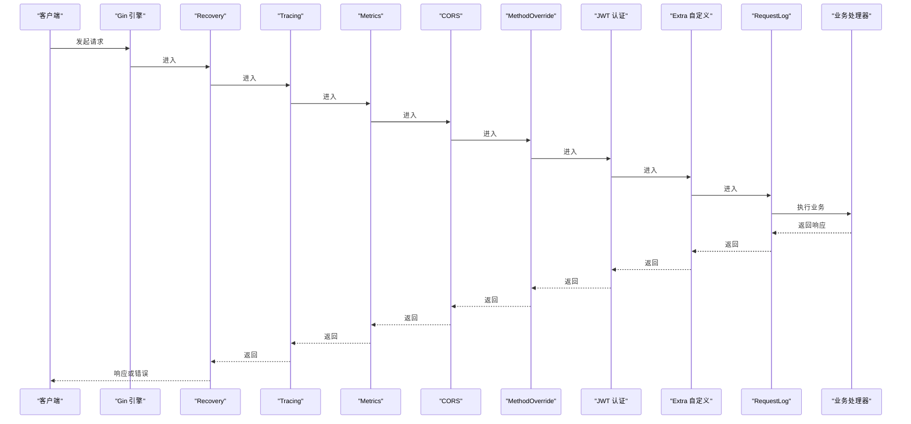
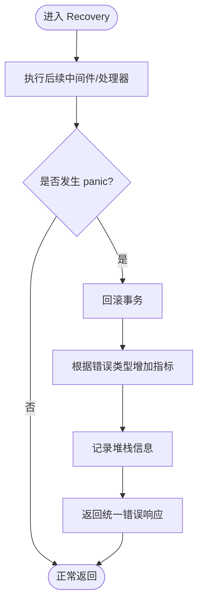
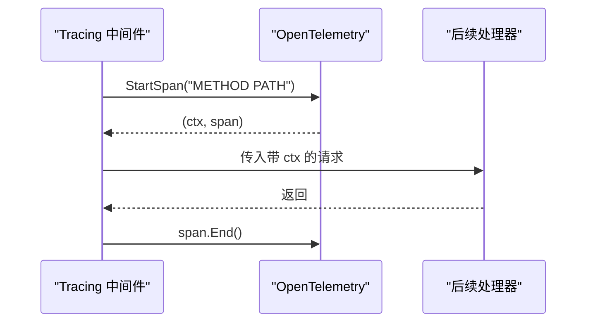
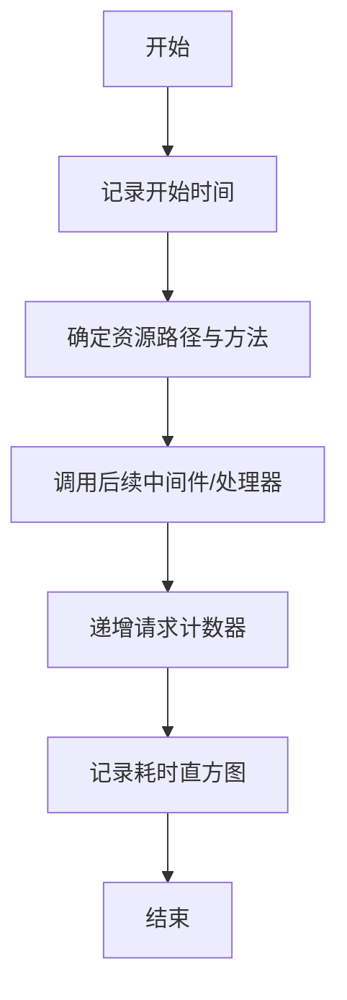
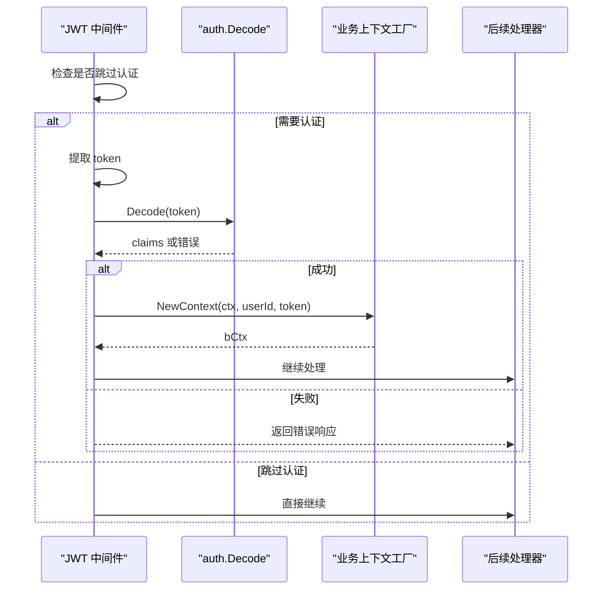
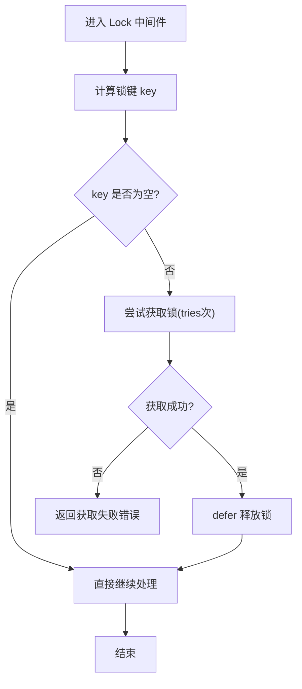
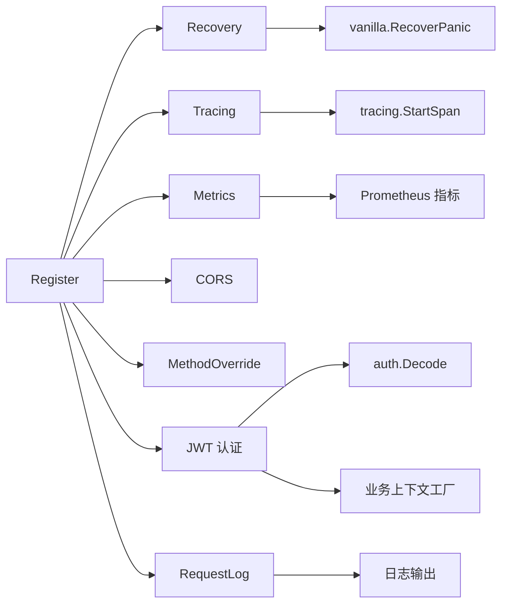

# 中间件系统

<cite>
**本文引用的文件**
- [register.go](file://middleware/register.go)
- [recovery.go](file://middleware/recovery.go)
- [tracing.go](file://middleware/tracing.go)
- [metrics.go](file://middleware/metrics.go)
- [cors.go](file://middleware/cors.go)
- [jwt_auth.go](file://middleware/jwt_auth.go)
- [request_log.go](file://middleware/request_log.go)
- [lock.go](file://middleware/lock.go)
- [method_override.go](file://middleware/method_override.go)
- [jwt.go](file://auth/jwt.go)
- [tracing.go](file://tracing/tracing.go)
- [metrics.go](file://metrics/metrics.go)
- [lock.go](file://lock/lock.go)
- [options.go](file://lock/options.go)
- [recover.go](file://vanilla/recover.go)
- [config.go](file://config/config.go)
- [README.md](file://README.md)
</cite>

## 目录
1. [简介](#简介)
2. [项目结构](#项目结构)
3. [核心组件](#核心组件)
4. [架构总览](#架构总览)
5. [详细组件分析](#详细组件分析)
6. [依赖关系分析](#依赖关系分析)
7. [性能考量](#性能考量)
8. [故障排查指南](#故障排查指南)
9. [结论](#结论)
10. [附录](#附录)

## 简介
本文件面向 Carina 中间件系统，系统性说明中间件链的配置与执行顺序、内置中间件的职责与配置项，并深入解析 Recovery（panic 捕获与自动回滚）、Tracing（链路追踪）、Metrics（指标收集）、CORS（跨域）、JWT 认证、Request Log（请求日志）、Lock（分布式锁）等能力。文末提供自定义中间件开发规范与最佳实践，帮助在业务中安全扩展中间件链。

## 项目结构
Carina 的中间件位于 middleware 包，通过统一的 Register 入口按固定顺序挂载到 Gin 引擎上；各中间件分别实现具体能力，并与 auth、tracing、metrics、lock、vanilla 等子模块协作。

图表来源
- [register.go:28-71](file://middleware/register.go#L28-L71)

章节来源
- [register.go:28-71](file://middleware/register.go#L28-L71)

## 核心组件
- 统一注册器：Options 集中管理 CORSOrigins、JWTSecret、EnableTx、EnableLock、EnableMetrics、EnableTracing、SkipJWTPaths、Extra 等开关与参数；Register 负责按序挂载中间件。
- 基础能力：
  - Recovery：基于 vanilla.RecoverPanic，捕获 panic、回滚事务、记录指标、返回统一错误响应。
  - Tracing：基于 OpenTelemetry，为每个请求创建 span，注入 context。
  - Metrics：统计端点请求数与耗时，暴露 Prometheus 指标。
  - CORS：可配置白名单的跨域处理。
  - MethodOverride：支持 _method 参数重写 HTTP 方法。
  - JWT 认证：从 Header/Query/Cookie 提取 token，校验后注入用户上下文与 gin.Context。
  - Request Log：记录请求方法、路径、状态码与耗时。
  - Lock：请求级分布式锁，适用于裸路由场景。

章节来源
- [register.go:7-26](file://middleware/register.go#L7-L26)
- [recovery.go:9-12](file://middleware/recovery.go#L9-L12)
- [tracing.go:10-20](file://middleware/tracing.go#L10-L20)
- [metrics.go:10-29](file://middleware/metrics.go#L10-L29)
- [cors.go:11-44](file://middleware/cors.go#L11-L44)
- [method_override.go:9-20](file://middleware/method_override.go#L9-L20)
- [jwt_auth.go:13-61](file://middleware/jwt_auth.go#L13-L61)
- [request_log.go:10-24](file://middleware/request_log.go#L10-L24)
- [lock.go:14-63](file://middleware/lock.go#L14-L63)

## 架构总览
中间件链的执行顺序由 Register 决定，确保异常在最外层被捕获，追踪与指标覆盖完整请求生命周期，认证在业务逻辑之前完成，日志在请求结束后输出。

图表来源
- [register.go:28-71](file://middleware/register.go#L28-L71)
- [recovery.go:9-12](file://middleware/recovery.go#L9-L12)
- [tracing.go:10-20](file://middleware/tracing.go#L10-L20)
- [metrics.go:10-29](file://middleware/metrics.go#L10-L29)
- [cors.go:11-44](file://middleware/cors.go#L11-L44)
- [method_override.go:9-20](file://middleware/method_override.go#L9-L20)
- [jwt_auth.go:13-61](file://middleware/jwt_auth.go#L13-L61)
- [request_log.go:10-24](file://middleware/request_log.go#L10-L24)

## 详细组件分析

### Recovery 中间件（panic 捕获与自动回滚）
- 职责：捕获 panic，回滚当前事务，区分业务错误与系统 panic 并分别计数，记录堆栈，返回统一错误响应。
- 关键点：
  - 事务回滚：在 panic 分支调用 db.RollbackTx，保证数据一致性。
  - 指标上报：根据错误类型递增 PanicCounter 或 BusinessErrorCounter。
  - 统一响应：将业务错误与系统错误以标准格式返回。
- 适用场景：所有请求的兜底保护，避免服务崩溃。

图表来源
- [recover.go:14-66](file://vanilla/recover.go#L14-L66)
- [recovery.go:9-12](file://middleware/recovery.go#L9-L12)

章节来源
- [recovery.go:9-12](file://middleware/recovery.go#L9-L12)
- [recover.go:14-66](file://vanilla/recover.go#L14-L66)

### Tracing 中间件（OpenTelemetry 链路追踪）
- 职责：为每个请求创建 span，设置操作名为“方法 + 路径”，将包含 span 的 context 注入请求上下文，并在结束时关闭 span。
- 集成方式：
  - 使用 tracing.StartSpan 创建 span。
  - 通过 c.Request.WithContext 传递上下文。
- 初始化建议：在服务启动时调用 tracing.Init 配置 OTLP 导出与采样率。

图表来源
- [tracing.go:10-20](file://middleware/tracing.go#L10-L20)
- [tracing.go:25-74](file://tracing/tracing.go#L25-L74)

章节来源
- [tracing.go:10-20](file://middleware/tracing.go#L10-L20)
- [tracing.go:25-74](file://tracing/tracing.go#L25-L74)

### Metrics 中间件（Prometheus 指标收集）
- 职责：统计每个端点的请求次数与耗时，标签包含 resource 与 method。
- 行为：
  - 记录开始时间。
  - 计算 FullPath 或 URL.Path 作为资源标识。
  - 在请求完成后递增 EndpointCounter 与观察 EndpointDuration。
- 前置条件：需在应用启动时调用 metrics.Init 注册指标。

图表来源
- [metrics.go:10-29](file://middleware/metrics.go#L10-L29)
- [metrics.go:35-106](file://metrics/metrics.go#L35-L106)

章节来源
- [metrics.go:10-29](file://middleware/metrics.go#L10-L29)
- [metrics.go:35-106](file://metrics/metrics.go#L35-L106)

### CORS 中间件（跨域处理）
- 职责：配置允许的源、方法、头、凭证、缓存时长等，支持通配符与自定义校验函数。
- 配置要点：
  - origins 为空或 nil 时允许所有源。
  - 支持 AllowCredentials、MaxAge、AllowWebSockets 等。
  - 可通过 CORSMiddlewareWithOrigins 便捷构造。

章节来源
- [cors.go:11-44](file://middleware/cors.go#L11-L44)

### JWT 认证中间件（用户身份验证）
- 职责：从 AUTHORIZATION 头、_jwt 查询参数或 _jwt Cookie 中提取 token，解码并注入业务上下文与 gin.Context。
- 跳过规则：
  - SkipJWTPaths 前缀匹配的路径跳过认证。
  - 根路径 “/” 默认跳过认证。
- 失败处理：缺失或无效 token 返回统一错误响应。
- 依赖：auth.Decode 进行 token 解析，需先通过 config 或其他方式设置全局密钥。

图表来源
- [jwt_auth.go:13-81](file://middleware/jwt_auth.go#L13-L81)
- [jwt.go:18-74](file://auth/jwt.go#L18-L74)

章节来源
- [jwt_auth.go:13-81](file://middleware/jwt_auth.go#L13-L81)
- [jwt.go:18-74](file://auth/jwt.go#L18-L74)

### Request Log 中间件（请求日志记录）
- 职责：记录请求方法、路径、状态码与耗时，便于审计与排障。
- 行为：在 c.Next() 之后读取 Writer.Status() 与耗时并输出日志。

章节来源
- [request_log.go:10-24](file://middleware/request_log.go#L10-L24)

### Lock 中间件（分布式锁支持）
- 职责：为裸路由提供请求级分布式锁，防止并发重复处理。
- 用法：
  - keyFunc：从请求中计算锁键（如用户 ID、订单号），返回空则不加锁。
  - timeout：锁过期时间（秒）。
  - tries：尝试获取锁的次数。
- 行为：
  - 使用 sync.Pool 复用 LockOption。
  - 获取锁失败返回统一错误响应。
  - 成功则在 defer 中释放锁。
- 后端：默认 DummyLock（开发环境），生产通过 lock.InitRedis 切换 Redis 实现。

图表来源
- [lock.go:14-63](file://middleware/lock.go#L14-L63)
- [lock.go:55-69](file://lock/lock.go#L55-L69)
- [options.go:3-17](file://lock/options.go#L3-L17)

章节来源
- [lock.go:14-63](file://middleware/lock.go#L14-L63)
- [lock.go:55-69](file://lock/lock.go#L55-L69)
- [options.go:3-17](file://lock/options.go#L3-L17)

### Method Override 中间件（HTTP 方法重写）
- 职责：当请求为 POST 且携带 _method 参数时，重写为指定方法，兼容 RESTful 表单提交。

章节来源
- [method_override.go:9-20](file://middleware/method_override.go#L9-L20)

## 依赖关系分析
- 中间件层对基础设施的依赖：
  - Recovery 依赖 vanilla.RecoverPanic 与 db.RollbackTx。
  - Tracing 依赖 tracing.StartSpan。
  - Metrics 依赖 metrics 包的指标实例。
  - JWT 认证依赖 auth.Decode 与 vanilla 的业务上下文工厂。
  - Lock 依赖 lock 包的全局锁引擎。
- 配置与环境：
  - 配置加载通过 config.Load 支持环境变量覆盖敏感字段（如 auth.jwt_secret）。
  - 中间件开关通过 Options 控制，便于按需启用。

图表来源
- [register.go:28-71](file://middleware/register.go#L28-L71)
- [jwt_auth.go:13-81](file://middleware/jwt_auth.go#L13-L81)
- [recover.go:14-66](file://vanilla/recover.go#L14-L66)
- [tracing.go:10-20](file://middleware/tracing.go#L10-L20)
- [metrics.go:10-29](file://middleware/metrics.go#L10-L29)
- [config.go:21-59](file://config/config.go#L21-L59)

章节来源
- [register.go:28-71](file://middleware/register.go#L28-L71)
- [config.go:21-59](file://config/config.go#L21-L59)

## 性能考量
- 中间件顺序影响性能与正确性：
  - Recovery 置于最外层，确保任何 panic 都能被捕获。
  - Tracing 与 Metrics 包裹尽可能多的处理逻辑，以获得更准确的度量。
  - JWT 认证在业务逻辑之前，减少无效请求的处理开销。
- 指标与追踪的开销：
  - 合理设置采样率（tracing.Options.SampleRate）以降低追踪成本。
  - 确保 metrics.Init 仅调用一次，避免重复注册。
- 锁的性能：
  - 合理设置 timeout 与 tries，避免长时间阻塞。
  - 在生产环境启用 Redis 锁，开发环境使用 DummyLock 降低依赖。

[本节为通用指导，不直接分析具体文件]

## 故障排查指南
- 常见错误与定位：
  - 缺少 JWT 密钥：auth 未初始化会导致 Decode 报错，需通过配置加载并设置全局密钥。
  - 认证失败：检查 SkipJWTPaths 是否正确配置，确认 token 来源（Header/Query/Cookie）。
  - 锁获取失败：检查 key 生成逻辑、Redis 连接与超时重试配置。
  - 指标未采集：确认 metrics.Init 已调用，且中间件已启用。
  - 追踪未生效：确认 tracing.Init 已调用，Endpoint 可达，采样率非零。
- 日志与指标：
  - 使用 RequestLog 快速定位慢请求与错误状态码。
  - 通过 Prometheus 指标观察端点 QPS、耗时分布与 panic 计数。

章节来源
- [jwt.go:18-74](file://auth/jwt.go#L18-L74)
- [jwt_auth.go:13-81](file://middleware/jwt_auth.go#L13-L81)
- [lock.go:14-63](file://middleware/lock.go#L14-L63)
- [metrics.go:35-106](file://metrics/metrics.go#L35-L106)
- [tracing.go:25-74](file://tracing/tracing.go#L25-L74)
- [request_log.go:10-24](file://middleware/request_log.go#L10-L24)

## 结论
Carina 中间件系统通过统一的 Register 入口提供了高内聚、低耦合的可插拔能力，涵盖异常恢复、链路追踪、指标采集、跨域、认证、日志与分布式锁等关键功能。合理的配置与顺序能显著提升系统的稳定性、可观测性与安全性。结合自定义中间件机制，可在不破坏既有流程的前提下灵活扩展业务能力。

[本节为总结性内容，不直接分析具体文件]

## 附录

### 中间件链配置与执行顺序
- 配置项（Options）：
  - CORSOrigins：允许的源列表，空表示允许所有。
  - JWTSecret：JWT 密钥，空字符串跳过 JWT 认证。
  - EnableTx：是否启用自动事务（非 GET 请求 Begin/Commit）。
  - EnableLock：是否启用分布式锁。
  - EnableMetrics：是否启用 Prometheus 指标。
  - EnableTracing：是否启用 OpenTelemetry 链路追踪。
  - SkipJWTPaths：跳过 JWT 认证的 URL 前缀。
  - Extra：项目自定义中间件，挂载在内置中间件之后。
- 执行顺序（由 Register 定义）：
  1. Recovery
  2. Tracing（可选）
  3. Metrics（可选）
  4. CORS
  5. MethodOverride
  6. JWT 认证（可选）
  7. Extra 自定义中间件
  8. RequestLog

章节来源
- [register.go:7-26](file://middleware/register.go#L7-L26)
- [register.go:28-71](file://middleware/register.go#L28-L71)

### 自定义中间件开发指南
- 编写规范：
  - 遵循 gin.HandlerFunc 签名，确保调用 c.Next() 并正确处理上下文。
  - 尽量无副作用地读取/写入 gin.Context，避免污染其他中间件。
  - 对于耗时操作，考虑埋点与错误上报。
- 最佳实践：
  - 将业务无关的横切关注点（鉴权、限流、审计）抽象为中间件。
  - 通过 Options 暴露可配置项，保持中间件可复用。
  - 在测试中覆盖异常路径与边界条件。
- 挂载位置：
  - 通过 Options.Extra 挂载在内置中间件之后，确保不影响核心流程。
  - 若需更早介入（如鉴权前），可考虑在 Register 中调整顺序或新增入口。

章节来源
- [register.go:7-26](file://middleware/register.go#L7-L26)
- [register.go:28-71](file://middleware/register.go#L28-L71)

### 快速开始参考
- 框架 README 展示了如何加载配置、初始化基础设施、注册中间件与启动服务。
- 建议在应用启动阶段完成 metrics.Init、tracing.Init、auth.Init 等初始化工作。

章节来源
- [README.md:27-74](file://README.md#L27-L74)
- [config.go:21-59](file://config/config.go#L21-L59)