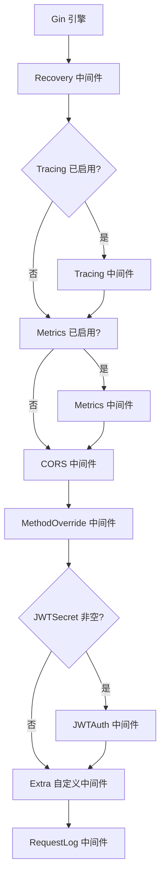
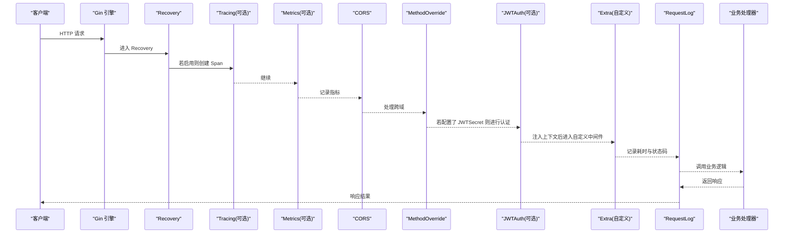
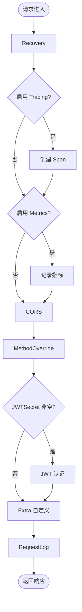
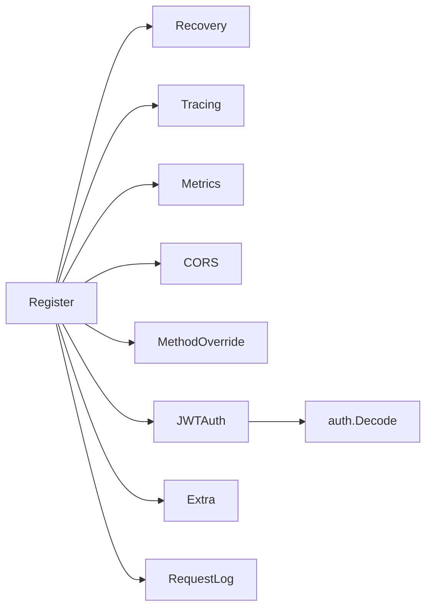

# 中间件配置

<cite>
**本文引用的文件**
- [register.go](file://middleware/register.go)
- [cors.go](file://middleware/cors.go)
- [jwt_auth.go](file://middleware/jwt_auth.go)
- [metrics.go](file://middleware/metrics.go)
- [recovery.go](file://middleware/recovery.go)
- [request_log.go](file://middleware/request_log.go)
- [tracing.go](file://middleware/tracing.go)
- [method_override.go](file://middleware/method_override.go)
- [lock.go](file://middleware/lock.go)
- [config.go](file://config/config.go)
- [types.go](file://config/types.go)
- [jwt.go](file://auth/jwt.go)
</cite>

## 目录
1. [简介](#简介)
2. [项目结构](#项目结构)
3. [核心组件](#核心组件)
4. [架构总览](#架构总览)
5. [详细组件分析](#详细组件分析)
6. [依赖关系分析](#依赖关系分析)
7. [性能考量](#性能考量)
8. [故障排查指南](#故障排查指南)
9. [结论](#结论)
10. [附录：环境配置与最佳实践](#附录环境配置与最佳实践)

## 简介
本文件面向使用 Carina 框架的开发者，系统化说明中间件的配置选项、注册顺序与执行流程，帮助你在不同环境下正确启用或关闭各项能力（CORS、JWT、事务、分布式锁、指标、链路追踪等），并提供可操作的最佳实践建议。

## 项目结构
Carina 将中间件集中在 middleware 包中，通过统一的 Register 函数按固定顺序挂载到 Gin 引擎上。各中间件职责清晰、解耦良好，便于按需启用与扩展。

图示来源
- [register.go:39-71](file://middleware/register.go#L39-L71)
- [recovery.go:9-12](file://middleware/recovery.go#L9-L12)
- [tracing.go:10-20](file://middleware/tracing.go#L10-L20)
- [metrics.go:10-29](file://middleware/metrics.go#L10-L29)
- [cors.go:11-44](file://middleware/cors.go#L11-L44)
- [method_override.go:9-20](file://middleware/method_override.go#L9-L20)
- [jwt_auth.go:13-62](file://middleware/jwt_auth.go#L13-L62)
- [request_log.go:10-24](file://middleware/request_log.go#L10-L24)

章节来源
- [register.go:7-26](file://middleware/register.go#L7-L26)
- [register.go:28-71](file://middleware/register.go#L28-L71)

## 核心组件
- Options 结构体：集中声明所有中间件开关与参数，新增字段采用零值默认行为，保证向后兼容。
- Register 函数：一站式注册全部内置中间件，并严格规定执行顺序。
- 各中间件：分别负责异常恢复、链路追踪、指标采集、跨域、方法重写、JWT 认证、请求日志等。

章节来源
- [register.go:7-26](file://middleware/register.go#L7-L26)
- [register.go:28-71](file://middleware/register.go#L28-L71)

## 架构总览
下图展示了从请求进入 Gin 引擎到最终返回响应的完整中间件链，以及关键分支条件（如是否启用 Tracing/Metrics/JWT）。

图示来源
- [register.go:39-71](file://middleware/register.go#L39-L71)
- [recovery.go:9-12](file://middleware/recovery.go#L9-L12)
- [tracing.go:10-20](file://middleware/tracing.go#L10-L20)
- [metrics.go:10-29](file://middleware/metrics.go#L10-L29)
- [cors.go:11-44](file://middleware/cors.go#L11-L44)
- [method_override.go:9-20](file://middleware/method_override.go#L9-L20)
- [jwt_auth.go:13-62](file://middleware/jwt_auth.go#L13-L62)
- [request_log.go:10-24](file://middleware/request_log.go#L10-L24)

## 详细组件分析

### Options 配置项详解
- CORSOrigins
  - 作用：设置允许的跨域源列表；为空或 nil 时允许所有源。
  - 配置方式：在 Options 中传入字符串切片；也可通过配置文件映射到 ServerConfig.CORSOrigins 再组装为 Options。
  - 参考实现：[cors.go:11-44](file://middleware/cors.go#L11-L44)
- JWTSecret
  - 作用：设置 JWT 签名密钥；为空字符串时跳过 JWT 认证。
  - 配置方式：在 Options 中设置；同时需在应用启动时初始化 auth 全局密钥。
  - 参考实现：[register.go:59-62](file://middleware/register.go#L59-L62)、[jwt.go:18-21](file://auth/jwt.go#L18-L21)
- EnableTx
  - 作用：控制是否启用自动事务（非 GET 请求自动 Begin/Commit）。当前 Register 未直接使用该字段，但保留以支持未来扩展。
  - 参考位置：[register.go:14-15](file://middleware/register.go#L14-L15)
- EnableLock
  - 作用：控制是否启用分布式锁。Register 未直接使用该字段；可通过 LockMiddleware 在路由或自定义中间件中按需启用。
  - 参考实现：[lock.go:14-63](file://middleware/lock.go#L14-L63)
- EnableMetrics
  - 作用：启用 Prometheus 指标采集（端点计数与耗时）。
  - 参考实现：[register.go:48-51](file://middleware/register.go#L48-L51)、[metrics.go:10-29](file://middleware/metrics.go#L10-L29)
- EnableTracing
  - 作用：启用 OpenTelemetry 链路追踪（为每个请求创建 Span）。
  - 参考实现：[register.go:43-46](file://middleware/register.go#L43-L46)、[tracing.go:10-20](file://middleware/tracing.go#L10-L20)
- SkipJWTPaths
  - 作用：指定跳过 JWT 认证的 URL 前缀；根路径“/”也默认跳过。
  - 参考实现：[jwt_auth.go:16-31](file://middleware/jwt_auth.go#L16-L31)
- Extra
  - 作用：挂载项目自定义中间件，位于内置中间件之后、RequestLog 之前。
  - 参考实现：[register.go:64-67](file://middleware/register.go#L64-L67)

章节来源
- [register.go:7-26](file://middleware/register.go#L7-L26)
- [register.go:39-71](file://middleware/register.go#L39-L71)
- [cors.go:11-44](file://middleware/cors.go#L11-L44)
- [jwt_auth.go:13-62](file://middleware/jwt_auth.go#L13-L62)
- [metrics.go:10-29](file://middleware/metrics.go#L10-L29)
- [tracing.go:10-20](file://middleware/tracing.go#L10-L20)
- [lock.go:14-63](file://middleware/lock.go#L14-L63)

### 中间件注册顺序与执行流程
- 固定顺序（由 Register 决定）：
  1) Recovery（最外层，捕获 panic 并回滚事务）
  2) Tracing（可选，创建 Span）
  3) Metrics（可选，统计端点调用次数与耗时）
  4) CORS（始终启用，白名单可控）
  5) MethodOverride（支持 _method 参数重写）
  6) JWTAuth（当 JWTSecret 非空时启用，解析 token 并注入上下文）
  7) Extra（项目自定义中间件）
  8) RequestLog（记录请求日志）
- 执行流程要点：
  - 请求进入后先经过 Recovery，确保任何 panic 都被捕获并安全返回。
  - 若启用 Tracing，会在请求上下文中注入 Span，便于后续链路追踪。
  - Metrics 会统计 FullPath 与 HTTP Method，并在请求结束后上报。
  - CORS 根据 Origins 白名单决定是否放行跨域请求。
  - MethodOverride 将 POST 请求中的 _method 参数转换为实际 HTTP 方法。
  - JWTAuth 会从 Header/Query/Cookie 提取 token，校验成功后注入用户信息到 gin.Context 与业务上下文。
  - Extra 用于项目级横切逻辑（如权限校验、审计等）。
  - RequestLog 最后记录请求耗时与状态码。

图示来源
- [register.go:39-71](file://middleware/register.go#L39-L71)
- [recovery.go:9-12](file://middleware/recovery.go#L9-L12)
- [tracing.go:10-20](file://middleware/tracing.go#L10-L20)
- [metrics.go:10-29](file://middleware/metrics.go#L10-L29)
- [cors.go:11-44](file://middleware/cors.go#L11-L44)
- [method_override.go:9-20](file://middleware/method_override.go#L9-L20)
- [jwt_auth.go:13-62](file://middleware/jwt_auth.go#L13-L62)
- [request_log.go:10-24](file://middleware/request_log.go#L10-L24)

章节来源
- [register.go:28-71](file://middleware/register.go#L28-L71)

### 关键中间件深入分析

#### CORS 中间件
- 行为：
  - 当 Origins 为空或 nil 时，允许所有源。
  - 允许常用方法与头，支持凭证、通配符、WebSocket。
  - AllowOriginFunc 对“*”与精确匹配进行处理。
- 适用场景：前后端分离部署、多域名访问。
- 参考实现：[cors.go:11-44](file://middleware/cors.go#L11-L44)

章节来源
- [cors.go:11-44](file://middleware/cors.go#L11-L44)

#### JWT 认证中间件
- 行为：
  - 跳过规则：SkipJWTPaths 前缀匹配；根路径“/”默认跳过。
  - Token 来源优先级：AUTHORIZATION header → _jwt query → _jwt cookie。
  - 校验失败或缺失时返回统一错误格式。
  - 成功后将用户信息写入 gin.Context，并通过业务上下文工厂注入到请求 Context。
- 注意：需确保应用启动时已初始化 auth 全局密钥。
- 参考实现：[jwt_auth.go:13-81](file://middleware/jwt_auth.go#L13-L81)、[jwt.go:18-21](file://auth/jwt.go#L18-L21)

章节来源
- [jwt_auth.go:13-81](file://middleware/jwt_auth.go#L13-L81)
- [jwt.go:18-21](file://auth/jwt.go#L18-L21)

#### Metrics 中间件
- 行为：统计端点调用次数与耗时，标签包含 FullPath 与 Method。
- 适用场景：生产环境监控与告警。
- 参考实现：[metrics.go:10-29](file://middleware/metrics.go#L10-L29)

章节来源
- [metrics.go:10-29](file://middleware/metrics.go#L10-L29)

#### Tracing 中间件
- 行为：为每个请求创建 Span，并将 Span 注入请求 Context。
- 适用场景：分布式链路追踪与问题定位。
- 参考实现：[tracing.go:10-20](file://middleware/tracing.go#L10-L20)

章节来源
- [tracing.go:10-20](file://middleware/tracing.go#L10-L20)

#### Recovery 中间件
- 行为：捕获 panic，避免服务崩溃，并尽可能回滚事务。
- 位置：必须置于最外层，确保所有异常都能被捕获。
- 参考实现：[recovery.go:9-12](file://middleware/recovery.go#L9-L12)

章节来源
- [recovery.go:9-12](file://middleware/recovery.go#L9-L12)

#### MethodOverride 中间件
- 行为：POST 请求携带 _method 参数时，将其作为实际 HTTP 方法。
- 适用场景：兼容 HTML 表单仅支持 GET/POST 的限制。
- 参考实现：[method_override.go:9-20](file://middleware/method_override.go#L9-L20)

章节来源
- [method_override.go:9-20](file://middleware/method_override.go#L9-L20)

#### RequestLog 中间件
- 行为：记录请求方法、路径、状态码与耗时。
- 参考实现：[request_log.go:10-24](file://middleware/request_log.go#L10-L24)

章节来源
- [request_log.go:10-24](file://middleware/request_log.go#L10-L24)

#### 分布式锁中间件（按需启用）
- 行为：根据 keyFunc 计算锁键，获取分布式锁后执行业务逻辑，释放锁。
- 适用场景：防止并发重复提交、热点资源竞争。
- 参考实现：[lock.go:14-63](file://middleware/lock.go#L14-L63)

章节来源
- [lock.go:14-63](file://middleware/lock.go#L14-L63)

## 依赖关系分析
- 中间件之间耦合度低，主要通过 gin.Context 传递上下文与状态。
- JWT 认证依赖 auth 包的 Decode 能力，需要全局密钥初始化。
- Metrics/Tracing 依赖各自的基础设施（Prometheus/OpenTelemetry），可按开关启用。
- CORS 依赖 gin-contrib/cors，提供灵活的白名单策略。

图示来源
- [register.go:39-71](file://middleware/register.go#L39-L71)
- [jwt_auth.go:13-81](file://middleware/jwt_auth.go#L13-L81)
- [jwt.go:52-74](file://auth/jwt.go#L52-L74)

章节来源
- [register.go:39-71](file://middleware/register.go#L39-L71)
- [jwt_auth.go:13-81](file://middleware/jwt_auth.go#L13-L81)
- [jwt.go:52-74](file://auth/jwt.go#L52-L74)

## 性能考量
- 开启 Tracing/Metrics 会带来少量额外开销，建议在开发/测试环境按需启用，生产环境根据监控需求选择。
- CORS 白名单越小越安全，避免在生产使用“*”通配。
- JWT 认证涉及签名校验，应合理设置超时与重试策略，避免频繁无效请求造成压力。
- 分布式锁在高并发下可能成为瓶颈，应结合业务特性评估必要性。

## 故障排查指南
- JWT 相关错误
  - 现象：缺少 token、token 无效或过期。
  - 排查：检查 AUTHORIZATION/_jwt/_jwt cookie 是否正确传递；确认 auth 全局密钥已初始化；核对 SkipJWTPaths 是否误配。
  - 参考实现：[jwt_auth.go:16-62](file://middleware/jwt_auth.go#L16-L62)、[jwt.go:52-74](file://auth/jwt.go#L52-L74)
- CORS 相关问题
  - 现象：浏览器报跨域错误。
  - 排查：确认 Origin 是否在白名单内；检查 AllowHeaders/AllowMethods 是否包含必要字段；生产环境避免“*”通配。
  - 参考实现：[cors.go:11-44](file://middleware/cors.go#L11-L44)
- 指标与链路追踪
  - 现象：无指标或无 Span。
  - 排查：确认 EnableMetrics/EnableTracing 已开启；检查对应基础设施是否可达。
  - 参考实现：[metrics.go:10-29](file://middleware/metrics.go#L10-L29)、[tracing.go:10-20](file://middleware/tracing.go#L10-L20)
- 请求日志
  - 现象：日志缺失或状态码不正确。
  - 排查：确认 RequestLog 处于链末；检查业务处理器是否正确设置状态码。
  - 参考实现：[request_log.go:10-24](file://middleware/request_log.go#L10-L24)

章节来源
- [jwt_auth.go:16-62](file://middleware/jwt_auth.go#L16-L62)
- [cors.go:11-44](file://middleware/cors.go#L11-L44)
- [metrics.go:10-29](file://middleware/metrics.go#L10-L29)
- [tracing.go:10-20](file://middleware/tracing.go#L10-L20)
- [request_log.go:10-24](file://middleware/request_log.go#L10-L24)

## 结论
通过 Options 与 Register，Carina 提供了统一、可扩展且顺序明确的中间件体系。建议在生产环境中谨慎配置 CORS、按需启用指标与追踪，并结合业务特性合理使用 JWT 与分布式锁，以获得更好的安全性与可观测性。

## 附录：环境配置与最佳实践

### 配置来源与加载顺序
- 配置文件加载：
  - 基础配置 config.yaml 与环境覆盖 config.<env>.yaml（由 GO_ENV 决定）。
  - 环境变量优先，敏感字段支持通过环境变量覆盖。
- 与中间件相关的配置映射：
  - ServerConfig.CORSOrigins → Options.CORSOrigins
  - AuthConfig.JWTSecret → Options.JWTSecret（并用于 auth.Init）
  - TracingConfig.Enabled → Options.EnableTracing
  - 其他开关（EnableMetrics、EnableLock、EnableTx、SkipJWTPaths、Extra）可在应用层根据配置动态组装 Options。

章节来源
- [config.go:11-60](file://config/config.go#L11-L60)
- [types.go:3-53](file://config/types.go#L3-L53)

### 不同环境的配置示例（概念性）
- 本地开发
  - 启用 Tracing/Metrics，方便调试与观测。
  - CORS 允许本地前端域名或临时放宽。
  - 可关闭 JWT 或使用弱密钥进行联调。
- 测试环境
  - 启用 Metrics/Tracing，关闭不必要的功能以减少干扰。
  - 配置合理的 CORS 白名单与 JWT 密钥。
- 生产环境
  - 严格 CORS 白名单，禁止“*”通配。
  - 启用 Metrics/Tracing，接入监控与追踪平台。
  - 启用 JWT，设置强密钥与合理的过期时间。
  - 按需启用分布式锁，避免热点冲突。

### 最佳实践建议
- 将 Options 的构建与配置中心/环境变量对接，避免硬编码。
- 将 SkipJWTPaths 最小化，仅放行必要的公开接口。
- 在 Extra 中集中实现项目级横切逻辑（如审计、限流、灰度）。
- 对高并发写操作考虑分布式锁，避免数据竞争。
- 定期审查 CORS 白名单与 JWT 策略，确保安全合规。