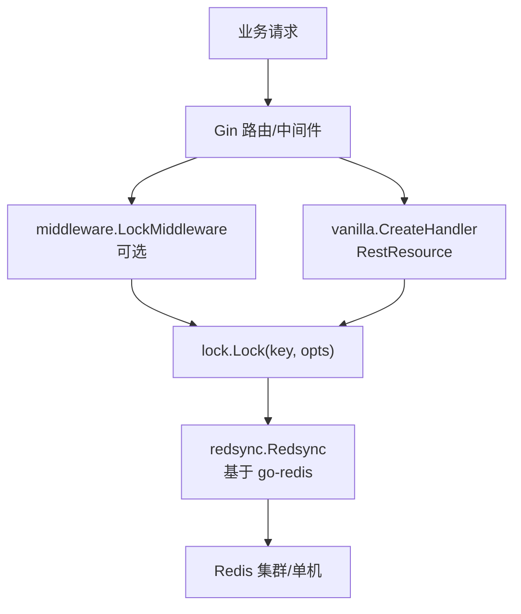
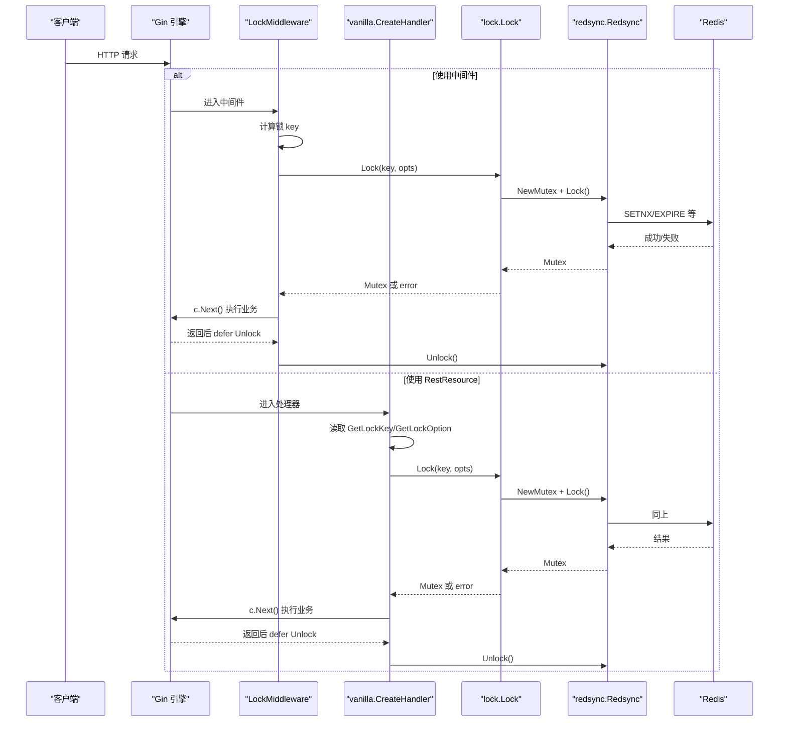
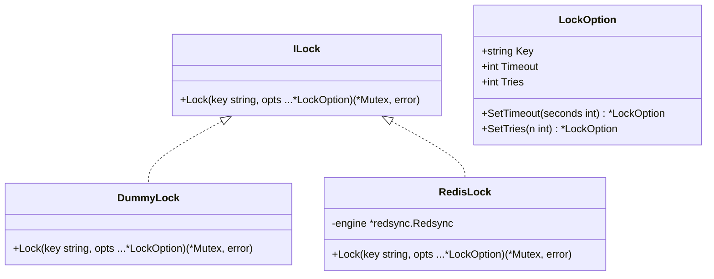
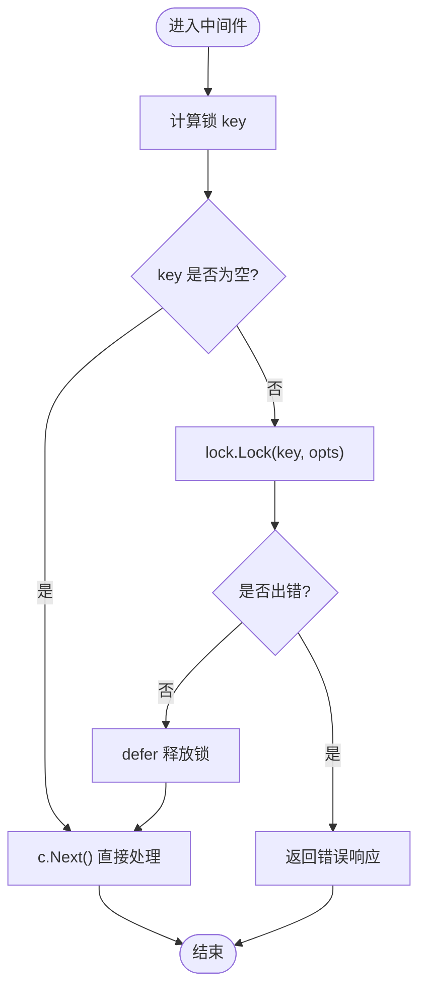
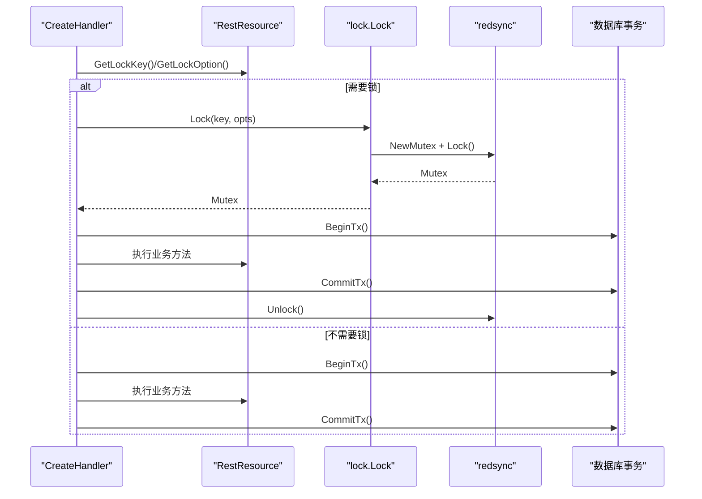
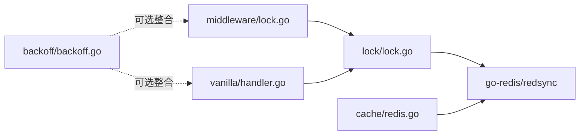

# 分布式锁中间件

<cite>
**本文引用的文件**
- [lock/lock.go](file://lock/lock.go)
- [lock/options.go](file://lock/options.go)
- [middleware/lock.go](file://middleware/lock.go)
- [vanilla/handler.go](file://vanilla/handler.go)
- [vanilla/rest_resource.go](file://vanilla/rest_resource.go)
- [cache/redis.go](file://cache/redis.go)
- [backoff/backoff.go](file://backoff/backoff.go)
- [README.md](file://README.md)
</cite>

## 目录
1. [简介](#简介)
2. [项目结构](#项目结构)
3. [核心组件](#核心组件)
4. [架构总览](#架构总览)
5. [详细组件分析](#详细组件分析)
6. [依赖关系分析](#依赖关系分析)
7. [性能与优化](#性能与优化)
8. [故障排查指南](#故障排查指南)
9. [结论](#结论)
10. [附录：使用模式与最佳实践](#附录使用模式与最佳实践)

## 简介
本中间件提供基于 Redis 的分布式锁能力，支持两种集成方式：
- 资源级自动加锁：通过 RestResource 声明 GetLockKey/GetLockOption，由框架在请求处理前自动获取锁、处理后释放。
- 裸路由中间件：通过 LockMiddleware 对任意 Gin 路由进行按请求维度的加锁控制。

底层基于 redsync 实现，具备超时保护、重试次数配置、以及开发环境的 DummyLock 降级能力。配合 backoff 包可实现更灵活的重试策略（如指数退避）。

## 项目结构
围绕分布式锁的关键模块如下：
- lock：锁引擎抽象与 Redis 实现，提供全局初始化与统一调用入口。
- middleware：Gin 中间件形式的请求级锁。
- vanilla：RestResource 体系中的自动锁集成点。
- cache：Redis 客户端封装（用于服务启动时连通性检查等）。
- backoff：重试退避算法（可与锁结合使用）。

图表来源
- [middleware/lock.go:20-63](file://middleware/lock.go#L20-L63)
- [vanilla/handler.go:54-72](file://vanilla/handler.go#L54-L72)
- [lock/lock.go:33-49](file://lock/lock.go#L33-L49)

章节来源
- [README.md:7-17](file://README.md#L7-L17)

## 核心组件
- ILock 接口与实现：DummyLock（开发环境无锁）、RedisLock（生产环境基于 redsync）。
- LockOption：锁粒度 key、超时时间、尝试次数等配置。
- 全局锁实例：InitRedis/InitDummy 切换实现；Lock 统一入口。
- 中间件：LockMiddleware 为裸路由提供请求级锁。
- 资源集成：vanilla.CreateHandler 在 RestResource 中按声明自动加锁。

章节来源
- [lock/lock.go:11-69](file://lock/lock.go#L11-L69)
- [lock/options.go:3-29](file://lock/options.go#L3-L29)
- [middleware/lock.go:14-63](file://middleware/lock.go#L14-L63)
- [vanilla/handler.go:54-72](file://vanilla/handler.go#L54-L72)
- [vanilla/rest_resource.go:27-30](file://vanilla/rest_resource.go#L27-L30)

## 架构总览
下图展示了从请求进入、到锁获取、再到业务执行与释放的完整流程。

图表来源
- [middleware/lock.go:34-61](file://middleware/lock.go#L34-L61)
- [vanilla/handler.go:54-72](file://vanilla/handler.go#L54-L72)
- [lock/lock.go:33-49](file://lock/lock.go#L33-L49)

## 详细组件分析

### 锁引擎与选项
- 接口与实现
  - ILock：定义 Lock(key, opts...) 方法。
  - DummyLock：空实现，便于本地开发跳过网络 IO。
  - RedisLock：基于 redsync 创建 Mutex，设置过期时间与尝试次数并执行 Lock。
- 选项
  - Key：锁粒度标识，建议以“资源:实体:主键”形式组织，避免冲突。
  - Timeout：锁持有超时（秒），防止死锁。
  - Tries：获取锁的最大尝试次数，适用于短暂竞争场景。

图表来源
- [lock/lock.go:14-49](file://lock/lock.go#L14-L49)
- [lock/options.go:3-29](file://lock/options.go#L3-L29)

章节来源
- [lock/lock.go:11-69](file://lock/lock.go#L11-L69)
- [lock/options.go:3-29](file://lock/options.go#L3-L29)

### 中间件式锁（裸路由）
- 作用域：针对不走 RestResource 体系的裸路由，按请求维度加锁。
- 行为：
  - 通过 keyFunc 动态计算锁 key，为空则直接放行。
  - 使用 sync.Pool 复用 LockOption，减少分配。
  - 获取失败返回统一错误响应；成功后在 defer 中释放锁。
- 适用场景：幂等校验、防重复提交、热点资源串行化。

图表来源
- [middleware/lock.go:20-63](file://middleware/lock.go#L20-L63)

章节来源
- [middleware/lock.go:14-63](file://middleware/lock.go#L14-L63)

### 资源级自动锁（RestResource）
- 集成点：vanilla.CreateHandler 在执行具体方法前，读取 GetLockKey/GetLockOption，若存在则获取锁并在 defer 中释放。
- 优势：无需手写中间件，声明式即可获得分布式锁保障。
- 事务协作：锁在事务之前获取，确保同一时刻只有一个请求能进入该资源方法，避免并发写冲突。

图表来源
- [vanilla/handler.go:54-72](file://vanilla/handler.go#L54-L72)
- [vanilla/rest_resource.go:27-30](file://vanilla/rest_resource.go#L27-L30)

章节来源
- [vanilla/handler.go:29-142](file://vanilla/handler.go#L29-L142)
- [vanilla/rest_resource.go:13-44](file://vanilla/rest_resource.go#L13-L44)

### Redis 客户端与连接
- cache.Init 负责初始化全局 Redis 客户端并进行 Ping 探测，确保可用。
- 锁引擎通过 InitRedis 接收 go-redis 客户端，构建 redsync 池并启用分布式锁。

章节来源
- [cache/redis.go:20-41](file://cache/redis.go#L20-L41)
- [lock/lock.go:55-59](file://lock/lock.go#L55-L59)

### 重试与退避
- 锁层内置 tries 参数，适合短竞争场景的快速重试。
- 对于更复杂的失败恢复（如网络抖动、Redis 瞬断），可结合 backoff 包实现指数退避重试，提升鲁棒性。

章节来源
- [lock/options.go:3-29](file://lock/options.go#L3-L29)
- [backoff/backoff.go:10-180](file://backoff/backoff.go#L10-L180)

## 依赖关系分析
- lock 依赖 redsync 与 go-redis，对外暴露 ILock 与全局 Lock 函数。
- middleware 依赖 lock 与 vanilla 的错误构造器，提供请求级锁。
- vanilla 在 handler 中集成 lock，实现资源级自动锁。
- cache 提供 Redis 客户端初始化与连通性检查。
- backoff 提供通用重试策略，可与上层逻辑组合。

图表来源
- [middleware/lock.go:1-63](file://middleware/lock.go#L1-L63)
- [vanilla/handler.go:1-142](file://vanilla/handler.go#L1-L142)
- [lock/lock.go:1-69](file://lock/lock.go#L1-L69)
- [cache/redis.go:1-41](file://cache/redis.go#L1-L41)
- [backoff/backoff.go:1-180](file://backoff/backoff.go#L1-L180)

章节来源
- [lock/lock.go:1-69](file://lock/lock.go#L1-L69)
- [middleware/lock.go:1-63](file://middleware/lock.go#L1-L63)
- [vanilla/handler.go:1-142](file://vanilla/handler.go#L1-L142)
- [cache/redis.go:1-41](file://cache/redis.go#L1-L41)
- [backoff/backoff.go:1-180](file://backoff/backoff.go#L1-L180)

## 性能与优化
- 锁粒度
  - 尽量细化 key，例如“订单ID:支付”而非“订单:所有”，降低锁竞争面。
  - 热点资源可考虑分片 key（如按用户 ID 哈希）分散压力。
- 超时与重试
  - Timeout 应略大于业务最大执行时间，避免误杀；同时防止进程崩溃导致的永久占用。
  - Tries 适合短时竞争；长耗时操作建议外层用 backoff 重试，避免频繁争抢。
- 内存与分配
  - 中间件使用 sync.Pool 复用 LockOption，减少 GC 压力。
- 观测与限流
  - 结合 metrics 统计锁获取耗时与失败率，必要时引入限流或熔断。
- 连接与网络
  - 确保 Redis 连接池大小与 QPS 匹配；开启健康检查与重试。

[本节为通用指导，不直接分析具体文件]

## 故障排查指南
- 无法获取锁
  - 检查 key 是否正确且唯一；确认 Redis 可达；查看锁超时与重试配置是否合理。
  - 参考错误码与日志定位：中间件会返回统一的错误响应体。
- 锁未释放
  - 确认业务代码路径均能触发 defer Unlock；避免提前 return 导致遗漏。
  - 利用 Timeout 机制兜底，防止进程异常导致死锁。
- 高延迟/抖动
  - 使用 backoff 做指数退避重试；监控 Redis 延迟与错误率。
  - 适当增大 Timeout 与 Tries，但需权衡吞吐与一致性。
- 开发环境验证
  - 使用 InitDummy 关闭分布式锁，快速验证业务逻辑；上线前务必切换到 InitRedis。

章节来源
- [middleware/lock.go:49-58](file://middleware/lock.go#L49-L58)
- [vanilla/handler.go:62-71](file://vanilla/handler.go#L62-L71)
- [lock/lock.go:55-64](file://lock/lock.go#L55-L64)

## 结论
本中间件以最小侵入的方式为 Gin 应用提供可靠的分布式锁能力：
- 资源级自动锁与裸路由中间件双模式覆盖常见场景。
- 基于 redsync 的超时与重试机制，兼顾一致性与可用性。
- 通过细粒度 key、合理超时与重试策略，有效预防死锁并提升吞吐。
- 结合 backoff 可实现更稳健的故障恢复。

[本节为总结性内容，不直接分析具体文件]

## 附录：使用模式与最佳实践
- 资源级自动锁
  - 在 RestResource 中实现 GetLockKey 返回稳定唯一的 key；必要时通过 GetLockOption 自定义超时与重试。
  - 将锁范围限定在最必要的临界区，避免包裹无关 I/O。
- 裸路由中间件
  - 使用 keyFunc 从请求中提取业务主键（如订单号、用户 ID），为空则不加锁。
  - 对幂等接口建议强制加锁，防止重复提交。
- 锁粒度设计
  - 推荐“资源:实体:主键”命名规范；热点数据可按分片 key 降竞争。
- 超时与重试
  - Timeout 设置为“业务最长执行时间 + 安全余量”；Tries 用于短竞争场景。
  - 复杂失败场景结合 backoff 指数退避，避免雪崩。
- 故障恢复
  - 结合 metrics 与 tracing 记录锁获取耗时与失败原因。
  - 对关键路径增加告警，及时感知 Redis 异常。
- 开发测试
  - 使用 InitDummy 快速验证；回归阶段切回 InitRedis 进行端到端压测。

[本节为通用指导，不直接分析具体文件]