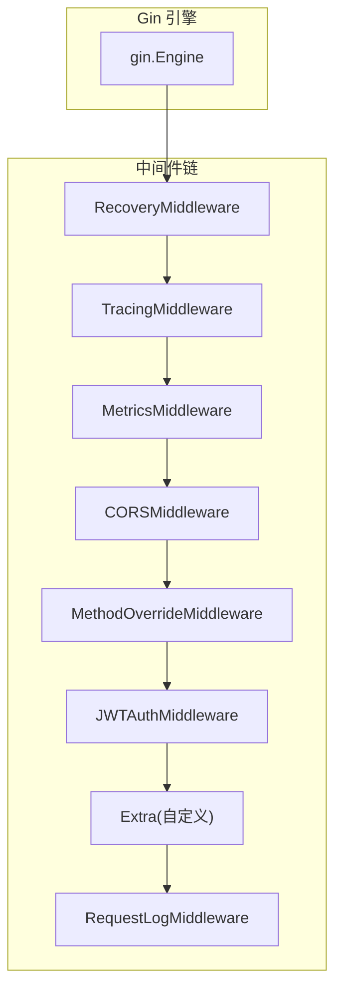
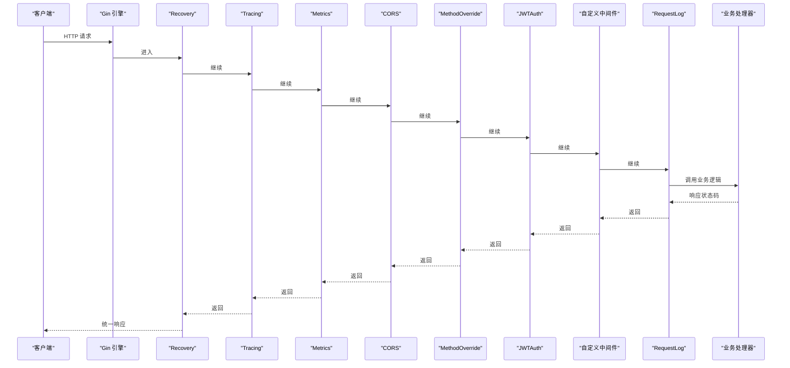
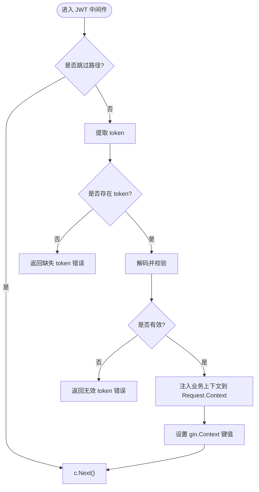
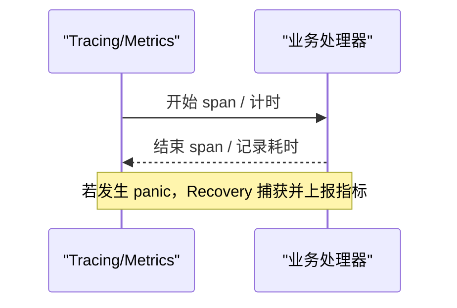
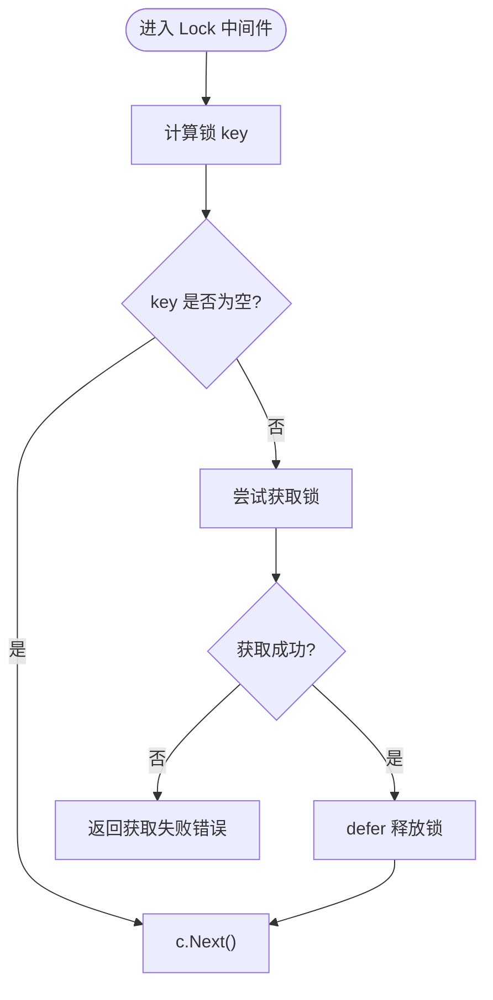
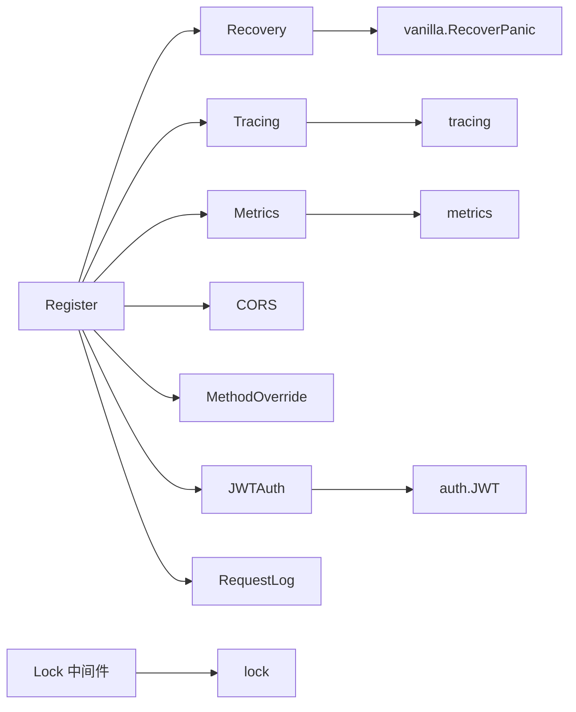

# 自定义中间件开发

<cite>
**本文引用的文件**
- [register.go](file://middleware/register.go)
- [cors.go](file://middleware/cors.go)
- [jwt_auth.go](file://middleware/jwt_auth.go)
- [request_log.go](file://middleware/request_log.go)
- [recovery.go](file://middleware/recovery.go)
- [metrics.go](file://middleware/metrics.go)
- [tracing.go](file://middleware/tracing.go)
- [lock.go](file://middleware/lock.go)
- [recover.go](file://vanilla/recover.go)
- [handler.go](file://vanilla/handler.go)
- [business_model.go](file://vanilla/business_model.go)
- [jwt.go](file://auth/jwt.go)
- [tracing.go](file://tracing/tracing.go)
- [metrics.go](file://metrics/metrics.go)
- [lock.go](file://lock/lock.go)
</cite>

## 目录
1. [简介](#简介)
2. [项目结构](#项目结构)
3. [核心组件](#核心组件)
4. [架构总览](#架构总览)
5. [详细组件分析](#详细组件分析)
6. [依赖关系分析](#依赖关系分析)
7. [性能考量](#性能考量)
8. [故障排查指南](#故障排查指南)
9. [结论](#结论)
10. [附录](#附录)

## 简介
本指南面向需要在 Carina 框架中编写、集成与测试自定义 Gin 中间件的开发者。内容涵盖：
- 中间件生命周期与上下文传递机制
- 在框架中的注册顺序与依赖管理
- 错误处理、性能监控与日志记录的实践
- 完整的自定义中间件示例思路（以代码路径引用代替具体代码）
- 测试策略与调试技巧

## 项目结构
Carina 的中间件位于 middleware 包，通过统一的 Register 入口按固定顺序挂载到 gin.Engine。内置能力包括：
- 恢复与事务回滚（Recovery）
- 链路追踪（Tracing）
- 指标采集（Metrics）
- 跨域（CORS）
- 方法重写（MethodOverride）
- JWT 认证（JWT Auth）
- 请求日志（Request Log）
- 分布式锁（Lock，可按需使用）

图示来源
- [register.go:28-71](file://middleware/register.go#L28-L71)

章节来源
- [register.go:28-71](file://middleware/register.go#L28-L71)

## 核心组件
- 统一注册器：提供 Options 配置项，集中控制各中间件的启用与参数，保证一致的挂载顺序和可观测性。
- 认证与上下文注入：JWT 中间件负责解析 token，并将业务上下文注入到 gin.Context 与 Request.Context，供后续 handler 使用。
- 可观测性：Tracing 与 Metrics 分别负责链路追踪与指标采集；Recovery 统一捕获 panic 并记录指标。
- 安全与兼容：CORS 与 MethodOverride 提供跨域与方法重写支持。
- 并发控制：Lock 中间件为裸路由提供请求级分布式锁能力。

章节来源
- [register.go:7-26](file://middleware/register.go#L7-L26)
- [jwt_auth.go:13-61](file://middleware/jwt_auth.go#L13-L61)
- [tracing.go:10-19](file://middleware/tracing.go#L10-L19)
- [metrics.go:10-28](file://middleware/metrics.go#L10-L28)
- [recovery.go:9-12](file://middleware/recovery.go#L9-L12)
- [cors.go:11-44](file://middleware/cors.go#L11-L44)
- [lock.go:14-63](file://middleware/lock.go#L14-L63)

## 架构总览
下图展示了从请求进入 Gin 引擎到最终返回响应的完整中间件链，以及关键数据流（如上下文、追踪 span、指标计数）。

图示来源
- [register.go:28-71](file://middleware/register.go#L28-L71)
- [jwt_auth.go:13-61](file://middleware/jwt_auth.go#L13-L61)
- [tracing.go:10-19](file://middleware/tracing.go#L10-L19)
- [metrics.go:10-28](file://middleware/metrics.go#L10-L28)
- [request_log.go:10-23](file://middleware/request_log.go#L10-L23)
- [recover.go:18-65](file://vanilla/recover.go#L18-L65)

## 详细组件分析

### 统一注册与挂载顺序
- 挂载顺序严格遵循：Recovery → Tracing → Metrics → CORS → MethodOverride → JWTAuth → Extra → RequestLog。
- 通过 Options 控制是否启用 Tracing、Metrics、JWT 等能力，并提供 SkipJWTPaths 白名单。
- 自定义中间件通过 Extra 切片挂载在 JWT 之后、日志之前，便于访问已认证的上下文。

章节来源
- [register.go:28-71](file://middleware/register.go#L28-L71)
- [register.go:7-26](file://middleware/register.go#L7-L26)

### 认证与上下文传递
- JWT 中间件从 AUTHORIZATION header、_jwt query 或 _jwt cookie 提取 token，校验后注入业务上下文到 Request.Context，并在 gin.Context 中设置 user_id、auth_user_id、jwt_token。
- 业务上下文工厂由 vanilla 包暴露接口，允许项目自定义注入字段。

图示来源
- [jwt_auth.go:13-61](file://middleware/jwt_auth.go#L13-L61)
- [business_model.go:50-66](file://vanilla/business_model.go#L50-L66)

章节来源
- [jwt_auth.go:13-61](file://middleware/jwt_auth.go#L13-L61)
- [business_model.go:50-66](file://vanilla/business_model.go#L50-L66)
- [jwt.go:18-74](file://auth/jwt.go#L18-L74)

### 可观测性：追踪与指标
- Tracing 中间件基于 OpenTelemetry 创建 span，并通过 WithContext 将 span 传播到下游。
- Metrics 中间件统计端点请求数与耗时，标签包含 path 与 method。
- Recovery 中间件在 panic 时记录指标并返回统一错误响应。

图示来源
- [tracing.go:10-19](file://middleware/tracing.go#L10-L19)
- [metrics.go:10-28](file://middleware/metrics.go#L10-L28)
- [recover.go:18-65](file://vanilla/recover.go#L18-L65)

章节来源
- [tracing.go:10-19](file://middleware/tracing.go#L10-L19)
- [metrics.go:10-28](file://middleware/metrics.go#L10-L28)
- [recover.go:18-65](file://vanilla/recover.go#L18-L65)

### 分布式锁中间件
- Lock 中间件适用于不走 RestResource 体系的裸路由，通过 keyFunc 动态计算锁 key，支持超时与重试次数。
- 获取失败时返回统一错误响应；成功则在 defer 中释放锁。

图示来源
- [lock.go:14-63](file://middleware/lock.go#L14-L63)

章节来源
- [lock.go:14-63](file://middleware/lock.go#L14-L63)
- [lock/lock.go:55-69](file://lock/lock.go#L55-L69)

### 请求日志
- RequestLog 中间件在请求前后记录方法、路径、状态码与耗时，便于问题定位。

章节来源
- [request_log.go:10-23](file://middleware/request_log.go#L10-L23)

### 跨域与方法重写
- CORSMiddleware 支持白名单与通配符，允许常用方法与头，支持凭据与 WebSocket。
- MethodOverride 用于通过 _method 参数重写 HTTP 方法。

章节来源
- [cors.go:11-44](file://middleware/cors.go#L11-L44)

### 与 RestResource 的关系
- 对于走 RestResource 体系的路由，锁与事务由 handler 层自动处理；Lock 中间件主要用于裸路由场景。

章节来源
- [handler.go:54-95](file://vanilla/handler.go#L54-L95)

## 依赖关系分析
- 中间件对框架其他包的依赖：
  - JWT 认证依赖 auth 包进行 token 解析。
  - 可观测性依赖 metrics 与 tracing 包。
  - 恢复与事务回滚依赖 vanilla 与 db 包。
  - 分布式锁依赖 lock 包。

图示来源
- [register.go:28-71](file://middleware/register.go#L28-L71)
- [jwt_auth.go:13-61](file://middleware/jwt_auth.go#L13-L61)
- [tracing.go:10-19](file://middleware/tracing.go#L10-L19)
- [metrics.go:10-28](file://middleware/metrics.go#L10-L28)
- [recovery.go:9-12](file://middleware/recovery.go#L9-L12)
- [lock.go:14-63](file://middleware/lock.go#L14-L63)

章节来源
- [register.go:28-71](file://middleware/register.go#L28-L71)
- [jwt_auth.go:13-61](file://middleware/jwt_auth.go#L13-L61)
- [tracing.go:10-19](file://middleware/tracing.go#L10-L19)
- [metrics.go:10-28](file://middleware/metrics.go#L10-L28)
- [recovery.go:9-12](file://middleware/recovery.go#L9-L12)
- [lock.go:14-63](file://middleware/lock.go#L14-L63)

## 性能考量
- 中间件顺序影响性能与正确性：
  - Recovery 必须最外层，确保任何 panic 都能被捕获并回滚事务。
  - Tracing 与 Metrics 尽量靠前，以获得更准确的端到端度量。
  - JWT 认证在日志之前，避免敏感信息泄露。
- 指标与追踪开销：
  - 合理采样率与标签维度，避免高基数导致内存压力。
  - 在高频路径上谨慎添加额外计算。
- 锁粒度与超时：
  - 锁 key 应尽量细粒度，减少竞争；超时与重试次数需结合业务容忍度设定。

[本节为通用指导，不直接分析具体文件]

## 故障排查指南
- 常见错误与定位：
  - 缺失或无效 token：检查 JWT 中间件的提取顺序与白名单路径。
  - 事务未提交或回滚：确认 Recovery 是否在最外层，RestResource 的事务钩子是否正常触发。
  - 指标缺失：确认 metrics.Init 已调用，且中间件已启用。
  - 追踪为空：确认 tracing.Init 已调用，且 EnableTracing 为真。
  - 锁冲突：检查 keyFunc 是否正确生成唯一 key，Redis 连接与 redsync 初始化是否成功。
- 调试建议：
  - 开启 RequestLog 输出，观察方法、路径、状态码与耗时。
  - 在自定义中间件中打印关键上下文（注意脱敏）。
  - 使用 Prometheus 与链路追踪平台验证指标与 span。

章节来源
- [jwt_auth.go:13-61](file://middleware/jwt_auth.go#L13-L61)
- [recover.go:18-65](file://vanilla/recover.go#L18-L65)
- [metrics.go:35-107](file://metrics/metrics.go#L35-L107)
- [tracing.go:25-61](file://tracing/tracing.go#L25-L61)
- [lock.go:55-69](file://lock/lock.go#L55-L69)

## 结论
Carina 提供了标准化、可扩展的中间件体系。通过统一注册器与清晰的挂载顺序，开发者可以安全地插入自定义逻辑，同时享受认证、追踪、指标、日志与锁等基础设施能力。建议在项目中优先复用内置中间件，仅在必要时扩展 Extra 中间件，并保持上下文传递的一致性。

[本节为总结，不直接分析具体文件]

## 附录

### 如何编写自定义中间件（步骤与要点）
- 实现 gin.HandlerFunc，遵循“前置处理 → c.Next() → 后置处理”的模式。
- 如需读取认证信息，请在 JWT 之后挂载，并从 gin.Context 或 Request.Context 获取。
- 如需加锁，可使用 Lock 中间件或在自定义中间件中调用 lock.Lock。
- 如需埋点，使用 metrics 与 tracing 提供的计数器与 span。
- 错误处理应返回统一格式，避免破坏上层 Recovery 的统一错误语义。

章节来源
- [register.go:28-71](file://middleware/register.go#L28-L71)
- [jwt_auth.go:13-61](file://middleware/jwt_auth.go#L13-L61)
- [lock.go:14-63](file://middleware/lock.go#L14-L63)
- [metrics.go:10-28](file://middleware/metrics.go#L10-L28)
- [tracing.go:10-19](file://middleware/tracing.go#L10-L19)

### 测试策略
- 单元测试：
  - 构造 gin.Context 模拟请求，断言中间件行为（如是否设置键值、是否调用 c.Next）。
  - 针对 JWT 中间件，覆盖缺失 token、无效 token、白名单路径等分支。
- 集成测试：
  - 启动 Gin 服务，注册中间件，发送真实请求，验证响应与指标。
  - 使用 Redis 实例验证分布式锁行为。
- 可观测性验证：
  - 检查 Prometheus 指标是否增长，链路追踪是否产生 span。

[本节为通用指导，不直接分析具体文件]

### 调试技巧
- 在中间件前后打印时间戳与关键上下文（注意脱敏）。
- 利用 RequestLog 快速定位慢请求与异常路径。
- 结合链路追踪查看跨中间件的调用链与耗时分布。
- 对锁相关逻辑，增加 key 与超时参数的日志，辅助定位竞争与超时问题。

[本节为通用指导，不直接分析具体文件]