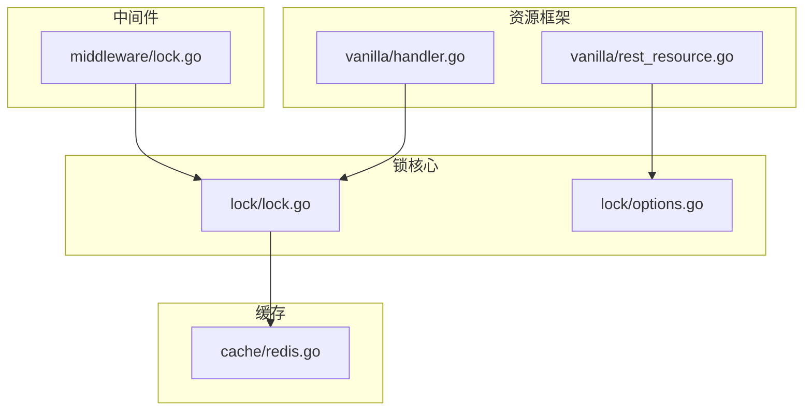
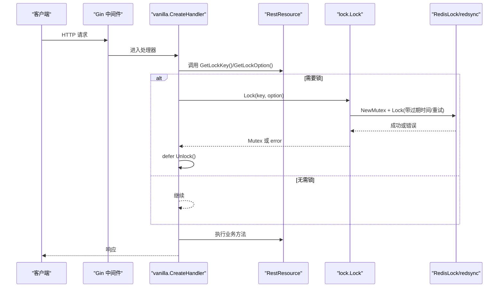
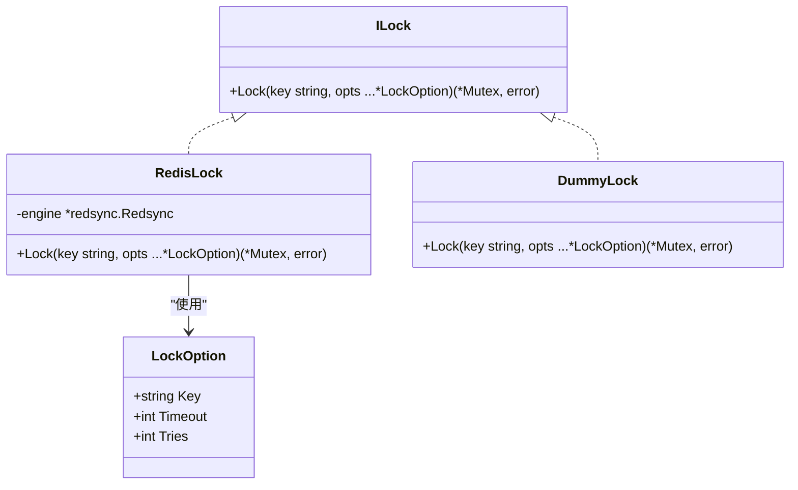
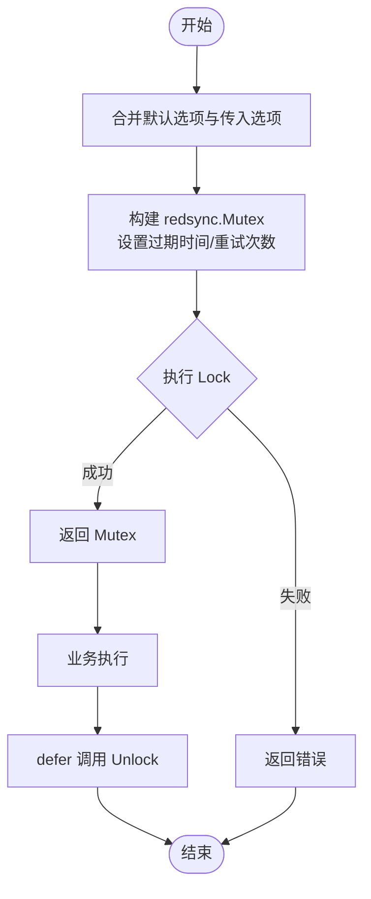
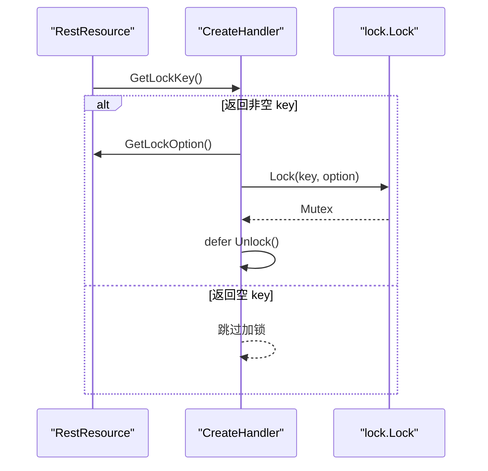
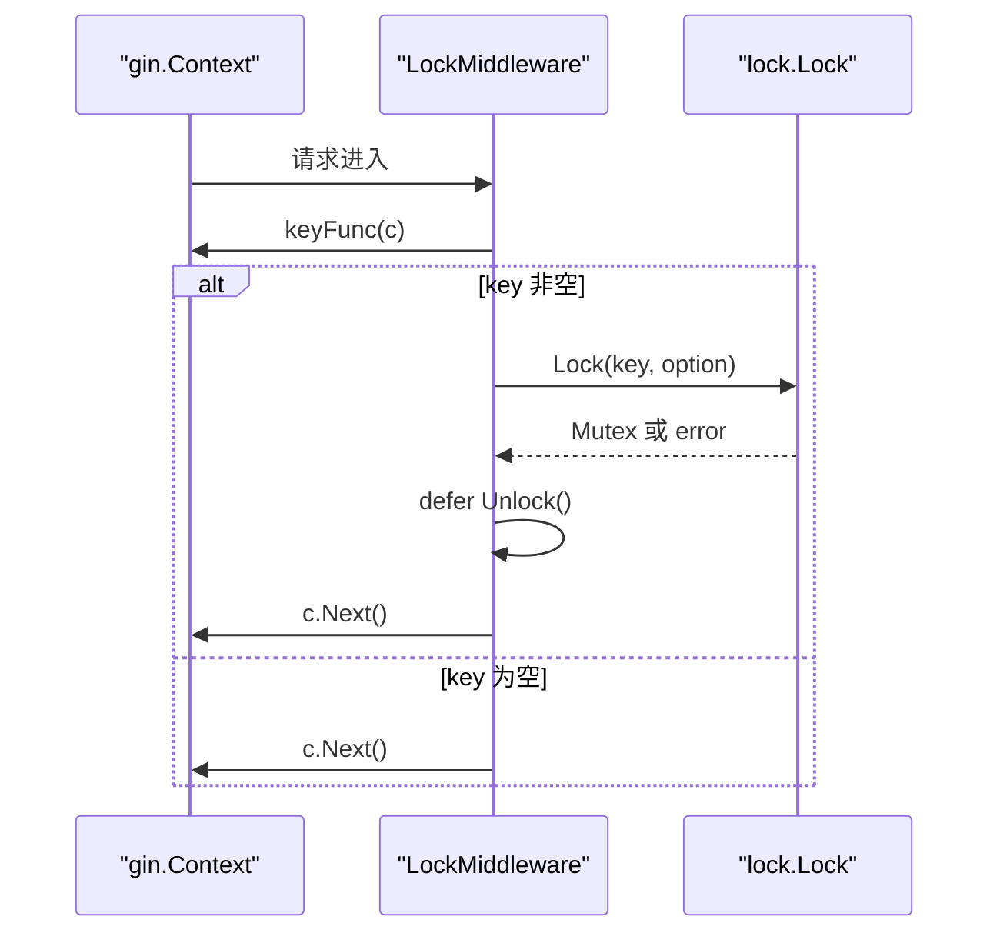
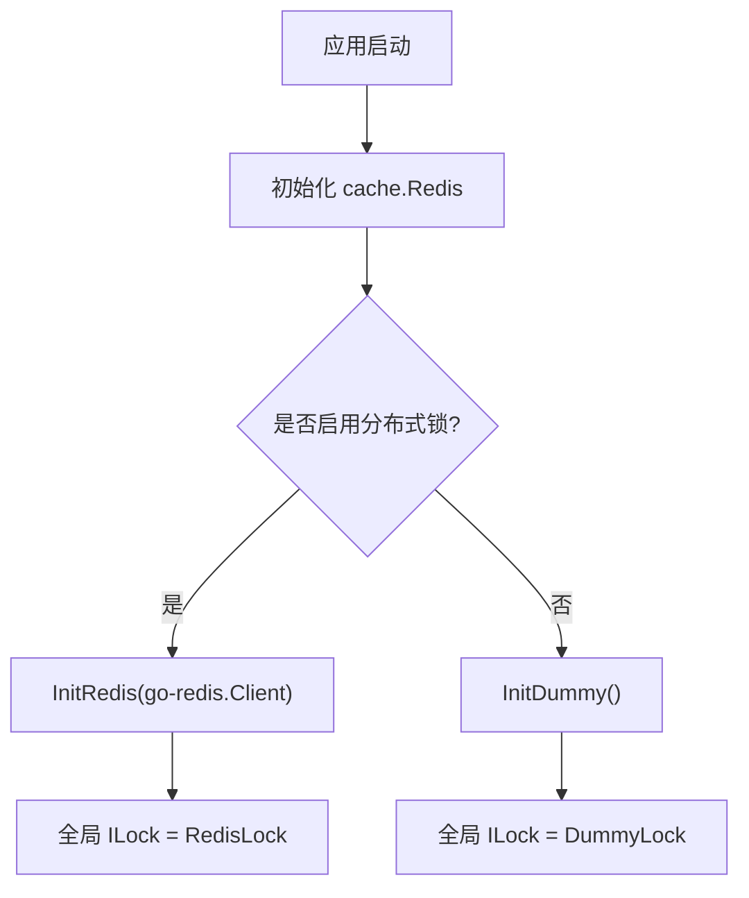
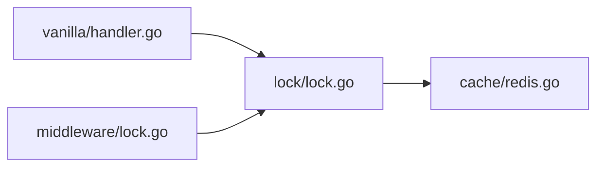

# 分布式锁

<cite>
**本文引用的文件**
- [lock/lock.go](file://lock/lock.go)
- [lock/options.go](file://lock/options.go)
- [middleware/lock.go](file://middleware/lock.go)
- [vanilla/handler.go](file://vanilla/handler.go)
- [vanilla/rest_resource.go](file://vanilla/rest_resource.go)
- [cache/redis.go](file://cache/redis.go)
- [README.md](file://README.md)
- [ARCHITECTURE.md](file://ARCHITECTURE.md)
</cite>

## 目录
1. [简介](#简介)
2. [项目结构](#项目结构)
3. [核心组件](#核心组件)
4. [架构总览](#架构总览)
5. [详细组件分析](#详细组件分析)
6. [依赖关系分析](#依赖关系分析)
7. [性能与优化建议](#性能与优化建议)
8. [故障排查指南](#故障排查指南)
9. [结论](#结论)
10. [附录：使用示例与最佳实践](#附录使用示例与最佳实践)

## 简介
本文件系统性说明 Carina 框架中的分布式锁子系统，包括接口设计、实现策略（RedisLock 与 DummyLock）、锁获取/释放/超时机制、资源级锁声明方式、中间件集成、以及性能优化与故障排查。目标是帮助开发者在业务中正确、安全地使用分布式锁，避免死锁与并发问题。

## 项目结构
分布式锁相关代码主要分布在以下模块：
- lock：定义 ILock 接口、RedisLock/DummyLock 实现、全局锁实例与初始化入口
- middleware：提供请求级分布式锁中间件，适用于裸路由场景
- vanilla：RestResource 体系通过 GetLockKey/GetLockOption 声明资源级锁，并在 handler 中统一加锁/释放
- cache：提供 Redis 客户端封装，供上层初始化锁引擎时使用

图表来源
- [lock/lock.go:1-70](file://lock/lock.go#L1-L70)
- [lock/options.go:1-30](file://lock/options.go#L1-L30)
- [middleware/lock.go:1-64](file://middleware/lock.go#L1-L64)
- [vanilla/handler.go:1-171](file://vanilla/handler.go#L1-L171)
- [vanilla/rest_resource.go:1-283](file://vanilla/rest_resource.go#L1-L283)
- [cache/redis.go:1-123](file://cache/redis.go#L1-L123)

章节来源
- [ARCHITECTURE.md:13-45](file://ARCHITECTURE.md#L13-L45)

## 核心组件
- ILock 接口：统一锁引擎抽象，仅暴露 Lock(key, opts...) 方法，返回可释放的 Mutex 句柄
- RedisLock：基于 redsync 的分布式锁实现，使用 go-redis 连接池，支持过期时间与重试次数
- DummyLock：空实现，用于开发环境跳过真实锁逻辑
- LockOption：锁选项，包含 Key、Timeout（秒）、Tries（尝试次数）
- 全局锁实例：默认 DummyLock，可通过 InitRedis 切换为 RedisLock
- 资源级锁声明：RestResourceInterface 提供 GetLockKey/GetLockOption，handler 自动执行加锁与释放
- 请求级锁中间件：LockMiddleware 为裸路由提供按请求计算 key 的分布式锁能力

章节来源
- [lock/lock.go:14-69](file://lock/lock.go#L14-L69)
- [lock/options.go:3-29](file://lock/options.go#L3-L29)
- [vanilla/rest_resource.go:13-44](file://vanilla/rest_resource.go#L13-L44)
- [vanilla/handler.go:29-72](file://vanilla/handler.go#L29-L72)
- [middleware/lock.go:14-64](file://middleware/lock.go#L14-L64)

## 架构总览
Carina 的分布式锁采用“接口 + 多实现”的设计，结合框架层（vanilla）与中间件层（middleware）两种接入方式：
- 资源级锁：在 RestResource 中声明 GetLockKey/GetLockOption，由 CreateHandler 统一处理加锁、事务、释放
- 请求级锁：对裸路由使用 LockMiddleware，从请求上下文派生锁 key，统一加锁与释放

图表来源
- [vanilla/handler.go:42-72](file://vanilla/handler.go#L42-L72)
- [lock/lock.go:33-49](file://lock/lock.go#L33-L49)
- [vanilla/rest_resource.go:27-30](file://vanilla/rest_resource.go#L27-L30)

## 详细组件分析

### ILock 接口与实现
- ILock 定义了统一的加锁入口，屏蔽底层差异
- RedisLock 使用 redsync 创建互斥量，设置过期时间与重试次数，并调用底层 Lock
- DummyLock 直接返回空结果，便于本地调试与无锁场景

图表来源
- [lock/lock.go:14-49](file://lock/lock.go#L14-L49)
- [lock/options.go:3-29](file://lock/options.go#L3-L29)

章节来源
- [lock/lock.go:14-69](file://lock/lock.go#L14-L69)
- [lock/options.go:3-29](file://lock/options.go#L3-L29)

### 锁获取、释放与超时机制
- 获取：Lock(key, opts...) 内部合并默认选项与传入选项，构造 redsync.Mutex，设置过期时间与重试次数后执行 Lock
- 释放：返回的 Mutex 对象调用 Unlock 释放；框架在 handler 与中间件中通过 defer 确保释放
- 超时：通过 Timeout 指定锁持有时间（秒），防止长时间占用导致死锁
- 重试：Tries 控制获取锁的最大尝试次数，提高在高竞争下的成功率

图表来源
- [lock/lock.go:33-49](file://lock/lock.go#L33-L49)
- [vanilla/handler.go:54-72](file://vanilla/handler.go#L54-L72)
- [middleware/lock.go:34-62](file://middleware/lock.go#L34-L62)

章节来源
- [lock/lock.go:33-49](file://lock/lock.go#L33-L49)
- [vanilla/handler.go:54-72](file://vanilla/handler.go#L54-L72)
- [middleware/lock.go:34-62](file://middleware/lock.go#L34-L62)

### 资源级锁声明与键生成规则
- 声明位置：RestResourceInterface 提供 GetLockKey 与 GetLockOption
- 键生成：由业务自定义，通常基于资源标识与操作维度（如订单号、用户ID+动作）
- 并发控制：同一 key 在同一时刻仅允许一个请求持有锁；不同 key 可并行
- 默认行为：未实现 GetLockKey 或不返回非空字符串时，不加锁

图表来源
- [vanilla/rest_resource.go:27-30](file://vanilla/rest_resource.go#L27-L30)
- [vanilla/handler.go:54-72](file://vanilla/handler.go#L54-L72)

章节来源
- [vanilla/rest_resource.go:27-30](file://vanilla/rest_resource.go#L27-L30)
- [vanilla/handler.go:54-72](file://vanilla/handler.go#L54-L72)

### 中间件级锁（裸路由）
- 适用场景：不走 RestResource 体系的裸路由
- 键生成：keyFunc 从 gin.Context 提取业务键（如用户ID、单号）
- 超时与重试：timeout 与 tries 作为参数传入，内部转换为 LockOption
- 释放：通过 defer 保证无论成功或异常均释放锁

图表来源
- [middleware/lock.go:20-62](file://middleware/lock.go#L20-L62)

章节来源
- [middleware/lock.go:20-62](file://middleware/lock.go#L20-L62)

### Redis 初始化与引擎切换
- 默认：DummyLock，适合本地开发
- 生产：InitRedis 接收 go-redis.Client，构建 redsync 引擎并替换全局 ILock
- 注意：需先初始化 cache 的 Redis 客户端，再初始化锁引擎

图表来源
- [cache/redis.go:20-41](file://cache/redis.go#L20-L41)
- [lock/lock.go:55-64](file://lock/lock.go#L55-L64)

章节来源
- [cache/redis.go:20-41](file://cache/redis.go#L20-L41)
- [lock/lock.go:55-64](file://lock/lock.go#L55-L64)

## 依赖关系分析
- vanilla/handler 依赖 lock 包进行加锁与释放
- middleware/lock 依赖 lock 包进行请求级加锁
- lock/lock.go 依赖 go-redis 与 redsync 实现 RedisLock
- cache/redis.go 提供 go-redis 客户端，供 lock 初始化使用

图表来源
- [vanilla/handler.go:1-171](file://vanilla/handler.go#L1-L171)
- [middleware/lock.go:1-64](file://middleware/lock.go#L1-L64)
- [lock/lock.go:1-70](file://lock/lock.go#L1-L70)
- [cache/redis.go:1-123](file://cache/redis.go#L1-L123)

章节来源
- [ARCHITECTURE.md:36-45](file://ARCHITECTURE.md#L36-L45)

## 性能与优化建议
- 合理设置超时：根据业务耗时设置合适的 Timeout，避免过长导致锁占用过久，或过短导致频繁重入
- 控制重试次数：Tries 不宜过大，避免高竞争下放大 Redis 压力
- 缩小锁粒度：尽量将 key 细化到最小必要范围，减少热点冲突
- 避免长事务：在持有锁期间不要执行耗时操作，必要时拆分流程
- 监控与指标：结合 metrics 统计锁获取失败率与耗时，定位瓶颈
- 连接池与网络：确保 Redis 连接池配置合理，避免连接耗尽

[本节为通用指导，不直接分析具体文件]

## 故障排查指南
- 锁获取失败：检查 Redis 连通性与权限；确认 InitRedis 已调用且参数正确
- 锁未释放：确认 handler 与中间件的 defer Unlock 路径未被提前 return 绕过
- 死锁风险：避免嵌套同 key 加锁；如需嵌套，应改为细粒度 key 或异步化
- 超时过快：调整 Timeout，确保业务能在超时内完成；必要时拆分任务
- 重试风暴：降低 Tries，增加退避策略（可在业务侧实现）
- 键冲突：审查 GetLockKey 的实现，确保 key 唯一性且不跨无关资源

章节来源
- [vanilla/handler.go:54-72](file://vanilla/handler.go#L54-L72)
- [middleware/lock.go:34-62](file://middleware/lock.go#L34-L62)
- [lock/lock.go:33-49](file://lock/lock.go#L33-L49)

## 结论
Carina 的分布式锁以 ILock 接口为核心，提供 RedisLock 与 DummyLock 两种实现，并通过 vanilla 资源级声明与 middleware 请求级中间件两种方式无缝集成。通过合理的超时与重试策略、细粒度的锁键设计与规范的释放路径，可有效避免死锁与并发问题。配合监控与调优，可在高并发场景下稳定运行。

[本节为总结，不直接分析具体文件]

## 附录：使用示例与最佳实践

### 资源级锁使用步骤
- 在 Resource 中实现 GetLockKey，返回业务维度的唯一键（如订单号、用户ID+动作）
- 可选实现 GetLockOption，设置 Timeout 与 Tries
- 框架会在 CreateHandler 中自动加锁与释放，无需手动管理

章节来源
- [vanilla/rest_resource.go:27-30](file://vanilla/rest_resource.go#L27-L30)
- [vanilla/handler.go:54-72](file://vanilla/handler.go#L54-L72)

### 裸路由锁使用步骤
- 注册 LockMiddleware，提供 keyFunc 从请求中提取锁键
- 设置 timeout 与 tries，中间件会统一加锁与释放

章节来源
- [middleware/lock.go:20-62](file://middleware/lock.go#L20-L62)

### 初始化与切换
- 开发环境：调用 InitDummy 使用 DummyLock
- 生产环境：先初始化 cache.Redis，再调用 InitRedis 切换到 RedisLock

章节来源
- [cache/redis.go:20-41](file://cache/redis.go#L20-L41)
- [lock/lock.go:55-64](file://lock/lock.go#L55-L64)

### 关键注意事项
- 锁键必须唯一且稳定，避免误伤其他资源
- 不要在锁内执行阻塞或超时的外部调用，必要时使用超时控制
- 结合业务幂等设计，防止重复执行带来的副作用
- 记录锁获取失败日志，便于问题追踪

章节来源
- [lock/lock.go:33-49](file://lock/lock.go#L33-L49)
- [vanilla/handler.go:54-72](file://vanilla/handler.go#L54-L72)
- [middleware/lock.go:34-62](file://middleware/lock.go#L34-L62)