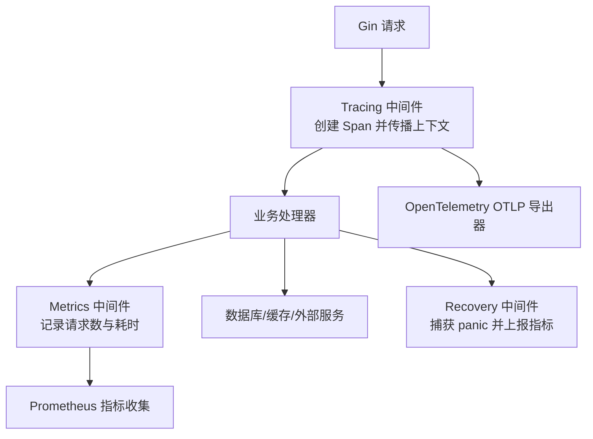
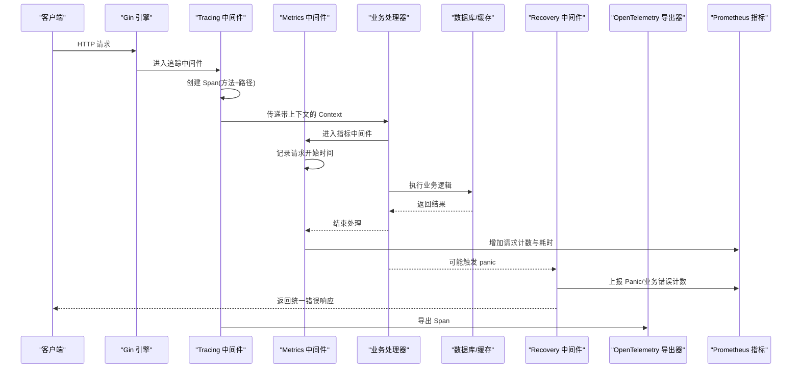
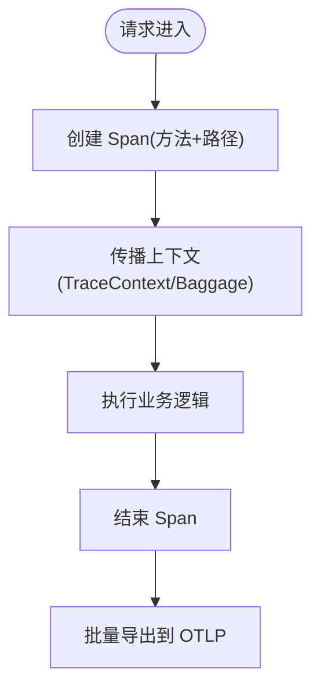
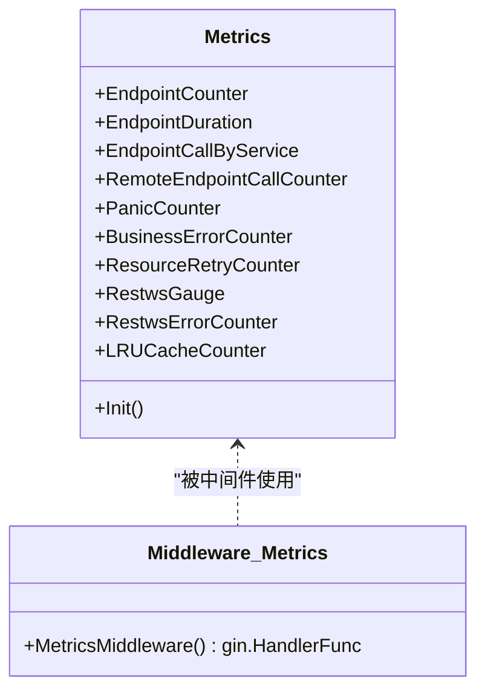
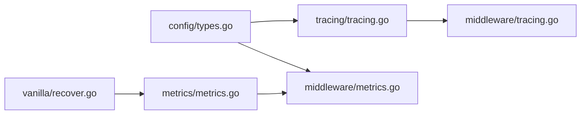

# 可观测性

<cite>
**本文引用的文件**
- [tracing/tracing.go](file://tracing/tracing.go)
- [middleware/tracing.go](file://middleware/tracing.go)
- [metrics/metrics.go](file://metrics/metrics.go)
- [middleware/metrics.go](file://middleware/metrics.go)
- [config/types.go](file://config/types.go)
- [config/config.go](file://config/config.go)
- [vanilla/error.go](file://vanilla/error.go)
- [vanilla/recover.go](file://vanilla/recover.go)
- [middleware/request_log.go](file://middleware/request_log.go)
- [cron/cron.go](file://cron/cron.go)
- [README.md](file://README.md)
</cite>

## 目录
1. [简介](#简介)
2. [项目结构](#项目结构)
3. [核心组件](#核心组件)
4. [架构总览](#架构总览)
5. [详细组件分析](#详细组件分析)
6. [依赖关系分析](#依赖关系分析)
7. [性能考量](#性能考量)
8. [故障排查指南](#故障排查指南)
9. [结论](#结论)
10. [附录：使用示例与最佳实践](#附录：使用示例与最佳实践)

## 简介
本文件面向 Carina 框架的可观测性能力，系统性说明 OpenTelemetry 链路追踪集成、Prometheus 指标采集机制、日志记录最佳实践，并提供监控集成、告警规则与分析性能瓶颈的完整使用示例。内容基于仓库中 tracing、metrics、middleware、config、vanilla 等模块的实际实现进行梳理，帮助读者快速落地并高效排障。

## 项目结构
Carina 的可观测性由以下模块协作完成：
- 追踪（Tracing）：基于 OpenTelemetry SDK 初始化 TracerProvider、设置采样率、资源属性、传播器，并通过中间件在请求入口创建 Span。
- 指标（Metrics）：集中定义 Prometheus 指标（Counter/Histogram/Gauge），通过中间件在请求生命周期内自动计数和耗时统计。
- 配置（Config）：提供结构化配置项，包含追踪开关、OTLP 端点、采样率等。
- 中间件（Middleware）：将追踪与指标注入到 Gin 请求处理链，统一记录请求/响应信息。
- 错误与恢复（Vanilla）：统一捕获 panic，区分业务错误与系统错误，并上报相应指标。
- 日志（Logging）：基础请求日志中间件输出关键请求信息；定时任务也具备日志与追踪上下文。

图表来源
- [middleware/tracing.go:10-20](file://middleware/tracing.go#L10-L20)
- [middleware/metrics.go:10-29](file://middleware/metrics.go#L10-L29)
- [tracing/tracing.go:25-60](file://tracing/tracing.go#L25-L60)
- [metrics/metrics.go:35-106](file://metrics/metrics.go#L35-L106)

章节来源
- [README.md:1-18](file://README.md#L1-L18)
- [config/types.go:30-35](file://config/types.go#L30-L35)

## 核心组件
- 追踪初始化与传播
  - 支持启用/禁用追踪，配置 OTLP HTTP 端点与采样率。
  - 设置 TextMap 传播器以跨进程传播 TraceContext 与 Baggage。
  - 提供全局 Tracer 与 StartSpan 工具方法。
- 指标注册与采集
  - 集中注册 Endpoint 请求数、耗时、按服务调用、远程调用、Panic、业务错误、重试、WebSocket 连接与错误、LRU 缓存操作等指标。
  - 通过中间件在请求前后自动更新指标。
- 配置管理
  - 提供 TracingConfig 结构体，映射 enabled、endpoint、sample_rate。
  - 支持环境变量覆盖敏感字段与多环境配置合并。
- 错误与恢复
  - 区分业务错误与系统错误，统一捕获 panic，回滚事务，上报对应指标，返回统一错误响应。
- 日志记录
  - 基础请求日志中间件输出方法、路径、状态码、耗时。
  - Cron 任务包装了追踪与日志，便于后台任务可观测。

章节来源
- [tracing/tracing.go:18-74](file://tracing/tracing.go#L18-L74)
- [metrics/metrics.go:10-106](file://metrics/metrics.go#L10-L106)
- [config/types.go:30-35](file://config/types.go#L30-L35)
- [config/config.go:11-60](file://config/config.go#L11-L60)
- [vanilla/error.go:5-75](file://vanilla/error.go#L5-L75)
- [vanilla/recover.go:14-80](file://vanilla/recover.go#L14-L80)
- [middleware/request_log.go:10-23](file://middleware/request_log.go#L10-L23)
- [cron/cron.go:67-116](file://cron/cron.go#L67-L116)

## 架构总览
下图展示了从请求进入、追踪上下文传播、指标采集到异常处理的完整链路。

图表来源
- [middleware/tracing.go:10-20](file://middleware/tracing.go#L10-L20)
- [middleware/metrics.go:10-29](file://middleware/metrics.go#L10-L29)
- [vanilla/recover.go:14-65](file://vanilla/recover.go#L14-L65)
- [tracing/tracing.go:25-60](file://tracing/tracing.go#L25-L60)
- [metrics/metrics.go:35-106](file://metrics/metrics.go#L35-L106)

## 详细组件分析

### OpenTelemetry 链路追踪集成
- 初始化
  - 根据配置决定是否启用追踪；若启用，则创建 OTLP HTTP 导出器，设置批处理、采样率（默认 0.1）、服务名等资源属性。
  - 设置 TextMap 传播器为 TraceContext + Baggage，确保跨服务上下文传播。
  - 暴露全局 Tracer 与 StartSpan 工具方法。
- 中间件集成
  - 在每个请求入口处创建 Span，名称通常为“方法 + 路径”，并将带 Span 的 Context 传递给后续处理器。
  - 使用 defer 确保 Span 在请求结束时关闭。
- 采样策略
  - 使用基于 TraceID 的比例采样，避免高流量下过度开销。
- 资源属性
  - 通过 Resource 注入服务名等元数据，便于在追踪系统中识别服务。

图表来源
- [tracing/tracing.go:25-60](file://tracing/tracing.go#L25-L60)
- [middleware/tracing.go:10-20](file://middleware/tracing.go#L10-L20)

章节来源
- [tracing/tracing.go:18-74](file://tracing/tracing.go#L18-L74)
- [middleware/tracing.go:10-20](file://middleware/tracing.go#L10-L20)
- [config/types.go:30-35](file://config/types.go#L30-L35)

### Prometheus 指标收集机制
- 指标定义
  - 请求级：Endpoint 请求总数、Endpoint 耗时分布（Histogram）。
  - 调用级：按来源服务统计、远程端点调用统计。
  - 稳定性：Panic 计数、业务错误计数、资源重试计数。
  - 连接与缓存：WebSocket 当前连接数、WebSocket 错误计数、LRU 缓存操作计数。
- 采集策略
  - 通过 Metrics 中间件在请求结束后统一增加计数与观察耗时。
  - 使用 promauto 注册指标，保证幂等初始化。
- 标签设计
  - 请求级指标使用 resource、method 作为维度。
  - 远程调用指标包含 local_method、local_resource、method、service、remote_resource。
  - WebSocket 错误指标使用 stage 区分阶段。
  - LRU 缓存指标使用 cache、operation 区分缓存与操作类型。

图表来源
- [metrics/metrics.go:10-106](file://metrics/metrics.go#L10-L106)
- [middleware/metrics.go:10-29](file://middleware/metrics.go#L10-L29)

章节来源
- [metrics/metrics.go:10-106](file://metrics/metrics.go#L10-L106)
- [middleware/metrics.go:10-29](file://middleware/metrics.go#L10-L29)

### 日志记录最佳实践
- 结构化日志
  - 建议将请求关键信息（方法、路径、状态码、耗时、trace_id）作为结构化字段输出，便于聚合与分析。
  - 当前基础请求日志中间件已输出方法、路径、状态码、耗时；可在上层业务中结合 trace_id 进一步丰富日志。
- 日志级别管理
  - 开发环境可使用更详细的日志；生产环境建议仅保留必要信息，降低 I/O 压力。
  - 对于高频接口，避免在循环或热点路径中打印过多日志。
- 错误日志
  - 通过 Recovery 中间件统一捕获 panic，记录堆栈与请求信息，并上报指标。
  - 业务错误与系统错误分别计数，便于区分正常流程异常与需要关注的系统问题。

章节来源
- [middleware/request_log.go:10-23](file://middleware/request_log.go#L10-L23)
- [vanilla/recover.go:14-80](file://vanilla/recover.go#L14-L80)
- [vanilla/error.go:5-75](file://vanilla/error.go#L5-L75)

### 配置与环境变量
- 追踪配置
  - 通过 TracingConfig 控制 enabled、endpoint、sample_rate。
  - 建议在 config.yaml 中配置，并通过环境变量覆盖敏感字段。
- 配置加载顺序
  - 先启用 AutomaticEnv 并设置 key replacer，再读取基础配置文件与环境覆盖文件，最后 Unmarshal 到结构体。
  - 支持 GO_ENV 指定环境配置文件，如 config.prod.yaml。

章节来源
- [config/types.go:30-35](file://config/types.go#L30-L35)
- [config/config.go:11-60](file://config/config.go#L11-L60)

### 定时任务的追踪与日志
- Cron 任务包装
  - 每个任务执行时创建追踪 Span，便于后台任务可观测。
  - 支持事务开启与提交/回滚，并在 panic 时回滚事务。
  - 记录任务开始、失败与成功耗时，便于性能分析与排障。

章节来源
- [cron/cron.go:67-116](file://cron/cron.go#L67-L116)

## 依赖关系分析
- 追踪与中间件
  - Tracing 中间件依赖 tracing 包提供的 Tracer 与 StartSpan。
  - 追踪初始化依赖 OTLP HTTP 导出器与 SDK TracerProvider。
- 指标与中间件
  - Metrics 中间件依赖 metrics 包注册的指标，用于请求计数与耗时统计。
- 错误与恢复
  - Recovery 中间件依赖 vanilla 的错误模型与 metrics 指标，用于统一处理 panic 并上报。
- 配置
  - 所有可观测性组件均受配置驱动，尤其是追踪开关与采样率。

图表来源
- [tracing/tracing.go:25-60](file://tracing/tracing.go#L25-L60)
- [middleware/tracing.go:10-20](file://middleware/tracing.go#L10-L20)
- [metrics/metrics.go:35-106](file://metrics/metrics.go#L35-L106)
- [middleware/metrics.go:10-29](file://middleware/metrics.go#L10-L29)
- [vanilla/recover.go:14-65](file://vanilla/recover.go#L14-L65)
- [config/types.go:30-35](file://config/types.go#L30-L35)

章节来源
- [tracing/tracing.go:25-60](file://tracing/tracing.go#L25-L60)
- [middleware/tracing.go:10-20](file://middleware/tracing.go#L10-L20)
- [metrics/metrics.go:35-106](file://metrics/metrics.go#L35-L106)
- [middleware/metrics.go:10-29](file://middleware/metrics.go#L10-L29)
- [vanilla/recover.go:14-65](file://vanilla/recover.go#L14-L65)
- [config/types.go:30-35](file://config/types.go#L30-L35)

## 性能考量
- 采样率调优
  - 合理设置 sample_rate，避免在高流量场景下产生过多 Span 导致导出与存储压力。
  - 默认 0.1 适用于一般场景，可根据 QPS 与存储预算调整。
- 指标粒度与标签基数
  - 避免为高频指标添加过多高基数字段（如用户 ID），防止指标爆炸。
  - 使用 resource、method 等稳定维度进行聚合分析。
- 日志 I/O
  - 在生产环境减少不必要的日志输出，避免阻塞请求处理。
  - 对热点接口采用异步或采样日志策略。
- 批处理导出
  - OTLP 导出器使用批处理模式，有助于降低网络与序列化开销。

[本节为通用指导，不直接分析具体文件]

## 故障排查指南
- 追踪未生效
  - 检查 tracing.enabled 是否为 true，endpoint 是否可达，sample_rate 是否大于 0。
  - 确认中间件已正确注册，请求入口是否创建 Span。
- 指标缺失
  - 确认 metrics.Init() 已被调用（或在首次访问时自动初始化）。
  - 检查中间件是否注册，请求是否经过 Metrics 中间件。
- Panic 与业务错误
  - 查看 PanicCounter 与 BusinessErrorCounter 的变化趋势，定位异常峰值。
  - 通过 Recovery 中间件记录的堆栈与请求信息快速定位问题。
- 日志质量
  - 确保日志中包含 trace_id、请求方法与路径、状态码与耗时，便于关联追踪与指标。
  - 对高频接口进行日志采样，避免影响性能。

章节来源
- [tracing/tracing.go:25-60](file://tracing/tracing.go#L25-L60)
- [metrics/metrics.go:35-106](file://metrics/metrics.go#L35-L106)
- [vanilla/recover.go:14-80](file://vanilla/recover.go#L14-L80)
- [middleware/request_log.go:10-23](file://middleware/request_log.go#L10-L23)

## 结论
Carina 的可观测性体系以 OpenTelemetry 与 Prometheus 为核心，通过中间件在请求生命周期中无缝注入追踪与指标，配合统一的错误恢复与日志记录，形成完整的可观测闭环。通过合理的配置与采样策略，可以在保障性能的同时获得高质量的追踪与指标数据，支撑监控、告警与性能优化。

[本节为总结，不直接分析具体文件]

## 附录：使用示例与最佳实践

### 集成监控系统
- 启用追踪
  - 在配置中设置 tracing.enabled=true，配置 endpoint 为 OTLP HTTP 地址，sample_rate 按需调整。
  - 在服务启动时调用 tracing.Init(serviceName, options)，并传入 shutdown 函数以确保优雅关闭。
- 注册中间件
  - 在 Gin 引擎中注册 Tracing 与 Metrics 中间件，确保每个请求都具备追踪与指标。
- 暴露指标端点
  - 使用 Prometheus 抓取 /metrics 端点（由框架或应用自行暴露），配置抓取间隔与标签过滤。

章节来源
- [config/types.go:30-35](file://config/types.go#L30-L35)
- [tracing/tracing.go:25-60](file://tracing/tracing.go#L25-L60)
- [middleware/tracing.go:10-20](file://middleware/tracing.go#L10-L20)
- [middleware/metrics.go:10-29](file://middleware/metrics.go#L10-L29)

### 配置告警规则
- 请求错误率告警
  - 基于 carina_business_error_total 与 carina_panic_total 的增长速率设置阈值告警。
- 延迟告警
  - 基于 carina_endpoint_duration_seconds 的分位值（如 p95、p99）设置延迟告警。
- 连接与缓存告警
  - 基于 carina_restws_connections 与 carina_lru_cache_total 的异常波动设置告警。
- 远程调用告警
  - 基于 carina_remote_endpoint_call_total 的失败比例与耗时设置告警。

[本节为通用指导，不直接分析具体文件]

### 分析性能瓶颈
- 追踪分析
  - 通过 Span 名称（方法+路径）定位慢接口，查看子 Span 耗时，识别数据库、缓存或外部调用瓶颈。
  - 利用 TraceContext 与 Baggage 传播上下文，跨服务追踪端到端链路。
- 指标分析
  - 使用 Histogram 分位值评估延迟分布，结合 Counter 分析错误率与重试次数。
  - 对比不同 resource 与 method 的指标，识别热点与异常接口。
- 日志关联
  - 通过 trace_id 关联日志与追踪，快速定位问题根因。

章节来源
- [tracing/tracing.go:25-60](file://tracing/tracing.go#L25-L60)
- [metrics/metrics.go:35-106](file://metrics/metrics.go#L35-L106)
- [middleware/request_log.go:10-23](file://middleware/request_log.go#L10-L23)