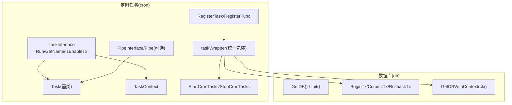
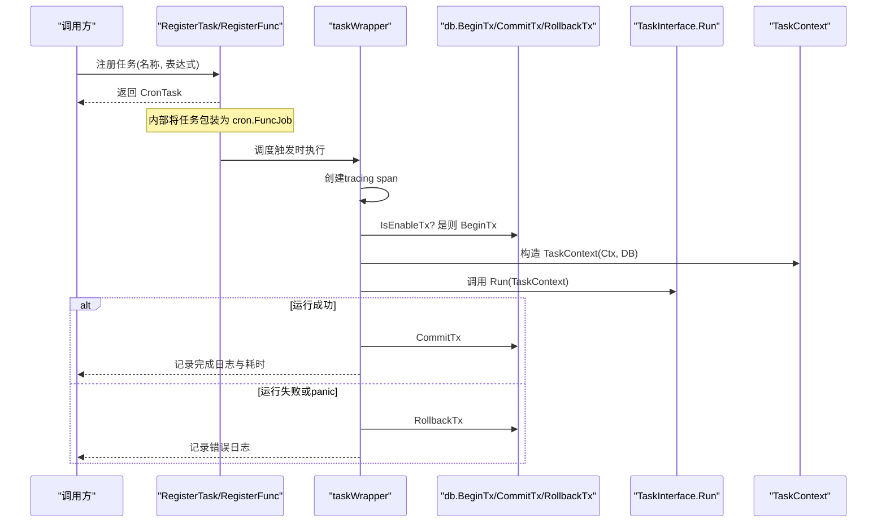
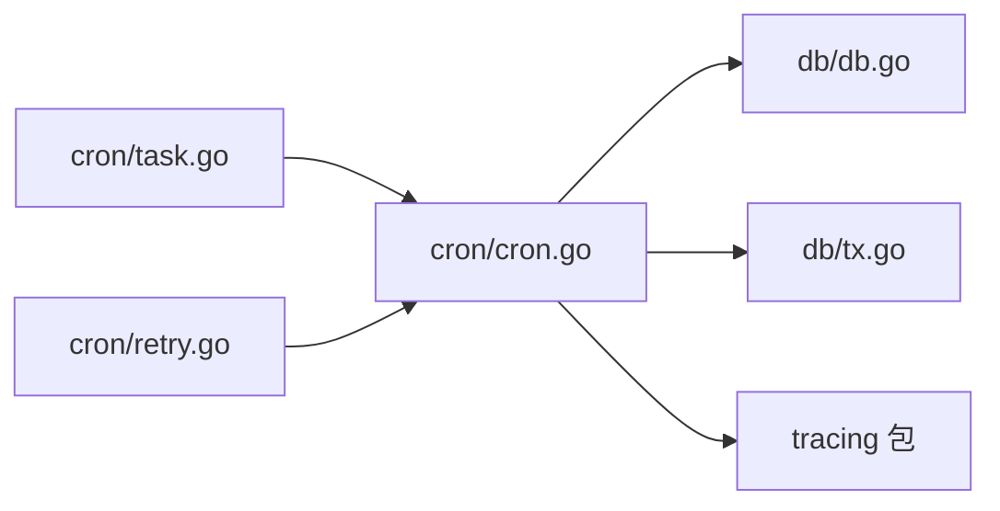

# 任务接口设计

<cite>
**本文引用的文件**
- [cron/cron.go](file://cron/cron.go)
- [cron/task.go](file://cron/task.go)
- [cron/retry.go](file://cron/retry.go)
- [db/db.go](file://db/db.go)
- [db/tx.go](file://db/tx.go)
- [README.md](file://README.md)
</cite>

## 目录
1. [简介](#简介)
2. [项目结构](#项目结构)
3. [核心组件](#核心组件)
4. [架构总览](#架构总览)
5. [详细组件分析](#详细组件分析)
6. [依赖关系分析](#依赖关系分析)
7. [性能考量](#性能考量)
8. [故障排查指南](#故障排查指南)
9. [结论](#结论)
10. [附录](#附录)

## 简介
本文件面向 Carina 框架中的定时任务子系统，系统化阐述 TaskInterface 接口的设计理念与三个核心方法 Run、GetName、IsEnableTx 的职责与使用场景；说明 Task 基类的默认行为与方法重写机制；解释 TaskContext 上下文结构及其数据库连接获取、Context 传递机制；并提供完整的任务实现示例（以代码片段路径形式给出），以及事务控制最佳实践与错误处理模式。

## 项目结构
Carina 的定时任务能力集中在 cron 包中，并与 db 包的事务能力深度集成：
- cron/cron.go：定义 TaskInterface、Task 基类、TaskContext、任务注册与调度包装器 taskWrapper、函数式任务适配器 funcTask、启动/停止入口等。
- cron/task.go：提供 PipeInterface 与 Pipe 基类，用于生产者/消费者模式的批量任务。
- cron/retry.go：重试策略与通用重试执行器 WithRetry。
- db/db.go：全局 DB 初始化、上下文感知 DB 获取 GetDBWithContext、事务注入/提取工具。
- db/tx.go：基于 context 的事务开启、提交、回滚。

图表来源
- [cron/cron.go:16-181](file://cron/cron.go#L16-L181)
- [cron/task.go:8-64](file://cron/task.go#L8-L64)
- [db/db.go:25-91](file://db/db.go#L25-L91)
- [db/tx.go:10-37](file://db/tx.go#L10-L37)

章节来源
- [cron/cron.go:16-181](file://cron/cron.go#L16-L181)
- [cron/task.go:8-64](file://cron/task.go#L8-L64)
- [db/db.go:25-91](file://db/db.go#L25-L91)
- [db/tx.go:10-37](file://db/tx.go#L10-L37)

## 核心组件
- TaskInterface：定时任务的抽象接口，包含 Run、GetName、IsEnableTx 三个方法。
- Task：TaskInterface 的默认实现基类，提供 name 字段与默认行为。
- TaskContext：任务执行上下文，封装 context.Context 与 gorm.DB，提供 DB() 与 Context() 访问。
- taskWrapper：统一的任务执行包装器，负责 tracing、事务生命周期管理、panic 恢复、日志记录与耗时统计。
- RegisterTask/RegisterFunc：任务注册 API，支持对象式与函数式两种注册方式。
- StartCronTasks/StopCronTasks：任务调度器的启动与停止。
- PipeInterface/Pipe：可选的生产者/消费者管道任务基类，内嵌 Task，便于批处理任务。

章节来源
- [cron/cron.go:16-181](file://cron/cron.go#L16-L181)
- [cron/task.go:8-64](file://cron/task.go#L8-L64)

## 架构总览
下图展示了从任务注册到实际执行的完整流程，包括事务开启、业务执行、成功提交与失败回滚，以及 panic 恢复。

图表来源
- [cron/cron.go:67-116](file://cron/cron.go#L67-L116)
- [db/tx.go:10-37](file://db/tx.go#L10-L37)
- [db/db.go:84-91](file://db/db.go#L84-L91)

## 详细组件分析

### TaskInterface 接口设计与使用方法
- Run(ctx *TaskContext) error：任务的核心逻辑入口。通过 TaskContext 获取数据库句柄和上下文，执行业务操作并返回错误。
- GetName() string：返回任务名称，用于日志、追踪与唯一标识。
- IsEnableTx() bool：声明该任务是否在事务中执行。默认 true，表示由框架自动包裹事务；若为 false，则由任务自行管理事务。

使用场景建议：
- 需要原子性写操作的后台任务：保持 IsEnableTx() 为 true，利用框架自动事务。
- 纯读任务或外部系统调用为主的任务：可设置 IsEnableTx() 为 false，避免不必要的事务开销。

章节来源
- [cron/cron.go:16-33](file://cron/cron.go#L16-L33)

### Task 基类：默认行为与方法重写
- 默认实现：
  - Run：返回“未实现”错误，强制子类覆盖。
  - GetName：返回内置 name。
  - IsEnableTx：默认启用事务。
- 推荐做法：
  - 继承 Task，仅覆写 Run 与必要时的 GetName。
  - 如需关闭事务，覆写 IsEnableTx 返回 false。

章节来源
- [cron/cron.go:26-38](file://cron/cron.go#L26-L38)

### TaskContext：上下文与数据库连接
- 字段：
  - Ctx：标准 context.Context，用于超时、取消、链路追踪等。
  - db：gorm.DB 实例，优先来自当前事务，否则回退到全局 DB。
- 方法：
  - DB()：获取当前可用的 gorm.DB（含事务）。
  - Context()：获取原始 context.Context。
- 关键机制：
  - 在 taskWrapper 中，通过 db.GetDBWithContext(ctx) 获取 DB，确保在事务上下文中能拿到事务 DB。
  - 通过 db.BeginTx 将事务注入 ctx，后续所有 DB 操作均会使用该事务。

章节来源
- [cron/cron.go:40-50](file://cron/cron.go#L40-L50)
- [db/db.go:84-91](file://db/db.go#L84-L91)
- [db/tx.go:10-19](file://db/tx.go#L10-L19)

### 任务执行包装器 taskWrapper：事务、Recovery、日志
- 职责：
  - 创建 tracing span，贯穿任务执行。
  - 根据 IsEnableTx 决定是否开启事务。
  - 统一 recover 捕获 panic，并在异常时回滚事务。
  - 记录开始、结束、耗时与错误信息。
- 事务边界：
  - 成功：CommitTx。
  - 失败或 panic：RollbackTx。

章节来源
- [cron/cron.go:67-116](file://cron/cron.go#L67-L116)
- [db/tx.go:21-37](file://db/tx.go#L21-L37)

### 管道任务 PipeInterface/Pipe（可选）
- 适用场景：大批量数据处理，采用生产者/消费者模型，提升吞吐与稳定性。
- 关键点：
  - 内嵌 Task，复用事务与上下文能力。
  - AddData 非阻塞写入，满时返回 ErrChannelFull。
  - GetData 阻塞读取。
  - GetConsumerCount 默认按容量十分之一计算消费者数。
  - EnableParallel 默认并行消费。

章节来源
- [cron/task.go:8-64](file://cron/task.go#L8-L64)
- [cron/retry.go:5-6](file://cron/retry.go#L5-L6)

### 函数式任务适配器 funcTask
- 用途：快速注册一个函数作为定时任务，无需定义结构体。
- 行为：Run 直接调用传入的函数，其他行为与 Task 一致。

章节来源
- [cron/cron.go:130-149](file://cron/cron.go#L130-L149)

### 任务注册与调度
- RegisterTask(task, spec)：注册对象式任务，spec 为 cron 表达式（秒级精度）。
- RegisterFunc(name, spec, fn)：注册函数式任务。
- StartCronTasks：启动调度器，支持 OnlyRun 标记只运行某个任务。
- StopCronTasks：简化实现，进程退出即停止。

章节来源
- [cron/cron.go:118-181](file://cron/cron.go#L118-L181)

## 依赖关系分析
- cron 包依赖 db 包进行事务管理与上下文感知 DB 获取。
- taskWrapper 依赖 tracing 包生成追踪跨度。
- Pipe 依赖 Task，扩展出生产/消费能力。
- 整体耦合点：
  - 事务生命周期：由 taskWrapper 集中管理，降低业务侵入。
  - 上下文传播：通过 TaskContext 与 db.GetDBWithContext 保证事务 DB 的正确传递。

图表来源
- [cron/cron.go:1-15](file://cron/cron.go#L1-L15)
- [cron/task.go:1-6](file://cron/task.go#L1-L6)
- [cron/retry.go:1-3](file://cron/retry.go#L1-L3)
- [db/db.go:1-10](file://db/db.go#L1-L10)
- [db/tx.go:1-8](file://db/tx.go#L1-L8)

章节来源
- [cron/cron.go:1-15](file://cron/cron.go#L1-L15)
- [db/db.go:1-10](file://db/db.go#L1-L10)
- [db/tx.go:1-8](file://db/tx.go#L1-L8)

## 性能考量
- 事务开销：对读多写少或无写操作的任务，可通过 IsEnableTx() = false 减少事务开销。
- 并发消费：Pipe 默认并行消费，可根据数据规模调整通道容量与消费者数量。
- 重试策略：结合 retry.go 的 WithRetry 对易错的外部调用进行重试，注意幂等性。
- 日志与追踪：taskWrapper 已记录耗时与错误，建议配合 tracing 进行全链路观测。

[本节为通用指导，不直接分析具体文件]

## 故障排查指南
- 常见错误与定位：
  - 任务未实现 Run：Task 基类默认返回“未实现”错误，需覆写。
  - 事务开启失败：检查 db.Init 是否已调用，DSN 是否正确。
  - 事务回滚：任务返回错误或 panic 时会回滚，查看日志定位错误原因。
  - 通道已满：Pipe.AddData 返回 ErrChannelFull，需增大容量或优化消费速度。
- 调试建议：
  - 使用 OnlyRun 仅运行目标任务，隔离问题。
  - 借助 tracing 与日志输出，确认事务边界与耗时热点。
  - 对于外部依赖不稳定场景，使用 WithRetry 增加健壮性。

章节来源
- [cron/cron.go:31-33](file://cron/cron.go#L31-L33)
- [cron/cron.go:67-116](file://cron/cron.go#L67-L116)
- [cron/retry.go:5-6](file://cron/retry.go#L5-L6)
- [db/db.go:25-51](file://db/db.go#L25-L51)

## 结论
Carina 的定时任务体系以 TaskInterface 为核心，通过 Task 基类与 TaskContext 提供统一的执行上下文与事务管理能力；taskWrapper 将事务、追踪、恢复与日志等横切关注点集中处理，使业务任务聚焦于核心逻辑。配合 Pipe 与重试策略，可构建高可用、可扩展的后台任务系统。

[本节为总结，不直接分析具体文件]

## 附录

### 完整任务实现示例（以路径引用代替代码内容）
- 对象式任务（继承 Task）：
  - 参考路径：[cron/cron.go:26-38](file://cron/cron.go#L26-L38)
  - 要点：继承 Task，覆写 Run；必要时覆写 GetName 与 IsEnableTx。
- 函数式任务（RegisterFunc）：
  - 参考路径：[cron/cron.go:130-149](file://cron/cron.go#L130-L149)
  - 要点：直接传入函数，适合简单一次性任务。
- 管道任务（Pipe）：
  - 参考路径：[cron/task.go:19-64](file://cron/task.go#L19-L64)
  - 要点：内嵌 Task，实现生产者/消费者模式，适用于批量处理。

### 事务控制最佳实践
- 默认开启事务：大多数写任务保持 IsEnableTx() = true，由框架统一管理事务边界。
- 明确事务范围：仅在任务入口处开启事务，避免嵌套或长事务。
- 错误即回滚：任务返回错误时自动回滚，确保数据一致性。
- 上下文感知 DB：始终通过 TaskContext.DB() 获取 DB，确保事务正确传播。

章节来源
- [cron/cron.go:67-116](file://cron/cron.go#L67-L116)
- [db/db.go:84-91](file://db/db.go#L84-L91)
- [db/tx.go:10-37](file://db/tx.go#L10-L37)

### 错误处理模式
- 统一 recover：taskWrapper 捕获 panic 并回滚事务，防止进程崩溃。
- 明确错误语义：任务返回错误时记录失败日志与耗时，便于定位。
- 重试与降级：对不稳定外部调用使用 WithRetry，并结合业务降级策略。

章节来源
- [cron/cron.go:87-114](file://cron/cron.go#L87-L114)
- [cron/retry.go:20-33](file://cron/retry.go#L20-L33)