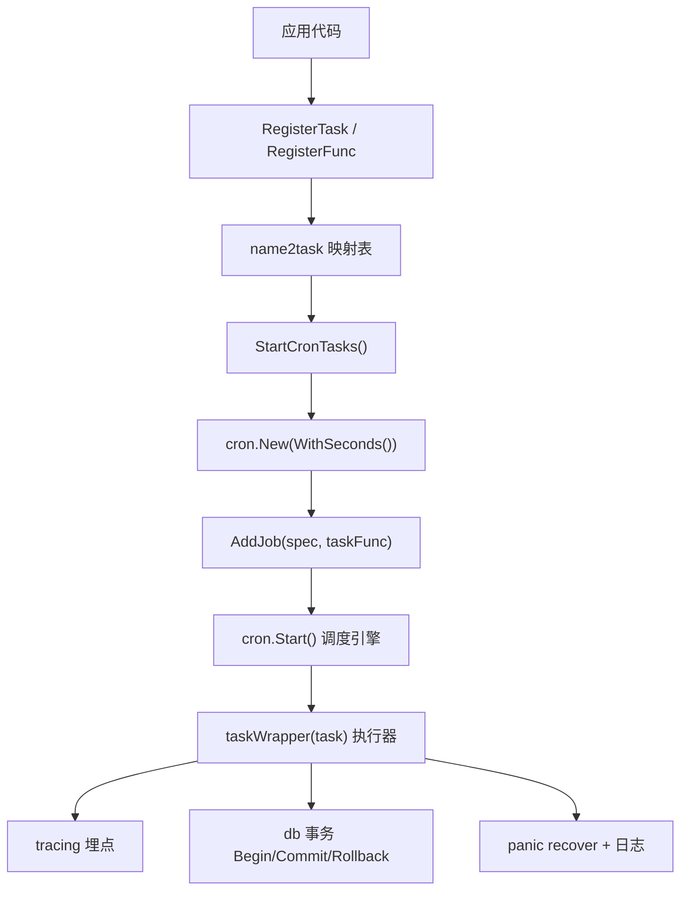
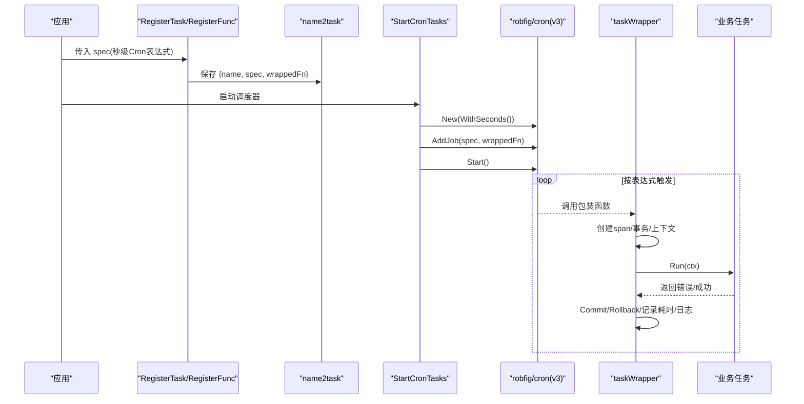
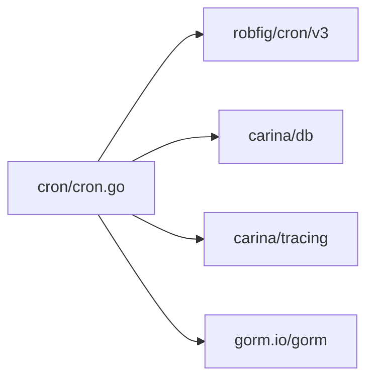

# Cron表达式解析

<cite>
**本文引用的文件**
- [cron/cron.go](file://cron/cron.go)
- [cron/task.go](file://cron/task.go)
- [cron/retry.go](file://cron/retry.go)
- [go.mod](file://go.mod)
</cite>

## 目录
1. [简介](#简介)
2. [项目结构](#项目结构)
3. [核心组件](#核心组件)
4. [架构总览](#架构总览)
5. [详细组件分析](#详细组件分析)
6. [依赖分析](#依赖分析)
7. [性能考虑](#性能考虑)
8. [故障排查指南](#故障排查指南)
9. [结论](#结论)
10. [附录：Cron表达式语法与示例](#附录cron表达式语法与示例)

## 简介
本文件围绕 Carina 框架中的定时任务子系统，系统化说明如何基于 robfig/cron/v3 实现秒级精度的 Cron 表达式解析与调度。重点包括：
- 通过 WithSeconds() 启用秒级精度
- Cron 表达式的字段规范（分钟、小时、日期、月份、星期）
- 常用场景的表达式示例
- 表达式解析的错误处理与验证机制
- 任务调度计划的生成与执行时机计算
- 调试与测试最佳实践

## 项目结构
Carina 将定时任务能力封装在 cron 包中，提供统一的注册、包装、启动与停止入口，并集成事务、Recovery、Tracing 等横切能力。

图表来源
- [cron/cron.go:118-174](file://cron/cron.go#L118-L174)

章节来源
- [cron/cron.go:16-181](file://cron/cron.go#L16-L181)

## 核心组件
- TaskInterface/Task：定义任务接口与基类，统一 GetName、Run、IsEnableTx 行为
- TaskContext：为任务提供 context.Context 与 gorm.DB 访问
- CronTask：记录任务名、表达式、包装后的函数以及是否仅运行一个任务的标记
- taskWrapper：统一包装任务执行，包含 tracing、事务、panic 恢复、耗时统计与日志
- StartCronTasks/StopCronTasks：创建带 WithSeconds() 的调度器，注册所有任务并启动；当前简化停止逻辑
- Pipe/PipeInterface：生产者/消费者管道抽象，便于批处理或流式消费
- RetryPolicy/WithRetry：重试策略与通用重试执行器

章节来源
- [cron/cron.go:16-181](file://cron/cron.go#L16-L181)
- [cron/task.go:8-64](file://cron/task.go#L8-L64)
- [cron/retry.go:8-33](file://cron/retry.go#L8-L33)

## 架构总览
下图展示从“注册任务”到“按 Cron 表达式触发执行”的完整流程，突出 WithSeconds() 的作用与任务执行的生命周期。

图表来源
- [cron/cron.go:67-116](file://cron/cron.go#L67-L116)
- [cron/cron.go:151-174](file://cron/cron.go#L151-L174)

## 详细组件分析

### 秒级精度配置与调度器初始化
- 使用 cron.New(cron.WithSeconds()) 启用秒级精度，使表达式支持 6 个字段（秒、分、时、日、月、周）
- 启动时遍历已注册任务，逐个 AddJob，然后 c.Start() 启动调度器
- 支持 OnlyRun 模式：若存在标记为 onlyRun 的任务，则只注册该任务

章节来源
- [cron/cron.go:151-174](file://cron/cron.go#L151-L174)

### 任务注册与执行包装
- RegisterTask/RegisterFunc：将业务任务或函数适配为 CronTask，并通过 name2task 集中管理
- taskWrapper：
  - 创建 tracing span，便于链路追踪
  - 根据 IsEnableTx 决定是否开启数据库事务
  - 捕获 panic，确保事务回滚并记录日志
  - 记录开始时间、耗时、成功/失败日志
  - 提供 TaskContext 给业务任务，包含 DB 句柄和 Context

章节来源
- [cron/cron.go:16-128](file://cron/cron.go#L16-L128)
- [cron/cron.go:67-116](file://cron/cron.go#L67-L116)

### 管道任务与并行消费
- PipeInterface/Pipe：提供非阻塞写入、阻塞读取、容量与消费者数量控制
- 默认消费者数量为容量的十分之一，可并行消费
- 适用于批量数据处理的定时任务

章节来源
- [cron/task.go:8-64](file://cron/task.go#L8-L64)

### 重试策略
- RetryPolicy：最大重试次数与间隔毫秒
- WithRetry：循环执行函数直到成功或达到最大重试次数
- 可在任务内部对易错操作进行重试封装

章节来源
- [cron/retry.go:8-33](file://cron/retry.go#L8-L33)

## 依赖分析
- 外部库：github.com/robfig/cron/v3 v3.0.1，用于 Cron 表达式解析与调度
- 内部依赖：
  - db：事务 Begin/Commit/Rollback、上下文注入
  - tracing：OpenTelemetry Span 创建与结束
  - gorm：数据库 ORM 句柄

图表来源
- [cron/cron.go:3-14](file://cron/cron.go#L3-L14)
- [go.mod:13-19](file://go.mod#L13-L19)

章节来源
- [go.mod:1-20](file://go.mod#L1-L20)

## 性能考虑
- 秒级精度会提高调度频率，需评估任务执行时长与资源占用
- 合理设置管道容量与消费者数量，避免背压导致丢数据或内存增长
- 使用 OnlyRun 模式减少并发竞争，适合独占型任务
- 利用 tracing 与日志统计耗时，定位慢任务
- 对 IO 密集任务建议结合重试策略与退避（可结合 backoff 扩展）

## 故障排查指南
- 表达式无效：AddJob 时会由底层解析器校验，若表达式非法将报错；建议在启动前预校验
- 任务未执行：确认 StartCronTasks 已被调用；检查 OnlyRun 是否误用导致仅注册单一任务
- 事务异常：若 IsEnableTx 为 true，任务内抛错将触发 Rollback；查看日志中的失败原因
- Panic 保护：taskWrapper 已捕获 panic，确保不会导致进程崩溃；查看 panic 日志定位问题
- 管道满：AddData 返回 ErrChannelFull，需增大容量或提升消费速度
- 重复执行：若任务无幂等设计，可能出现重复执行；可通过分布式锁或唯一键约束规避

章节来源
- [cron/cron.go:67-116](file://cron/cron.go#L67-L116)
- [cron/retry.go:5-6](file://cron/retry.go#L5-L6)

## 结论
Carina 的 Cron 子系统以 robfig/cron/v3 为核心，通过 WithSeconds() 启用秒级精度，配合统一的 taskWrapper 提供事务、追踪、恢复与日志能力，形成开箱即用的定时任务框架。借助管道与重试策略，可支撑多种批处理与高可用场景。建议在生产环境严格校验表达式、监控执行耗时与错误率，并结合 OnlyRun 与分布式锁保障任务正确性。

## 附录：Cron表达式语法与示例

### 表达式字段与规则
- 字段顺序（启用秒级后为 6 位）：秒、分、时、日、月、星期
- 取值范围：
  - 秒：0-59
  - 分：0-59
  - 时：0-23
  - 日：1-31
  - 月：1-12
  - 星期：0-7（0 和 7 均表示周日）
- 通配符与步长：
  - * 表示任意值
  - */n 表示每隔 n 单位
  - a-b 表示区间
  - a,b,c 表示集合
- 注意：当启用秒级精度时，必须提供 6 个字段；否则解析会失败

### 常用场景示例
- 每分钟执行一次（秒级精度）：0 * * * * *
- 每小时整点执行：0 0 * * * *
- 每天凌晨 02:30 执行：0 30 2 * * *
- 每 5 分钟执行：*/5 * * * * *
- 工作日 9:00-18:00 每小时执行：0 0 9-18 * * 1-5
- 每月最后一天 23:59 执行：0 59 23 L * *
- 每周周一 00:00 执行：0 0 0 * * 1

### 表达式解析的错误处理与验证
- 解析阶段：AddJob 时由底层解析器校验字段合法性与范围，非法表达式将返回错误
- 建议做法：
  - 在启动前对表达式进行预校验，尽早暴露配置错误
  - 记录解析结果与最近一次/下一次触发时间，便于观测
  - 对关键任务增加单元测试，覆盖边界值与常见错误输入

### 调度计划生成与执行时机计算
- 调度器维护每个任务的下一个触发时间点
- 到达触发点后，调度器调用对应的 FuncJob（即 taskWrapper）
- taskWrapper 负责创建上下文、事务、追踪与日志，再执行业务任务
- 若任务执行超时或阻塞，可能影响后续触发；应确保任务具备超时控制与幂等性

### 调试与测试最佳实践
- 本地调试：
  - 使用短时间间隔表达式快速验证逻辑
  - 结合 tracing 与日志观察执行路径与耗时
- 单元测试：
  - 构造最小化任务，断言执行结果与副作用
  - 模拟数据库与外部依赖，隔离网络与 IO
- 集成测试：
  - 使用真实调度器实例，验证表达式解析与触发时序
  - 验证 OnlyRun 模式下的互斥行为
- 生产观测：
  - 关注失败率、平均耗时、P95/P99 延迟
  - 对频繁失败的任务设置告警与自动降级