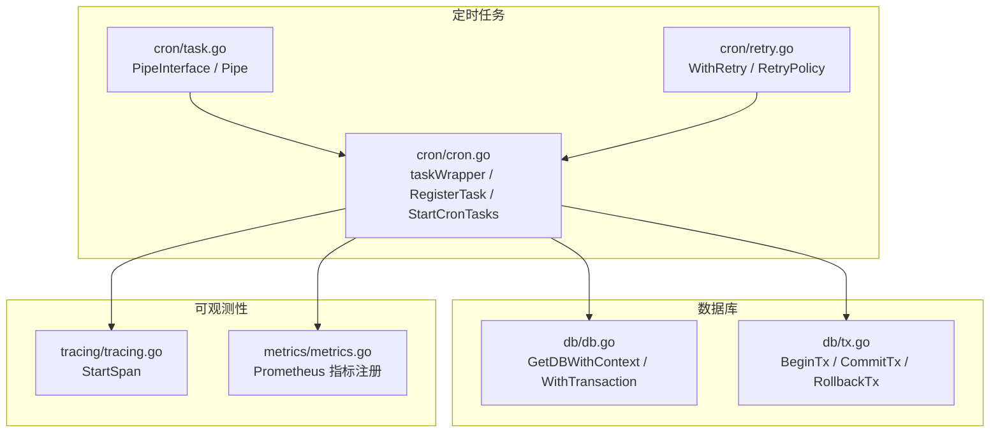
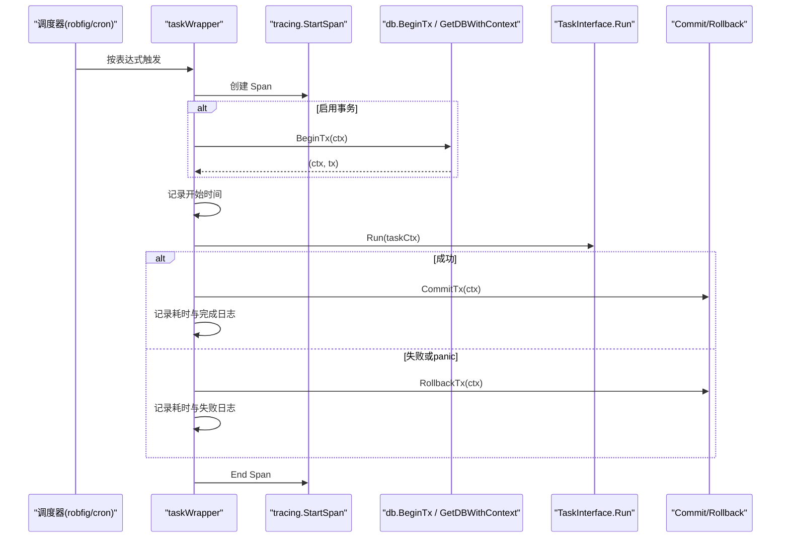
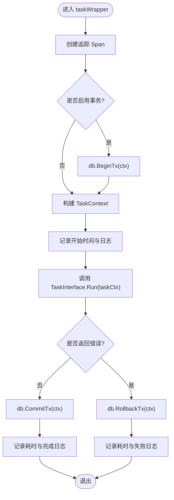
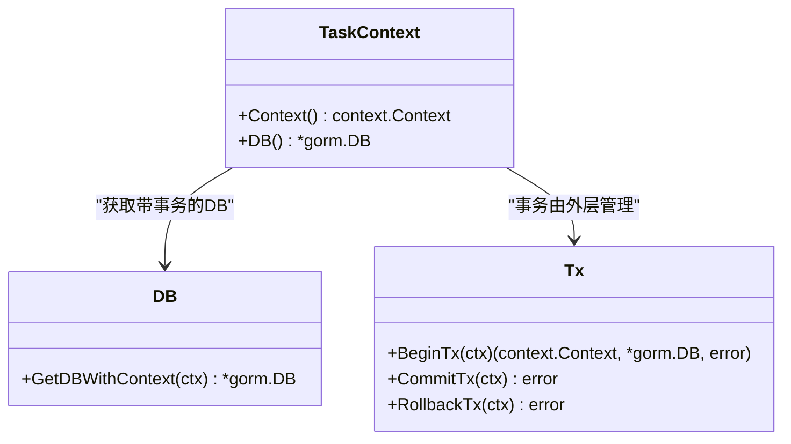
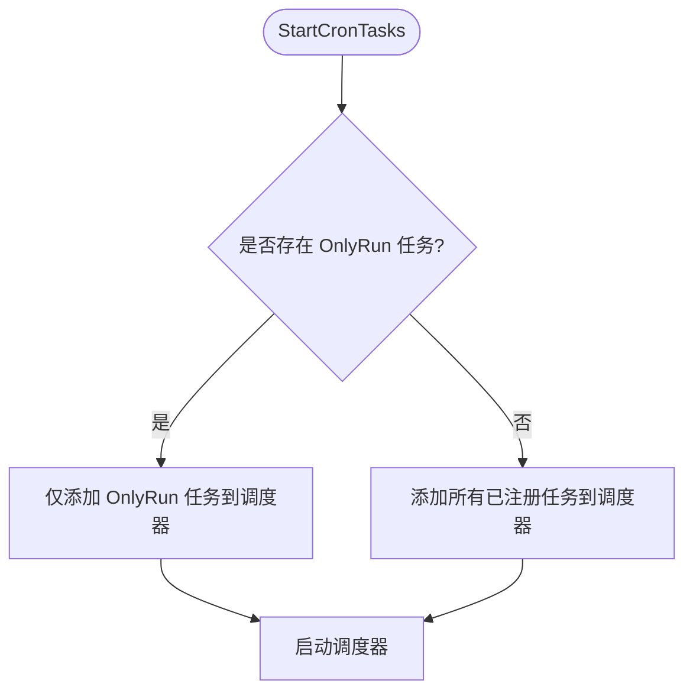
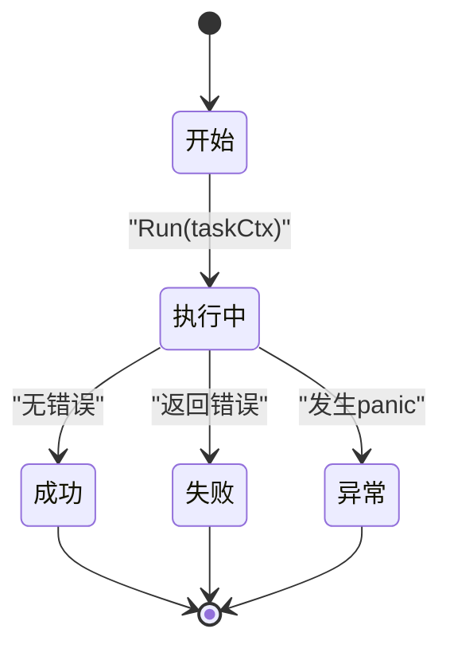
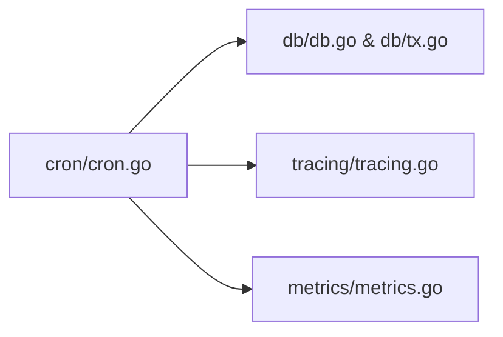

# 任务包装器

<cite>
**本文引用的文件**
- [cron/cron.go](file://cron/cron.go)
- [cron/task.go](file://cron/task.go)
- [cron/retry.go](file://cron/retry.go)
- [db/db.go](file://db/db.go)
- [db/tx.go](file://db/tx.go)
- [tracing/tracing.go](file://tracing/tracing.go)
- [metrics/metrics.go](file://metrics/metrics.go)
</cite>

## 目录
1. [简介](#简介)
2. [项目结构](#项目结构)
3. [核心组件](#核心组件)
4. [架构总览](#架构总览)
5. [详细组件分析](#详细组件分析)
6. [依赖关系分析](#依赖关系分析)
7. [性能考量](#性能考量)
8. [故障排查指南](#故障排查指南)
9. [结论](#结论)
10. [附录](#附录)

## 简介
本文件面向 Carina 的定时任务包装器，系统性说明 taskWrapper 的实现原理与生命周期管理，涵盖事务管理、异常恢复、日志记录与追踪集成；解释 TaskContext 的创建与上下文传播；阐述 OnlyRun 标记在多实例部署下的任务唯一性保证机制；并给出扩展点与自定义包装逻辑的实践指导。

## 项目结构
围绕定时任务的代码主要位于 cron 包，配合 db 包提供事务与上下文注入，tracing 包提供分布式追踪能力，metrics 包提供指标采集能力（当前未直接接入任务耗时指标）。

图表来源
- [cron/cron.go:67-116](file://cron/cron.go#L67-L116)
- [db/db.go:84-91](file://db/db.go#L84-L91)
- [db/tx.go:10-37](file://db/tx.go#L10-L37)
- [tracing/tracing.go:71-74](file://tracing/tracing.go#L71-L74)
- [metrics/metrics.go:35-106](file://metrics/metrics.go#L35-L106)

章节来源
- [cron/cron.go:16-182](file://cron/cron.go#L16-L182)
- [db/db.go:1-119](file://db/db.go#L1-L119)
- [db/tx.go:1-38](file://db/tx.go#L1-L38)
- [tracing/tracing.go:1-75](file://tracing/tracing.go#L1-L75)
- [metrics/metrics.go:1-107](file://metrics/metrics.go#L1-L107)

## 核心组件
- TaskInterface：定义任务的最小契约，包含 Run、GetName、IsEnableTx。
- TaskContext：封装 context.Context 与 gorm.DB，供任务执行时访问数据库与上下文。
- CronTask：已注册的定时任务描述，支持 OnlyRun 标记。
- taskWrapper：统一包装任务执行，负责事务、Recovery、日志、追踪与耗时统计。
- Pipe/PipeInterface：生产者/消费者模式的任务基类，便于批量数据处理。
- WithRetry：通用重试策略封装。

章节来源
- [cron/cron.go:16-63](file://cron/cron.go#L16-L63)
- [cron/task.go:8-64](file://cron/task.go#L8-L64)
- [cron/retry.go:8-33](file://cron/retry.go#L8-L33)

## 架构总览
下图展示了从调度触发到任务执行的完整流程，包括追踪、事务、日志与错误处理。

图表来源
- [cron/cron.go:67-116](file://cron/cron.go#L67-L116)
- [db/tx.go:10-37](file://db/tx.go#L10-L37)
- [tracing/tracing.go:71-74](file://tracing/tracing.go#L71-L74)

## 详细组件分析

### taskWrapper 实现原理
- 追踪集成：在任务入口创建 Span，包裹整个执行过程，便于链路追踪。
- 事务管理：根据 IsEnableTx() 决定是否开启事务；通过 db.BeginTx 将事务注入 context；成功提交、失败回滚。
- 异常恢复：使用 recover 捕获 panic，确保事务回滚并记录日志，避免进程崩溃。
- 日志与耗时：记录任务开始、结束与耗时；失败路径记录错误信息。
- 上下文传播：通过 TaskContext 暴露 Context() 与 DB()，使下游调用可感知事务与上下文。

图表来源
- [cron/cron.go:67-116](file://cron/cron.go#L67-L116)
- [db/tx.go:10-37](file://db/tx.go#L10-L37)

章节来源
- [cron/cron.go:67-116](file://cron/cron.go#L67-L116)
- [db/tx.go:10-37](file://db/tx.go#L10-L37)

### TaskContext 的创建与管理
- 创建时机：在事务开启后、任务执行前构造 TaskContext，包含原始 context 与基于该 context 的 gorm.DB。
- 数据库连接获取：通过 db.GetDBWithContext(ctx) 优先返回事务中的 DB，否则返回全局 DB 并绑定 context，确保事务内 SQL 走同一连接。
- 上下文传播：任务内部可通过 taskCtx.Context() 获取原始 context，用于传递追踪信息与取消信号。

图表来源
- [cron/cron.go:40-50](file://cron/cron.go#L40-L50)
- [db/db.go:84-91](file://db/db.go#L84-L91)
- [db/tx.go:10-37](file://db/tx.go#L10-L37)

章节来源
- [cron/cron.go:40-50](file://cron/cron.go#L40-L50)
- [db/db.go:84-91](file://db/db.go#L84-L91)
- [db/tx.go:10-37](file://db/tx.go#L10-L37)

### OnlyRun 标记与多实例唯一性
- 行为：当某个任务调用 OnlyRun() 标记后，启动阶段会仅注册该任务为“唯一运行”，其他任务不会被加入调度。
- 适用场景：适用于需要单实例执行的后台任务（如数据迁移、索引重建），避免多实例重复执行导致冲突。
- 注意：该机制仅在进程内生效，不依赖分布式锁；若需跨进程/跨节点的唯一性，应结合外部锁服务（例如 Redis 分布式锁）实现。

图表来源
- [cron/cron.go:151-174](file://cron/cron.go#L151-L174)

章节来源
- [cron/cron.go:52-63](file://cron/cron.go#L52-L63)
- [cron/cron.go:151-174](file://cron/cron.go#L151-L174)

### 任务执行生命周期
- 开始：记录开始时间、打印“run...”日志、创建追踪 Span。
- 执行：调用 TaskInterface.Run，传入 TaskContext。
- 成功：提交事务、记录耗时与“done”日志。
- 失败：回滚事务、记录耗时与“failed”日志。
- Panic：捕获 panic、回滚事务、记录 panic 日志。

图表来源
- [cron/cron.go:67-116](file://cron/cron.go#L67-L116)

章节来源
- [cron/cron.go:67-116](file://cron/cron.go#L67-L116)

### 管道任务（Pipe）与批处理
- PipeInterface：扩展 TaskInterface，增加数据入队、出队、容量与消费者数量等能力。
- Pipe：提供有界 channel 的生产者/消费者模型，默认并行消费，适合大数据量吞吐。
- 使用建议：合理设置通道容量与消费者数量，避免内存占用过高或背压不足。

章节来源
- [cron/task.go:8-64](file://cron/task.go#L8-L64)

### 重试策略
- RetryPolicy：配置最大重试次数与间隔。
- WithRetry：对任意函数进行重试包装，简化业务侧重试逻辑。

章节来源
- [cron/retry.go:8-33](file://cron/retry.go#L8-L33)

## 依赖关系分析
- cron/cron.go 依赖：
  - db：事务开启、提交、回滚与上下文注入。
  - tracing：创建 Span，贯穿任务执行。
  - robfig/cron：调度器驱动。
- db/db.go 与 db/tx.go：提供统一的数据库访问与事务管理能力。
- metrics/metrics.go：提供 Prometheus 指标注册（当前未在任务包装器中直接使用）。

图表来源
- [cron/cron.go:1-182](file://cron/cron.go#L1-L182)
- [db/db.go:1-119](file://db/db.go#L1-L119)
- [db/tx.go:1-38](file://db/tx.go#L1-L38)
- [tracing/tracing.go:1-75](file://tracing/tracing.go#L1-L75)
- [metrics/metrics.go:1-107](file://metrics/metrics.go#L1-L107)

章节来源
- [cron/cron.go:1-182](file://cron/cron.go#L1-L182)
- [db/db.go:1-119](file://db/db.go#L1-L119)
- [db/tx.go:1-38](file://db/tx.go#L1-L38)
- [tracing/tracing.go:1-75](file://tracing/tracing.go#L1-L75)
- [metrics/metrics.go:1-107](file://metrics/metrics.go#L1-L107)

## 性能考量
- 事务粒度：尽量缩小事务范围，减少锁持有时间，降低阻塞风险。
- 并发与背压：Pipe 的通道容量与消费者数量需根据数据规模与资源限制调优。
- 追踪开销：Span 创建与上报会带来一定开销，生产环境建议合理采样。
- 日志与监控：当前任务包装器使用日志记录耗时，如需更细粒度的指标（如成功率、P95/P99 耗时），可在包装层接入 metrics 包。

## 故障排查指南
- 事务未提交/回滚：检查 IsEnableTx() 与实际业务逻辑是否一致；确认错误路径是否回滚。
- Panic 导致中断：确认 recover 分支是否生效；查看 panic 日志定位问题。
- 多实例重复执行：若未使用 OnlyRun，多个实例可能同时执行；如需唯一性，请结合分布式锁。
- 数据库连接异常：确认 db.Init 已正确初始化；检查连接池参数。
- 追踪缺失：确认 tracing.Init 已调用且 Endpoint 可达。

章节来源
- [cron/cron.go:67-116](file://cron/cron.go#L67-L116)
- [db/db.go:25-51](file://db/db.go#L25-L51)
- [tracing/tracing.go:25-61](file://tracing/tracing.go#L25-L61)

## 结论
taskWrapper 提供了开箱即用的定时任务执行框架，统一了事务、异常恢复、日志与追踪，降低了业务任务实现的复杂度。通过 TaskContext 实现了上下文与事务的透明传播，OnlyRun 满足单实例任务场景。对于更高要求的唯一性与可观测性，可在现有基础上扩展分布式锁与指标埋点。

## 附录

### 扩展点与自定义包装逻辑
- 自定义包装器：
  - 在 taskWrapper 前后插入自定义逻辑（如限流、熔断、审计）。
  - 通过 TaskContext 注入额外字段（如请求 ID、租户 ID）。
- 指标接入：
  - 在成功/失败分支记录 Prometheus 指标（如任务耗时直方图、错误计数）。
- 分布式唯一性：
  - 在任务入口处加分布式锁（如 Redis SETNX），确保跨实例唯一执行。
- 重试增强：
  - 结合 WithRetry 对易错操作进行重试，区分可重试与不可重试错误。

章节来源
- [cron/cron.go:67-116](file://cron/cron.go#L67-L116)
- [cron/retry.go:8-33](file://cron/retry.go#L8-L33)
- [metrics/metrics.go:35-106](file://metrics/metrics.go#L35-L106)