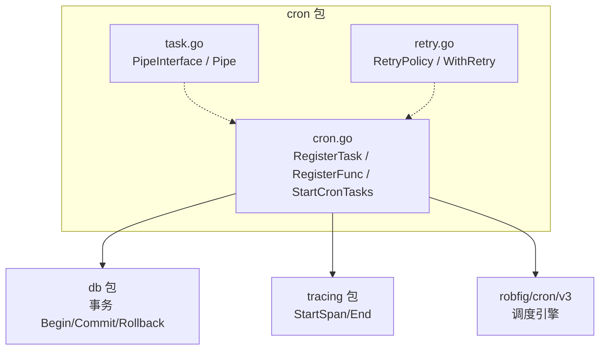
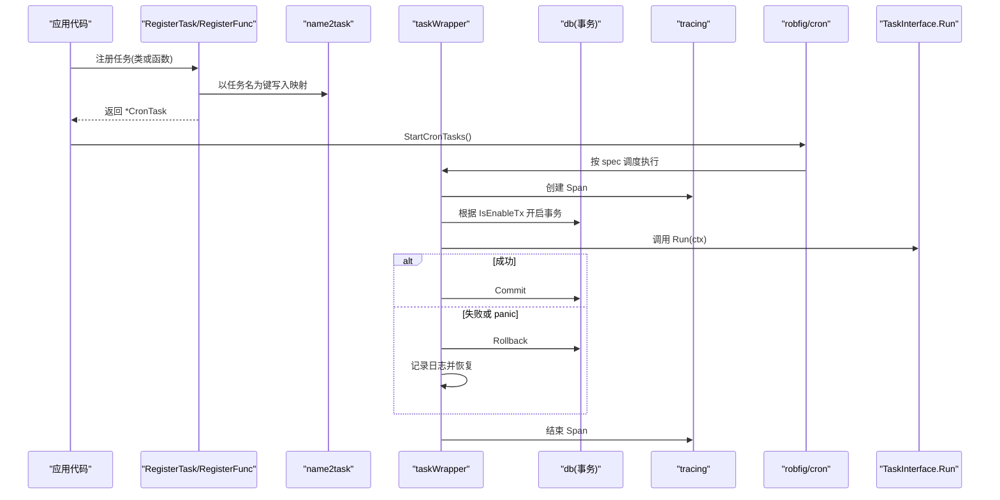
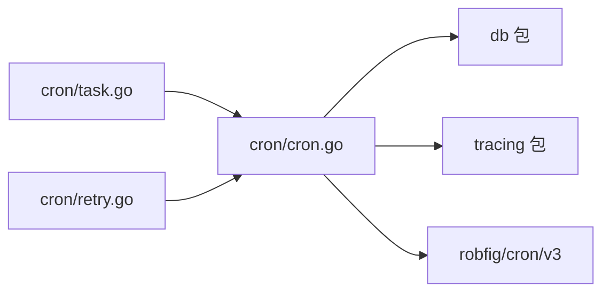

# 任务注册机制

<cite>
**本文引用的文件**
- [cron/cron.go](file://cron/cron.go)
- [cron/task.go](file://cron/task.go)
- [cron/retry.go](file://cron/retry.go)
- [ARCHITECTURE.md](file://ARCHITECTURE.md)
</cite>

## 目录
1. [简介](#简介)
2. [项目结构](#项目结构)
3. [核心组件](#核心组件)
4. [架构总览](#架构总览)
5. [详细组件分析](#详细组件分析)
6. [依赖关系分析](#依赖关系分析)
7. [性能考量](#性能考量)
8. [故障排查指南](#故障排查指南)
9. [结论](#结论)
10. [附录：使用示例与最佳实践](#附录使用示例与最佳实践)

## 简介
本文件系统性说明 Carina 的定时任务注册机制，重点覆盖以下要点：
- RegisterTask 与 RegisterFunc 两种注册方式的区别、适用场景与调用链
- TaskInterface 接口的实现要求与约束
- funcTask 适配器的工作原理
- CronTask 结构体字段设计（name、spec、taskFunc、onlyRun）及其作用
- 任务名称唯一性保证与 name2task 全局映射表的使用
- 任务注册的生命周期管理与错误处理机制
- 基于类与函数式的完整注册示例路径指引

## 项目结构
Carina 将定时任务能力集中在 cron 包中，对外暴露统一的注册与启动接口；内部通过包装器统一处理事务、Recovery、Tracing、日志等横切关注点。

图表来源
- [cron/cron.go:1-182](file://cron/cron.go#L1-L182)
- [cron/task.go:1-65](file://cron/task.go#L1-L65)
- [cron/retry.go:1-34](file://cron/retry.go#L1-L34)

章节来源
- [cron/cron.go:1-182](file://cron/cron.go#L1-L182)
- [ARCHITECTURE.md:12-45](file://ARCHITECTURE.md#L12-L45)

## 核心组件
- TaskInterface：定义任务的最小契约（Run、GetName、IsEnableTx），用于统一接入调度器
- Task：基类，提供默认实现与便捷构造
- CronTask：已注册的定时任务元数据（名称、表达式、包装后的执行函数、是否仅运行）
- funcTask：函数式任务适配器，将普通函数适配为 TaskInterface
- taskWrapper：统一包装任务执行，注入上下文、事务、Recovery、Tracing、日志与耗时统计
- name2task：全局映射表，维护“任务名 -> CronTask”的唯一索引
- StartCronTasks/StopCronTasks：生命周期管理入口

章节来源
- [cron/cron.go:16-65](file://cron/cron.go#L16-L65)
- [cron/cron.go:67-116](file://cron/cron.go#L67-L116)
- [cron/cron.go:118-182](file://cron/cron.go#L118-L182)

## 架构总览
下图展示了从注册到执行的端到端流程，包括两种注册方式与统一执行包装。

图表来源
- [cron/cron.go:67-116](file://cron/cron.go#L67-L116)
- [cron/cron.go:118-182](file://cron/cron.go#L118-L182)

## 详细组件分析

### TaskInterface 与 Task 基类
- TaskInterface 要求实现：
  - Run(ctx *TaskContext) error：业务逻辑入口
  - GetName() string：任务名称，作为唯一标识
  - IsEnableTx() bool：是否启用事务包裹
- Task 基类提供默认实现：
  - Run 默认返回未实现的错误
  - GetName 返回内嵌 name
  - IsEnableTx 默认启用事务
- NewTask(name) 便捷构造

章节来源
- [cron/cron.go:16-38](file://cron/cron.go#L16-L38)

### CronTask 结构体与 onlyRun 语义
- name：任务名称，来自 TaskInterface.GetName()，用于唯一标识与日志
- spec：cron 表达式，支持秒级精度
- taskFunc：由 taskWrapper 生成的可调度函数
- onlyRun：标记该任务为“仅运行一个实例”，在启动时若存在该标记，则只注册该任务，避免并发重复执行

章节来源
- [cron/cron.go:52-63](file://cron/cron.go#L52-L63)
- [cron/cron.go:151-174](file://cron/cron.go#L151-L174)

### RegisterTask vs RegisterFunc
- RegisterTask(task, spec)
  - 适用于面向对象的任务实现，需实现 TaskInterface
  - 通过 taskWrapper 包装后加入调度器
  - 将任务名与 CronTask 存入 name2task
- RegisterFunc(name, spec, fn)
  - 适用于轻量函数式任务，无需定义类型
  - 内部构造 funcTask 适配器，再委托给 RegisterTask
  - 同样纳入 name2task 统一管理

差异与选择建议：
- 复杂任务、需要继承 Task 基类能力（如事务开关、名称管理）时使用 RegisterTask
- 简单一次性逻辑、快速验证或脚本化任务时使用 RegisterFunc

章节来源
- [cron/cron.go:118-134](file://cron/cron.go#L118-L134)

### funcTask 适配器工作原理
- 嵌入 Task 基类，复用 GetName/IsEnableTx 默认行为
- 重写 Run：当 fn 非空时调用传入的函数，否则返回 nil
- 通过此适配器，函数式任务可以无缝进入统一的执行包装流程

章节来源
- [cron/cron.go:136-149](file://cron/cron.go#L136-L149)

### 任务名称唯一性与 name2task 映射
- 所有任务均以任务名为键写入 name2task
- 后续启动时遍历该表进行调度注册
- 若多次注册同名任务，后者会覆盖前者（以最后一次为准）
- 因此必须确保 GetName() 返回的值在全局唯一

章节来源
- [cron/cron.go:65-66](file://cron/cron.go#L65-L66)
- [cron/cron.go:120-128](file://cron/cron.go#L120-L128)
- [cron/cron.go:151-174](file://cron/cron.go#L151-L174)

### 任务执行包装与错误处理
- taskWrapper 负责：
  - 创建 tracing span
  - 根据 IsEnableTx 开启/提交/回滚事务
  - defer recover 捕获 panic 并回滚事务
  - 记录开始、耗时、成功/失败日志
- 异常路径：
  - 事务开启失败：直接返回，记录日志
  - 业务返回 error：回滚事务并记录失败日志
  - panic：回滚事务并记录 panic 日志

章节来源
- [cron/cron.go:67-116](file://cron/cron.go#L67-L116)

### 管道任务（Pipe）与重试策略（补充）
- PipeInterface/Pipe：生产者/消费者模式的基础设施，便于批处理与并行消费
- RetryPolicy/WithRetry：通用重试封装，可在任务内部按需使用

章节来源
- [cron/task.go:8-65](file://cron/task.go#L8-L65)
- [cron/retry.go:1-34](file://cron/retry.go#L1-L34)

## 依赖关系分析
- cron 包依赖：
  - db：事务 Begin/Commit/Rollback
  - tracing：链路追踪
  - robfig/cron/v3：调度引擎
- 耦合与内聚：
  - 高内聚：任务注册、包装、生命周期均在 cron 包内完成
  - 低耦合：对外仅暴露 TaskInterface、RegisterTask/RegisterFunc、Start/Stop 等稳定 API
- 外部依赖：
  - 数据库驱动由上层初始化，框架不引入具体驱动
  - 调度器为第三方库，通过封装屏蔽细节

图表来源
- [cron/cron.go:1-182](file://cron/cron.go#L1-L182)
- [cron/task.go:1-65](file://cron/task.go#L1-L65)
- [cron/retry.go:1-34](file://cron/retry.go#L1-L34)

章节来源
- [ARCHITECTURE.md:12-45](file://ARCHITECTURE.md#L12-L45)
- [cron/cron.go:1-182](file://cron/cron.go#L1-L182)

## 性能考量
- 调度开销：robfig/cron 基于时间轮/定时器，适合常规定时任务
- 事务开销：默认开启事务，对频繁短小任务可能带来额外开销，可通过 IsEnableTx 控制
- 并发与阻塞：
  - 同一时刻多个任务同时触发时，各自独立执行
  - 如需限制并发，可在任务内部加锁或使用分布式锁
- 管道任务：Pipe 提供有界缓冲与并行消费，适合吞吐型任务
- 重试策略：WithRetry 可用于易错的外部调用，但需注意幂等性

[本节为通用指导，不直接分析具体文件]

## 故障排查指南
- 任务未执行
  - 检查是否正确调用 StartCronTasks
  - 确认 cron 表达式合法且与预期一致
  - 检查 name2task 中是否存在对应条目
- 重复执行问题
  - 若 need 单实例执行，使用 CronTask.OnlyRun() 标记
  - 注意 onlyRun 模式下只会注册被标记的任务
- 事务相关错误
  - 观察日志中的 begin tx failed/rollback/commit 信息
  - 若业务返回 error，事务会被回滚
- Panic 导致中断
  - 框架已 recover 并记录 panic，不会导致进程崩溃
  - 检查任务内部是否有未处理的 panic
- 命名冲突
  - 确保 GetName() 全局唯一，避免后者覆盖前者

章节来源
- [cron/cron.go:67-116](file://cron/cron.go#L67-L116)
- [cron/cron.go:151-182](file://cron/cron.go#L151-L182)

## 结论
Carina 的定时任务机制通过 TaskInterface 抽象出最小契约，结合 taskWrapper 统一了事务、Recovery、Tracing 与日志等横切关注点。RegisterTask 面向面向对象任务，RegisterFunc 面向轻量函数式任务；两者均通过 name2task 维护唯一映射，并在启动时交由调度器执行。CronTask 的 onlyRun 能力提供了简单的单实例保障。整体设计清晰、扩展性强，便于在不同规模的业务场景中复用。

[本节为总结性内容，不直接分析具体文件]

## 附录：使用示例与最佳实践

### 基于类的任务注册（RegisterTask）
- 步骤
  - 定义结构体并嵌入 Task 基类
  - 实现 Run(ctx)、可选覆盖 IsEnableTx()
  - 在初始化阶段调用 RegisterTask(你的任务实例, "cron 表达式")
  - 启动时调用 StartCronTasks()
- 参考路径
  - [cron/cron.go:16-38](file://cron/cron.go#L16-L38)
  - [cron/cron.go:118-128](file://cron/cron.go#L118-L128)

### 函数式任务注册（RegisterFunc）
- 步骤
  - 编写 func() error 形式的业务函数
  - 调用 RegisterFunc("任务名", "cron 表达式", 你的函数)
  - 启动时调用 StartCronTasks()
- 参考路径
  - [cron/cron.go:130-149](file://cron/cron.go#L130-L149)

### 仅运行一个实例
- 使用 CronTask.OnlyRun() 标记任务，启动时仅注册该任务
- 参考路径
  - [cron/cron.go:60-63](file://cron/cron.go#L60-L63)
  - [cron/cron.go:151-174](file://cron/cron.go#L151-L174)

### 事务与错误处理
- 默认开启事务，可根据需要覆盖 IsEnableTx()
- 任务返回 error 将触发回滚并记录失败日志
- 发生 panic 将被 recover 并记录 panic 日志
- 参考路径
  - [cron/cron.go:67-116](file://cron/cron.go#L67-L116)

### 管道与重试（可选增强）
- 使用 PipeInterface/Pipe 构建生产者/消费者模型
- 使用 WithRetry 对易错调用进行重试
- 参考路径
  - [cron/task.go:8-65](file://cron/task.go#L8-L65)
  - [cron/retry.go:1-34](file://cron/retry.go#L1-L34)