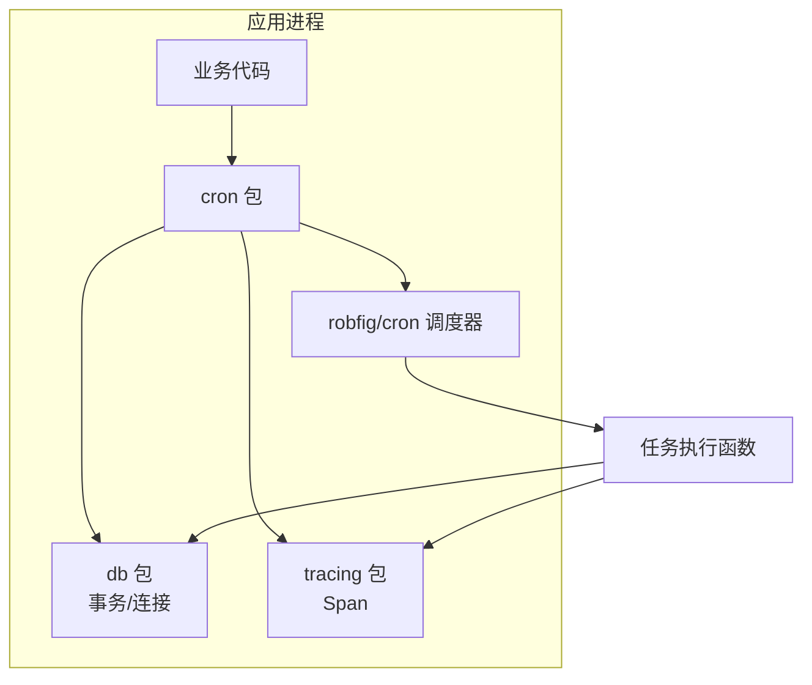
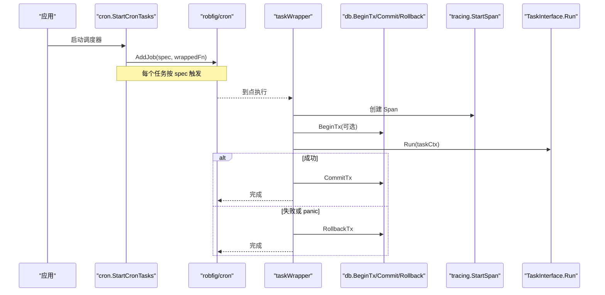
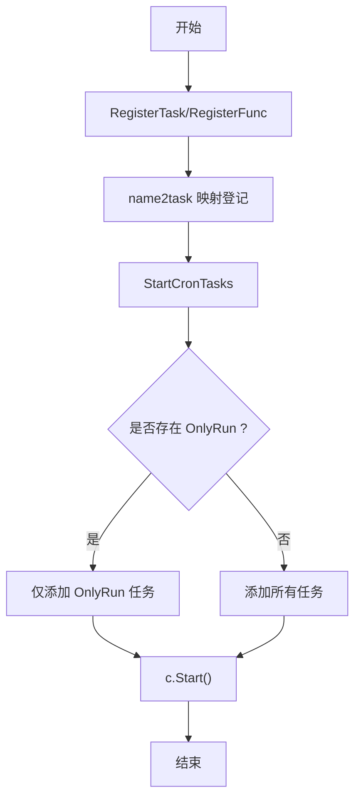
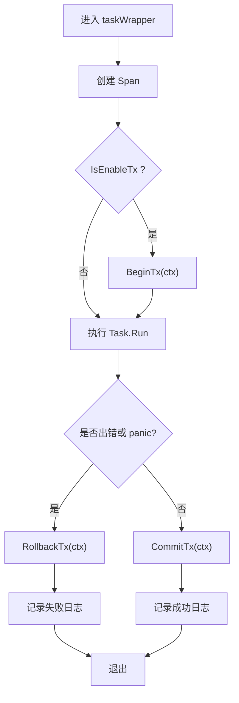
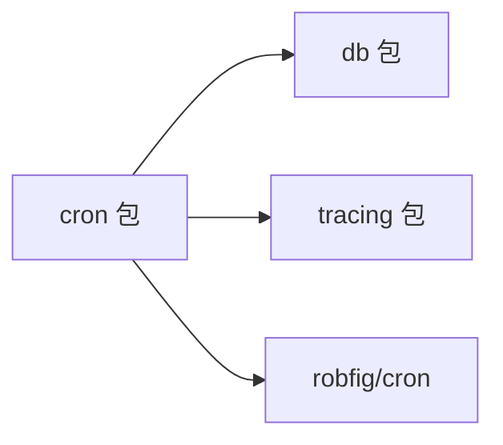

# 任务调度机制

<cite>
**本文引用的文件**
- [cron/cron.go](file://cron/cron.go)
- [cron/task.go](file://cron/task.go)
- [cron/retry.go](file://cron/retry.go)
- [db/db.go](file://db/db.go)
- [db/tx.go](file://db/tx.go)
- [tracing/tracing.go](file://tracing/tracing.go)
- [README.md](file://README.md)
- [ARCHITECTURE.md](file://ARCHITECTURE.md)
</cite>

## 目录
1. [简介](#简介)
2. [项目结构](#项目结构)
3. [核心组件](#核心组件)
4. [架构总览](#架构总览)
5. [详细组件分析](#详细组件分析)
6. [依赖关系分析](#依赖关系分析)
7. [性能与可观测性](#性能与可观测性)
8. [故障排查指南](#故障排查指南)
9. [结论](#结论)
10. [附录：注册与生命周期示例](#附录注册与生命周期示例)

## 简介
本文件系统性阐述 Carina 的定时任务调度机制，覆盖 CronTask 结构设计、任务注册流程（RegisterTask 与 RegisterFunc）、taskWrapper 包装器的事务管理/异常恢复/日志记录/性能监控、Cron 表达式解析与执行计划、OnlyRun 标记在多实例部署下的唯一性保证，以及完整的任务注册与启动示例。

## 项目结构
Carina 将定时任务能力集中在 cron 包中，并复用 db、tracing 等基础设施：
- cron：任务接口、基类、注册入口、调度启动、管道与重试工具
- db：数据库连接、事务上下文传播、Begin/Commit/Rollback
- tracing：OpenTelemetry Span 创建，用于链路追踪
- README/ARCHITECTURE：框架特性与模块职责说明

图表来源
- [cron/cron.go:1-182](file://cron/cron.go#L1-L182)
- [db/db.go:1-119](file://db/db.go#L1-L119)
- [tracing/tracing.go:1-75](file://tracing/tracing.go#L1-L75)

章节来源
- [README.md:1-154](file://README.md#L1-L154)
- [ARCHITECTURE.md:1-122](file://ARCHITECTURE.md#L1-L122)

## 核心组件
- TaskInterface：定义任务的 Run、GetName、IsEnableTx 三个方法，作为统一的任务契约
- Task：基础实现，提供默认行为（默认开启事务）
- TaskContext：任务执行上下文，封装 context 和 gorm.DB，供任务内部使用
- CronTask：已注册的定时任务元数据（名称、Cron 表达式、包装后的执行函数、OnlyRun 标记）
- taskWrapper：统一包装任务执行，负责 tracing、事务、panic 恢复、耗时统计与日志
- Pipe/PipeInterface：生产者-消费者管道基类，便于批量数据处理
- RetryPolicy/WithRetry：通用重试策略与执行器

章节来源
- [cron/cron.go:16-116](file://cron/cron.go#L16-L116)
- [cron/task.go:8-65](file://cron/task.go#L8-L65)
- [cron/retry.go:5-33](file://cron/retry.go#L5-L33)

## 架构总览
下图展示从“注册”到“执行”的完整调用链，包括事务、追踪、日志与错误处理。

图表来源
- [cron/cron.go:67-116](file://cron/cron.go#L67-L116)
- [cron/cron.go:151-174](file://cron/cron.go#L151-L174)
- [db/tx.go:10-37](file://db/tx.go#L10-L37)
- [tracing/tracing.go:71-74](file://tracing/tracing.go#L71-L74)

## 详细组件分析

### CronTask 结构与任务注册流程
- CronTask 保存任务名、Cron 表达式、包装后的执行函数与 OnlyRun 标记
- RegisterTask：接收实现了 TaskInterface 的任务对象与 Cron 表达式，生成 CronTask 并加入全局映射
- RegisterFunc：以函数形式快速注册任务，内部通过 funcTask 适配器适配为 TaskInterface
- StartCronTasks：构建 robfig/cron 调度器，若存在 OnlyRun 标记的任务则仅注册该任务；否则注册全部任务

图表来源
- [cron/cron.go:118-134](file://cron/cron.go#L118-L134)
- [cron/cron.go:151-174](file://cron/cron.go#L151-L174)

章节来源
- [cron/cron.go:52-134](file://cron/cron.go#L52-L134)
- [cron/cron.go:151-174](file://cron/cron.go#L151-L174)

### RegisterTask 与 RegisterFunc 的区别与使用场景
- RegisterTask
  - 适用：需要自定义类型、实现 TaskInterface，具备更丰富的生命周期控制（如 IsEnableTx 开关）
  - 优势：可继承 Task 基类，获得默认行为；可通过 TaskContext 获取 DB 与 Context
- RegisterFunc
  - 适用：轻量级一次性逻辑，无需新建类型
  - 优势：零样板代码，直接传入函数即可注册

章节来源
- [cron/cron.go:118-149](file://cron/cron.go#L118-L149)

### taskWrapper 包装器：事务、异常恢复、日志与性能监控
- 追踪：在每次执行开始时创建 Span，结束时关闭，便于链路追踪
- 事务：根据任务 IsEnableTx 决定是否开启事务；成功提交，失败回滚
- 异常恢复：defer recover 捕获 panic，确保事务回滚并记录日志
- 日志与耗时：记录任务开始、结束与耗时，失败时附带错误信息
- 上下文：构造 TaskContext，注入带事务的 DB 句柄

图表来源
- [cron/cron.go:67-116](file://cron/cron.go#L67-L116)
- [db/tx.go:10-37](file://db/tx.go#L10-L37)
- [tracing/tracing.go:71-74](file://tracing/tracing.go#L71-L74)

章节来源
- [cron/cron.go:67-116](file://cron/cron.go#L67-L116)

### Cron 表达式解析与执行计划
- 基于 robfig/cron/v3 实现，支持秒级精度
- 通过 c.AddJob(spec, fn) 将任务绑定到指定表达式
- StartCronTasks 会创建调度器并启动，按表达式周期触发任务

章节来源
- [cron/cron.go:151-174](file://cron/cron.go#L151-L174)

### OnlyRun 标记与多实例唯一性
- OnlyRun 标记用于标识“仅运行一次”的任务
- 启动时若发现 Any 任务设置了 OnlyRun，则只注册该任务，忽略其他任务
- 注意：当前实现仅在进程内生效；跨实例的唯一性需结合分布式锁或外部协调机制

章节来源
- [cron/cron.go:60-63](file://cron/cron.go#L60-L63)
- [cron/cron.go:151-174](file://cron/cron.go#L151-L174)

### 管道任务与重试策略
- Pipe 提供生产者-消费者通道，支持容量、消费者数量、并行消费开关
- RetryPolicy 与 WithRetry 提供通用重试能力，可在任务内部按需使用

章节来源
- [cron/task.go:8-65](file://cron/task.go#L8-L65)
- [cron/retry.go:5-33](file://cron/retry.go#L5-L33)

## 依赖关系分析
- cron 依赖 db（事务）、tracing（链路追踪）、robfig/cron（调度）
- db 提供事务上下文传播与连接池配置
- tracing 提供 OpenTelemetry Span 能力

图表来源
- [cron/cron.go:1-14](file://cron/cron.go#L1-L14)
- [db/db.go:1-119](file://db/db.go#L1-L119)
- [tracing/tracing.go:1-75](file://tracing/tracing.go#L1-L75)

章节来源
- [ARCHITECTURE.md:36-45](file://ARCHITECTURE.md#L36-L45)

## 性能与可观测性
- 事务开销：仅在 IsEnableTx 为真时开启事务，避免不必要的开销
- 日志与耗时：每次执行记录开始、结束与耗时，便于定位慢任务
- 链路追踪：每个任务执行产生一个 Span，便于端到端追踪
- 并发与背压：Pipe 支持容量限制与并行消费，防止过载

优化建议
- 对 IO 密集任务考虑关闭事务（IsEnableTx=false），减少锁竞争
- 合理设置 Pipe 容量与消费者数量，平衡吞吐与内存占用
- 结合 metrics 与 tracing 进行性能分析与瓶颈定位

[本节为通用指导，不直接分析具体文件]

## 故障排查指南
常见问题与定位要点
- 任务未执行
  - 检查 Cron 表达式是否正确，确认 StartCronTasks 已调用
  - 若使用了 OnlyRun，确认仅该任务被注册
- 事务未提交/回滚
  - 检查 IsEnableTx 设置是否符合预期
  - 查看日志中的失败信息与耗时
- Panic 导致中断
  - taskWrapper 已做 recover，关注 panic 日志
  - 确认事务在 panic 路径下已回滚
- 重复执行
  - OnlyRun 仅在进程内有效；多实例需配合分布式锁

章节来源
- [cron/cron.go:67-116](file://cron/cron.go#L67-L116)
- [cron/cron.go:151-174](file://cron/cron.go#L151-L174)
- [db/tx.go:10-37](file://db/tx.go#L10-L37)

## 结论
Carina 的定时任务调度以简洁的接口与强大的包装器为核心，提供了开箱即用的事务、追踪、日志与异常恢复能力。通过 RegisterTask/RegisterFunc 两种注册方式，既能满足复杂任务的结构化需求，也能支撑轻量函数的快速接入。OnlyRun 适用于进程内单例任务，跨实例唯一性需结合分布式锁。结合 Pipe 与重试策略，可构建高可靠、可观测的批处理流水线。

[本节为总结，不直接分析具体文件]

## 附录：注册与生命周期示例
以下示例描述如何注册与启动任务，以及关键参数的含义。为避免泄露实现细节，仅提供步骤与要点。

- 定义任务
  - 方式一：实现 TaskInterface（推荐用于复杂任务）
    - 继承 Task 基类，重写 Run、GetName、IsEnableTx
    - 在 Run 中使用 TaskContext.DB() 获取事务感知的数据库句柄
  - 方式二：使用 RegisterFunc（适合简单逻辑）
    - 直接传入函数签名 func() error

- 注册任务
  - RegisterTask(task, spec)：spec 为 Cron 表达式（秒级精度）
  - RegisterFunc(name, spec, fn)：快速注册函数式任务
  - 如需进程内唯一执行，可对返回的 CronTask 调用 OnlyRun()

- 启动调度器
  - 调用 StartCronTasks() 启动所有已注册任务
  - 若存在 OnlyRun 任务，则仅启动该任务

- 停止调度器
  - 当前实现随进程退出而停止；如需优雅停机，可扩展持有 cron 实例并调用 Stop

- 关键参数与生命周期
  - IsEnableTx：是否启用事务（默认开启）
  - OnlyRun：是否仅运行该任务（进程内）
  - spec：Cron 表达式，决定执行频率
  - TaskContext：包含 context 与 gorm.DB，贯穿任务执行

章节来源
- [cron/cron.go:16-149](file://cron/cron.go#L16-L149)
- [cron/cron.go:151-174](file://cron/cron.go#L151-L174)
- [db/db.go:84-91](file://db/db.go#L84-L91)
- [db/tx.go:10-37](file://db/tx.go#L10-L37)
- [tracing/tracing.go:71-74](file://tracing/tracing.go#L71-L74)