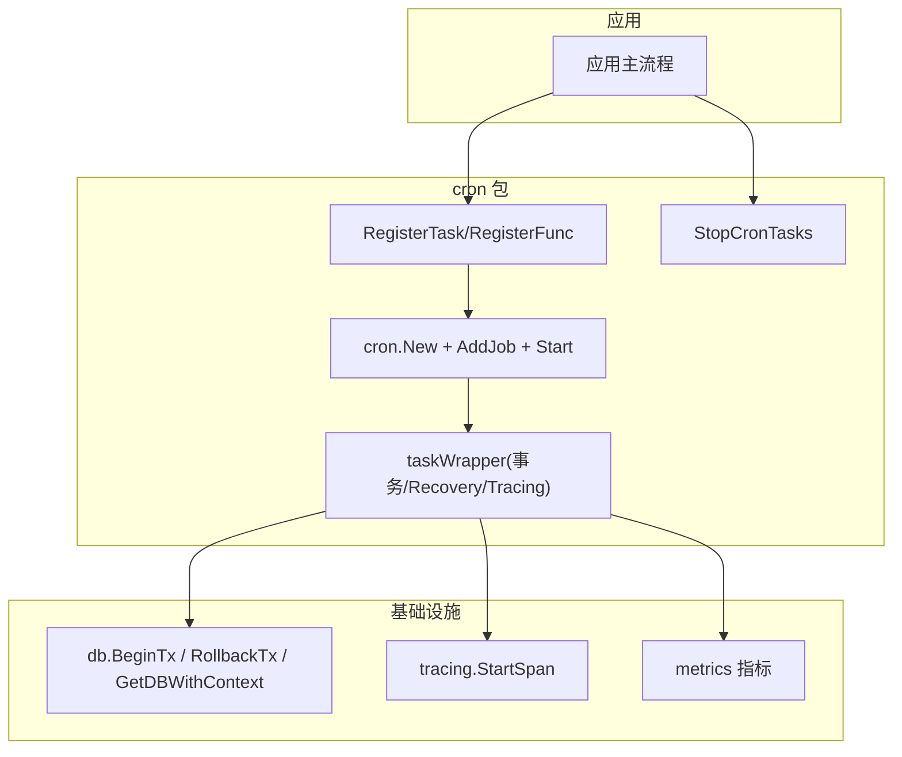
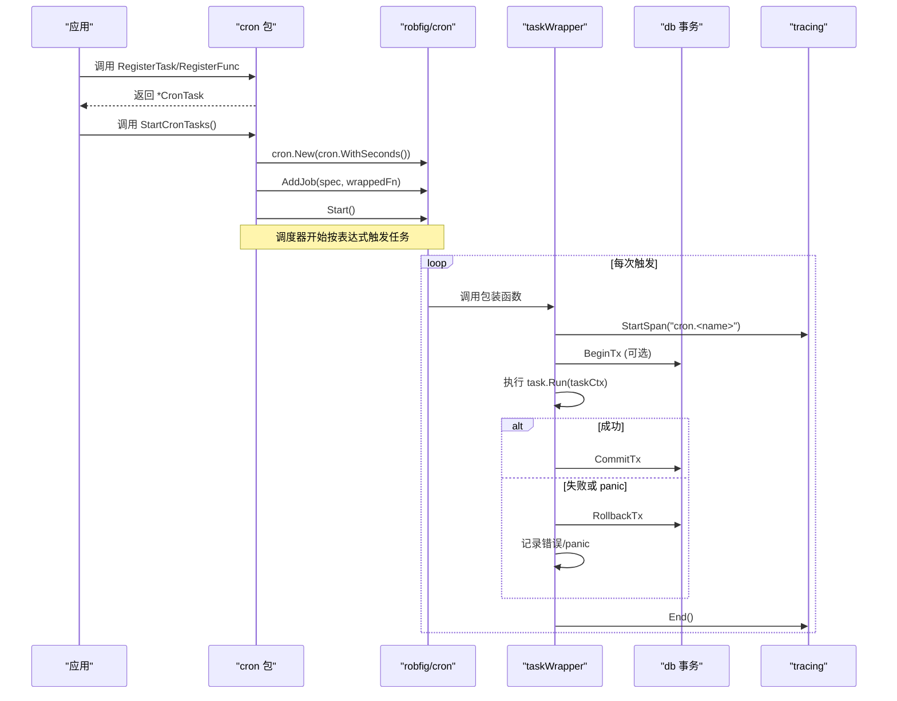
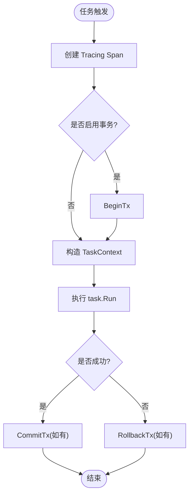
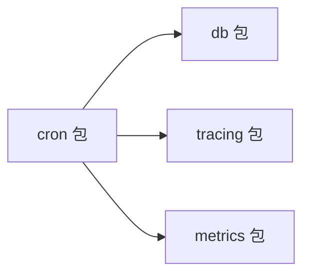

# 生命周期管理

<cite>
**本文引用的文件**
- [cron/cron.go](file://cron/cron.go)
- [cron/task.go](file://cron/task.go)
- [cron/retry.go](file://cron/retry.go)
- [db/db.go](file://db/db.go)
- [db/tx.go](file://db/tx.go)
- [tracing/tracing.go](file://tracing/tracing.go)
- [metrics/metrics.go](file://metrics/metrics.go)
- [README.md](file://README.md)
- [ARCHITECTURE.md](file://ARCHITECTURE.md)
</cite>

## 目录
1. [简介](#简介)
2. [项目结构](#项目结构)
3. [核心组件](#核心组件)
4. [架构总览](#架构总览)
5. [详细组件分析](#详细组件分析)
6. [依赖关系分析](#依赖关系分析)
7. [性能考量](#性能考量)
8. [故障排查指南](#故障排查指南)
9. [结论](#结论)
10. [附录：启动与停止示例](#附录启动与停止示例)

## 简介
本文件聚焦 Carina 框架中定时任务的生命周期管理，围绕 StartCronTasks 与 StopCronTasks 的实现机制展开，系统阐述任务注册、调度器初始化、任务执行包装（事务、Recovery、Tracing）、以及进程退出时的资源清理策略。同时给出任务状态监控与健康检查的落地方式，并提供最佳实践与完整示例路径，帮助读者在工程中正确编排任务的启动顺序、依赖管理与故障恢复。

## 项目结构
Carina 将定时任务能力封装在 cron 包内，通过统一的 TaskInterface 抽象任务，结合 robfig/cron/v3 提供调度能力；在执行层统一注入数据库事务、Recovery、Tracing 等横切关注点。相关模块职责如下：
- cron：任务接口、注册、调度器创建与启停、任务执行包装
- db：数据库连接与事务传播（BeginTx/RollbackTx/GetDBWithContext）
- tracing：OpenTelemetry Span 创建与结束
- metrics：指标定义与注册（用于可观测性）
- README/ARCHITECTURE：框架特性与模块依赖方向说明

图表来源
- [cron/cron.go:118-174](file://cron/cron.go#L118-L174)
- [cron/cron.go:67-116](file://cron/cron.go#L67-L116)
- [db/tx.go:1-200](file://db/tx.go#L1-L200)
- [tracing/tracing.go:1-200](file://tracing/tracing.go#L1-L200)

章节来源
- [README.md:1-154](file://README.md#L1-L154)
- [ARCHITECTURE.md:1-122](file://ARCHITECTURE.md#L1-L122)

## 核心组件
- 任务接口与基类
  - TaskInterface：定义 Run、GetName、IsEnableTx，作为所有任务的统一契约
  - Task：基础实现，默认开启事务执行
  - TaskContext：为任务提供 context 与 gorm.DB 访问
- 任务注册与调度
  - RegisterTask/RegisterFunc：将任务与 cron 表达式绑定，并记录到全局映射
  - StartCronTasks：创建调度器、添加任务、启动调度
  - StopCronTasks：当前简化实现，依赖进程退出完成清理
- 执行包装
  - taskWrapper：统一处理 Tracing、事务 Begin/Commit/Rollback、Panic Recovery、耗时统计与日志
- 管道任务与重试
  - Pipe/PipeInterface：生产者/消费者模式的任务基类
  - RetryPolicy/WithRetry：通用重试工具

章节来源
- [cron/cron.go:16-50](file://cron/cron.go#L16-L50)
- [cron/cron.go:52-65](file://cron/cron.go#L52-L65)
- [cron/cron.go:67-116](file://cron/cron.go#L67-L116)
- [cron/cron.go:118-174](file://cron/cron.go#L118-L174)
- [cron/task.go:8-64](file://cron/task.go#L8-L64)
- [cron/retry.go:8-33](file://cron/retry.go#L8-L33)

## 架构总览
下图展示从应用启动到任务执行的端到端流程，包括调度器初始化、任务注册、任务触发与执行包装。

图表来源
- [cron/cron.go:118-174](file://cron/cron.go#L118-L174)
- [cron/cron.go:67-116](file://cron/cron.go#L67-L116)
- [db/tx.go:1-200](file://db/tx.go#L1-L200)
- [tracing/tracing.go:1-200](file://tracing/tracing.go#L1-L200)

## 详细组件分析

### StartCronTasks 启动流程
- 扫描已注册任务，支持 onlyRun 标记：若存在仅运行任务，则只添加该任务；否则添加全部任务
- 使用 cron.New(cron.WithSeconds()) 创建秒级精度调度器
- 遍历任务列表，调用 AddJob(spec, taskFunc) 将包装后的任务加入调度器
- 调用 c.Start() 启动调度器，并输出启动数量日志

关键点
- 任务执行被 taskWrapper 包裹，确保每个任务具备事务、Recovery、Tracing、耗时统计与日志
- 仅当 IsEnableTx() 为真时，才会开启事务；失败或 panic 时回滚

章节来源
- [cron/cron.go:151-174](file://cron/cron.go#L151-L174)
- [cron/cron.go:67-116](file://cron/cron.go#L67-L116)

### StopCronTasks 停止与资源清理
- 当前实现为简化版本：打印“进程退出即停止”的日志
- 原因：robfig/cron v3 的 Stop 未直接暴露，需要持有调度器实例；当前未保存实例引用
- 实际效果：进程退出时，操作系统回收资源，goroutine 随进程终止

改进建议
- 保存调度器实例并在优雅关闭时调用其停止方法
- 配合信号处理（如 SIGTERM/SIGINT）进行优雅停机，等待正在执行的任务完成或超时取消

章节来源
- [cron/cron.go:176-181](file://cron/cron.go#L176-L181)

### 任务调度与执行包装
- 注册阶段：RegisterTask/RegisterFunc 将任务与 cron 表达式绑定，并生成包装函数
- 执行阶段：taskWrapper 负责
  - 创建 Tracing Span
  - 根据 IsEnableTx 决定是否开启事务
  - 捕获 panic 并回滚事务
  - 构造 TaskContext（包含 context 和 gorm.DB）
  - 记录开始时间，执行 task.Run，并根据结果提交或回滚事务
  - 记录耗时与结果日志

图表来源
- [cron/cron.go:67-116](file://cron/cron.go#L67-L116)

章节来源
- [cron/cron.go:67-116](file://cron/cron.go#L67-L116)

### 管道任务与重试
- Pipe/PipeInterface：提供基于 channel 的生产者/消费者模型，支持容量、消费者数量、并行消费开关
- RetryPolicy/WithRetry：提供固定次数重试的工具函数，便于在任务内部对易失败操作进行重试

章节来源
- [cron/task.go:8-64](file://cron/task.go#L8-L64)
- [cron/retry.go:8-33](file://cron/retry.go#L8-L33)

### 任务状态监控与健康检查
- 可观测性
  - Tracing：每个任务执行都会创建 Span，便于链路追踪与耗时分析
  - Metrics：框架提供指标注册入口，可在任务中上报自定义指标（如任务执行次数、失败率、耗时分布）
- 健康检查建议
  - 暴露健康检查端点，查询最近一次任务执行时间与状态
  - 基于 Redis/DB 记录任务心跳或最后执行时间，供外部探针读取
  - 结合告警通道（如钉钉机器人）对连续失败或长时间无执行进行告警

章节来源
- [tracing/tracing.go:1-200](file://tracing/tracing.go#L1-L200)
- [metrics/metrics.go:1-200](file://metrics/metrics.go#L1-L200)
- [ARCHITECTURE.md:1-122](file://ARCHITECTURE.md#L1-L122)

## 依赖关系分析
- cron 包依赖
  - db：事务 BeginTx/RollbackTx 与上下文感知 DB 获取
  - tracing：Span 创建与结束
  - metrics：指标注册与上报（可选）
- 单向依赖
  - cron → {db, tracing, metrics}
  - 其他模块不反向依赖 cron，保证解耦

图表来源
- [ARCHITECTURE.md:36-45](file://ARCHITECTURE.md#L36-L45)
- [cron/cron.go:3-14](file://cron/cron.go#L3-L14)

章节来源
- [ARCHITECTURE.md:36-45](file://ARCHITECTURE.md#L36-L45)
- [cron/cron.go:3-14](file://cron/cron.go#L3-L14)

## 性能考量
- 调度器粒度：使用秒级精度，避免过密调度导致资源争用
- 事务开销：仅在必要时开启事务（IsEnableTx），减少锁竞争与日志量
- 并发控制：Pipe 支持并行消费，合理设置容量与消费者数量，避免内存膨胀
- 重试策略：使用 WithRetry 对幂等且短暂失败的操作进行有限次重试，避免雪崩
- 可观测性：利用 Tracing 与 Metrics 定位瓶颈，优化慢任务

[本节为通用指导，无需具体文件引用]

## 故障排查指南
- 任务未执行
  - 确认已调用 RegisterTask/RegisterFunc 并完成 StartCronTasks
  - 检查 cron 表达式是否正确（秒级精度）
- 任务执行失败
  - 查看日志中的失败信息与耗时
  - 检查事务是否因异常回滚（panic 会触发回滚）
- 资源泄漏
  - 当前 StopCronTasks 为简化实现，进程退出才释放；如需优雅停机，需保存调度器实例并调用停止
- 监控缺失
  - 补充指标上报与健康检查端点，结合告警通道及时发现异常

章节来源
- [cron/cron.go:67-116](file://cron/cron.go#L67-L116)
- [cron/cron.go:176-181](file://cron/cron.go#L176-L181)

## 结论
Carina 的定时任务框架以简洁的接口与强大的执行包装为核心，提供了事务、Recovery、Tracing 的一体化能力。StartCronTasks 负责调度器初始化与任务注册，StopCronTasks 当前依赖进程退出完成清理。通过合理的启动顺序、依赖管理与重试策略，可实现稳定可靠的定时任务体系。建议在后续迭代中完善优雅停机与更丰富的健康检查能力。

[本节为总结，无需具体文件引用]

## 附录：启动与停止示例
以下示例展示如何在应用中注册任务、启动调度器与优雅停止。请根据实际业务替换任务逻辑与 cron 表达式。

- 注册任务与启动
  - 在应用初始化阶段，先完成数据库、缓存、中间件等基础设施初始化
  - 调用 RegisterTask/RegisterFunc 注册任务
  - 调用 StartCronTasks 启动调度器
  - 参考路径：[cron/cron.go:118-174](file://cron/cron.go#L118-L174)

- 优雅停止
  - 当前实现为进程退出即停止；如需优雅停机，保存调度器实例并在收到信号后调用停止方法
  - 参考路径：[cron/cron.go:176-181](file://cron/cron.go#L176-L181)

- 任务实现
  - 实现 TaskInterface 或使用 funcTask 适配器
  - 在 Run 中使用 TaskContext 获取 DB 与 Context
  - 参考路径：[cron/cron.go:16-50](file://cron/cron.go#L16-L50), [cron/cron.go:136-149](file://cron/cron.go#L136-L149)

- 管道任务与重试
  - 使用 Pipe 实现生产者/消费者模式
  - 使用 WithRetry 对易失败操作进行重试
  - 参考路径：[cron/task.go:8-64](file://cron/task.go#L8-L64), [cron/retry.go:8-33](file://cron/retry.go#L8-L33)

- 健康检查与监控
  - 在任务中上报指标，暴露健康检查端点
  - 参考路径：[metrics/metrics.go:1-200](file://metrics/metrics.go#L1-L200), [tracing/tracing.go:1-200](file://tracing/tracing.go#L1-L200)

章节来源
- [cron/cron.go:118-174](file://cron/cron.go#L118-L174)
- [cron/cron.go:176-181](file://cron/cron.go#L176-L181)
- [cron/cron.go:16-50](file://cron/cron.go#L16-L50)
- [cron/cron.go:136-149](file://cron/cron.go#L136-L149)
- [cron/task.go:8-64](file://cron/task.go#L8-L64)
- [cron/retry.go:8-33](file://cron/retry.go#L8-L33)
- [metrics/metrics.go:1-200](file://metrics/metrics.go#L1-L200)
- [tracing/tracing.go:1-200](file://tracing/tracing.go#L1-L200)