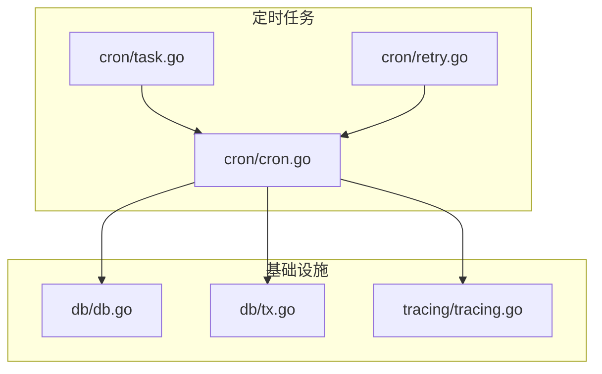
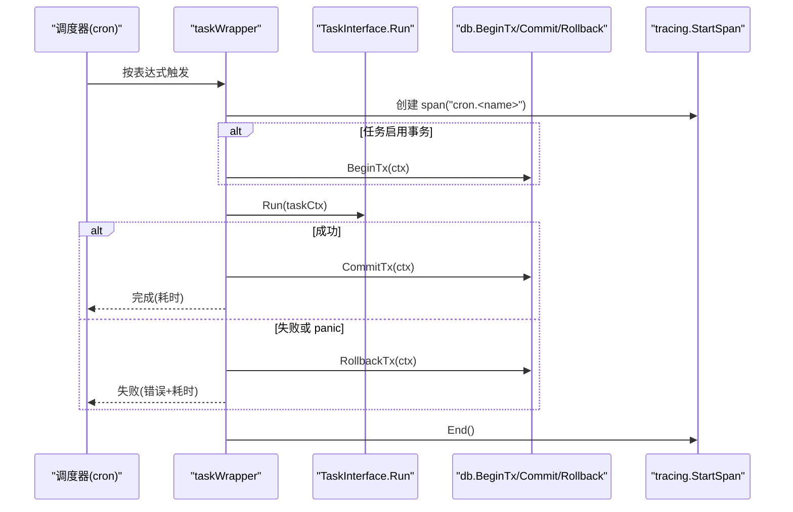
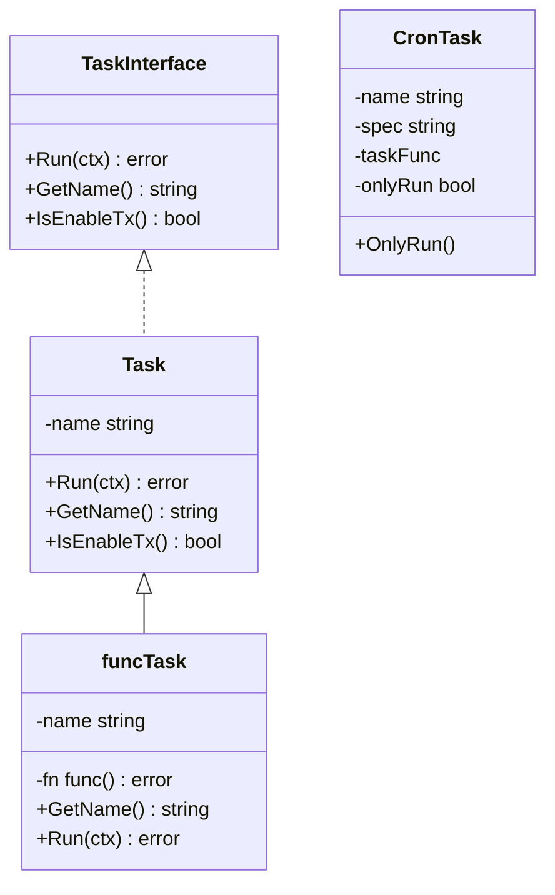
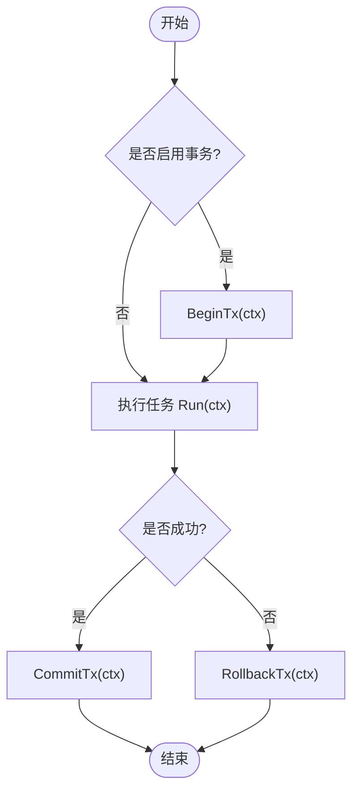
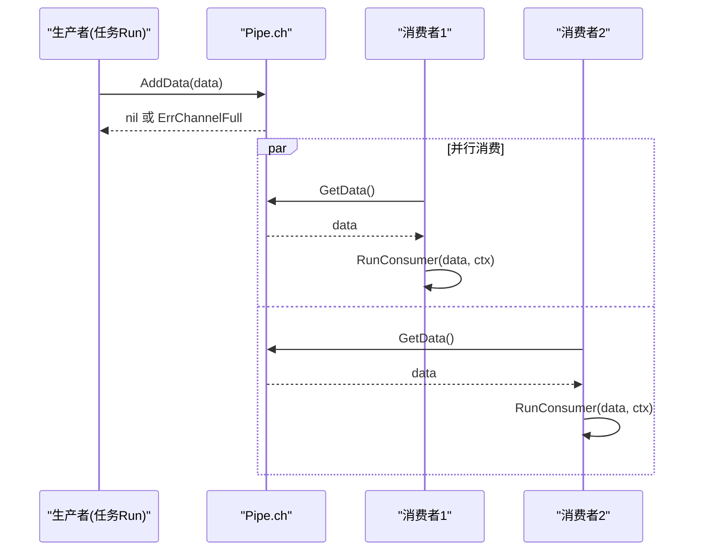
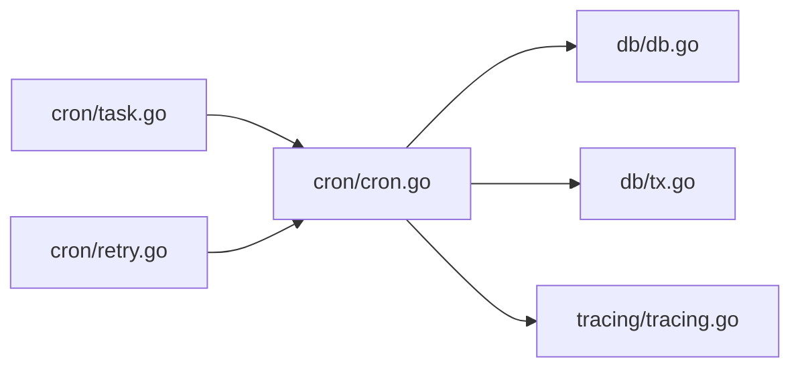

# 定时任务

<cite>
**本文引用的文件**
- [cron/cron.go](file://cron/cron.go)
- [cron/task.go](file://cron/task.go)
- [cron/retry.go](file://cron/retry.go)
- [db/db.go](file://db/db.go)
- [db/tx.go](file://db/tx.go)
- [tracing/tracing.go](file://tracing/tracing.go)
- [README.md](file://README.md)
- [ARCHITECTURE.md](file://ARCHITECTURE.md)
</cite>

## 目录
1. [简介](#简介)
2. [项目结构](#项目结构)
3. [核心组件](#核心组件)
4. [架构总览](#架构总览)
5. [详细组件分析](#详细组件分析)
6. [依赖关系分析](#依赖关系分析)
7. [性能与优化建议](#性能与优化建议)
8. [故障排查指南](#故障排查指南)
9. [结论](#结论)
10. [附录：使用示例与最佳实践](#附录使用示例与最佳实践)

## 简介
本框架提供基于 robfig/cron 的定时任务能力，统一封装了事务、Recovery（panic 恢复）、Tracing（可观测性）和日志记录。支持两种任务形态：
- 结构化任务：实现 TaskInterface 接口，适合复杂业务逻辑
- 函数式任务：通过 RegisterFunc 快速注册简单任务

同时提供管道任务模式（Pipe），用于生产者/消费者模型下的批量数据处理，支持并行消费与背压控制。

## 项目结构
定时任务相关代码集中在 cron 包，并与 db、tracing 等基础设施协作：
- cron/cron.go：TaskInterface、任务包装器、调度启动/停止、注册 API
- cron/task.go：管道任务基类 Pipe 及接口定义
- cron/retry.go：重试策略与工具函数
- db/db.go、db/tx.go：数据库连接、事务上下文传播、Begin/Commit/Rollback
- tracing/tracing.go：OpenTelemetry Tracer 初始化与 Span 创建

图表来源
- [cron/cron.go:16-182](file://cron/cron.go#L16-L182)
- [cron/task.go:8-65](file://cron/task.go#L8-L65)
- [cron/retry.go:8-34](file://cron/retry.go#L8-L34)
- [db/db.go:25-119](file://db/db.go#L25-L119)
- [db/tx.go:10-38](file://db/tx.go#L10-L38)
- [tracing/tracing.go:25-75](file://tracing/tracing.go#L25-L75)

章节来源
- [README.md:1-154](file://README.md#L1-L154)
- [ARCHITECTURE.md:1-122](file://ARCHITECTURE.md#L1-L122)

## 核心组件
- TaskInterface：定义任务的 Run、GetName、IsEnableTx 三个方法，是任务契约的核心
- Task 基类：提供默认实现，便于继承扩展
- CronTask：已注册的定时任务描述（名称、表达式、执行函数、是否唯一运行）
- taskWrapper：统一包装任务执行，负责事务、Recovery、Tracing、日志与耗时统计
- Pipe/PipeInterface：管道任务模式，内置缓冲 channel、容量、消费者数量、并行开关
- RetryPolicy/WithRetry：重试策略与通用重试执行器

章节来源
- [cron/cron.go:16-182](file://cron/cron.go#L16-L182)
- [cron/task.go:8-65](file://cron/task.go#L8-L65)
- [cron/retry.go:8-34](file://cron/retry.go#L8-L34)

## 架构总览
下图展示了从调度触发到任务执行的完整流程，包括事务、Recovery、Tracing 与日志埋点。

图表来源
- [cron/cron.go:67-116](file://cron/cron.go#L67-L116)
- [db/tx.go:10-38](file://db/tx.go#L10-L38)
- [tracing/tracing.go:71-75](file://tracing/tracing.go#L71-L75)

## 详细组件分析

### TaskInterface 与任务生命周期
- 接口设计
  - Run(ctx *TaskContext) error：执行业务逻辑，返回错误表示失败
  - GetName() string：任务标识名，用于日志与追踪
  - IsEnableTx() bool：是否开启事务；默认 true
- 生命周期
  - 注册：RegisterTask/RegisterFunc 将任务加入调度表
  - 启动：StartCronTasks 创建 cron 实例并添加所有任务（若存在 OnlyRun 标记的任务，则仅注册该任务）
  - 执行：taskWrapper 负责事务、Recovery、Tracing、日志与耗时统计
  - 停止：StopCronTasks 当前为进程退出即停的简化实现

图表来源
- [cron/cron.go:16-38](file://cron/cron.go#L16-L38)
- [cron/cron.go:52-63](file://cron/cron.go#L52-L63)
- [cron/cron.go:136-149](file://cron/cron.go#L136-L149)

章节来源
- [cron/cron.go:16-182](file://cron/cron.go#L16-L182)

### 事务支持与错误恢复
- 事务
  - 当 IsEnableTx() 为真时，taskWrapper 在任务执行前调用 db.BeginTx 开启事务，并将事务注入 context
  - 成功时提交，失败或 panic 时回滚
  - 通过 db.GetDBWithContext(ctx) 获取当前事务句柄，确保后续 DB 操作在同一事务中
- 错误恢复
  - 使用 defer recover 捕获 panic，并在 panic 时回滚事务并记录日志
- 事务传播
  - db/tx.go 提供 BeginTx/CommitTx/RollbackTx，结合 ContextWithTx/TxFromContext 实现上下文内事务传递

图表来源
- [cron/cron.go:67-116](file://cron/cron.go#L67-L116)
- [db/tx.go:10-38](file://db/tx.go#L10-L38)

章节来源
- [cron/cron.go:67-116](file://cron/cron.go#L67-L116)
- [db/tx.go:10-38](file://db/tx.go#L10-L38)
- [db/db.go:68-91](file://db/db.go#L68-L91)

### 管道任务模式（生产者/消费者）
- 接口与基类
  - PipeInterface：扩展 TaskInterface，增加 AddData、GetData、GetCap、GetConsumerCount、RunConsumer、EnableParallel
  - Pipe：内置缓冲 channel、容量、并发消费者数量计算、并行开关
- 执行模型
  - 生产者：AddData 非阻塞写入，满时返回 ErrChannelFull
  - 消费者：GetData 阻塞读取；可通过 GetConsumerCount 决定消费者数；EnableParallel 控制是否并行消费
  - 典型用法：在 Run 中启动若干消费者 goroutine，循环 GetData 并调用 RunConsumer 处理数据

图表来源
- [cron/task.go:8-65](file://cron/task.go#L8-L65)

章节来源
- [cron/task.go:8-65](file://cron/task.go#L8-L65)
- [cron/retry.go:5-6](file://cron/retry.go#L5-L6)

### Cron 表达式解析与调度
- 表达式精度：秒级（cron.WithSeconds）
- 注册方式：RegisterTask/RegisterFunc 指定 spec（如 "0 0 * * * *"）
- 启动行为：StartCronTasks 创建 cron 实例，将所有任务加入调度；若存在 OnlyRun 标记的任务，则仅注册该任务
- 停止行为：当前为进程退出即停的简化实现

章节来源
- [cron/cron.go:118-182](file://cron/cron.go#L118-L182)

### 可观测性与日志
- Tracing：每个任务执行前后创建/结束 span，便于链路追踪
- 日志：记录任务开始、耗时、失败原因与 panic 信息
- 指标：框架 README 提及 Prometheus metrics 能力，可在上层集成

章节来源
- [cron/cron.go:67-116](file://cron/cron.go#L67-L116)
- [tracing/tracing.go:25-75](file://tracing/tracing.go#L25-L75)
- [README.md:1-154](file://README.md#L1-L154)

## 依赖关系分析
- cron 依赖 db（事务）、tracing（链路追踪）
- db 提供全局连接与事务上下文传播
- tracing 提供 OpenTelemetry tracer 与 span 管理

图表来源
- [cron/cron.go:1-182](file://cron/cron.go#L1-L182)
- [db/db.go:1-119](file://db/db.go#L1-L119)
- [db/tx.go:1-38](file://db/tx.go#L1-L38)
- [tracing/tracing.go:1-75](file://tracing/tracing.go#L1-L75)

章节来源
- [ARCHITECTURE.md:36-45](file://ARCHITECTURE.md#L36-L45)

## 性能与优化建议
- 合理设置管道容量与消费者数量
  - chCap 影响内存占用与吞吐；GetConsumerCount 默认按容量的十分之一估算
  - EnableParallel 为 true 时可并行消费，注意下游资源限制
- 控制任务粒度与频率
  - 避免过短间隔导致频繁上下文切换；根据业务 SLA 调整 cron 表达式
- 事务边界最小化
  - 仅在必要时开启事务（IsEnableTx=false 可关闭），减少锁竞争
- 重试策略
  - 使用 WithRetry 对易错外部调用进行重试；可根据场景自定义 RetryPolicy
- 可观测性
  - 开启 tracing 采样率以平衡开销与可观测性
  - 关注日志中的耗时字段，识别慢任务

[本节为通用指导，不直接分析具体文件]

## 故障排查指南
- 任务未执行
  - 检查是否正确调用 StartCronTasks
  - 确认 cron 表达式合法且与预期一致
  - 若设置了 OnlyRun，仅该任务会被注册
- 事务未生效
  - 确认 IsEnableTx() 返回 true
  - 检查 db.Init 是否已调用
  - 查看 BeginTx/CommitTx/RollbackTx 的错误日志
- Panic 导致回滚
  - 查看 panic 日志，定位异常堆栈
  - 确认 recover 路径正确回滚事务
- 管道满导致丢数据
  - 监控 ErrChannelFull 出现频率
  - 增大 chCap 或提升消费者处理能力
- 重试无效
  - 检查 WithRetry 的 MaxRetries 与 IntervalMs 配置
  - 确认被重试的操作幂等或具备补偿机制

章节来源
- [cron/cron.go:67-116](file://cron/cron.go#L67-L116)
- [cron/retry.go:8-34](file://cron/retry.go#L8-L34)
- [db/tx.go:10-38](file://db/tx.go#L10-L38)

## 结论
Carina 的定时任务框架以简洁的接口与统一的包装器，提供了事务、Recovery、Tracing、日志与管道模式的组合能力。通过 TaskInterface 与 PipeInterface 抽象，既支持结构化任务也支持函数式快速接入；借助 db 与 tracing 的基础设施，实现了高内聚、低耦合的可维护调度系统。

[本节为总结性内容，不直接分析具体文件]

## 附录：使用示例与最佳实践

### 定义与注册任务
- 结构化任务
  - 实现 TaskInterface：实现 Run、GetName、IsEnableTx
  - 通过 RegisterTask 注册并指定 cron 表达式
- 函数式任务
  - 通过 RegisterFunc(name, spec, fn) 快速注册

章节来源
- [cron/cron.go:16-38](file://cron/cron.go#L16-L38)
- [cron/cron.go:118-149](file://cron/cron.go#L118-L149)

### 配置调度参数
- 表达式精度：秒级（cron.WithSeconds）
- 表达式示例：参考 cron 标准格式（如 "0 0 * * * *"）
- 唯一运行任务：使用 OnlyRun 标记，启动时仅注册该任务

章节来源
- [cron/cron.go:118-182](file://cron/cron.go#L118-L182)

### 事务与错误处理
- 默认开启事务：IsEnableTx 默认 true
- 失败自动回滚：错误与 panic 均会触发回滚
- 推荐做法：尽量缩小事务范围，避免长事务

章节来源
- [cron/cron.go:67-116](file://cron/cron.go#L67-L116)
- [db/tx.go:10-38](file://db/tx.go#L10-L38)

### 管道任务模式
- 生产者：在 Run 中循环 AddData
- 消费者：启动多个 goroutine 调用 GetData 并执行 RunConsumer
- 背压：channel 满时 AddData 返回 ErrChannelFull，可据此做退避或丢弃策略

章节来源
- [cron/task.go:8-65](file://cron/task.go#L8-L65)
- [cron/retry.go:5-6](file://cron/retry.go#L5-L6)

### 监控、日志与性能优化
- 日志：任务开始、耗时、失败原因、panic 信息
- 追踪：每个任务执行生成 span，便于链路分析
- 指标：可结合框架提供的 metrics 能力进行采集
- 优化：合理设置 chCap、消费者数量、重试策略与采样率

章节来源
- [cron/cron.go:67-116](file://cron/cron.go#L67-L116)
- [tracing/tracing.go:25-75](file://tracing/tracing.go#L25-L75)
- [README.md:1-154](file://README.md#L1-L154)