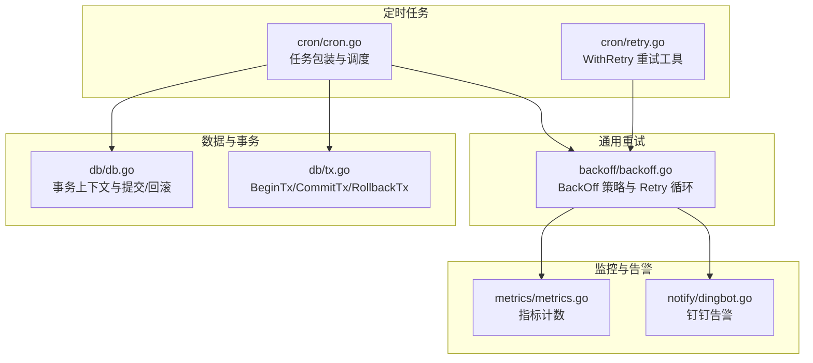
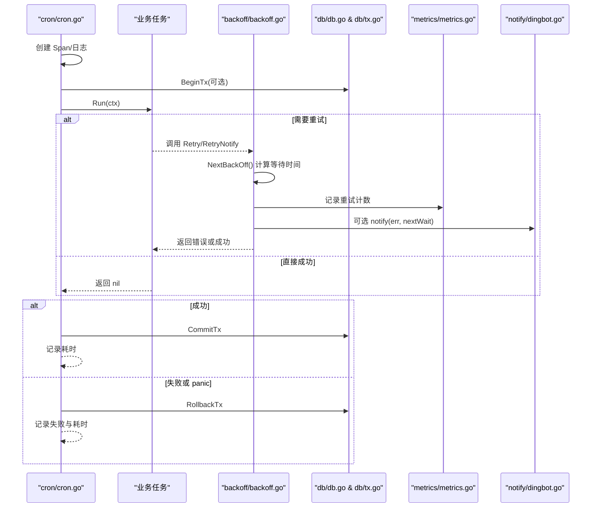
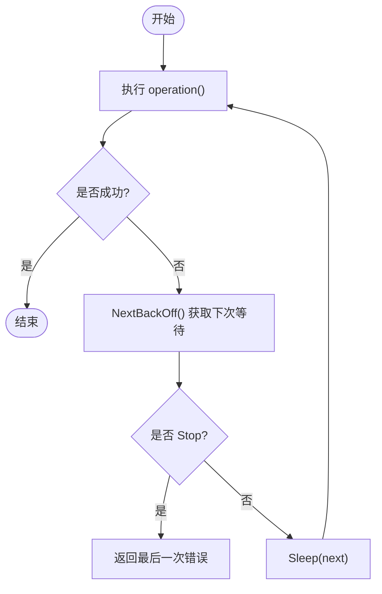
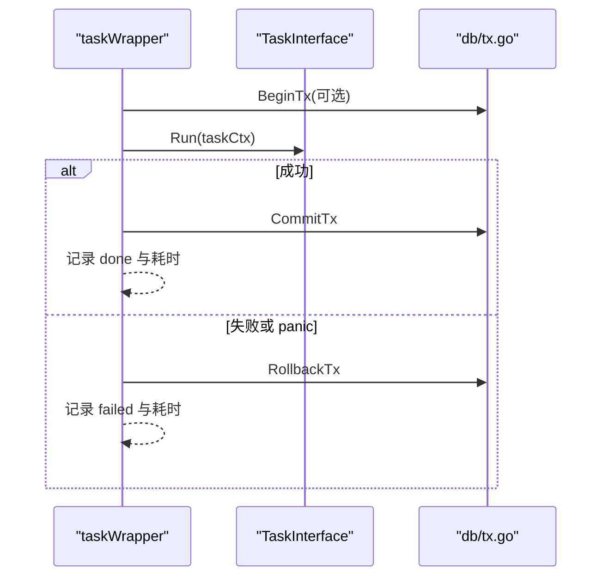
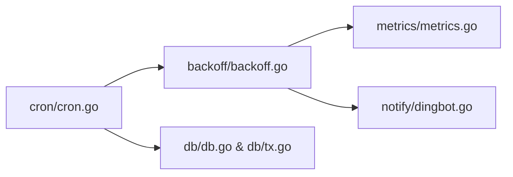

# 重试策略

<cite>
**本文引用的文件**
- [cron/retry.go](file://cron/retry.go)
- [backoff/backoff.go](file://backoff/backoff.go)
- [cron/cron.go](file://cron/cron.go)
- [db/db.go](file://db/db.go)
- [db/tx.go](file://db/tx.go)
- [notify/dingbot.go](file://notify/dingbot.go)
- [metrics/metrics.go](file://metrics/metrics.go)
- [README.md](file://README.md)
</cite>

## 目录
1. [简介](#简介)
2. [项目结构](#项目结构)
3. [核心组件](#核心组件)
4. [架构总览](#架构总览)
5. [详细组件分析](#详细组件分析)
6. [依赖关系分析](#依赖关系分析)
7. [性能考量](#性能考量)
8. [故障排查指南](#故障排查指南)
9. [结论](#结论)
10. [附录：配置示例与最佳实践](#附录：配置示例与最佳实践)

## 简介
本文件围绕 Carina 的定时任务重试策略进行系统化说明，覆盖重试条件判断、次数限制、退避算法、状态管理、错误分类、失败处理与告警机制，以及与事务管理的集成和数据一致性保证。文档基于仓库中的 cron 与 backoff 模块实现，结合数据库事务封装与通知能力，给出可操作的配置建议与排错指引。

## 项目结构
Carina 的重试相关能力由两个层次组成：
- 任务层重试：在 cron 任务执行入口提供统一包装，支持事务、恢复、日志等横切关注点；同时暴露轻量级重试工具 WithRetry。
- 通用退避重试：backoff 包提供多种退避策略（固定间隔、指数退避、零等待、停止）以及统一的 Retry/RetryNotify 执行器。

图表来源
- [cron/cron.go:67-116](file://cron/cron.go#L67-L116)
- [cron/retry.go:8-33](file://cron/retry.go#L8-L33)
- [backoff/backoff.go:10-179](file://backoff/backoff.go#L10-L179)
- [db/db.go:68-115](file://db/db.go#L68-L115)
- [db/tx.go:10-37](file://db/tx.go#L10-L37)
- [metrics/metrics.go:74-106](file://metrics/metrics.go#L74-L106)
- [notify/dingbot.go:114-132](file://notify/dingbot.go#L114-L132)

章节来源
- [README.md:1-18](file://README.md#L1-L18)

## 核心组件
- 任务重试工具：WithRetry(policy, fn) 提供“最大重试次数 + 固定间隔”的简单重试能力，适用于对复杂度要求不高的场景。
- 通用退避重试：BackOff 接口及多种实现（ZeroBackOff、StopBackOff、ConstantBackOff、ExponentialBackOff），配合 Retry/RetryNotify 完成带退避的重试循环，并支持每次失败回调。
- 任务包装：taskWrapper 为每个定时任务提供事务、Recovery、Tracing、日志的统一处理，确保异常时回滚与可观测性。
- 事务管理：通过 db.BeginTx/CommitTx/RollbackTx 与 Context 注入，使任务在执行期间自动感知事务边界。
- 监控与告警：Prometheus 计数器用于统计重试行为；DingBot 提供信息/警告/错误/严重级别的通知能力。

章节来源
- [cron/retry.go:8-33](file://cron/retry.go#L8-L33)
- [backoff/backoff.go:10-179](file://backoff/backoff.go#L10-L179)
- [cron/cron.go:67-116](file://cron/cron.go#L67-L116)
- [db/db.go:68-115](file://db/db.go#L68-L115)
- [db/tx.go:10-37](file://db/tx.go#L10-L37)
- [metrics/metrics.go:74-106](file://metrics/metrics.go#L74-L106)
- [notify/dingbot.go:114-132](file://notify/dingbot.go#L114-L132)

## 架构总览
下图展示一次定时任务的执行流程，包括事务、重试、退避、监控与告警的协作关系。

图表来源
- [cron/cron.go:67-116](file://cron/cron.go#L67-L116)
- [backoff/backoff.go:144-179](file://backoff/backoff.go#L144-L179)
- [db/db.go:68-115](file://db/db.go#L68-L115)
- [db/tx.go:10-37](file://db/tx.go#L10-L37)
- [metrics/metrics.go:74-106](file://metrics/metrics.go#L74-L106)
- [notify/dingbot.go:114-132](file://notify/dingbot.go#L114-L132)

## 详细组件分析

### 任务层重试：WithRetry
- 设计要点
  - 参数：最大重试次数 MaxRetries、固定间隔 IntervalMs。
  - 行为：最多执行 MaxRetries+1 次（首次 + 重试次数），每次失败后进入下一次尝试。
  - 适用场景：对退避复杂度无要求的简单重试，如本地缓存刷新、幂等写操作等。
- 注意事项
  - 当前实现未包含实际 sleep 逻辑（注释占位），若需固定间隔重试，应在 i>0 时加入睡眠。
  - 与事务集成：建议在 taskWrapper 中包裹业务逻辑，By default 任务默认开启事务，失败会回滚。

章节来源
- [cron/retry.go:8-33](file://cron/retry.go#L8-L33)
- [cron/cron.go:67-116](file://cron/cron.go#L67-L116)

### 通用退避重试：BackOff 与 Retry
- 策略类型
  - ZeroBackOff：立即重试，适合快速失败且外部系统瞬时不可用的场景。
  - StopBackOff：永不重试，适合一次性操作或明确不应重试的错误。
  - ConstantBackOff：固定间隔重试，适合稳定延迟的外部依赖。
  - ExponentialBackOff：指数退避 + 随机化，适合网络抖动、限流保护等场景。
- 关键参数（指数退避）
  - InitialInterval：初始间隔
  - RandomizationFactor：随机化因子，避免雪崩
  - Multiplier：增长倍数
  - MaxInterval：最大间隔上限
  - MaxElapsedTime：最长总时长，超过则停止
- 执行器
  - Retry：按策略循环执行，直到成功或策略停止。
  - RetryNotify：同 Retry，但每次失败回调 notify(err, nextWait)，便于记录指标与告警。

图表来源
- [backoff/backoff.go:144-179](file://backoff/backoff.go#L144-L179)
- [backoff/backoff.go:10-142](file://backoff/backoff.go#L10-L142)

章节来源
- [backoff/backoff.go:10-179](file://backoff/backoff.go#L10-L179)

### 任务包装与事务集成
- 事务生命周期
  - 任务默认开启事务（IsEnableTx 默认为 true）。
  - 成功：提交事务；失败或 panic：回滚事务。
  - 通过 Context 注入事务句柄，业务代码使用 GetDBWithContext 自动感知事务。
- 可观测性
  - 每个任务执行前后记录日志与耗时。
  - 使用 tracing.StartSpan 生成追踪跨度。
- 错误处理
  - 捕获 panic 并记录，必要时回滚事务。

图表来源
- [cron/cron.go:67-116](file://cron/cron.go#L67-L116)
- [db/tx.go:10-37](file://db/tx.go#L10-L37)

章节来源
- [cron/cron.go:67-116](file://cron/cron.go#L67-L116)
- [db/db.go:68-115](file://db/db.go#L68-L115)
- [db/tx.go:10-37](file://db/tx.go#L10-L37)

### 错误分类与告警机制
- 错误分类
  - 业务错误 vs 系统错误：可通过 BusinessError 的类型区分，系统错误通常需要上报与告警。
- 告警通道
  - DingBot 提供 Info/Warn/Error/Critical 多级通知，可在重试失败或达到阈值时触发。
- 指标统计
  - Prometheus 计数器可用于统计资源调用重试次数、业务错误总数等，便于监控与告警联动。

章节来源
- [notify/dingbot.go:114-132](file://notify/dingbot.go#L114-L132)
- [metrics/metrics.go:74-106](file://metrics/metrics.go#L74-L106)

## 依赖关系分析
- cron 模块依赖 backoff 模块以提供退避重试能力。
- cron 模块依赖 db 模块以管理事务与上下文。
- backoff 模块可通过 metrics 与 notify 扩展监控与告警。
- 各模块间耦合清晰：cron 负责编排，backoff 专注退避策略，db 专注事务，monitor/notify 提供横切能力。

图表来源
- [cron/cron.go:67-116](file://cron/cron.go#L67-L116)
- [backoff/backoff.go:144-179](file://backoff/backoff.go#L144-L179)
- [db/db.go:68-115](file://db/db.go#L68-L115)
- [db/tx.go:10-37](file://db/tx.go#L10-L37)
- [metrics/metrics.go:74-106](file://metrics/metrics.go#L74-L106)
- [notify/dingbot.go:114-132](file://notify/dingbot.go#L114-L132)

章节来源
- [cron/cron.go:67-116](file://cron/cron.go#L67-L116)
- [backoff/backoff.go:144-179](file://backoff/backoff.go#L144-L179)

## 性能考量
- 退避策略选择
  - 指数退避适合高抖动或受限环境，能有效降低并发重试风暴。
  - 固定间隔适合延迟稳定的服务，便于预测与容量规划。
  - 零等待仅用于极短重试且外部系统快速恢复的场景。
- 超时控制
  - 指数退避支持 MaxElapsedTime，避免长时间重试占用资源。
- 并发与背压
  - 管道任务（Pipe）具备容量与消费者数量控制，避免内存膨胀。
- 事务成本
  - 频繁小事务可能带来开销，建议合并写入或批量提交。

[本节为通用指导，不直接分析具体文件]

## 故障排查指南
- 常见问题
  - 重试未生效：检查 WithRetry 的 MaxRetries 与 IntervalMs 配置；确认业务函数确实返回 error。
  - 事务未提交：确认任务 IsEnableTx 为 true，且 Run 未提前 return 导致跳过提交。
  - 告警未触发：检查 RetryNotify 的 notify 回调是否注册，以及 DingBot 配置是否正确。
- 定位方法
  - 查看任务日志中的 run/failed/done 输出与耗时。
  - 通过 Prometheus 指标观察重试计数与错误趋势。
  - 使用 Tracing 跟踪跨模块调用链。

章节来源
- [cron/cron.go:98-114](file://cron/cron.go#L98-L114)
- [backoff/backoff.go:163-179](file://backoff/backoff.go#L163-L179)
- [notify/dingbot.go:114-132](file://notify/dingbot.go#L114-L132)
- [metrics/metrics.go:74-106](file://metrics/metrics.go#L74-L106)

## 结论
Carina 的重试体系将“任务层重试”与“通用退避重试”解耦，既满足简单场景的快速接入，又提供强大的退避策略与可观测性。结合事务管理与告警机制，能够在保障数据一致性的前提下，提升系统的鲁棒性与可维护性。推荐在生产环境中优先采用指数退避并结合总时长限制，辅以指标与告警闭环。

[本节为总结，不直接分析具体文件]

## 附录：配置示例与最佳实践
- 配置项说明
  - 任务重试（cron/retry.go）
    - MaxRetries：最大重试次数（含首次执行）
    - IntervalMs：固定间隔（毫秒）
  - 退避重试（backoff/backoff.go）
    - InitialInterval：初始间隔
    - RandomizationFactor：随机化因子
    - Multiplier：增长倍数
    - MaxInterval：最大间隔上限
    - MaxElapsedTime：最长总时长
- 典型场景建议
  - 网络抖动/限流：指数退避，设置合理的 MaxInterval 与 MaxElapsedTime。
  - 外部服务瞬时不可用：固定间隔 + 较小 MaxRetries。
  - 幂等写操作：固定间隔 + 中等 MaxRetries，确保最终一致性。
- 事务集成
  - 保持 IsEnableTx 为 true，确保失败回滚；对于长事务，考虑拆分以减少锁持有时间。
- 告警与监控
  - 使用 RetryNotify 的 notify 回调记录重试事件与下次等待时间。
  - 通过 Prometheus 指标观察重试总量与错误分布。
  - 在达到阈值或连续失败时，通过 DingBot 发送告警。

章节来源
- [cron/retry.go:8-33](file://cron/retry.go#L8-L33)
- [backoff/backoff.go:56-142](file://backoff/backoff.go#L56-L142)
- [cron/cron.go:67-116](file://cron/cron.go#L67-L116)
- [notify/dingbot.go:114-132](file://notify/dingbot.go#L114-L132)
- [metrics/metrics.go:74-106](file://metrics/metrics.go#L74-L106)