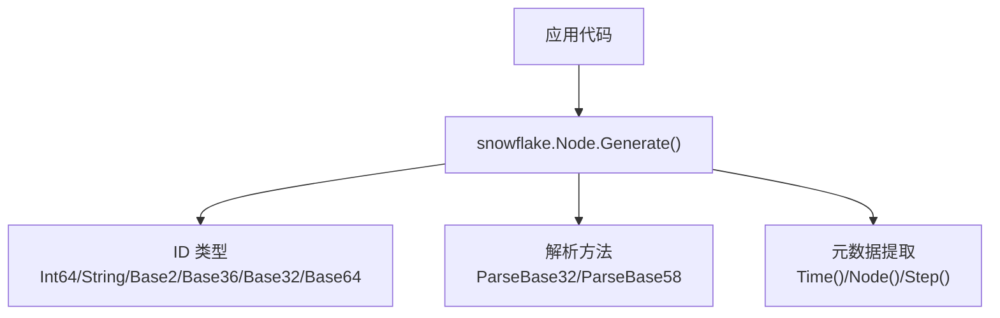
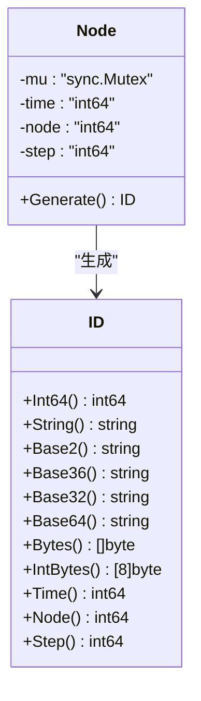
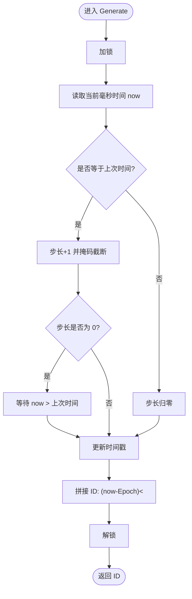
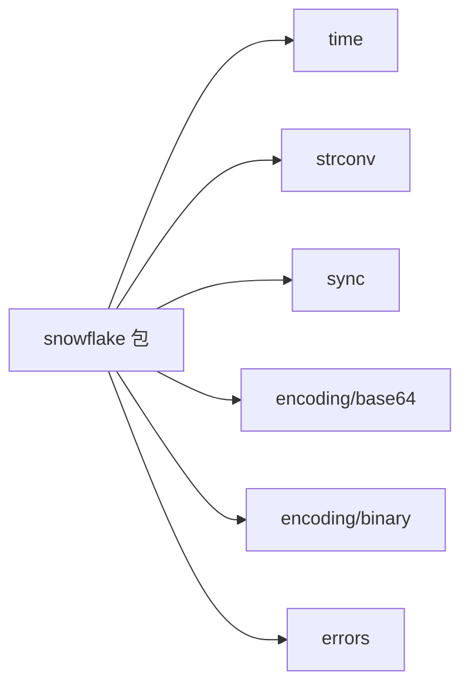
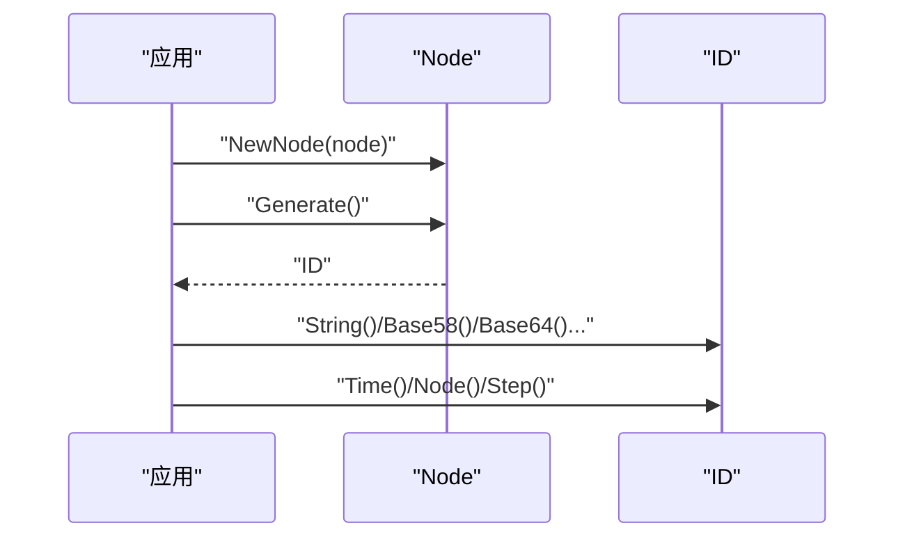

# Snowflake 分布式 ID 生成器

<cite>
**本文引用的文件**
- [snowflake/snowflake.go](file://snowflake/snowflake.go)
- [snowflake/snowflake_test.go](file://snowflake/snowflake_test.go)
- [ARCHITECTURE.md](file://ARCHITECTURE.md)
- [README.md](file://README.md)
- [go.mod](file://go.mod)
</cite>

## 目录
1. [简介](#简介)
2. [项目结构](#项目结构)
3. [核心组件](#核心组件)
4. [架构总览](#架构总览)
5. [详细组件分析](#详细组件分析)
6. [依赖关系分析](#依赖关系分析)
7. [性能考量](#性能考量)
8. [故障排查指南](#故障排查指南)
9. [结论](#结论)
10. [附录：使用示例与最佳实践](#附录使用示例与最佳实践)

## 简介
本模块提供 Twitter Snowflake 算法的 Go 实现，用于在分布式系统中生成全局唯一、趋势递增的 64 位整数 ID。该实现支持多种编码格式（十进制、二进制、Base32、Base58、Base64）及对应的解析方法，并提供可自定义的 Epoch 起始时间、节点位数与步长位数配置，以满足不同业务场景对 ID 长度、可读性与容量需求。

## 项目结构
- snowflake/ 包为独立叶子模块，不依赖框架内部其他包，便于在任意服务中复用。
- README 将该能力列为“工具集”之一；ARCHITECTURE 明确其职责为“分布式 ID 生成”。

图表来源
- [snowflake/snowflake.go:68-125](file://snowflake/snowflake.go#L68-L125)
- [snowflake/snowflake.go:127-241](file://snowflake/snowflake.go#L127-L241)

章节来源
- [README.md:1-154](file://README.md#L1-L154)
- [ARCHITECTURE.md:1-122](file://ARCHITECTURE.md#L1-L122)

## 核心组件
- Node：并发安全的 ID 生成节点，维护当前毫秒时间、节点号与步长，通过互斥锁保护临界区。
- ID：基于 int64 的类型封装，提供多格式序列化与解析、以及从 ID 中提取时间戳、节点号、步长的方法。
- 全局配置：Epoch、NodeBits、StepBits 等位分配参数，可在初始化前按需调整。

章节来源
- [snowflake/snowflake.go:15-30](file://snowflake/snowflake.go#L15-L30)
- [snowflake/snowflake.go:68-125](file://snowflake/snowflake.go#L68-L125)
- [snowflake/snowflake.go:127-241](file://snowflake/snowflake.go#L127-L241)

## 架构总览
Snowflake 将 64 位 ID 划分为三部分：
- 时间戳（毫秒）：高位部分，保证趋势递增
- 机器/节点 ID：中间部分，区分不同节点
- 序列号（步长）：低位部分，同一毫秒内自增

本实现默认采用 NodeBits=10、StepBits=12，即：
- 时间戳占 64 - 10 - 12 = 42 位
- 节点号范围 0..(2^10 - 1)
- 单节点单毫秒最大步长 0..(2^12 - 1)

图表来源
- [snowflake/snowflake.go:68-125](file://snowflake/snowflake.go#L68-L125)
- [snowflake/snowflake.go:127-241](file://snowflake/snowflake.go#L127-L241)

## 详细组件分析

### 位分配策略与时间戳
- 时间戳：以 Unix 毫秒为单位，减去 Epoch 后左移 (NodeBits + StepBits) 位。
- 节点号：占用 NodeBits 位，位于时间戳与步长之间。
- 步长：占用 StepBits 位，表示同一毫秒内的序号。
- 默认值：NodeBits=10、StepBits=12，时间戳 42 位。

章节来源
- [snowflake/snowflake.go:15-30](file://snowflake/snowflake.go#L15-L30)
- [snowflake/snowflake.go:118-121](file://snowflake/snowflake.go#L118-L121)

### 并发安全与步长递增机制
- 互斥锁：Node.Generate 使用 sync.Mutex 保护临界区，确保多线程并发下 time/step 一致性。
- 同毫秒处理：当当前时间与上次相同，步长按掩码循环递增；若步长溢出至 0，则等待时钟推进到下一毫秒再继续。
- 跨毫秒重置：当时间前进时，步长重置为 0。

图表来源
- [snowflake/snowflake.go:99-125](file://snowflake/snowflake.go#L99-L125)

章节来源
- [snowflake/snowflake.go:68-125](file://snowflake/snowflake.go#L68-L125)

### 编码与解析
- 十进制：String()
- 二进制：Base2()
- Base36：Base36()
- Base32：Base32()，配套 ParseBase32([]byte)
- Base58：Base58()，配套 ParseBase58([]byte)
- Base64：Base64()，底层基于字节形式
- 字节形式：Bytes() 返回十进制字符串的字节；IntBytes() 返回大端序 8 字节

章节来源
- [snowflake/snowflake.go:127-226](file://snowflake/snowflake.go#L127-L226)

### 元数据提取
- Time()：从 ID 中恢复出 Unix 毫秒时间戳（含 Epoch）
- Node()：提取节点号
- Step()：提取步长

章节来源
- [snowflake/snowflake.go:228-241](file://snowflake/snowflake.go#L228-L241)

### JSON 编解码
- MarshalJSON：将 ID 序列化为十进制字符串
- UnmarshalJSON：从十进制字符串反序列化，非法格式返回 JSONSyntaxError

章节来源
- [snowflake/snowflake.go:243-265](file://snowflake/snowflake.go#L243-L265)

### 自定义 Epoch 与位宽
- Epoch：可在全局变量处修改，影响时间戳起点
- NodeBits/StepBits：可在调用 NewNode 前修改，NewNode 会据此重算掩码与位移量

章节来源
- [snowflake/snowflake.go:15-30](file://snowflake/snowflake.go#L15-L30)
- [snowflake/snowflake.go:79-97](file://snowflake/snowflake.go#L79-L97)

## 依赖关系分析
- 标准库：encoding/base64、encoding/binary、errors、fmt、strconv、sync、time
- 无第三方依赖，适合轻量集成

图表来源
- [snowflake/snowflake.go:5-13](file://snowflake/snowflake.go#L5-L13)

章节来源
- [snowflake/snowflake.go:5-13](file://snowflake/snowflake.go#L5-L13)
- [go.mod:1-87](file://go.mod#L1-L87)

## 性能考量
- 高吞吐：单节点单毫秒最多 2^12=4096 个 ID；超过需增加节点数或调大 StepBits。
- 时钟回拨保护：当步长溢出时会忙等直到时间推进，避免重复 ID。
- 锁粒度：Generate 内部持有互斥锁，建议每个进程/实例维护一个 Node 实例共享，避免频繁创建。
- 编码选择：Base58/Base32 更短且可读性较好；Base64 适合二进制传输；JSON 默认十进制字符串。
- 位宽权衡：增大 NodeBits 提升节点容量，减小 StepBits 会降低单毫秒吞吐；反之亦然。

[本节为通用性能指导，不直接分析具体文件]

## 故障排查指南
- 节点号越界：NewNode 要求节点号在 [0, 2^NodeBits - 1]，超出范围将报错。
- 非法 Base32/Base58：ParseBase32/ParseBase58 遇到非法字符返回对应错误。
- JSON 解析失败：UnmarshalJSON 非十进制字符串或格式不符返回 JSONSyntaxError。
- 时钟回拨：极端情况下系统时间回拨可能导致短暂阻塞等待，属设计保护行为。

章节来源
- [snowflake/snowflake.go:79-97](file://snowflake/snowflake.go#L79-L97)
- [snowflake/snowflake.go:167-209](file://snowflake/snowflake.go#L167-L209)
- [snowflake/snowflake.go:243-265](file://snowflake/snowflake.go#L243-L265)

## 结论
该 Snowflake 实现以简洁、低依赖的方式提供了高并发、可扩展的分布式 ID 生成能力。通过合理的位分配、互斥锁保护与时钟回拨处理，满足大多数微服务场景的 ID 需求。同时提供丰富的编码与解析接口，便于在不同存储与传输层中使用。

[本节为总结性内容，不直接分析具体文件]

## 附录：使用示例与最佳实践

### 基本用法流程
- 创建节点：传入节点号（需在允许范围内）
- 生成 ID：调用 Generate()
- 解析/编码：根据场景选择 String/Base2/Base36/Base32/Base58/Base64
- 提取元数据：Time()/Node()/Step()

图表来源
- [snowflake/snowflake.go:79-125](file://snowflake/snowflake.go#L79-L125)
- [snowflake/snowflake.go:127-241](file://snowflake/snowflake.go#L127-L241)

### 关键 API 参考（路径引用）
- 创建节点与生成 ID：[NewNode / Generate:79-125](file://snowflake/snowflake.go#L79-L125)
- 十进制/二进制/Base36/Base32/Base58/Base64 编码：[String/Base2/Base36/Base32/Base58/Base64:127-226](file://snowflake/snowflake.go#L127-L226)
- Base32/Base58 解析：[ParseBase32 / ParseBase58:167-209](file://snowflake/snowflake.go#L167-L209)
- 元数据提取：[Time/Node/Step:228-241](file://snowflake/snowflake.go#L228-L241)
- JSON 编解码：[MarshalJSON/UnmarshalJSON:243-265](file://snowflake/snowflake.go#L243-L265)

### 测试用例参考（路径引用）
- 唯一性验证：[TestGenerateUnique:7-21](file://snowflake/snowflake_test.go#L7-L21)
- 元数据解析：[TestIDParts:23-36](file://snowflake/snowflake_test.go#L23-L36)
- Base58 往返：[TestBase58RoundTrip:38-49](file://snowflake/snowflake_test.go#L38-L49)
- JSON 往返：[TestJSONRoundTrip:51-66](file://snowflake/snowflake_test.go#L51-L66)
- 节点边界校验：[TestNewNodeBoundary:68-79](file://snowflake/snowflake_test.go#L68-L79)

### 最佳实践
- 每个进程/容器启动时创建一个 Node 实例并全局复用，避免频繁创建开销。
- 合理设置 NodeBits/StepBits：节点规模较大时优先增加节点数；需要更高单毫秒吞吐时可考虑增大 StepBits。
- 统一 Epoch：集群内所有节点使用相同 Epoch，避免 ID 区间重叠。
- 编码选择：对外暴露的 ID 建议使用 Base58/Base32 以提升可读性与 URL 友好性；内部存储可用 Int64 或 Base64。
- 监控与告警：关注时钟回拨导致的等待情况，必要时引入时钟同步与告警。

[本节为实践指导，不直接分析具体文件]