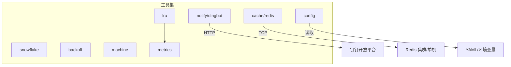
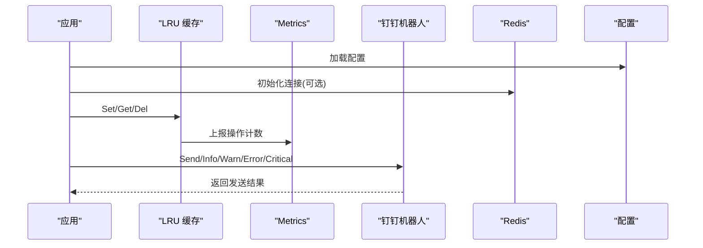
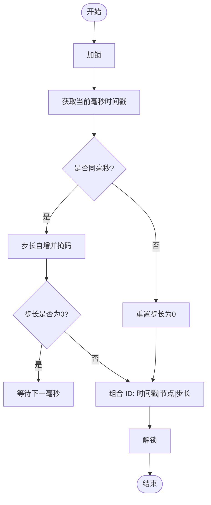
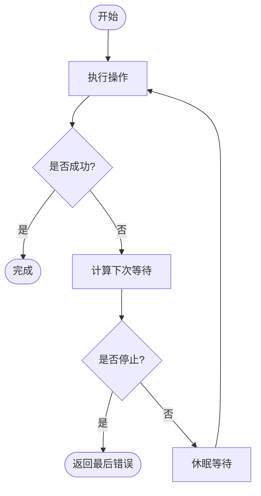
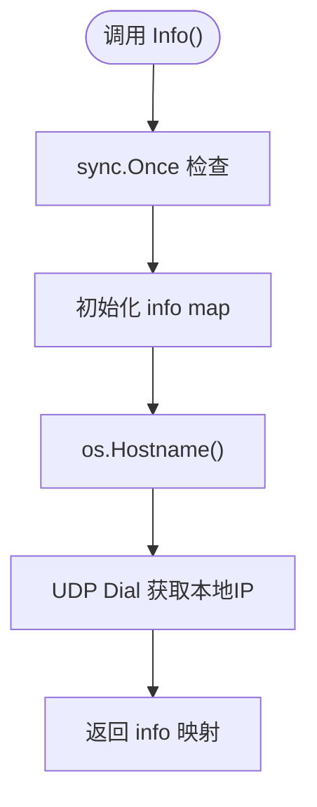
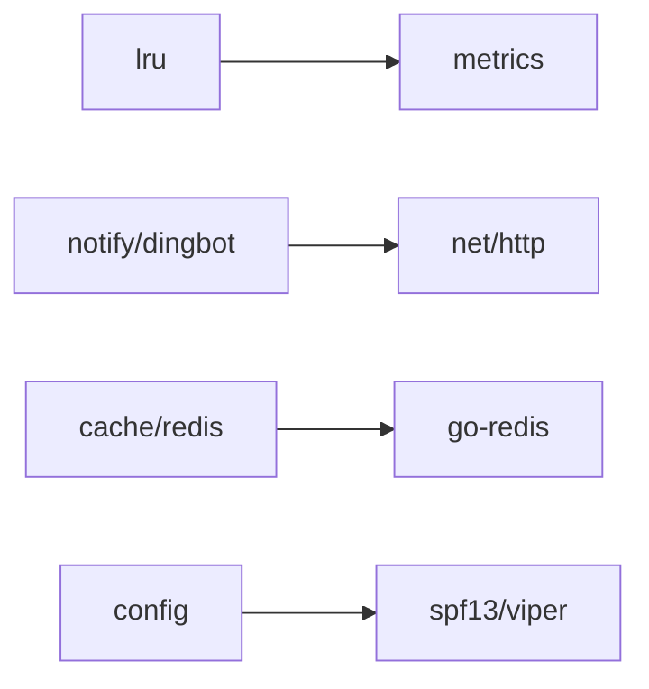

# 工具集

<cite>
**本文引用的文件**
- [snowflake/snowflake.go](file://snowflake/snowflake.go)
- [lru/lru.go](file://lru/lru.go)
- [backoff/backoff.go](file://backoff/backoff.go)
- [notify/dingbot.go](file://notify/dingbot.go)
- [machine/machine.go](file://machine/machine.go)
- [metrics/metrics.go](file://metrics/metrics.go)
- [cache/redis.go](file://cache/redis.go)
- [config/config.go](file://config/config.go)
- [ARCHITECTURE.md](file://ARCHITECTURE.md)
- [README.md](file://README.md)
</cite>

## 目录
1. [简介](#简介)
2. [项目结构](#项目结构)
3. [核心组件](#核心组件)
4. [架构总览](#架构总览)
5. [详细组件分析](#详细组件分析)
6. [依赖关系分析](#依赖关系分析)
7. [性能考量](#性能考量)
8. [故障排查指南](#故障排查指南)
9. [结论](#结论)
10. [附录：使用示例与最佳实践](#附录使用示例与最佳实践)

## 简介
本技术文档聚焦 Carina 工具集，围绕以下能力进行系统化说明：
- Snowflake 分布式 ID 生成器：时间戳、机器ID（节点号）、序列号的组合策略与并发安全。
- 带 TTL 的 LRU 缓存：内存管理、过期策略、淘汰回调与并发安全。
- 重试退避算法：固定间隔、指数退避与抖动策略的实现与使用。
- 钉钉机器人通知：集成方式、消息格式与环境控制。
- 机器信息获取：主机名、出口 IP 等元数据的惰性初始化与线程安全。
并提供完整的使用示例与最佳实践建议。

## 项目结构
Carina 工具集以“叶子包”形式提供可复用能力，彼此低耦合，便于在微服务中按需引入。关键模块职责如下：
- snowflake：分布式唯一 ID 生成与解析。
- lru：带 TTL 的内存 LRU 缓存，支持淘汰回调与指标上报。
- backoff：重试退避策略（零等待、停止、固定间隔、指数退避+抖动）。
- notify：钉钉机器人告警客户端。
- machine：机器信息（hostname/ip）惰性初始化。
- metrics：Prometheus 指标定义（LRU 操作计数等）。
- cache：Redis 客户端封装（用于全局缓存或外部存储）。
- config：基于 Viper 的配置加载与环境覆盖。



图表来源
- [snowflake/snowflake.go:1-266](file://snowflake/snowflake.go#L1-L266)
- [lru/lru.go:1-243](file://lru/lru.go#L1-L243)
- [backoff/backoff.go:1-180](file://backoff/backoff.go#L1-L180)
- [notify/dingbot.go:1-133](file://notify/dingbot.go#L1-L133)
- [machine/machine.go:1-35](file://machine/machine.go#L1-L35)
- [metrics/metrics.go:1-107](file://metrics/metrics.go#L1-L107)
- [cache/redis.go:1-123](file://cache/redis.go#L1-L123)
- [config/config.go:1-61](file://config/config.go#L1-L61)

章节来源
- [ARCHITECTURE.md:13-34](file://ARCHITECTURE.md#L13-L34)
- [README.md:1-18](file://README.md#L1-L18)

## 核心组件
本节概述各工具的能力边界与典型用法，后续章节将深入实现细节。

- Snowflake 分布式 ID：通过毫秒级时间戳、节点号与步长位组合，保证分布式环境下的高吞吐、单调递增且全局唯一。
- 带 TTL 的 LRU 缓存：基于双向链表 + 哈希表实现，支持容量上限、TTL 自动过期、淘汰回调与并发读写保护。
- 重试退避：提供 ZeroBackOff、StopBackOff、ConstantBackOff、ExponentialBackOff 四种策略，并封装 Retry/RetryNotify 通用执行器。
- 钉钉机器人通知：支持 markdown 消息发送，开发环境默认只打印日志；支持自定义 API URL、超时与平台标识。
- 机器信息：惰性初始化 hostname 与本机出口 IP，供统一响应体注入 _pod 字段。

章节来源
- [snowflake/snowflake.go:68-125](file://snowflake/snowflake.go#L68-L125)
- [lru/lru.go:13-86](file://lru/lru.go#L13-L86)
- [backoff/backoff.go:10-161](file://backoff/backoff.go#L10-L161)
- [notify/dingbot.go:18-133](file://notify/dingbot.go#L18-L133)
- [machine/machine.go:9-34](file://machine/machine.go#L9-L34)

## 架构总览
工具集遵循“叶子包”设计，不相互强依赖，仅通过标准库或第三方库协作。整体调用链如下：
- 业务代码按需引入工具包。
- LRU 缓存通过 metrics 上报 get-hit/get-miss/set/evict 计数。
- 钉钉通知通过 HTTP 调用开放平台接口。
- Redis 作为外部缓存或计数器后端。
- 配置由 Viper 统一加载，支持环境变量覆盖。



图表来源
- [lru/lru.go:88-92](file://lru/lru.go#L88-L92)
- [metrics/metrics.go:35-107](file://metrics/metrics.go#L35-L107)
- [notify/dingbot.go:73-112](file://notify/dingbot.go#L73-L112)
- [cache/redis.go:20-33](file://cache/redis.go#L20-L33)
- [config/config.go:21-60](file://config/config.go#L21-L60)

## 详细组件分析

### Snowflake 分布式 ID 生成器
- 位分配策略：
  - 时间戳：高位移位，单位毫秒，相对 Epoch 偏移。
  - 节点号：NodeBits 位，默认 10 位，表示节点范围 [0, 2^10-1]。
  - 步长号：StepBits 位，默认 12 位，同一毫秒内自增步长，溢出时等待下一毫秒。
- 并发安全：
  - Node 内部使用互斥锁保护 Generate 流程，确保同一时刻只有一个 goroutine 推进 step/time。
- 编码与解析：
  - 支持十进制、二进制、Base32、Base58、Base64、字节与大端序 8 字节形式。
  - 提供 JSON 序列化/反序列化，保持字符串形式传输。
- 复杂度与性能：
  - 单次生成 O(1)，内存占用极小；在高并发下具备良好吞吐。
- 错误处理：
  - 非法 Base32/Base58 输入返回对应错误；节点号越界返回错误。



图表来源
- [snowflake/snowflake.go:99-125](file://snowflake/snowflake.go#L99-L125)

章节来源
- [snowflake/snowflake.go:15-30](file://snowflake/snowflake.go#L15-L30)
- [snowflake/snowflake.go:68-125](file://snowflake/snowflake.go#L68-L125)
- [snowflake/snowflake.go:127-241](file://snowflake/snowflake.go#L127-L241)

### 带 TTL 的 LRU 缓存
- 数据结构：
  - 哈希表 items 映射 key 到 entry。
  - 双向链表 evictList 维护访问顺序，队头为最近使用，队尾为最久未使用。
  - entry 包含 key/value、链表元素指针、过期时间与定时器。
- 内存管理与容量：
  - 设置容量 cap，超过时从队尾淘汰最久未使用的条目。
  - Purge 清空所有条目并触发淘汰回调。
- 过期策略：
  - 每个 entry 创建时启动 time.AfterFunc 定时器，到期后移除条目。
  - Get 时若 noReset=false 则刷新 TTL 并移动至队头；否则不刷新。
- 并发安全：
  - 写操作使用互斥锁，读操作使用读锁；定时器回调内再次加锁安全删除。
- 指标与回调：
  - 通过 metrics.LRUCacheCounter 上报 get-hit/get-miss/set/evict。
  - 支持 EvictCallback 在淘汰或清理时执行资源释放逻辑。

```mermaid
classDiagram
class Cache {
+Set(key,value) bool
+Get(key) (value,bool)
+Del(key) bool
+Keys() []interface{}
+Len() int
+Cap() int
+Purge() void
}
class cache {
-name string
-cap int
-ttl time.Duration
-items map[interface{}]*entry
-evictList *list.List
-lock sync.RWMutex
-noReset bool
-onEvict EvictCallback
}
class entry {
-key interface{}
-value interface{}
-element *list.Element
-expires time.Time
-timer *time.Timer
}
Cache <|.. cache : "实现"
cache --> entry : "持有"
```

图表来源
- [lru/lru.go:13-68](file://lru/lru.go#L13-L68)
- [lru/lru.go:24-30](file://lru/lru.go#L24-L30)

章节来源
- [lru/lru.go:70-118](file://lru/lru.go#L70-L118)
- [lru/lru.go:120-173](file://lru/lru.go#L120-L173)
- [lru/lru.go:175-243](file://lru/lru.go#L175-L243)
- [metrics/metrics.go:31-33](file://metrics/metrics.go#L31-L33)

### 重试退避算法
- 策略类型：
  - ZeroBackOff：立即重试，无等待。
  - StopBackOff：永不重试。
  - ConstantBackOff：固定间隔重试。
  - ExponentialBackOff：指数增长 + 随机抖动，支持最大间隔与最大耗时限制。
- 计算模型：
  - 下次等待 = 当前间隔 ± (RandomizationFactor × 当前间隔)。
  - 每次失败后按 Multiplier 倍增，直至 MaxInterval。
  - 超过 MaxElapsedTime 返回 Stop。
- 执行器：
  - Retry：循环执行 operation，直到成功或策略返回 Stop。
  - RetryNotify：同 Retry，但失败时回调通知（记录错误与下次等待）。
- 线程安全：
  - ExponentialBackOff 非线程安全，需每 goroutine 独立实例或使用同步包装。



图表来源
- [backoff/backoff.go:144-180](file://backoff/backoff.go#L144-L180)
- [backoff/backoff.go:112-142](file://backoff/backoff.go#L112-L142)

章节来源
- [backoff/backoff.go:10-161](file://backoff/backoff.go#L10-L161)

### 钉钉机器人通知
- 配置选项：
  - Token：机器人 access_token，为空时仅打印日志。
  - Mode：运行环境（develop/test/deploy），develop 模式只打印不发送。
  - PlatformName：附加在消息尾部，用于区分平台。
  - APIURL：自定义 API 地址，默认官方地址。
  - Timeout：HTTP 请求超时，默认 5s。
- 消息格式：
  - msgtype=markdown，包含 title 与 text。
  - text 拼接平台名、环境中文名与标题，便于识别来源。
- 发送流程：
  - 构造请求体 → 设置 Content-Type → 发起 POST → 检查状态码 → 返回错误。
- 便捷方法：
  - Info/Warn/Error/Critical 分别封装不同标题的通知。

```mermaid
sequenceDiagram
participant App as "应用"
participant DBot as "DingBot"
participant HTTP as "HTTP 客户端"
participant Ding as "钉钉开放平台"
App->>DBot : Send(ctx, title, msg)
DBot->>DBot : 检查Token/Mode
alt 开发或无Token
DBot-->>App : 打印日志并返回
else 正式环境
DBot->>HTTP : POST /robot/send?access_token=...
HTTP->>Ding : 发送JSON
Ding-->>HTTP : 响应状态码
HTTP-->>DBot : 响应体
DBot-->>App : 成功或错误
end
```



图表来源
- [notify/dingbot.go:41-53](file://notify/dingbot.go#L41-L53)
- [notify/dingbot.go:73-112](file://notify/dingbot.go#L73-L112)

章节来源
- [notify/dingbot.go:18-133](file://notify/dingbot.go#L18-L133)

### 机器信息获取
- 功能：
  - 惰性初始化一次，获取 hostname 与本机出口 IP。
  - 通过 UDP dial 到公共 DNS 端口获取本地出口 IP，不实际发包。
- 线程安全：
  - 使用 sync.Once 保证只初始化一次。
- 用途：
  - 注入到统一 Response 的 _pod 字段，便于追踪请求来源。



图表来源
- [machine/machine.go:9-34](file://machine/machine.go#L9-L34)

章节来源
- [machine/machine.go:1-35](file://machine/machine.go#L1-L35)

## 依赖关系分析
- 松耦合：工具包之间无直接依赖，仅通过标准库或第三方库交互。
- 指标接入：LRU 缓存通过 metrics 上报操作计数，便于监控。
- 外部依赖：
  - Redis：用于集中式缓存或计数。
  - 钉钉开放平台：用于告警通知。
  - Viper：用于配置加载与环境变量覆盖。



图表来源
- [lru/lru.go:88-92](file://lru/lru.go#L88-L92)
- [metrics/metrics.go:35-107](file://metrics/metrics.go#L35-L107)
- [notify/dingbot.go:5-14](file://notify/dingbot.go#L5-L14)
- [cache/redis.go:3-9](file://cache/redis.go#L3-L9)
- [config/config.go:3-9](file://config/config.go#L3-L9)

章节来源
- [ARCHITECTURE.md:36-45](file://ARCHITECTURE.md#L36-L45)

## 性能考量
- Snowflake：
  - 单节点高吞吐，毫秒级时间戳 + 步长位避免冲突。
  - 合理设置 NodeBits/StepBits 平衡节点数与每秒生成量。
- LRU 缓存：
  - 容量设置应结合热点数据大小与内存预算。
  - TTL 过短导致频繁重建，过长增加内存压力；根据业务语义调整。
  - 淘汰回调可用于释放大对象或统计指标。
- 重试退避：
  - 指数退避适合不稳定依赖，避免雪崩；设置合理的 MaxInterval 与 MaxElapsedTime。
  - 抖动因子降低多实例同时重试导致的拥塞。
- 钉钉通知：
  - 开发环境默认只打印，避免误发；生产环境务必配置 Token。
  - 合理设置超时，避免阻塞主流程。
- 机器信息：
  - 惰性初始化减少冷启动开销；UDP 探测不实际发包，开销极低。

## 故障排查指南
- Snowflake：
  - 节点号越界：检查 NewNode 传入值是否在 [0, 2^NodeBits-1]。
  - Base32/Base58 解析失败：确认输入字符集正确。
- LRU 缓存：
  - 容量为负或 TTL 为负：NewCache 返回 nil，检查参数。
  - 命中率低：检查 TTL 与 noReset 配置；评估热点数据分布。
  - 内存泄漏：确认淘汰回调中释放了资源；Purge 后重新初始化。
- 重试退避：
  - 无限重试：检查 MaxElapsedTime 是否设置为 0；必要时添加熔断。
  - 退避过快/过慢：调整 InitialInterval、Multiplier、MaxInterval。
- 钉钉通知：
  - Token 为空或 Mode=develop：仅打印日志，不会发送。
  - 网络异常或状态码非 200：检查 APIURL、Token 与网络连通性。
- 机器信息：
  - hostname/IP 为空：检查系统环境与网络栈；UDP 探测可能受限。

章节来源
- [snowflake/snowflake.go:80-97](file://snowflake/snowflake.go#L80-L97)
- [snowflake/snowflake.go:167-209](file://snowflake/snowflake.go#L167-L209)
- [lru/lru.go:70-86](file://lru/lru.go#L70-L86)
- [lru/lru.go:218-230](file://lru/lru.go#L218-L230)
- [backoff/backoff.go:112-142](file://backoff/backoff.go#L112-L142)
- [notify/dingbot.go:73-112](file://notify/dingbot.go#L73-L112)
- [machine/machine.go:16-34](file://machine/machine.go#L16-L34)

## 结论
Carina 工具集提供了稳定、可观测、易用的基础能力：
- Snowflake 保证分布式 ID 的唯一性与高性能。
- 带 TTL 的 LRU 缓存提供内存级快速访问与可控生命周期。
- 重试退避增强系统韧性，避免级联失败。
- 钉钉通知便于运维告警与问题定位。
- 机器信息简化了请求溯源。
建议在项目中按需引入，并结合 metrics 与配置管理形成完整的可观测与治理体系。

## 附录：使用示例与最佳实践

- Snowflake 使用示例
  - 创建节点并生成 ID：参考路径 [snowflake/snowflake.go:80-125](file://snowflake/snowflake.go#L80-L125)。
  - 编码/解码：参考路径 [snowflake/snowflake.go:147-209](file://snowflake/snowflake.go#L147-L209)。
  - 最佳实践：
    - 为不同服务分配不同 node 号，避免冲突。
    - 根据 QPS 调整 StepBits，确保单毫秒内足够步长。
    - 使用 Base58/Base32 缩短传输长度，注意字符集兼容性。

- LRU 缓存使用示例
  - 创建缓存并设置 TTL：参考路径 [lru/lru.go:70-86](file://lru/lru.go#L70-L86)。
  - 写入/读取/删除：参考路径 [lru/lru.go:94-118](file://lru/lru.go#L94-L118)、[lru/lru.go:175-190](file://lru/lru.go#L175-L190)、[lru/lru.go:232-243](file://lru/lru.go#L232-L243)。
  - 最佳实践：
    - 设置合理容量与 TTL，避免内存膨胀。
    - 使用 WithNoReset 控制是否刷新 TTL，适用于静态热点数据。
    - 注册淘汰回调释放大对象或统计指标。

- 重试退避使用示例
  - 固定间隔：参考路径 [backoff/backoff.go:33-44](file://backoff/backoff.go#L33-L44)。
  - 指数退避：参考路径 [backoff/backoff.go:83-95](file://backoff/backoff.go#L83-L95)。
  - 执行重试：参考路径 [backoff/backoff.go:147-180](file://backoff/backoff.go#L147-L180)。
  - 最佳实践：
    - 对不稳定依赖使用指数退避 + 抖动。
    - 设置 MaxElapsedTime 防止长时间重试。
    - 使用 RetryNotify 记录错误与等待时长，便于排障。

- 钉钉通知使用示例
  - 初始化与发送：参考路径 [notify/dingbot.go:41-53](file://notify/dingbot.go#L41-L53)、[notify/dingbot.go:73-112](file://notify/dingbot.go#L73-L112)。
  - 便捷方法：参考路径 [notify/dingbot.go:114-133](file://notify/dingbot.go#L114-L133)。
  - 最佳实践：
    - 生产环境配置 Token，开发环境仅打印。
    - 使用 PlatformName 与 Mode 区分环境与平台。
    - 设置合理超时，避免阻塞。

- 机器信息使用示例
  - 获取信息：参考路径 [machine/machine.go:16-34](file://machine/machine.go#L16-L34)。
  - 最佳实践：
    - 在统一响应体中注入 _pod 字段，便于追踪。
    - 在网络受限环境中，考虑备用方案获取 IP。

- 配置与缓存集成
  - 配置加载：参考路径 [config/config.go:21-60](file://config/config.go#L21-L60)。
  - Redis 初始化：参考路径 [cache/redis.go:20-33](file://cache/redis.go#L20-L33)。
  - 最佳实践：
    - 使用环境变量覆盖敏感配置（如 DSN、密码）。
    - 初始化时 Ping 验证连接，失败快速失败。

章节来源
- [snowflake/snowflake.go:80-209](file://snowflake/snowflake.go#L80-L209)
- [lru/lru.go:70-243](file://lru/lru.go#L70-L243)
- [backoff/backoff.go:33-180](file://backoff/backoff.go#L33-L180)
- [notify/dingbot.go:41-133](file://notify/dingbot.go#L41-L133)
- [machine/machine.go:16-34](file://machine/machine.go#L16-L34)
- [config/config.go:21-60](file://config/config.go#L21-L60)
- [cache/redis.go:20-33](file://cache/redis.go#L20-L33)