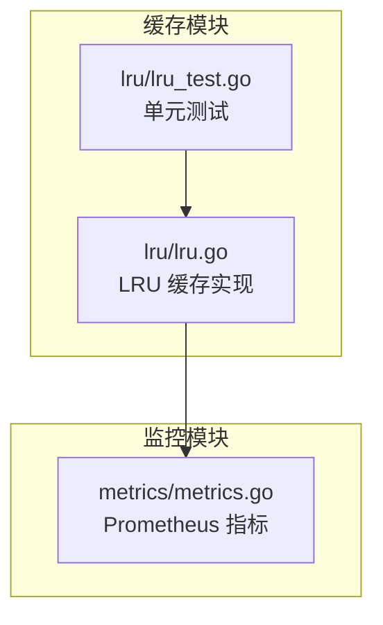
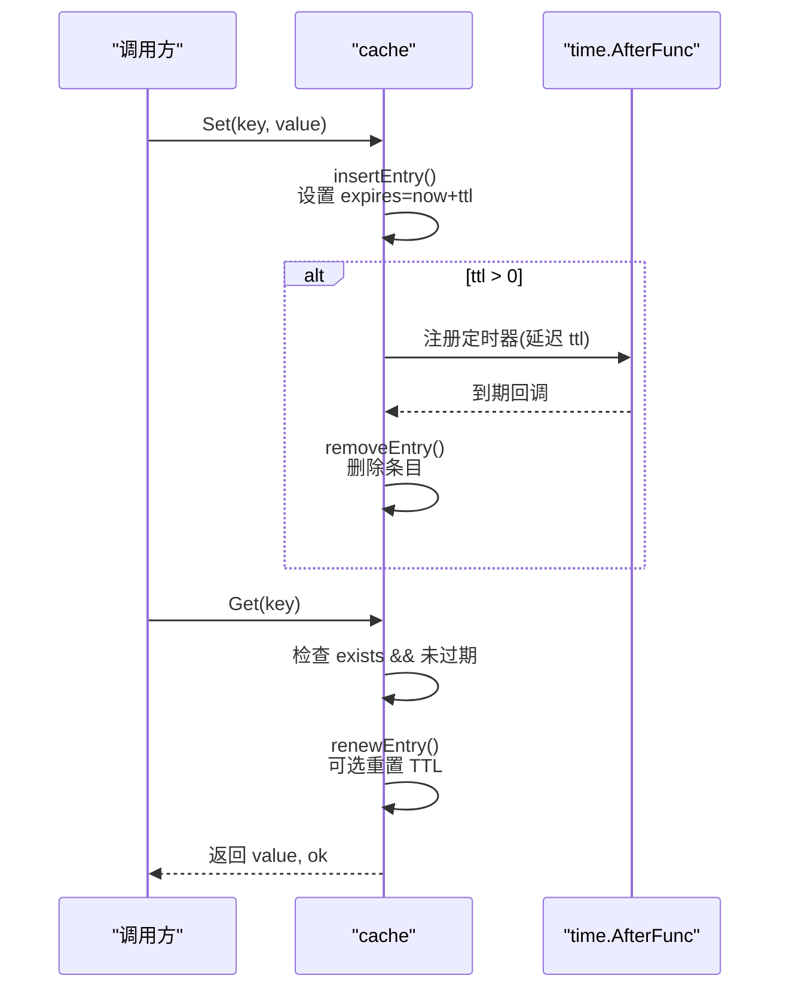
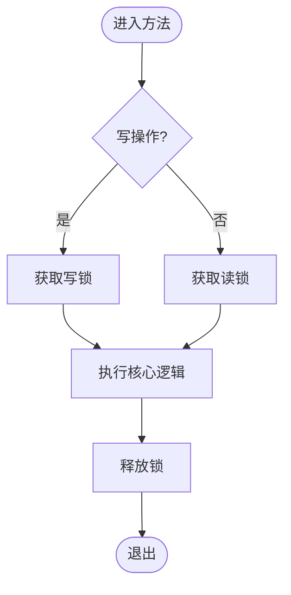
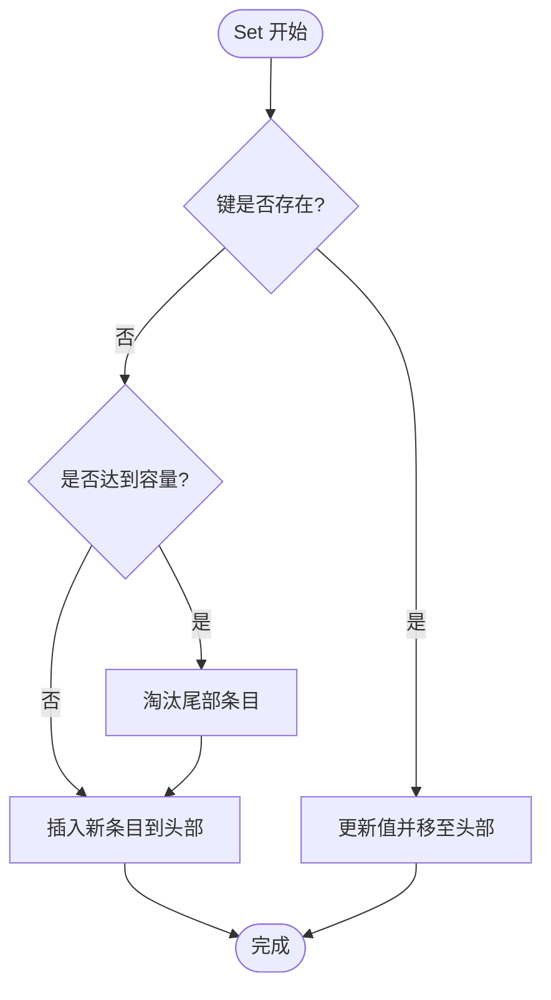

# 带 TTL 的 LRU 缓存

<cite>
**本文引用的文件**
- [lru/lru.go](file://lru/lru.go)
- [lru/lru_test.go](file://lru/lru_test.go)
- [metrics/metrics.go](file://metrics/metrics.go)
</cite>

## 目录
1. [简介](#简介)
2. [项目结构](#项目结构)
3. [核心组件](#核心组件)
4. [架构总览](#架构总览)
5. [详细组件分析](#详细组件分析)
6. [依赖关系分析](#依赖关系分析)
7. [性能与容量管理](#性能与容量管理)
8. [使用示例](#使用示例)
9. [故障排查指南](#故障排查指南)
10. [结论](#结论)

## 简介
本技术文档围绕仓库中的“带 TTL 的 LRU 缓存”实现进行系统化说明。内容涵盖：
- LRU（最近最少使用）算法原理与数据结构设计（双向链表 + 哈希表）
- TTL（Time To Live）过期机制的实现细节（时间戳存储、定时器清理）
- 并发安全设计（读写锁、线程安全的操作方法）
- 容量管理、内存优化与性能调优建议
- 完整的使用示例（初始化、存取、过期处理、监控统计）
- 常见使用场景与最佳实践

该实现以 Go 语言编写，提供简洁的接口与可插拔配置选项，并通过 Prometheus 指标暴露缓存操作计数，便于观测与告警。

## 项目结构
与缓存相关的代码主要位于以下模块：
- lru：LRU 缓存核心实现与测试
- metrics：Prometheus 指标定义与初始化



图表来源
- [lru/lru.go:1-243](file://lru/lru.go#L1-L243)
- [metrics/metrics.go:1-107](file://metrics/metrics.go#L1-L107)

章节来源
- [lru/lru.go:1-243](file://lru/lru.go#L1-L243)
- [metrics/metrics.go:1-107](file://metrics/metrics.go#L1-L107)

## 核心组件
- 缓存接口 Cache：定义 Set/Get/Del/Keys/Len/Cap/Purge 等标准方法
- 内部结构 cache：封装容量 cap、TTL 时长 ttl、条目 map、淘汰链表 evictList、读写锁 lock、是否刷新 TTL 的 noReset、淘汰回调 onEvict
- 条目 entry：保存 key/value、在链表中的元素指针 element、过期时间 expires、定时器 timer
- 配置选项 Option：WithTTL、WithEvictCallBack、WithNoReset
- 指标 metric：通过 metrics.LRUCacheCounter 记录 get-hit/get-miss/set/evict 等操作计数

章节来源
- [lru/lru.go:13-68](file://lru/lru.go#L13-L68)
- [lru/lru.go:88-92](file://lru/lru.go#L88-L92)
- [metrics/metrics.go:31-33](file://metrics/metrics.go#L31-L33)

## 架构总览
下图展示了缓存的核心数据结构和关键流程：

```mermaid
classDiagram
class Cache {
+Set(key, value) bool
+Get(key) (interface{}, bool)
+Del(key) bool
+Keys() []interface{}
+Len() int
+Cap() int
+Purge() void
}
class cache {
-string name
-int cap
-time.Duration ttl
-map items
-list.List evictList
-sync.RWMutex lock
-bool noReset
-EvictCallback onEvict
-metric(op) void
-insertEntry(key, value) *entry
-updateEntry(entry, value) void
-resetEntryTTL(entry) void
-renewEntry(entry, reset) void
-removeEntry(entry) void
}
class entry {
-interface{} key
-interface{} value
-list.Element* element
-time.Time expires
-time.Timer* timer
}
Cache <|.. cache
cache --> entry : "维护"
```

图表来源
- [lru/lru.go:13-68](file://lru/lru.go#L13-L68)
- [lru/lru.go:120-173](file://lru/lru.go#L120-L173)

## 详细组件分析

### LRU 算法与数据结构
- 双向链表 evictList：用于维护访问顺序，头部为最近使用，尾部为最久未使用
- 哈希表 items：key -> entry 的映射，支持 O(1) 查找
- 插入/更新时：将条目移动到链表头部；超容量时从尾部淘汰最久未使用的条目
- 读取时：命中则根据 noReset 决定是否移动至头部并刷新 TTL

复杂度分析
- Set/Get/Del 均为 O(1) 平均时间复杂度
- Keys 遍历所有条目，O(n)

章节来源
- [lru/lru.go:59-68](file://lru/lru.go#L59-L68)
- [lru/lru.go:94-118](file://lru/lru.go#L94-L118)
- [lru/lru.go:175-190](file://lru/lru.go#L175-L190)
- [lru/lru.go:192-204](file://lru/lru.go#L192-L204)

### TTL 过期机制
- 每个 entry 包含 expires 时间戳与 timer 定时器
- 写入或更新时设置 expires = now + ttl；若启用 TTL，创建 time.AfterFunc 定时任务在到期时移除条目
- Get 时进行防御性检查：即使理论上已被定时器移除，仍会判断当前时间是否早于 expires
- WithNoReset 选项：当设置为 true 时，Get 不会刷新 TTL，适合“固定生命周期”的场景



图表来源
- [lru/lru.go:120-140](file://lru/lru.go#L120-L140)
- [lru/lru.go:148-161](file://lru/lru.go#L148-L161)
- [lru/lru.go:175-190](file://lru/lru.go#L175-L190)

章节来源
- [lru/lru.go:120-140](file://lru/lru.go#L120-L140)
- [lru/lru.go:148-161](file://lru/lru.go#L148-L161)
- [lru/lru.go:175-190](file://lru/lru.go#L175-L190)

### 并发安全设计
- 使用 sync.RWMutex 保护共享状态
- 写操作（Set/Del/Purge）获取写锁
- 读操作（Get/Keys/Len）获取读锁
- 定时器回调中再次获取写锁后执行 removeEntry，避免竞态



图表来源
- [lru/lru.go:94-118](file://lru/lru.go#L94-L118)
- [lru/lru.go:175-190](file://lru/lru.go#L175-L190)
- [lru/lru.go:192-211](file://lru/lru.go#L192-L211)
- [lru/lru.go:218-230](file://lru/lru.go#L218-L230)
- [lru/lru.go:232-242](file://lru/lru.go#L232-L242)

章节来源
- [lru/lru.go:94-118](file://lru/lru.go#L94-L118)
- [lru/lru.go:175-190](file://lru/lru.go#L175-L190)
- [lru/lru.go:192-211](file://lru/lru.go#L192-L211)
- [lru/lru.go:218-230](file://lru/lru.go#L218-L230)
- [lru/lru.go:232-242](file://lru/lru.go#L232-L242)

### 容量管理与淘汰策略
- 容量 cap 限制最大条目数
- 当新条目导致超出容量时，从链表尾部淘汰最久未使用的条目
- 淘汰时触发 onEvict 回调（若已设置），可用于资源释放或统计



图表来源
- [lru/lru.go:94-118](file://lru/lru.go#L94-L118)
- [lru/lru.go:120-140](file://lru/lru.go#L120-L140)
- [lru/lru.go:163-173](file://lru/lru.go#L163-L173)

章节来源
- [lru/lru.go:94-118](file://lru/lru.go#L94-L118)
- [lru/lru.go:163-173](file://lru/lru.go#L163-L173)

### 监控与统计
- 通过 metrics.LRUCacheCounter 记录操作计数，标签包括缓存名与操作类型（get-hit/get-miss/set/evict）
- 指标在 Init() 中统一注册，支持 Prometheus 抓取

章节来源
- [lru/lru.go:88-92](file://lru/lru.go#L88-L92)
- [metrics/metrics.go:31-33](file://metrics/metrics.go#L31-L33)
- [metrics/metrics.go:98-105](file://metrics/metrics.go#L98-L105)

## 依赖关系分析
- lru 包依赖 metrics 包进行指标上报
- 测试用例覆盖基本读写、淘汰、TTL 过期、删除、回调触发以及非法参数处理


图表来源
- [lru/lru.go:1-11](file://lru/lru.go#L1-L11)
- [metrics/metrics.go:1-107](file://metrics/metrics.go#L1-L107)
- [lru/lru_test.go:1-95](file://lru/lru_test.go#L1-L95)

章节来源
- [lru/lru.go:1-11](file://lru/lru.go#L1-L11)
- [metrics/metrics.go:1-107](file://metrics/metrics.go#L1-L107)
- [lru/lru_test.go:1-95](file://lru/lru_test.go#L1-L95)

## 性能与容量管理
- 时间复杂度：Set/Get/Del 均摊 O(1)，Keys 为 O(n)
- 空间复杂度：O(n)，n 为当前条目数
- 内存优化：
  - 移除条目时将链表元素指针置空，避免残留引用造成内存泄漏
  - 合理设置 cap，避免过大导致内存占用过高
- 性能调优：
  - 高并发读场景下，读锁粒度较小，吞吐较好
  - 频繁更新的热点键会被移至头部，减少淘汰概率
  - 使用 WithNoReset 可避免热键频繁刷新 TTL 带来的额外开销
- 容量规划：
  - 根据业务 QPS 与内存预算估算 cap，结合命中率与淘汰率观察调整
  - 对短生命周期数据设置较短 TTL，降低常驻内存压力

[本节为通用指导，不直接分析具体文件]

## 使用示例
以下为典型使用步骤与要点（基于测试与实现推断）：
- 初始化
  - 使用 NewCache(name, cap, opts...) 创建缓存实例
  - 可通过 WithTTL(duration) 设置过期时间；0 表示不过期
  - 可通过 WithEvictCallBack(callback) 设置淘汰回调
  - 可通过 WithNoReset() 禁用 Get 时刷新 TTL
- 数据存取
  - Set(key, value)：写入或更新，返回是否发生淘汰
  - Get(key)：读取，返回 value 与是否命中
  - Del(key)：删除指定键
  - Keys()/Len()/Cap()：查询元信息
- 过期处理
  - 启用 TTL 后，条目会在到期后被自动移除
  - Get 时会进行过期检查，确保一致性
- 监控统计
  - 确保 metrics.Init() 被调用以注册指标
  - 通过 Prometheus 抓取 carina_lru_cache_total 指标，按 cache 与 operation 维度观察

章节来源
- [lru/lru.go:70-86](file://lru/lru.go#L70-L86)
- [lru/lru.go:94-118](file://lru/lru.go#L94-L118)
- [lru/lru.go:175-190](file://lru/lru.go#L175-L190)
- [lru/lru.go:192-211](file://lru/lru.go#L192-L211)
- [lru/lru.go:218-242](file://lru/lru.go#L218-L242)
- [metrics/metrics.go:35-107](file://metrics/metrics.go#L35-L107)
- [lru/lru_test.go:8-94](file://lru/lru_test.go#L8-L94)

## 故障排查指南
- 缓存未生效
  - 检查 NewCache 返回值是否为 nil（cap <= 0 或 ttl < 0 会返回 nil）
  - 确认已正确传入 cap 与 ttl
- 数据未过期
  - 确认启用了 TTL 且 duration > 0
  - 若设置了 WithNoReset，Get 不会刷新 TTL，需留意预期行为
- 淘汰回调未触发
  - 确认已通过 WithEvictCallBack 设置回调
  - 检查是否在超容量时触发了淘汰
- 指标缺失
  - 确认已调用 metrics.Init() 注册指标
  - 检查 Prometheus 抓取端点与标签是否正确

章节来源
- [lru/lru.go:70-86](file://lru/lru.go#L70-L86)
- [lru/lru.go:120-140](file://lru/lru.go#L120-L140)
- [lru/lru.go:148-161](file://lru/lru.go#L148-L161)
- [lru/lru.go:163-173](file://lru/lru.go#L163-L173)
- [metrics/metrics.go:35-107](file://metrics/metrics.go#L35-L107)
- [lru/lru_test.go:43-94](file://lru/lru_test.go#L43-L94)

## 结论
该实现以简洁的接口提供了高性能、线程安全的带 TTL 的 LRU 缓存：
- 采用双向链表 + 哈希表的经典组合，保证 O(1) 的读写与淘汰
- 通过定时器与时间戳实现精确的 TTL 过期机制，并在读取时做防御性校验
- 使用读写锁保障并发安全，支持回调与指标上报，便于运维观测
- 提供灵活的配置选项，适配不同业务场景的 TTL 与刷新策略
- 建议在生产环境中结合监控指标持续优化容量与 TTL，以获得最佳命中率与资源利用率

[本节为总结性内容，不直接分析具体文件]