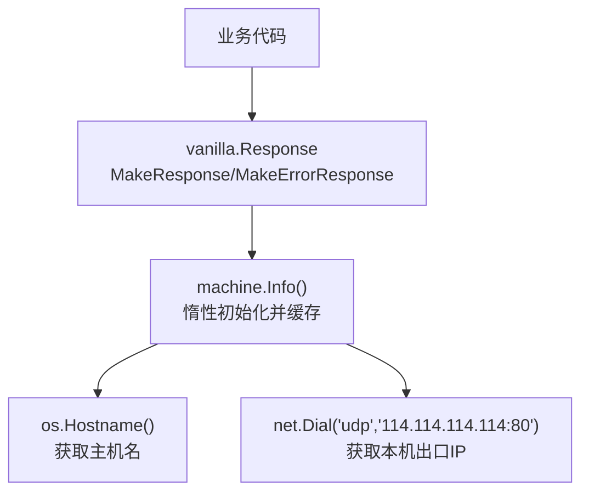
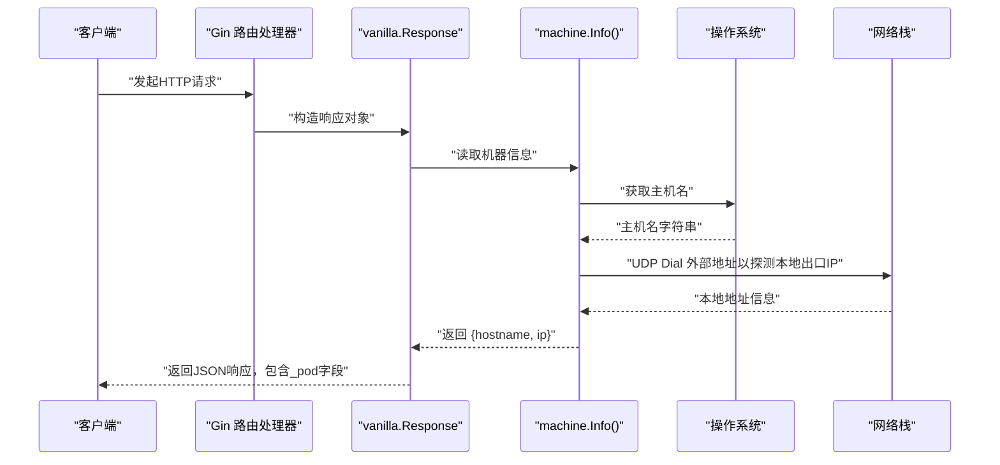
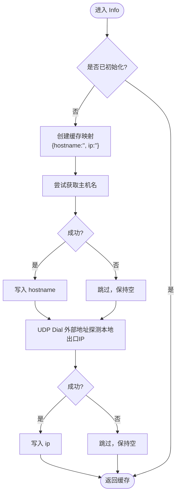
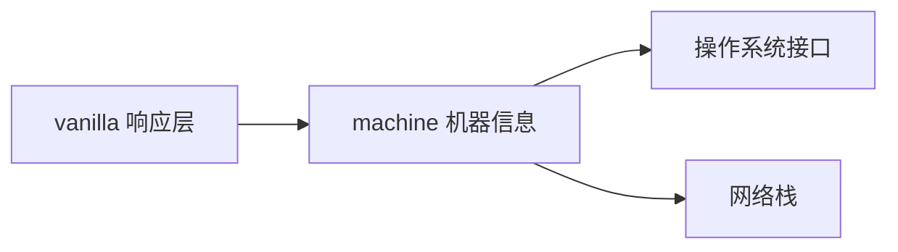

# 机器信息获取

<cite>
**本文引用的文件**
- [machine/machine.go](file://machine/machine.go)
- [vanilla/response.go](file://vanilla/response.go)
- [ARCHITECTURE.md](file://ARCHITECTURE.md)
- [README.md](file://README.md)
</cite>

## 目录
1. [简介](#简介)
2. [项目结构](#项目结构)
3. [核心组件](#核心组件)
4. [架构总览](#架构总览)
5. [详细组件分析](#详细组件分析)
6. [依赖关系分析](#依赖关系分析)
7. [性能考量](#性能考量)
8. [故障排查指南](#故障排查指南)
9. [结论](#结论)
10. [附录：使用示例与最佳实践](#附录使用示例与最佳实践)

## 简介
本技术文档聚焦于“机器信息获取”能力，说明如何从操作系统中获取主机名、本机出口 IP 等系统信息，并解释其在框架中的集成方式。当前实现通过惰性初始化缓存一次结果，并在统一响应结构中自动注入机器信息字段，便于在分布式环境中追踪请求来源节点。

## 项目结构
- machine 包提供机器信息的获取与缓存逻辑。
- vanilla 包的统一响应结构在构造时自动调用 machine.Info()，将机器信息注入到响应的 _pod 字段。
- 架构文档明确了 machine 包作为叶子模块的职责边界：主机信息（hostname/ip → response _pod 字段）。



图表来源
- [vanilla/response.go:23-53](file://vanilla/response.go#L23-L53)
- [machine/machine.go:16-33](file://machine/machine.go#L16-L33)

章节来源
- [ARCHITECTURE.md:12-34](file://ARCHITECTURE.md#L12-L34)
- [README.md:1-18](file://README.md#L1-L18)

## 核心组件
- 机器信息提供者：machine.Info()
  - 职责：返回包含 hostname 和 ip 的 map，惰性初始化且线程安全。
  - 行为：首次调用时尝试获取主机名和本机出口 IP，后续直接返回缓存结果。
- 统一响应注入：vanilla.Response
  - 字段：_pod（MachineInfo）用于承载机器信息。
  - 行为：所有 Make* 响应构造函数都会自动填充 MachineInfo。

章节来源
- [machine/machine.go:9-33](file://machine/machine.go#L9-L33)
- [vanilla/response.go:13-53](file://vanilla/response.go#L13-L53)

## 架构总览
机器信息获取是轻量级、无状态的基础设施能力，被统一响应层消费。其设计要点如下：
- 惰性初始化：避免启动期阻塞或失败影响服务启动。
- 线程安全：使用同步原语保证并发安全。
- 最小依赖：仅依赖标准库 os/net，不引入第三方依赖。
- 可观测性：通过响应中的 _pod 字段，便于日志与链路追踪定位具体节点。



图表来源
- [vanilla/response.go:23-53](file://vanilla/response.go#L23-L53)
- [machine/machine.go:16-33](file://machine/machine.go#L16-L33)

## 详细组件分析

### 机器信息提供者（machine.Info）
- 功能概述
  - 返回包含 hostname 与 ip 的映射。
  - 首次调用时进行初始化，后续直接返回缓存。
- 关键实现要点
  - 主机名：通过系统接口获取，若失败则保留空值。
  - 本机出口 IP：通过 UDP 连接外部地址（不实际发包），利用本地地址推断本机对外网出口的 IP。
  - 线程安全：使用一次性初始化机制确保只执行一次。
- 复杂度与性能
  - 时间复杂度：首次调用涉及系统调用与一次 UDP 探测；后续为 O(1)。
  - 空间复杂度：常量级缓存。
- 错误处理与降级
  - 主机名获取失败：忽略错误，保持空字符串。
  - 网络探测失败：忽略错误，保持空字符串。
  - 整体策略：尽量不影响主流程，失败时返回部分可用信息。



图表来源
- [machine/machine.go:16-33](file://machine/machine.go#L16-L33)

章节来源
- [machine/machine.go:9-33](file://machine/machine.go#L9-L33)

### 统一响应注入（vanilla.Response）
- 功能概述
  - 所有响应构造函数自动填充 MachineInfo 到 _pod 字段。
  - 便于在日志、监控、链路追踪中识别请求来源节点。
- 关键实现要点
  - 构造函数：MakeResponse、MakeResponseWithCode、MakeErrorResponse。
  - 字段：_pod（MachineInfo）类型为通用映射。
- 使用建议
  - 无需业务代码手动注入，统一由框架层完成。
  - 如需扩展机器信息，可在 machine 包内扩展返回结构。

```mermaid
classDiagram
class Response {
+int32 Code
+interface{} Data
+string ErrCode
+string ErrMsg
+string InnerErrMsg
+map[string]interface{} MachineInfo
}
class Machine {
+Info() map[string]interface{}
}
Response --> Machine : "构造时调用"
```

图表来源
- [vanilla/response.go:13-53](file://vanilla/response.go#L13-L53)
- [machine/machine.go:16-33](file://machine/machine.go#L16-L33)

章节来源
- [vanilla/response.go:13-53](file://vanilla/response.go#L13-L53)

## 依赖关系分析
- 模块耦合
  - vanilla 依赖 machine 以注入机器信息。
  - machine 仅依赖标准库 os/net，无内部依赖。
- 外部依赖
  - 无第三方依赖，降低部署与维护成本。
- 潜在风险
  - 网络探测依赖外部可达性；在受限网络环境下可能无法获取 IP。
  - 主机名在某些容器化环境可能被设置为默认值或为空。



图表来源
- [ARCHITECTURE.md:12-34](file://ARCHITECTURE.md#L12-L34)
- [machine/machine.go:3-7](file://machine/machine.go#L3-L7)
- [vanilla/response.go:3-5](file://vanilla/response.go#L3-L5)

章节来源
- [ARCHITECTURE.md:12-34](file://ARCHITECTURE.md#L12-L34)

## 性能考量
- 惰性初始化：仅在首次访问时执行系统调用与网络探测，避免启动开销。
- 线程安全：一次性初始化保证并发安全，避免重复计算。
- 资源占用：极低，仅维护一个小型映射缓存。
- 网络探测：采用 UDP 方式，不建立真实连接，开销小；但受限于网络可达性与防火墙策略。

[本节为通用性能讨论，不直接分析具体文件]

## 故障排查指南
- 现象：响应中 _pod.ip 为空
  - 可能原因：网络不可达、防火墙拦截、容器网络配置异常。
  - 排查步骤：
    - 检查容器/主机是否能访问外部地址。
    - 检查出站规则与 DNS 解析。
    - 在目标环境执行相同探测逻辑验证连通性。
- 现象：响应中 _pod.hostname 为空
  - 可能原因：系统未设置主机名、容器镜像未配置 hostname。
  - 排查步骤：
    - 在运行环境查看系统主机名配置。
    - 在容器编排平台确认 hostname 注入策略。
- 降级策略
  - 即使失败，响应仍会返回，只是对应字段为空；不影响主业务流程。

章节来源
- [machine/machine.go:16-33](file://machine/machine.go#L16-L33)
- [vanilla/response.go:23-53](file://vanilla/response.go#L23-L53)

## 结论
当前机器信息获取实现简洁、稳定、低耦合，满足大多数场景下的节点标识需求。通过统一响应注入，便于在分布式系统中进行问题定位与追踪。对于更复杂的网络拓扑与多网卡场景，可在现有基础上扩展枚举与选择策略。

[本节为总结性内容，不直接分析具体文件]

## 附录：使用示例与最佳实践

- 如何在业务中消费机器信息
  - 通过统一响应构造函数返回的数据中包含 _pod 字段，可直接在日志或前端展示。
  - 参考路径：[vanilla/response.go:23-53](file://vanilla/response.go#L23-L53)

- 如何自定义机器信息
  - 扩展 machine.Info 的返回映射，增加更多系统指标（如 CPU、内存、磁盘等）。
  - 注意保持惰性初始化与线程安全。
  - 参考路径：[machine/machine.go:16-33](file://machine/machine.go#L16-L33)

- 跨平台兼容性注意事项
  - 主机名：不同操作系统对主机名的设置与可见性存在差异，建议在容器化环境中显式配置。
  - 本机出口 IP：UDP 探测方法在多数平台有效，但在严格网络策略下可能失败；可考虑备选方案（如遍历网卡与子网掩码判断）。
  - 参考路径：[machine/machine.go:22-31](file://machine/machine.go#L22-L31)

- 网络接口枚举与 IP 选择策略（建议）
  - 枚举所有网络接口，过滤回环与 down 状态接口。
  - 优先选择非私有网段（公网）地址；若无公网地址，再选择内网地址。
  - 支持 IPv4/IPv6 双栈，按配置或环境选择首选协议。
  - 该策略可作为未来增强方向，当前实现以 UDP 探测为主。

- 异常处理与降级策略（最佳实践）
  - 任何系统调用失败均应记录日志并继续返回可用信息。
  - 在网络不可用或权限不足时，保持响应正常返回，仅相关字段为空。
  - 参考路径：[machine/machine.go:22-31](file://machine/machine.go#L22-L31)

- 机器标识生成规则（分布式唯一性）
  - 当前 _pod 字段提供 hostname 与 ip，可用于基础节点标识。
  - 若需全局唯一 ID，可结合 snowflake 等分布式 ID 生成器，并与 _pod 一起上报。
  - 参考路径：[ARCHITECTURE.md:29-33](file://ARCHITECTURE.md#L29-L33)

章节来源
- [machine/machine.go:16-33](file://machine/machine.go#L16-L33)
- [vanilla/response.go:23-53](file://vanilla/response.go#L23-L53)
- [ARCHITECTURE.md:29-33](file://ARCHITECTURE.md#L29-L33)