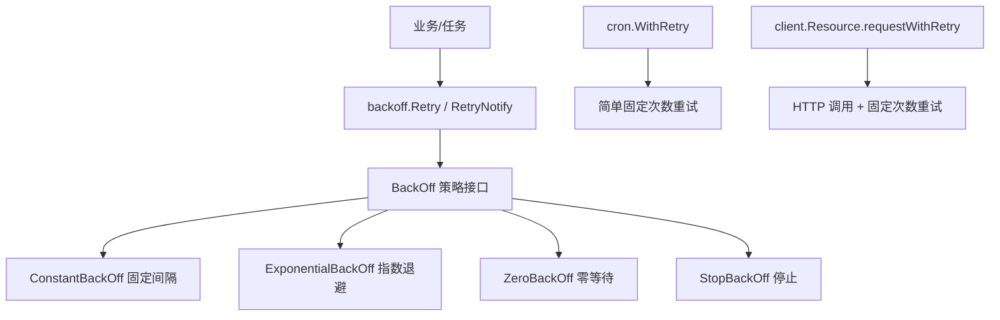
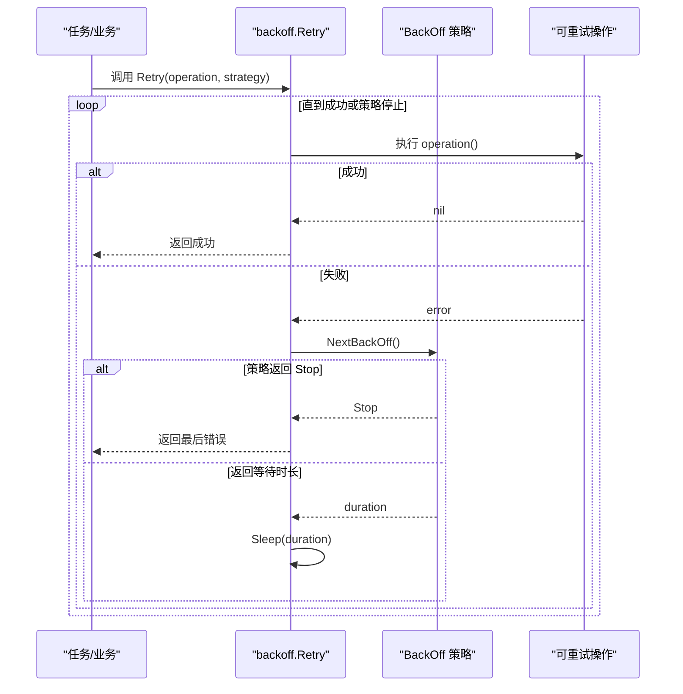
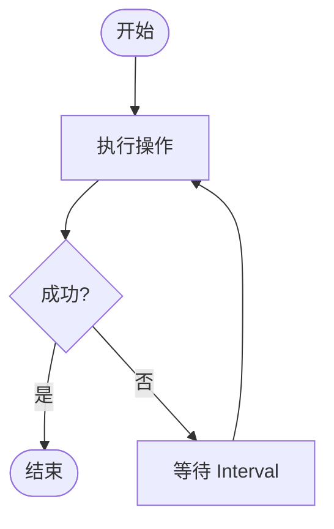
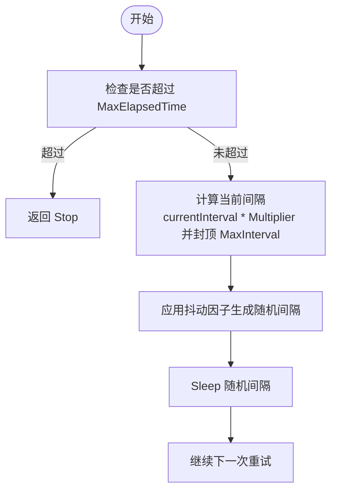
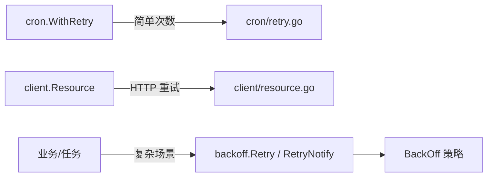

# 重试退避算法

<cite>
**本文引用的文件**
- [backoff.go](file://backoff/backoff.go)
- [backoff_test.go](file://backoff/backoff_test.go)
- [retry.go](file://cron/retry.go)
- [resource.go](file://client/resource.go)
- [README.md](file://README.md)
- [ARCHITECTURE.md](file://ARCHITECTURE.md)
</cite>

## 目录
1. [简介](#简介)
2. [项目结构](#项目结构)
3. [核心组件](#核心组件)
4. [架构总览](#架构总览)
5. [详细组件分析](#详细组件分析)
6. [依赖关系分析](#依赖关系分析)
7. [性能与可观测性](#性能与可观测性)
8. [故障排查指南](#故障排查指南)
9. [结论](#结论)
10. [附录：配置与使用示例（路径引用）](#附录配置与使用示例路径引用)

## 简介
本技术文档围绕仓库中的“重试退避算法”实现，系统讲解固定间隔退避、指数退避与随机抖动策略的设计与用法，覆盖参数配置（最大重试次数、初始延迟、最大延迟、抖动因子）、适用场景（网络请求、数据库操作、外部服务调用），以及错误处理、超时控制与性能监控的最佳实践。同时提供基于仓库现有代码的完整使用路径指引，帮助读者快速落地到实际业务中。

## 项目结构
- backoff 包提供通用的重试退避策略与重试执行器，包含零等待、停止、固定间隔、指数退避等策略，以及统一的重试循环与通知回调。
- cron 包提供简单的重试策略模型与带重试的执行函数，适用于定时任务或批处理场景。
- client 包在服务间 HTTP 调用中内置了固定次数的重试逻辑，可作为外部服务调用的参考。
- README 与 ARCHITECTURE 提供了整体框架定位与模块职责说明，便于理解 backoff 在系统中的位置。

图表来源
- [backoff.go:10-179](file://backoff/backoff.go#L10-L179)
- [retry.go:8-33](file://cron/retry.go#L8-L33)
- [resource.go:113-126](file://client/resource.go#L113-L126)

章节来源
- [backoff.go:1-179](file://backoff/backoff.go#L1-L179)
- [retry.go:1-34](file://cron/retry.go#L1-L34)
- [resource.go:1-225](file://client/resource.go#L1-L225)
- [README.md:1-154](file://README.md#L1-L154)
- [ARCHITECTURE.md:1-122](file://ARCHITECTURE.md#L1-L122)

## 核心组件
- BackOff 接口：定义 NextBackOff 与 Reset，用于计算下次重试等待时长并支持重置状态。
- 策略实现：
  - ZeroBackOff：立即重试（等待时间为 0）。
  - StopBackOff：永不重试（返回 Stop 表示终止）。
  - ConstantBackOff：固定间隔重试。
  - ExponentialBackOff：指数退避 + 随机抖动，支持最大间隔与最大总耗时限制。
- 重试执行器：
  - Retry：按策略循环执行操作，直到成功或策略停止。
  - RetryNotify：同 Retry，但每次失败时回调通知（可用于日志、指标上报）。
- Cron 重试：
  - RetryPolicy：包含最大重试次数与间隔（毫秒）。
  - WithRetry：按策略执行函数，具备基础重试能力。
- 客户端重试：
  - Resource.requestWithRetry：对 HTTP 调用进行固定次数重试，支持禁用重试。

章节来源
- [backoff.go:10-179](file://backoff/backoff.go#L10-L179)
- [retry.go:8-33](file://cron/retry.go#L8-L33)
- [resource.go:71-126](file://client/resource.go#L71-L126)

## 架构总览
backoff 作为通用重试机制被上层复用：
- 定时任务通过 cron.WithRetry 进行简单重试。
- 服务间调用通过 client.Resource 自带重试逻辑完成 HTTP 请求。
- 更复杂的场景可直接使用 backoff.Retry/RetryNotify 配合不同 BackOff 策略。

图表来源
- [backoff.go:144-179](file://backoff/backoff.go#L144-L179)

章节来源
- [backoff.go:144-179](file://backoff/backoff.go#L144-L179)

## 详细组件分析

### 固定间隔退避（ConstantBackOff）
- 行为：每次重试前等待固定时长。
- 适用场景：对延迟敏感且目标服务稳定的短重试；批量任务中需要均匀节奏的重试。
- 配置要点：Interval 决定重试频率；结合 Retry 或 RetryNotify 使用。
- 复杂度：O(1) 每次 NextBackOff。
- 线程安全：该实现为无状态，NextBackOff 不修改内部状态，适合并发使用。

图表来源
- [backoff.go:33-44](file://backoff/backoff.go#L33-L44)
- [backoff.go:147-161](file://backoff/backoff.go#L147-L161)

章节来源
- [backoff.go:33-44](file://backoff/backoff.go#L33-L44)
- [backoff.go:147-161](file://backoff/backoff.go#L147-L161)

### 指数退避 + 随机抖动（ExponentialBackOff）
- 行为：每次重试间隔按倍数增长，并在区间内加入随机抖动，避免雪崩与惊群。
- 关键参数：
  - InitialInterval：初始等待时间。
  - Multiplier：增长倍数。
  - MaxInterval：单次等待的最大上限。
  - RandomizationFactor：抖动因子，范围 [1 - factor, 1 + factor]。
  - MaxElapsedTime：总耗时上限，超过后返回 Stop。
  - Clock：时间源，便于测试替换。
- 计算公式：randomized interval = currentInterval ± (RandomizationFactor × currentInterval)，并受 MaxInterval 封顶。
- 复杂度：每次 NextBackOff O(1)。
- 线程安全：实现非线程安全，需每 goroutine 独立实例或在调用处加锁。

图表来源
- [backoff.go:56-95](file://backoff/backoff.go#L56-L95)
- [backoff.go:112-142](file://backoff/backoff.go#L112-L142)

章节来源
- [backoff.go:56-95](file://backoff/backoff.go#L56-L95)
- [backoff.go:112-142](file://backoff/backoff.go#L112-L142)

### 零等待与停止策略（ZeroBackOff / StopBackOff）
- ZeroBackOff：NextBackOff 返回 0，立即重试，适合极快幂等操作或本地缓存刷新。
- StopBackOff：NextBackOff 返回 Stop，直接终止重试，适合一次性尝试或已明确不可恢复的错误。

章节来源
- [backoff.go:21-31](file://backoff/backoff.go#L21-L31)

### Cron 重试（RetryPolicy / WithRetry）
- RetryPolicy：包含 MaxRetries 与 IntervalMs，用于简单固定次数重试。
- WithRetry：最多执行 MaxRetries+1 次，失败则继续，直到成功或达到上限。
- 注意：当前实现未包含 sleep 逻辑，仅做次数控制；如需退避，建议改用 backoff 包。

章节来源
- [retry.go:8-33](file://cron/retry.go#L8-L33)

### 客户端重试（Resource.requestWithRetry）
- 行为：默认最多重试 3 次，可通过 DisableRetry 关闭。
- 适用场景：服务间 HTTP 调用，结合 JWT 透传与 tracing。
- 超时控制：HTTP Client 设置连接与读写超时，避免长时间阻塞。

章节来源
- [resource.go:21-23](file://client/resource.go#L21-L23)
- [resource.go:87-126](file://client/resource.go#L87-L126)
- [resource.go:151-165](file://client/resource.go#L151-L165)

## 依赖关系分析
- backoff 包为叶子包，不依赖其他内部包，便于广泛复用。
- cron 与 client 分别实现了各自的重试策略，可与 backoff 互补：
  - cron 侧重简单次数控制。
  - client 侧重 HTTP 调用上下文与传输层重试。
  - backoff 提供通用策略与执行器，适合复杂场景。

图表来源
- [retry.go:20-33](file://cron/retry.go#L20-L33)
- [resource.go:113-126](file://client/resource.go#L113-L126)
- [backoff.go:144-179](file://backoff/backoff.go#L144-L179)

章节来源
- [retry.go:20-33](file://cron/retry.go#L20-L33)
- [resource.go:113-126](file://client/resource.go#L113-L126)
- [backoff.go:144-179](file://backoff/backoff.go#L144-L179)

## 性能与可观测性
- 指数退避的优势：
  - 降低瞬时压力，避免雪崩。
  - 随机抖动分散重试峰值，提升整体稳定性。
- 监控建议：
  - 使用 RetryNotify 回调记录每次失败与下次等待时长，便于统计重试次数与延迟分布。
  - 结合 metrics 与 tracing 上报重试事件与耗时。
- 超时控制：
  - 为每个操作设置合理超时，避免重试放大阻塞。
  - 对于 HTTP 调用，确保 Client 超时与连接池参数合理。
- 线程安全：
  - ExponentialBackOff 非线程安全，请在并发场景中为每个 goroutine 创建独立实例。

章节来源
- [backoff.go:56-95](file://backoff/backoff.go#L56-L95)
- [backoff.go:163-179](file://backoff/backoff.go#L163-L179)
- [resource.go:151-165](file://client/resource.go#L151-L165)

## 故障排查指南
- 现象：重试次数过多导致资源耗尽
  - 检查 MaxElapsedTime 是否设置合理，避免无限重试。
  - 调整 MaxInterval 与 Multiplier，控制增长速率。
- 现象：抖动不足导致拥塞
  - 增大 RandomizationFactor，增加随机性。
- 现象：重试无效
  - 确认操作是否为幂等；非幂等操作需谨慎重试。
  - 检查错误类型，区分可重试与不可重试错误。
- 现象：客户端调用卡住
  - 检查 HTTP Client 超时设置与连接池参数。
  - 确认网络与远端服务健康状态。

章节来源
- [backoff.go:56-95](file://backoff/backoff.go#L56-L95)
- [backoff.go:112-142](file://backoff/backoff.go#L112-L142)
- [resource.go:151-165](file://client/resource.go#L151-L165)

## 结论
- backoff 包提供了完善的重试退避策略与执行器，适用于多种场景。
- 指数退避 + 随机抖动是推荐默认策略，能有效缓解瞬时压力与雪崩。
- 对于简单场景可使用 cron.WithRetry；对于 HTTP 调用可使用 client.Resource 的重试能力。
- 建议结合 RetryNotify 与可观测性工具，持续优化重试参数与监控告警。

## 附录：配置与使用示例（路径引用）
- 固定间隔重试
  - 策略创建与使用：[backoff.go:33-44](file://backoff/backoff.go#L33-L44), [backoff.go:147-161](file://backoff/backoff.go#L147-L161)
  - 单元测试参考：[backoff_test.go:9-15](file://backoff/backoff_test.go#L9-L15)
- 指数退避 + 随机抖动
  - 策略参数与默认值：[backoff.go:56-95](file://backoff/backoff.go#L56-L95)
  - 计算与递增逻辑：[backoff.go:112-142](file://backoff/backoff.go#L112-L142)
  - 单元测试参考：[backoff_test.go:29-48](file://backoff/backoff_test.go#L29-L48)
- 零等待与停止策略
  - 实现与行为：[backoff.go:21-31](file://backoff/backoff.go#L21-L31)
  - 单元测试参考：[backoff_test.go:17-27](file://backoff/backoff_test.go#L17-L27)
- Cron 重试
  - 策略与执行：[retry.go:8-33](file://cron/retry.go#L8-L33)
- 客户端重试
  - 重试逻辑与超时：[resource.go:113-126](file://client/resource.go#L113-L126), [resource.go:151-165](file://client/resource.go#L151-L165)
- 通知回调（指标/日志）
  - RetryNotify 使用：[backoff.go:163-179](file://backoff/backoff.go#L163-L179)

章节来源
- [backoff.go:21-179](file://backoff/backoff.go#L21-L179)
- [backoff_test.go:9-48](file://backoff/backoff_test.go#L9-L48)
- [retry.go:8-33](file://cron/retry.go#L8-L33)
- [resource.go:113-165](file://client/resource.go#L113-L165)