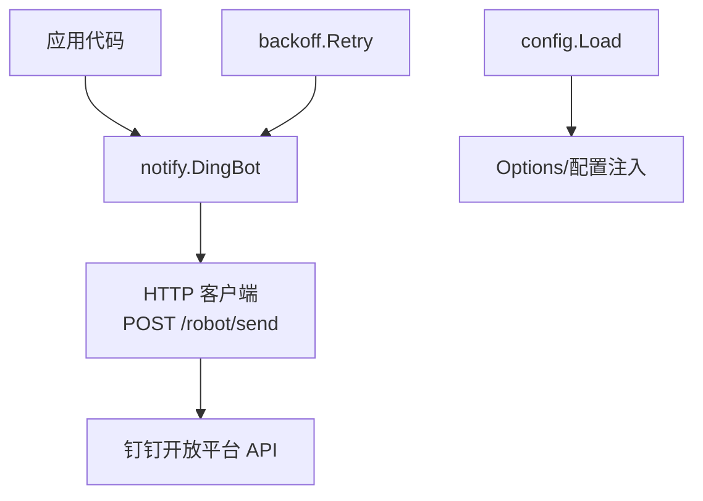
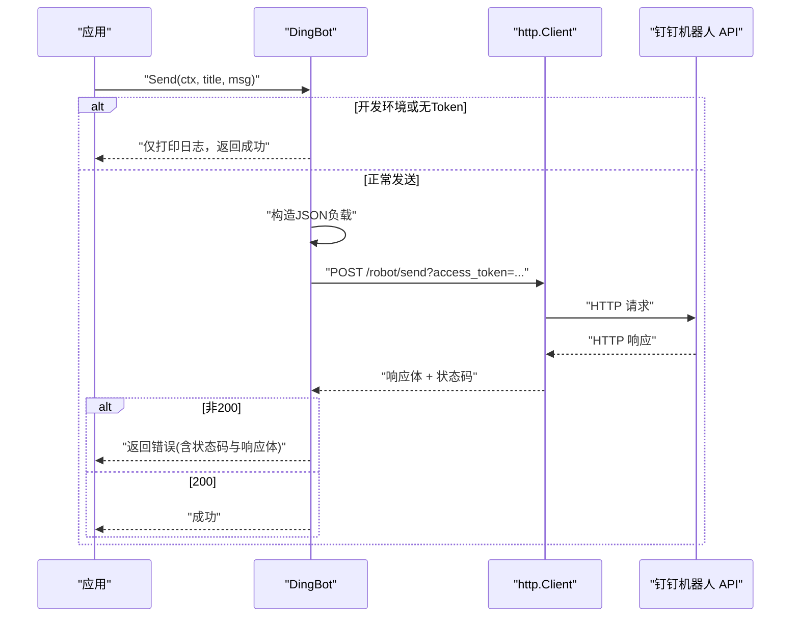
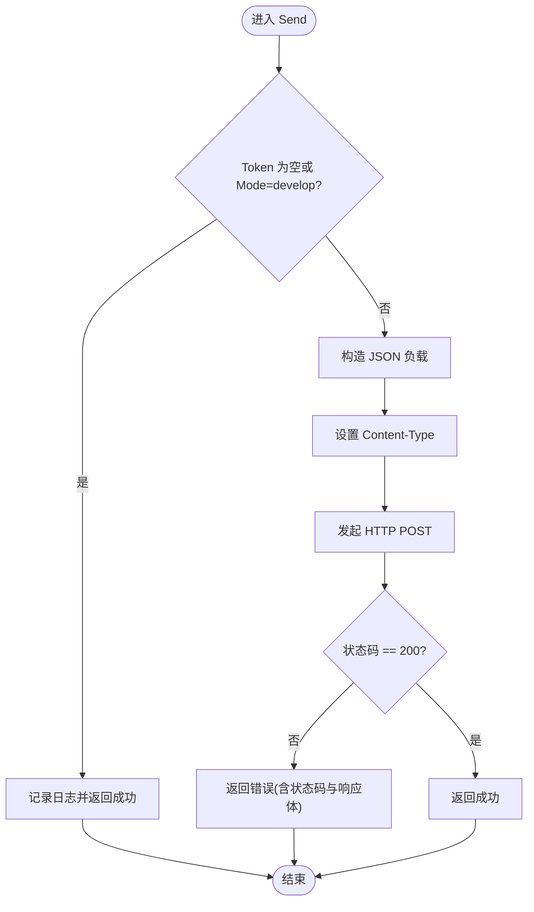
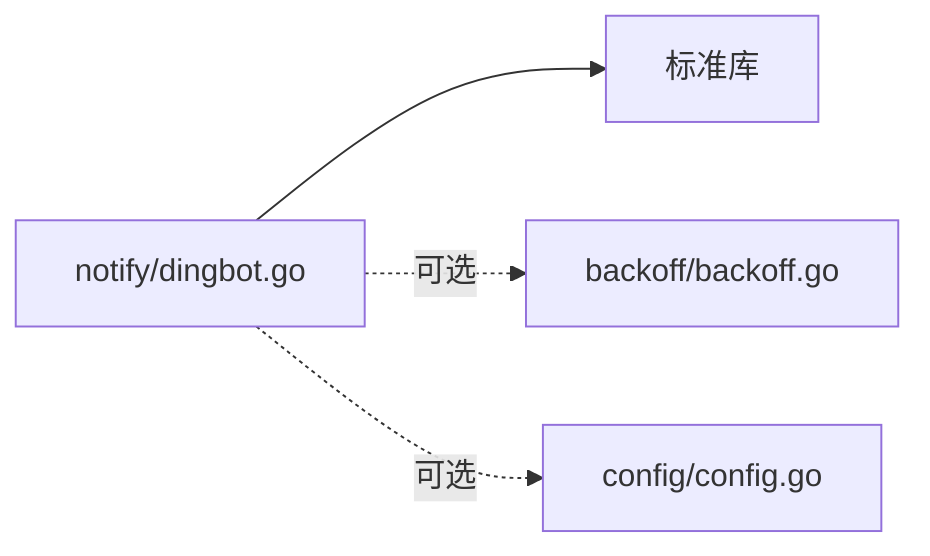

# 钉钉机器人通知

<cite>
**本文引用的文件**
- [notify/dingbot.go](file://notify/dingbot.go)
- [config/config.go](file://config/config.go)
- [config/types.go](file://config/types.go)
- [backoff/backoff.go](file://backoff/backoff.go)
- [ARCHITECTURE.md](file://ARCHITECTURE.md)
- [README.md](file://README.md)
</cite>

## 目录
1. [简介](#简介)
2. [项目结构](#项目结构)
3. [核心组件](#核心组件)
4. [架构总览](#架构总览)
5. [详细组件分析](#详细组件分析)
6. [依赖关系分析](#依赖关系分析)
7. [性能与可靠性](#性能与可靠性)
8. [故障排查指南](#故障排查指南)
9. [结论](#结论)
10. [附录：配置与使用示例路径](#附录配置与使用示例路径)

## 简介
本技术文档围绕仓库中的“钉钉机器人通知”能力，系统性说明其集成方式、消息协议、安全配置、错误处理与重试机制，并提供可落地的最佳实践。该能力以 HTTP Webhook 形式向钉钉机器人发送 Markdown 消息，支持多环境模式（开发/测试/生产）与超时控制，便于在告警、运维与业务通知场景中使用。

## 项目结构
- notify 包提供钉钉机器人客户端，封装了创建、构造请求、发送与响应校验等逻辑。
- config 包提供统一的配置加载机制（基于 viper），支持环境变量覆盖与环境配置文件合并。
- backoff 包提供多种重试退避策略，可用于对通知发送进行重试增强。
- ARCHITECTURE.md 描述了模块职责与依赖方向，notify 为叶子包，不依赖框架内部其他包。

图表来源
- [notify/dingbot.go:16-112](file://notify/dingbot.go#L16-L112)
- [config/config.go:21-59](file://config/config.go#L21-L59)
- [backoff/backoff.go:144-180](file://backoff/backoff.go#L144-L180)

章节来源
- [ARCHITECTURE.md:12-45](file://ARCHITECTURE.md#L12-L45)
- [README.md:17-18](file://README.md#L17-L18)

## 核心组件
- DingBot：钉钉机器人客户端，负责构建并发送 Markdown 消息，支持自定义 API 地址、超时、运行环境与平台标识。
- Options：配置项集合，包含 Token、BotName、Mode、PlatformName、APIURL、Timeout。
- 发送流程：根据 Mode 与 Token 决定是否实际发送；构造 JSON 负载；设置 Content-Type；发起 POST；校验状态码。

章节来源
- [notify/dingbot.go:18-53](file://notify/dingbot.go#L18-L53)
- [notify/dingbot.go:67-112](file://notify/dingbot.go#L67-L112)

## 架构总览
下图展示了从应用调用到钉钉 API 的完整时序，包括上下文传递、JSON 序列化、HTTP 请求与响应处理。

图表来源
- [notify/dingbot.go:67-112](file://notify/dingbot.go#L67-L112)

## 详细组件分析

### 钉钉机器人集成与 Webhook URL
- Webhook 地址：默认使用官方地址，可通过 Options.APIURL 自定义。
- 访问令牌：通过 access_token 查询参数传入，由 Options.Token 提供。
- 请求方法：HTTP POST，Content-Type 为 application/json。
- 超时控制：http.Client 使用 Options.Timeout 作为请求超时，默认 5 秒。

章节来源
- [notify/dingbot.go:16-53](file://notify/dingbot.go#L16-L53)
- [notify/dingbot.go:80-101](file://notify/dingbot.go#L80-L101)

### 消息类型与内容格式
- 当前实现的消息类型：Markdown 消息。
- 消息体字段：
  - msgtype：固定为 markdown
  - markdown.title：标题
  - markdown.text：正文，自动附加平台名称、环境名与标题信息
- 富文本与链接：Markdown 语法由钉钉侧渲染，可在 text 中按钉钉 Markdown 规范编写链接、@提及等。
- @提及：如需 @特定用户或部门，请在 text 中按钉钉 Markdown 的 @ 语法书写（例如 @手机号 或 @部门ID）。

章节来源
- [notify/dingbot.go:67-88](file://notify/dingbot.go#L67-L88)

### 安全配置选项
- Token 与 Mode：当 Token 为空或 Mode 为 develop 时，仅打印日志而不发送，避免误发。
- 自定义 APIURL：支持内网代理或企业自建网关场景。
- 超时：防止阻塞上游服务。
- 注意：当前实现未内置签名验证与 IP 白名单校验，建议在网关层或前置代理完成这些安全控制。

章节来源
- [notify/dingbot.go:18-53](file://notify/dingbot.go#L18-L53)
- [notify/dingbot.go:73-78](file://notify/dingbot.go#L73-L78)

### 错误处理与重试机制
- 错误分类：
  - 序列化失败：返回错误
  - 请求构建失败：返回错误
  - 网络异常：返回错误
  - 非 200 响应：返回错误并附带状态码与响应体
- 重试建议：结合 backoff 包的指数退避策略，对 Send 调用进行重试，避免瞬时抖动导致的通知丢失。
- 监控告警：可对失败次数、耗时、状态码分布进行埋点统计，结合 Prometheus 指标体系进行告警。

章节来源
- [notify/dingbot.go:90-112](file://notify/dingbot.go#L90-L112)
- [backoff/backoff.go:144-180](file://backoff/backoff.go#L144-L180)

### 发送流程图（算法级）

图表来源
- [notify/dingbot.go:73-112](file://notify/dingbot.go#L73-L112)

## 依赖关系分析
- notify 包为叶子包，不依赖框架内部其他包，耦合度低，易于复用。
- 外部依赖：标准库 net/http、encoding/json、context、time 等。
- 可选依赖：backoff 用于重试增强；config 用于统一配置加载。

图表来源
- [notify/dingbot.go:5-14](file://notify/dingbot.go#L5-L14)
- [backoff/backoff.go:1-180](file://backoff/backoff.go#L1-L180)
- [config/config.go:1-61](file://config/config.go#L1-L61)

章节来源
- [ARCHITECTURE.md:36-45](file://ARCHITECTURE.md#L36-L45)

## 性能与可靠性
- 连接与超时：每个 DingBot 实例持有独立 http.Client，使用配置的 Timeout 控制请求超时，避免长连接堆积。
- 并发安全：DingBot 本身无共享可变状态，适合并发调用。
- 重试策略：建议使用指数退避（ExponentialBackOff），初始间隔、最大间隔、最大耗时可按需调整，减少雪崩风险。
- 限流与背压：在高并发场景下，结合队列或速率限制器控制发送频率，避免触发钉钉侧限流。
- 可观测性：记录发送耗时、成功/失败率、状态码分布，接入 metrics 与 tracing。

[本节为通用指导，无需具体文件引用]

## 故障排查指南
- 无法发送：
  - 检查 Token 是否为空或 Mode 是否为 develop（此时仅打印日志）
  - 确认 APIURL 是否可达（内网代理或防火墙）
  - 查看返回的状态码与响应体，定位钉钉侧错误
- 频繁失败：
  - 启用重试（指数退避），观察是否因瞬时抖动导致
  - 检查网络质量与 DNS 解析
- 告警风暴：
  - 增加去抖与聚合策略，避免短时间内重复告警
  - 结合业务维度（如服务名、环境）进行分组

章节来源
- [notify/dingbot.go:73-112](file://notify/dingbot.go#L73-L112)
- [backoff/backoff.go:144-180](file://backoff/backoff.go#L144-L180)

## 结论
该实现提供了轻量、可靠的钉钉机器人通知能力，适用于告警与运维通知场景。通过 Options 灵活配置，结合 backoff 重试与可观测性手段，可满足大多数生产需求。对于更复杂的安全与消息类型需求，可在网关层扩展或在业务层封装更多消息类型。

[本节为总结，无需具体文件引用]

## 附录：配置与使用示例路径
- 配置加载入口与顺序：
  - [config/config.go:21-59](file://config/config.go#L21-L59)
- 钉钉机器人客户端初始化与发送：
  - [notify/dingbot.go:41-53](file://notify/dingbot.go#L41-L53)
  - [notify/dingbot.go:67-112](file://notify/dingbot.go#L67-L112)
- 重试策略（指数退避）：
  - [backoff/backoff.go:74-95](file://backoff/backoff.go#L74-L95)
  - [backoff/backoff.go:144-180](file://backoff/backoff.go#L144-L180)
- 模块职责与依赖方向（参考）：
  - [ARCHITECTURE.md:12-45](file://ARCHITECTURE.md#L12-L45)
- 快速开始与特性概览（参考）：
  - [README.md:17-18](file://README.md#L17-L18)