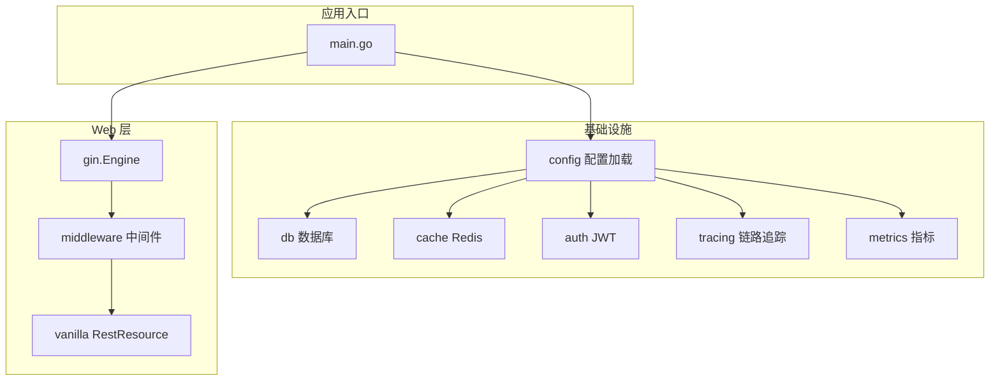
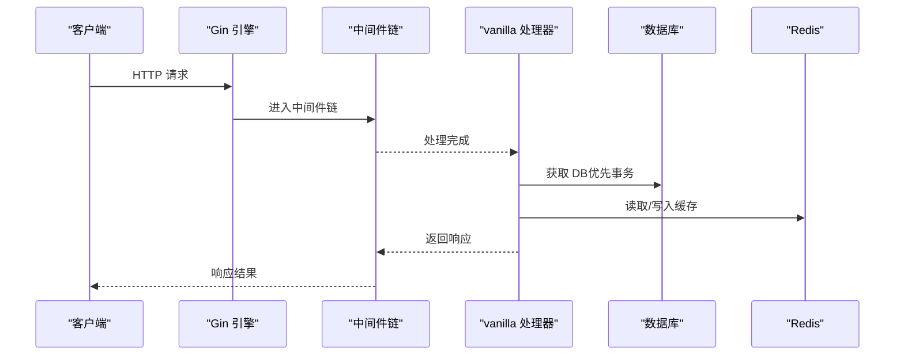
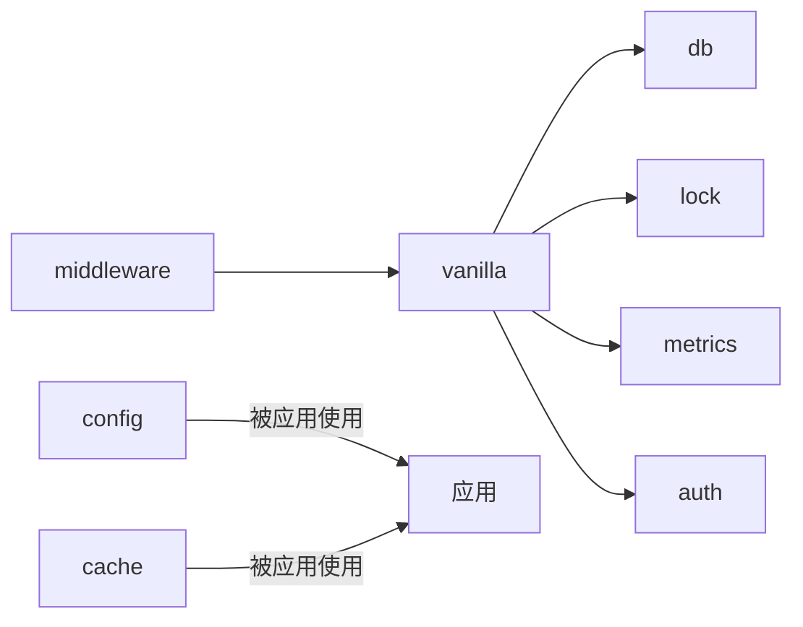

# 快速开始

<cite>
**本文引用的文件**
- [README.md](file://README.md)
- [ARCHITECTURE.md](file://ARCHITECTURE.md)
- [config/config.go](file://config/config.go)
- [config/types.go](file://config/types.go)
- [db/db.go](file://db/db.go)
- [cache/redis.go](file://cache/redis.go)
- [middleware/register.go](file://middleware/register.go)
- [vanilla/rest_resource.go](file://vanilla/rest_resource.go)
- [vanilla/router.go](file://vanilla/router.go)
</cite>

## 目录
1. [简介](#简介)
2. [项目结构](#项目结构)
3. [核心组件](#核心组件)
4. [架构总览](#架构总览)
5. [详细组件分析](#详细组件分析)
6. [依赖关系分析](#依赖关系分析)
7. [性能注意事项](#性能注意事项)
8. [故障排查指南](#故障排查指南)
9. [结论](#结论)
10. [附录](#附录)

## 简介
本指南面向首次使用 Carina 框架的开发者，目标是在最短时间内搭建一个可用的微服务应用。内容涵盖：
- 完整的初始化流程：配置加载、数据库连接初始化、Redis 缓存设置、Gin 引擎创建与中间件注册
- 每个步骤的配置选项与最佳实践
- 完整 main.go 示例（以仓库 README 为准）
- 常见配置场景与环境变量设置
- 故障排查指南，帮助解决常见的初始化问题

Carina 是基于 Gin + GORM 的微服务基础框架，提供声明式参数校验、约定式路由、统一响应格式、事务生命周期、分布式锁、Filter 查询协议、JWT 认证、可观测性（Prometheus metrics + OpenTelemetry tracing）等能力。

**章节来源**
- [README.md:1-18](file://README.md#L1-L18)

## 项目结构
Carina 采用模块化设计，按职责划分包：
- vanilla：核心契约层（RestResource、路由、参数校验、响应、错误、分页、Filter、BusinessContext 契约）
- middleware：Gin 中间件集与一站式挂载
- db：GORM 封装（驱动无关 Init、事务传播、ApplyFilters）
- cache：go-redis 封装（常用操作 + 前缀清理）
- lock：分布式锁（ILock 接口 + RedisLock/DummyLock）
- auth：JWT 编解码
- config：viper 加载器 + Base 通用配置基座
- cron：定时任务封装（事务、Recovery、重试策略）
- client：服务间调用（JWT 透传 + 重试 + tracing）
- ws：WebSocket REST Proxy
- tracing：OpenTelemetry 初始化
- metrics：Prometheus 指标定义
- snowflake：分布式 ID 生成
- notify：钉钉机器人告警
- lru：带 TTL 的内存 LRU 缓存
- backoff：重试退避算法
- machine：主机信息

**图表来源**
- [ARCHITECTURE.md:12-45](file://ARCHITECTURE.md#L12-L45)

**章节来源**
- [ARCHITECTURE.md:12-45](file://ARCHITECTURE.md#L12-L45)

## 核心组件
- 配置加载：通过 viper 实现，支持环境变量覆盖、环境配置文件合并、敏感字段绑定
- 数据库：基于 GORM，驱动无关，提供全局 Init、事务传播、上下文感知获取 DB
- 缓存：基于 go-redis，提供常用操作与前缀清理
- 中间件：一站式注册 Recovery、Tracing、Metrics、CORS、MethodOverride、JWT Auth、RequestLog 等
- 资源路由：vanilla.RestResource 体系，约定式路由、自动参数校验、事务与锁管理

**章节来源**
- [config/config.go:11-60](file://config/config.go#L11-L60)
- [db/db.go:18-119](file://db/db.go#L18-L119)
- [cache/redis.go:13-123](file://cache/redis.go#L13-L123)
- [middleware/register.go:7-72](file://middleware/register.go#L7-L72)
- [vanilla/rest_resource.go:13-132](file://vanilla/rest_resource.go#L13-L132)
- [vanilla/router.go:11-70](file://vanilla/router.go#L11-L70)

## 架构总览
请求生命周期与中间件顺序如下：
- Recovery（panic 捕获 + tx rollback）
- Tracing（可选，span 创建）
- Metrics（可选，请求计数）
- CORS（跨域）
- MethodOverride（_method 参数重写）
- JWT Auth（token 认证 → 注入业务上下文，可选）
- 项目自定义中间件（Extra）
- RequestLog（请求日志）

在 vanilla 层，每请求创建独立 RestResource 实例，执行参数解析、分布式锁、事务开启（非 GET）、Prepare、反射派发方法、BeforeCommitCallback、提交、AfterCommitCallback、Finish。

**图表来源**
- [ARCHITECTURE.md:47-72](file://ARCHITECTURE.md#L47-L72)
- [middleware/register.go:28-72](file://middleware/register.go#L28-L72)
- [vanilla/rest_resource.go:71-132](file://vanilla/rest_resource.go#L71-L132)

**章节来源**
- [ARCHITECTURE.md:47-72](file://ARCHITECTURE.md#L47-L72)
- [middleware/register.go:28-72](file://middleware/register.go#L28-L72)
- [vanilla/rest_resource.go:71-132](file://vanilla/rest_resource.go#L71-L132)

## 详细组件分析

### 配置加载（config）
- 加载顺序：
  1) AutomaticEnv + 键替换（将点号转为下划线）
  2) GO_ENV 决定加载 config.<env>.yaml
  3) 基础文件 config.yaml → 环境文件覆盖
  4) 敏感字段显式绑定（db.dsn / redis.address / redis.password / auth.jwt_secret）
  5) Unmarshal 到 out
- 支持的环境变量覆盖：DB_DSN、REDIS_ADDRESS、REDIS_PASSWORD、AUTH_JWT_SECRET
- 建议：
  - 将敏感信息放入环境变量或密钥管理系统
  - 使用 GO_ENV 区分 dev/test/prod 配置
  - 保持 config.yaml 为最小必要配置，其余由环境变量或环境文件覆盖

**章节来源**
- [config/config.go:11-60](file://config/config.go#L11-L60)
- [config/types.go:3-53](file://config/types.go#L3-L53)

### 数据库连接初始化（db）
- 驱动无关：Init 接收 gorm.Dialector（如 mysql.Open(dsn)），便于切换数据库
- 连接池选项：MaxIdleConns、MaxOpenConns、ConnMaxLifetime（分钟）
- 事务传播：GetDBWithContext 优先返回 context 中的事务 DB，否则返回全局 DB
- 事务工具：WithTransaction 自动 Begin/Commit/Rollback，panic 时回滚并恢复 panic
- 建议：
  - 根据负载调整连接池大小
  - 在生产环境设置 ConnMaxLifetime 避免长连接失效
  - 使用 WithTransaction 包裹写操作，保证一致性

**章节来源**
- [db/db.go:18-119](file://db/db.go#L18-L119)

### Redis 缓存设置（cache）
- 初始化：Options 包含 Address、Password、DB；Init 会 Ping 验证连通性
- 常用操作：Get/Set/SetEx/Delete/Exists/Incr/Decr/HSet/HGet/HGetAll/MGet/ClearByPrefix
- 建议：
  - 合理设置过期时间，避免缓存雪崩
  - 使用 ClearByPrefix 批量清理命名空间
  - 对关键路径增加超时与重试策略

**章节来源**
- [cache/redis.go:13-123](file://cache/redis.go#L13-L123)

### Gin 引擎与中间件注册（middleware）
- 一站式 Register：按固定顺序挂载中间件，保证幂等与兼容性
- 中间件顺序：
  1) Recovery（必须最外层）
  2) Tracing（可选）
  3) Metrics（可选）
  4) CORS
  5) MethodOverride
  6) JWT Auth（可选，需配置 JWTSecret）
  7) Extra（项目自定义中间件）
  8) RequestLog
- 建议：
  - 生产环境启用 Metrics 与 Tracing
  - 通过 SkipJWTPaths 跳过登录等公开路径
  - 使用 Extra 挂载业务相关中间件（如审计、限流）

**章节来源**
- [middleware/register.go:7-72](file://middleware/register.go#L7-L72)

### 资源路由与 RestResource（vanilla）
- 约定式路由：资源名 "account.corp" 生成标准 URL 与 API URL，以及别名
- 参数校验：通过 GetParameters() 声明各 HTTP Method 的参数类型与是否可选
- 事务与锁：DisableTx() 控制是否开启事务；GetLockKey() 非空时自动加分布式锁
- 生命周期：InitContext → Prepare → 反射派发 → BeforeCommitCallback → Commit → AfterCommitCallback → Finish
- 建议：
  - 明确声明参数类型，减少手动校验
  - 对写操作开启事务，读操作默认关闭以提升性能
  - 使用分布式锁保护并发写场景

**章节来源**
- [vanilla/router.go:11-70](file://vanilla/router.go#L11-L70)
- [vanilla/rest_resource.go:13-132](file://vanilla/rest_resource.go#L13-L132)

## 依赖关系分析
- 单向依赖：middleware → vanilla → {db, lock, metrics, auth}
- 其他包（config/cache/lock/auth/tracing/metrics/snowflake/notify/lru/backoff/machine）为叶子包，不依赖内部其他包
- 好处：降低耦合度，便于测试与替换实现

**图表来源**
- [ARCHITECTURE.md:36-45](file://ARCHITECTURE.md#L36-L45)

**章节来源**
- [ARCHITECTURE.md:36-45](file://ARCHITECTURE.md#L36-L45)

## 性能注意事项
- 连接池：根据 QPS 与延迟目标调整 MaxIdleConns/MaxOpenConns
- 事务粒度：尽量缩小事务范围，避免长事务阻塞
- 缓存命中率：合理设计 key 与过期时间，避免热点 key 失效风暴
- 中间件开销：按需启用 Tracing/Metrics，生产环境建议开启但采样率可控
- 资源实例化：vanilla 每请求创建独立 RestResource，避免共享状态导致竞争

[本节为通用指导，无需具体文件引用]

## 故障排查指南
- 未初始化错误
  - 现象：调用 db.GetDB 或 cache.Client 时 panic
  - 原因：未先调用 db.Init 或 cache.Init
  - 解决：确保在启动早期完成初始化
- 配置加载失败
  - 现象：config.Load 报错或字段为空
  - 原因：配置文件不存在、GO_ENV 指向的环境文件缺失、环境变量未正确设置
  - 解决：检查 conf 目录、GO_ENV、环境变量映射（点号转下划线）
- Redis 连接失败
  - 现象：cache.Init 返回 ping 错误
  - 原因：地址/密码/DB 配置错误，网络不可达
  - 解决：核对 Redis 配置，检查防火墙与网络策略
- JWT 认证失败
  - 现象：请求被拒绝或无法注入业务上下文
  - 原因：JWTSecret 未配置或 token 无效
  - 解决：配置 JWTSecret，检查 token 签发与校验逻辑
- 事务未生效
  - 现象：写操作未提交或异常未回滚
  - 原因：DisableTx() 返回 true 或未使用 WithTransaction
  - 解决：确认 DisableTx() 行为，使用 WithTransaction 包裹写操作

**章节来源**
- [db/db.go:25-60](file://db/db.go#L25-L60)
- [cache/redis.go:20-41](file://cache/redis.go#L20-L41)
- [config/config.go:21-60](file://config/config.go#L21-L60)
- [middleware/register.go:59-67](file://middleware/register.go#L59-L67)

## 结论
通过本指南，你可以在最短时间内完成 Carina 框架的初始化与集成，包括配置加载、数据库与 Redis 初始化、Gin 引擎与中间件注册、资源路由与 RestResource 使用。遵循最佳实践与故障排查建议，能够稳定地构建微服务应用。

[本节为总结，无需具体文件引用]

## 附录

### 完整 main.go 示例（来自仓库 README）
以下示例展示了如何正确集成各个组件：
- 加载配置（项目本地 config 内嵌 config.Base）
- 初始化数据库与 Redis
- 创建 Gin 引擎并注册中间件
- 注册资源路由
- 启动服务

请参照仓库 README 中的示例代码进行集成。

**章节来源**
- [README.md:27-74](file://README.md#L27-L74)

### 常见配置场景与环境变量
- 多环境配置：使用 GO_ENV 指定环境文件（如 prod、dev）
- 敏感信息：通过环境变量覆盖 DB_DSN、REDIS_ADDRESS、REDIS_PASSWORD、AUTH_JWT_SECRET
- 跨域：配置 CORSOrigins 允许的来源列表
- 追踪与指标：启用 EnableTracing 与 EnableMetrics，并配置 OTLP endpoint 与采样率
- 分布式锁：配置 LockConfig 的 engine（dummy/redis）与 Redis 连接信息

**章节来源**
- [config/config.go:21-60](file://config/config.go#L21-L60)
- [config/types.go:30-53](file://config/types.go#L30-L53)
- [middleware/register.go:7-26](file://middleware/register.go#L7-L26)