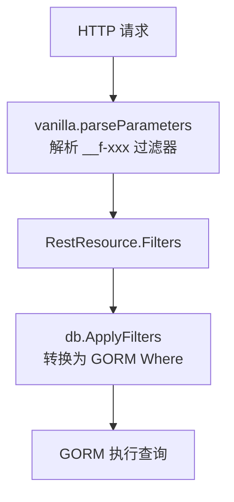
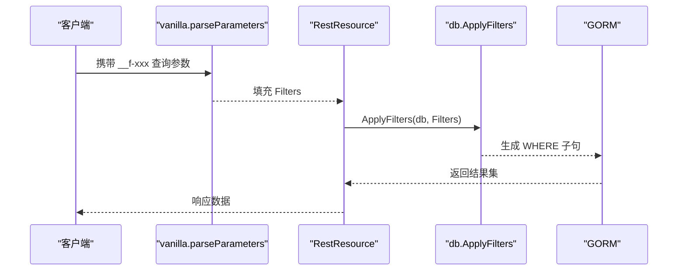
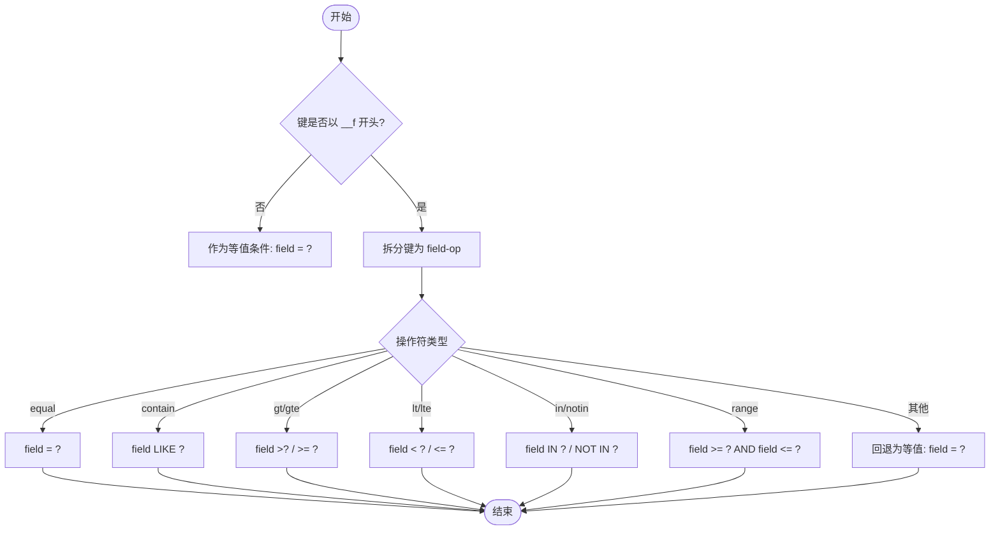
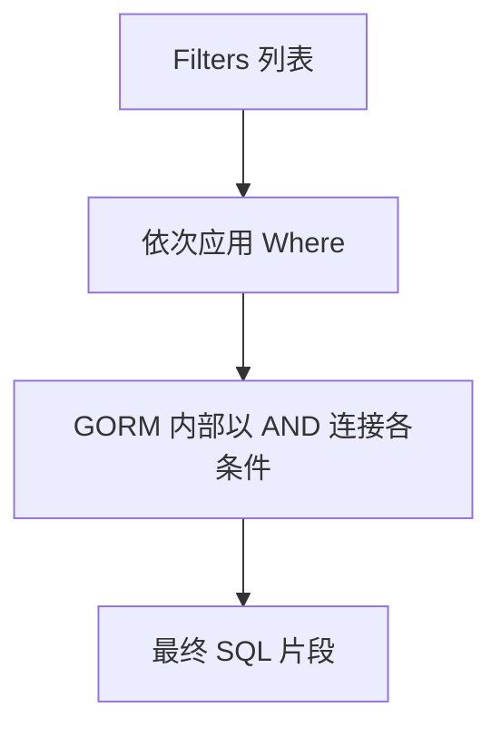
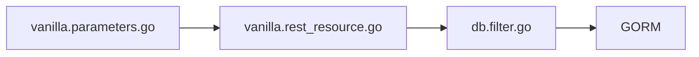

# Filter 查询系统

<cite>
**本文引用的文件**
- [db/filter.go](file://db/filter.go)
- [db/filter_test.go](file://db/filter_test.go)
- [vanilla/parameters.go](file://vanilla/parameters.go)
- [vanilla/rest_resource.go](file://vanilla/rest_resource.go)
- [vanilla/paginator.go](file://vanilla/paginator.go)
- [vanilla/page_info.go](file://vanilla/page_info.go)
- [README.md](file://README.md)
- [ARCHITECTURE.md](file://ARCHITECTURE.md)
</cite>

## 目录
1. [简介](#简介)
2. [项目结构](#项目结构)
3. [核心组件](#核心组件)
4. [架构总览](#架构总览)
5. [详细组件分析](#详细组件分析)
6. [依赖关系分析](#依赖关系分析)
7. [性能与优化](#性能与优化)
8. [故障排查指南](#故障排查指南)
9. [结论](#结论)
10. [附录：使用示例](#附录使用示例)

## 简介
本技术文档聚焦 Carina 框架中的 Filter 查询系统，系统性说明声明式查询条件的构建机制、支持的查询操作符、条件组合逻辑、字段映射与类型转换、分页与排序能力、性能优化策略以及边界情况与错误诊断方法。读者可据此在业务层以统一协议快速构建安全、准确且高性能的数据库查询。

## 项目结构
Filter 查询系统由“参数提取”和“SQL 生成”两部分组成：
- 参数提取：vanilla 层负责从请求中解析 __f-xxx 过滤器并填充到 RestResource.Filters
- SQL 生成：db 层将 Filters 转换为 GORM Where 条件

图表来源
- [vanilla/parameters.go:100-120](file://vanilla/parameters.go#L100-L120)
- [db/filter.go:21-60](file://db/filter.go#L21-L60)

章节来源
- [README.md:121-135](file://README.md#L121-L135)
- [ARCHITECTURE.md:12-20](file://ARCHITECTURE.md#L12-L20)

## 核心组件
- 过滤器提取器（vanilla）：从 URL Query 中提取所有以 __f 开头的键值对，按操作符类型进行 JSON 数组解析或保留原始字符串，存入 RestResource.Filters
- 过滤器转换器（db）：遍历 Filters，将每个键值对转换为 GORM Where 子句；支持等值、比较、包含、范围、集合等操作符
- 分页与排序（vanilla）：提供 PageInfo 与 Paginate，支持 offset 分页与 cursor 分页，并内置方向控制

章节来源
- [vanilla/parameters.go:100-120](file://vanilla/parameters.go#L100-L120)
- [db/filter.go:21-60](file://db/filter.go#L21-L60)
- [vanilla/paginator.go:62-135](file://vanilla/paginator.go#L62-L135)
- [vanilla/page_info.go:7-62](file://vanilla/page_info.go#L7-L62)

## 架构总览
Filter 查询系统在请求生命周期中的位置如下：
- 中间件完成鉴权、事务注入等后，进入 vanilla 资源处理
- vanilla 先解析参数与过滤器，再交由业务层调用 db.ApplyFilters 生成查询条件
- 业务层可在 ApplyFilters 基础上追加 Order/Limit/Offset 等条件，最终执行查询

图表来源
- [vanilla/parameters.go:100-120](file://vanilla/parameters.go#L100-L120)
- [db/filter.go:21-60](file://db/filter.go#L21-L60)

章节来源
- [ARCHITECTURE.md:47-72](file://ARCHITECTURE.md#L47-L72)

## 详细组件分析

### 过滤器协议与操作符
- 协议格式：__f-字段-操作符
- 支持的操作符：
  - equal：等值匹配
  - contain：模糊匹配（LIKE '%值%'）
  - gt/gte：大于/大于等于
  - lt/lte：小于/小于等于
  - in/notin：集合包含/不包含
  - range：范围过滤（需传入长度为至少 2 的数组）
- 非 __f 前缀的普通键值对会被当作等值条件处理

图表来源
- [db/filter.go:21-60](file://db/filter.go#L21-L60)

章节来源
- [db/filter.go:21-60](file://db/filter.go#L21-L60)
- [README.md:121-135](file://README.md#L121-L135)

### 条件组合逻辑与优先级
- 组合方式：AND
- 实现机制：ApplyFilters 遍历 Filters 时多次调用 db.Where，GORM 会将多个 Where 以 AND 连接
- 注意：当前实现未提供显式的 OR 组合；如需 OR，需在业务层通过 GORM 原生 API 拼接

图表来源
- [db/filter.go:21-60](file://db/filter.go#L21-L60)

章节来源
- [db/filter.go:21-60](file://db/filter.go#L21-L60)

### 字段映射与类型转换
- 字段映射：键中第二个部分即为字段名，直接用于 SQL 片段
- 类型转换：
  - 对于 in/notin/range 操作符，vanilla 会尝试将查询参数解析为 JSON 数组；若失败则回退为字符串
  - 其他操作符保持原始字符串形式，由 GORM 驱动层绑定参数
- 安全性：
  - 使用占位符绑定参数，避免 SQL 注入
  - 字段名来自键解析，建议配合白名单校验防止恶意字段

章节来源
- [vanilla/parameters.go:100-120](file://vanilla/parameters.go#L100-L120)
- [db/filter.go:21-60](file://db/filter.go#L21-L60)

### 分页与排序
- 分页模式：
  - backend 模式：COUNT + LIMIT/OFFSET，返回 PaginateResult
  - apiserver 模式：LIMIT count+1 判断是否有下一页，返回 APIServiceNextPageInfo
- 排序方向：asc/desc，默认 asc；游标模式下基于 id 字段进行范围过滤
- 使用方式：
  - 通过 ExtractPageInfoFromRequest 从请求中抽取 PageInfo
  - 调用 Paginate 执行分页查询

章节来源
- [vanilla/page_info.go:7-62](file://vanilla/page_info.go#L7-L62)
- [vanilla/paginator.go:62-135](file://vanilla/paginator.go#L62-L135)

## 依赖关系分析
- vanilla 层负责参数与过滤器提取，不依赖具体数据库实现
- db 层依赖 GORM，将过滤器转换为 Where 条件
- 两者通过 RestResource.Filters 解耦，便于扩展与维护

图表来源
- [vanilla/parameters.go:100-120](file://vanilla/parameters.go#L100-L120)
- [db/filter.go:21-60](file://db/filter.go#L21-L60)

章节来源
- [ARCHITECTURE.md:12-20](file://ARCHITECTURE.md#L12-L20)

## 性能与优化
- 索引利用
  - 等值、范围、IN/NOT IN 操作通常可利用 B-Tree 或哈希索引
  - LIKE '%...%' 前导通配难以命中索引，建议改用全文检索或调整搜索策略
- 查询计划分析
  - 使用数据库 EXPLAIN 查看执行计划，确认是否命中索引
  - 关注全表扫描、临时表、文件排序等低效行为
- 分页优化
  - 大数据量下优先使用 cursor 分页，避免深页 OFFSET 带来的性能退化
- 条件数量控制
  - 过多 Where 条件会增加 SQL 复杂度，建议合并或拆分查询

[本节为通用指导，不直接分析具体文件]

## 故障排查指南
- 常见问题
  - 操作符无效：当前实现未知操作符会回退为等值匹配，检查键名是否正确
  - 数组参数解析失败：in/notin/range 期望 JSON 数组，若解析失败将回退为字符串，可能导致类型不匹配
  - 空范围：range 需要长度至少为 2 的数组，否则不会生成范围条件
- 调试方法
  - 使用 DryRun 模式获取生成的 SQL 片段，验证 Where 条件是否符合预期
  - 结合数据库 EXPLAIN 分析执行计划，定位慢查询原因

章节来源
- [db/filter_test.go:56-86](file://db/filter_test.go#L56-L86)
- [db/filter_test.go:98-138](file://db/filter_test.go#L98-L138)

## 结论
Carina 的 Filter 查询系统通过统一的 __f-字段-操作符 协议，将声明式查询条件安全地转换为 GORM Where 子句。其设计简洁、易于扩展，并通过分页与排序能力满足常见业务需求。在生产环境中，应结合索引策略与查询计划分析持续优化性能，并对输入进行白名单校验以确保安全。

[本节为总结性内容，不直接分析具体文件]

## 附录：使用示例
以下为典型用法路径指引（不展示代码内容）：
- 简单查询：使用等值或包含操作符
  - 参考路径：[db/filter.go:21-60](file://db/filter.go#L21-L60)
- 复杂条件组合：多个 __f-xxx 条件自动以 AND 组合
  - 参考路径：[db/filter.go:21-60](file://db/filter.go#L21-L60)
- 分页查询：
  - 后端后台：backend 模式，使用 Page + CountPerPage
    - 参考路径：[vanilla/page_info.go:36-62](file://vanilla/page_info.go#L36-L62), [vanilla/paginator.go:73-89](file://vanilla/paginator.go#L73-L89)
  - API 服务：apiserver 模式，使用 FromId + CountPerPage
    - 参考路径：[vanilla/page_info.go:40-51](file://vanilla/page_info.go#L40-L51), [vanilla/paginator.go:91-135](file://vanilla/paginator.go#L91-L135)
- 排序功能：
  - 游标分页支持 asc/desc 方向
    - 参考路径：[vanilla/page_info.go:21-34](file://vanilla/page_info.go#L21-L34), [vanilla/paginator.go:91-100](file://vanilla/paginator.go#L91-L100)

章节来源
- [README.md:121-135](file://README.md#L121-L135)
- [vanilla/paginator.go:62-135](file://vanilla/paginator.go#L62-L135)
- [vanilla/page_info.go:7-62](file://vanilla/page_info.go#L7-L62)