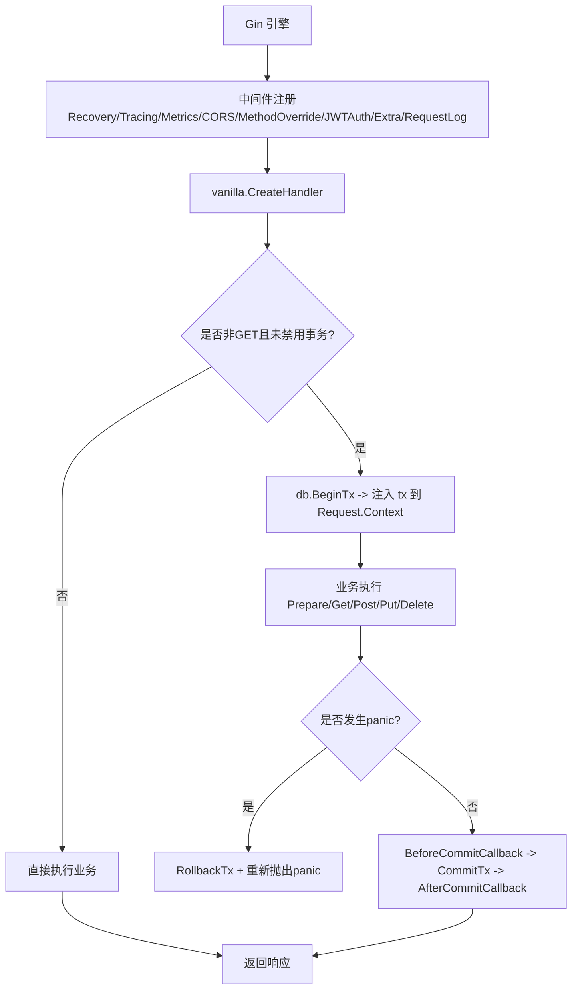
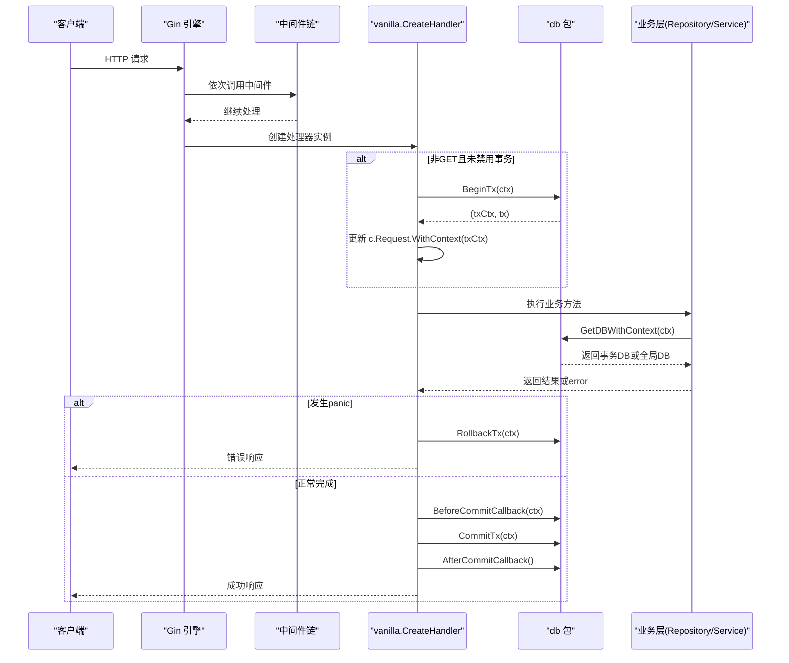
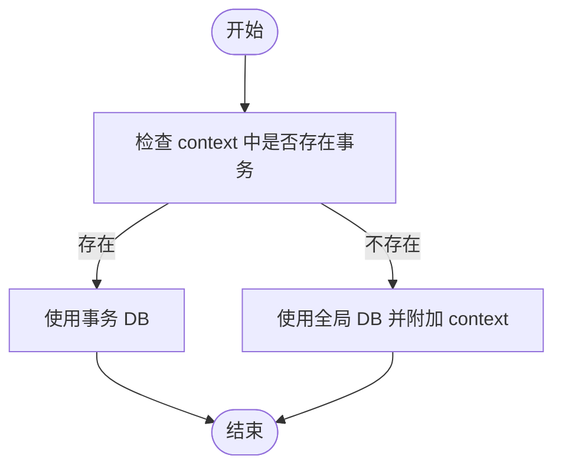
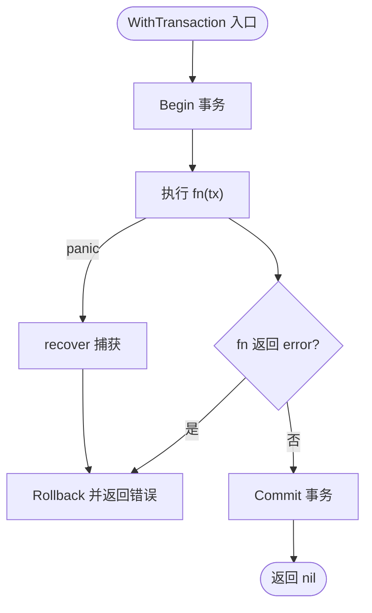
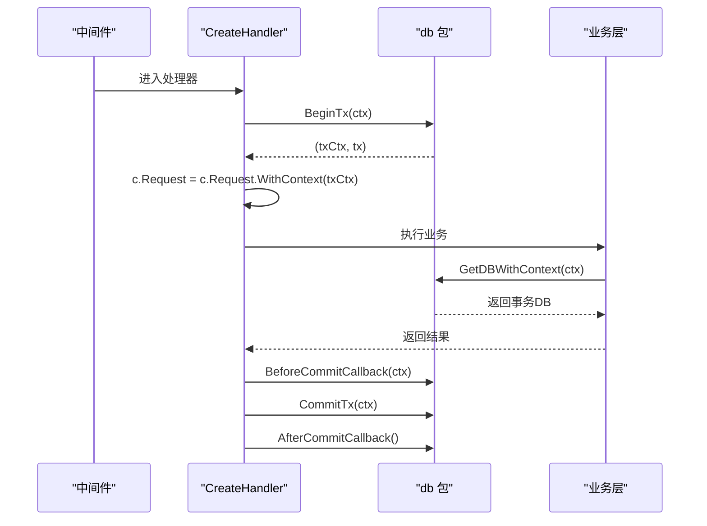
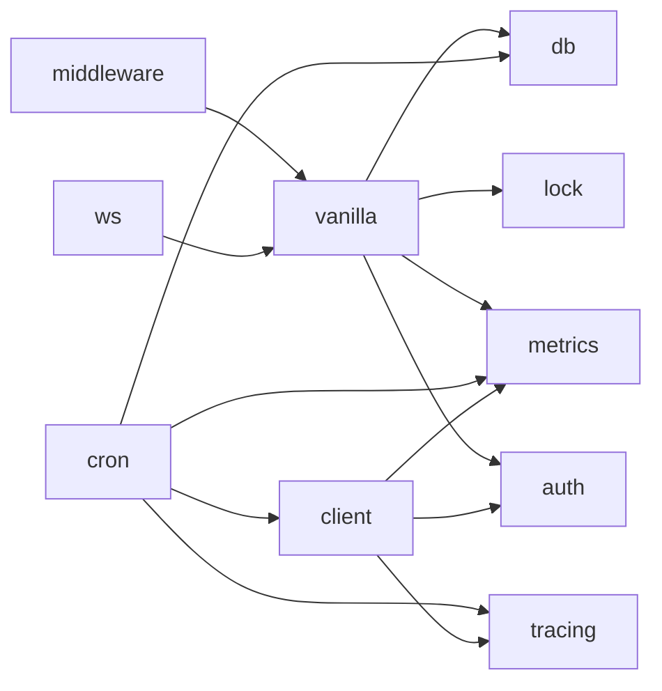

# 事务管理

<cite>
**本文引用的文件**
- [db/db.go](file://db/db.go)
- [db/tx.go](file://db/tx.go)
- [vanilla/handler.go](file://vanilla/handler.go)
- [vanilla/business_model.go](file://vanilla/business_model.go)
- [middleware/register.go](file://middleware/register.go)
- [ARCHITECTURE.md](file://ARCHITECTURE.md)
- [README.md](file://README.md)
</cite>

## 目录
1. [简介](#简介)
2. [项目结构](#项目结构)
3. [核心组件](#核心组件)
4. [架构总览](#架构总览)
5. [详细组件分析](#详细组件分析)
6. [依赖关系分析](#依赖关系分析)
7. [性能考量](#性能考量)
8. [故障排查指南](#故障排查指南)
9. [结论](#结论)
10. [附录：使用示例与最佳实践](#附录使用示例与最佳实践)

## 简介
本技术文档聚焦 Carina 框架中的事务管理能力，围绕基于 context 的事务传播机制、WithTransaction 生命周期管理、嵌套事务策略、隔离级别配置、复杂业务场景（批量操作、条件回滚、错误处理）、以及中间件到业务层的事务上下文传递进行系统化说明。同时提供性能优化建议与常见问题解决方案，帮助开发者在微服务中稳定、高效地使用事务。

## 项目结构
Carina 将事务能力集中在 db 包，并通过 vanilla 层的请求处理器与中间件集成到请求生命周期中。关键路径如下：
- 中间件注册：统一挂载 Recovery、Tracing、Metrics、CORS、MethodOverride、JWTAuth、Extra、RequestLog。
- 请求进入 vanilla.CreateHandler：按方法反射派发，非 GET 请求自动开启事务，并在 defer 中捕获 panic 触发 Rollback。
- 业务层通过 RepositoryBase.DB() / ServiceBase.DB() 获取 DB 句柄，自动感知当前请求是否处于事务上下文中。
- 裸路由或独立场景可使用 WithTransaction 包裹业务逻辑，实现自动 Begin/Commit/Rollback。

图表来源
- [middleware/register.go:28-71](file://middleware/register.go#L28-L71)
- [vanilla/handler.go:29-142](file://vanilla/handler.go#L29-L142)
- [db/tx.go:10-37](file://db/tx.go#L10-L37)
- [ARCHITECTURE.md:47-87](file://ARCHITECTURE.md#L47-L87)

章节来源
- [middleware/register.go:28-71](file://middleware/register.go#L28-L71)
- [vanilla/handler.go:29-142](file://vanilla/handler.go#L29-L142)
- [ARCHITECTURE.md:47-87](file://ARCHITECTURE.md#L47-L87)

## 核心组件
- 事务上下文注入与提取
  - ContextWithTx：将 *gorm.DB 事务对象注入到 context 的特定 key。
  - TxFromContext：从 context 安全取出事务，无则返回 nil。
  - GetDBWithContext：优先返回事务 DB，否则返回全局 DB 并附加 context。
- 事务生命周期管理
  - BeginTx：在 context 中开启新事务，返回注入后的 context 和事务句柄。
  - CommitTx/RollbackTx：对当前 context 中的事务提交或回滚，若不存在则幂等返回。
  - WithTransaction：封装 fn 的执行，自动 Begin/Commit/Rollback，并支持 panic 恢复后回滚。
- 业务层透明接入
  - RepositoryBase.DB()/ServiceBase.DB()：通过 GetDBWithContext 自动感知事务。
  - GetDBFromContext：便捷入口，内部委托给 db.GetDBWithContext。

章节来源
- [db/db.go:62-115](file://db/db.go#L62-L115)
- [db/tx.go:10-37](file://db/tx.go#L10-L37)
- [vanilla/business_model.go:13-42](file://vanilla/business_model.go#L13-L42)

## 架构总览
下图展示从请求进入、中间件处理、事务开启、业务执行到提交/回滚的完整流程，以及事务在 context 中的传播路径。

图表来源
- [vanilla/handler.go:74-132](file://vanilla/handler.go#L74-L132)
- [db/tx.go:10-37](file://db/tx.go#L10-L37)
- [db/db.go:84-115](file://db/db.go#L84-L115)
- [ARCHITECTURE.md:47-87](file://ARCHITECTURE.md#L47-L87)

## 详细组件分析

### 基于 context 的事务传播机制
- 注入与提取
  - ContextWithTx：以自定义 key 将 *gorm.DB 写入 context。
  - TxFromContext：安全读取，空 context 或无值时返回 nil。
  - GetDBWithContext：若存在事务则返回事务 DB；否则返回全局 DB 并附带 context。
- 传播路径
  - 框架侧在 handler 中调用 BeginTx，将 tx 注入到 request context。
  - 业务层通过 RepositoryBase.DB()/ServiceBase.DB() 获取 DB，自动使用事务 DB。
  - 跨层调用（如 service → repository）无需显式传递 tx，仅凭 context 即可共享同一事务。

图表来源
- [db/db.go:68-91](file://db/db.go#L68-L91)
- [vanilla/business_model.go:13-42](file://vanilla/business_model.go#L13-L42)

章节来源
- [db/db.go:62-91](file://db/db.go#L62-L91)
- [vanilla/business_model.go:13-42](file://vanilla/business_model.go#L13-L42)

### WithTransaction 事务生命周期管理
- 自动 Begin/Commit/Rollback
  - 调用 WithTransaction(ctx, fn) 会先 Begin 事务。
  - 若 fn 返回 error，则 Rollback 并返回错误。
  - 若 fn 成功，则 Commit 并返回 nil。
- Panic 恢复机制
  - 使用 defer recover 捕获 panic，执行 Rollback 后重新抛出 panic，确保上层 Recovery 中间件能统一处理。
- 适用场景
  - 裸路由或独立任务中需要事务包裹的业务逻辑。

图表来源
- [db/db.go:93-115](file://db/db.go#L93-L115)

章节来源
- [db/db.go:93-115](file://db/db.go#L93-L115)

### 嵌套事务的处理策略
- 当前实现为“每请求一个事务”模型：
  - 框架在 handler 中 Begin 一次事务，贯穿整个请求生命周期。
  - 业务层通过 GetDBWithContext 获取的是同一个事务 DB。
  - WithTransaction 也会 Begin 一个新事务，但通常用于独立场景（非 handler）。
- 嵌套行为
  - 若在已存在事务的上下文中再次调用 BeginTx/WithTransaction，底层由 GORM 决定行为（多数数据库不支持真正的嵌套事务，会以 savepoint 形式模拟）。
  - 建议在业务层避免重复 Begin，尽量复用当前请求事务；如需分段提交，请使用数据库 savepoint 语义或在业务层拆分函数。
- 推荐实践
  - 保持单一事务边界：在一个 handler 内完成相关的所有写操作。
  - 避免在循环中多次 Begin/Commit，减少事务开销。
  - 对于长事务，考虑拆分为多个短事务以提升并发与锁持有时间。

章节来源
- [vanilla/handler.go:74-132](file://vanilla/handler.go#L74-L132)
- [db/tx.go:10-37](file://db/tx.go#L10-L37)
- [db/db.go:93-115](file://db/db.go#L93-L115)

### 事务隔离级别的配置
- 框架层面未暴露隔离级别选项，隔离级别由数据库驱动与连接配置决定。
- 建议
  - 在数据库连接初始化阶段设置隔离级别（例如 MySQL 的 SET TRANSACTION ISOLATION LEVEL）。
  - 根据业务一致性需求选择合适的隔离级别（读已提交、可重复读等）。
  - 在高并发写场景下，结合索引与查询优化降低锁竞争。

章节来源
- [ARCHITECTURE.md:102-104](file://ARCHITECTURE.md#L102-L104)

### 中间件与业务层之间的事务上下文传递
- 中间件职责
  - Recovery：最外层捕获 panic，保证系统稳定性。
  - JWTAuth：可选认证，注入业务上下文。
  - 其他中间件：Tracing、Metrics、CORS、MethodOverride、Extra、RequestLog。
- 事务注入点
  - vanilla.CreateHandler 在非 GET 且未禁用事务时，调用 BeginTx 并将 tx 注入到 request context。
  - 业务层通过 RepositoryBase.DB()/ServiceBase.DB() 获取 DB，自动使用事务。
- 回调机制
  - BeforeCommitCallback：提交前回调，可用于审计、缓存预热等。
  - AfterCommitCallback：提交后回调，可用于消息发送、缓存失效等。

图表来源
- [middleware/register.go:28-71](file://middleware/register.go#L28-L71)
- [vanilla/handler.go:74-132](file://vanilla/handler.go#L74-L132)
- [db/db.go:84-115](file://db/db.go#L84-L115)

章节来源
- [middleware/register.go:28-71](file://middleware/register.go#L28-L71)
- [vanilla/handler.go:74-132](file://vanilla/handler.go#L74-L132)
- [db/db.go:84-115](file://db/db.go#L84-L115)

## 依赖关系分析
- 模块依赖方向
  - middleware → vanilla → {db, lock, metrics, auth}
  - cron → {db, client, tracing, metrics}
  - ws → {vanilla（经 engine 内部派发）, metrics}
  - client → {auth, tracing, metrics, backoff}
  - 其余包为叶子包，不依赖 carina 内部其他包。
- 事务相关依赖
  - vanilla.CreateHandler 依赖 db.BeginTx/CommitTx/RollbackTx。
  - 业务层通过 RepositoryBase.DB()/ServiceBase.DB() 依赖 db.GetDBWithContext。
  - 中间件 Register 负责挂载 Recovery 等，保障事务异常时的回滚与错误响应。

图表来源
- [ARCHITECTURE.md:36-45](file://ARCHITECTURE.md#L36-L45)

章节来源
- [ARCHITECTURE.md:36-45](file://ARCHITECTURE.md#L36-L45)

## 性能考量
- 事务边界最小化
  - 将相关写操作合并到单个事务中，减少 Begin/Commit 次数。
  - 避免在循环中频繁开启事务。
- 连接池与超时
  - 合理设置 MaxIdleConns、MaxOpenConns、ConnMaxLifetime，避免连接泄漏与过期。
  - 为慢查询设置超时，防止长事务阻塞连接池。
- 索引与查询优化
  - 为高频查询字段建立合适索引，减少锁范围与等待时间。
  - 避免 SELECT *，只取必要字段。
- 批量操作
  - 使用批量插入/更新减少往返次数。
  - 注意批量大小与内存占用，避免 OOM。
- 监控与观测
  - 启用 Metrics 与 Tracing，观察事务耗时与失败率。
  - 记录 BeforeCommitCallback/AfterCommitCallback 的执行时间与错误。

[本节为通用指导，不直接分析具体文件]

## 故障排查指南
- 常见错误与定位
  - 未初始化数据库：GetDB 会 panic，需在应用启动时调用 Init。
  - 事务 Begin 失败：检查数据库连接与权限。
  - 事务 Commit 失败：检查约束冲突、死锁、网络异常。
  - Panic 导致回滚：确认业务层是否正确抛出 BusinessError/SystemError，并由 Recovery 统一处理。
- 调试建议
  - 打印事务 SQL 与参数，定位慢查询与锁竞争。
  - 使用 Tracing 追踪跨层调用，确认事务上下文是否正确传递。
  - 在 BeforeCommitCallback/AfterCommitCallback 中加入日志与指标。
- 回滚策略
  - 业务错误：抛出 BusinessError，框架会在适当时机回滚并返回错误响应。
  - 系统错误：抛出 SystemError，框架回滚并推送告警。

章节来源
- [db/db.go:25-60](file://db/db.go#L25-L60)
- [vanilla/error.go:15-75](file://vanilla/error.go#L15-L75)
- [ARCHITECTURE.md:47-87](file://ARCHITECTURE.md#L47-L87)

## 结论
Carina 的事务管理以 context 为核心，实现了透明的传播机制与统一的生命周期管理。通过 vanilla.CreateHandler 的自动事务注入与 Recovery 的 panic 恢复，业务代码可以专注于领域逻辑，而无需关心事务细节。配合合理的连接池配置、索引优化与监控观测，可在高并发场景下保持稳定与高性能。

[本节为总结性内容，不直接分析具体文件]

## 附录：使用示例与最佳实践

### 批量操作
- 在单个事务中批量插入/更新，减少事务开销。
- 控制批量大小，避免单次事务过大导致锁竞争与内存压力。
- 使用 ApplyFilters 构建高效查询，减少不必要的数据加载。

章节来源
- [db/filter_test.go:98-138](file://db/filter_test.go#L98-L138)

### 条件回滚
- 在业务逻辑中判断条件，若失败则返回 error，WithTransaction 会自动回滚。
- 使用 BusinessError 表达业务规则违反，便于统一处理与告警。

章节来源
- [db/db.go:93-115](file://db/db.go#L93-L115)
- [vanilla/error.go:15-75](file://vanilla/error.go#L15-L75)

### 错误处理
- 业务错误：抛出 BusinessError，框架回滚并返回错误响应。
- 系统错误：抛出 SystemError，框架回滚并推送告警。
- 在 BeforeCommitCallback/AfterCommitCallback 中处理副作用（如消息发送），失败时记录日志但不影响主事务。

章节来源
- [vanilla/handler.go:89-132](file://vanilla/handler.go#L89-L132)
- [vanilla/error.go:15-75](file://vanilla/error.go#L15-L75)

### 事务上下文在中间件与业务层之间的传递
- 中间件 Register 挂载 Recovery、Tracing、Metrics、CORS、MethodOverride、JWTAuth、Extra、RequestLog。
- CreateHandler 在非 GET 且未禁用事务时，调用 BeginTx 并注入到 request context。
- 业务层通过 RepositoryBase.DB()/ServiceBase.DB() 获取 DB，自动使用事务。

章节来源
- [middleware/register.go:28-71](file://middleware/register.go#L28-L71)
- [vanilla/handler.go:74-132](file://vanilla/handler.go#L74-L132)
- [vanilla/business_model.go:13-42](file://vanilla/business_model.go#L13-L42)

### 快速开始参考
- 应用启动时初始化数据库连接池与缓存。
- 注册中间件并启用事务（EnableTx=true）。
- 定义 Resource 并实现 GetParameters/Get/Post/Put/Delete。
- 非 GET 请求自动包裹事务，GET 请求默认不开启事务。

章节来源
- [README.md:27-74](file://README.md#L27-L74)