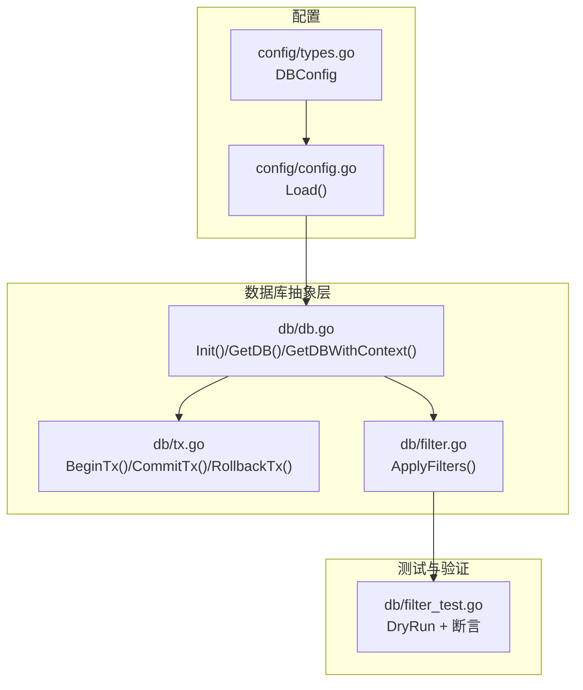
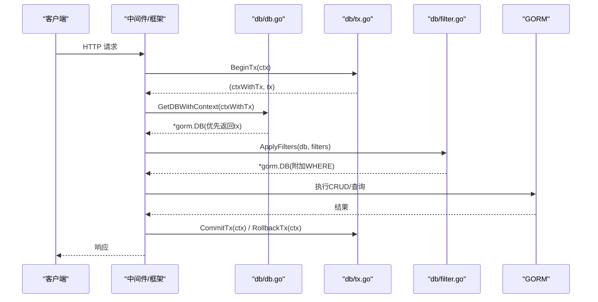
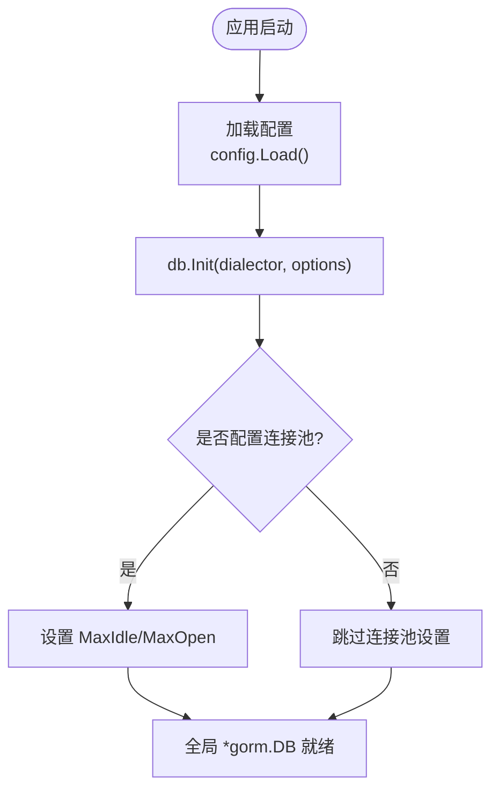
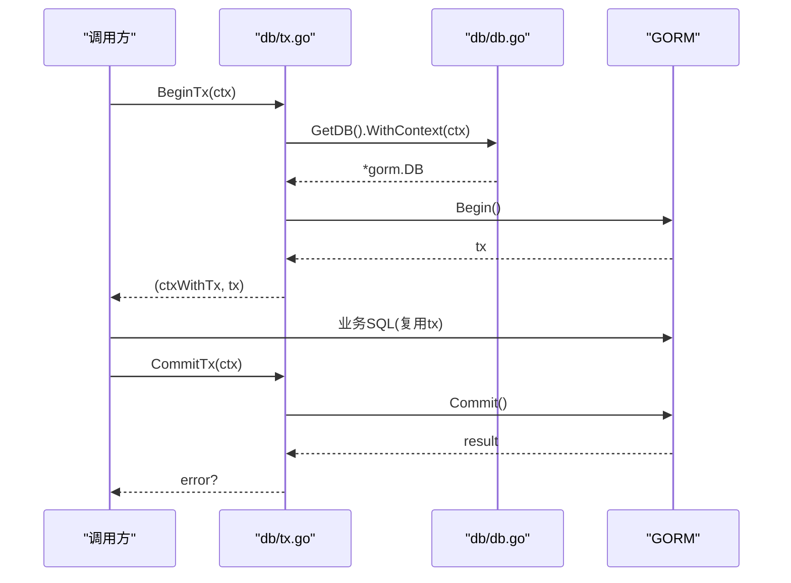
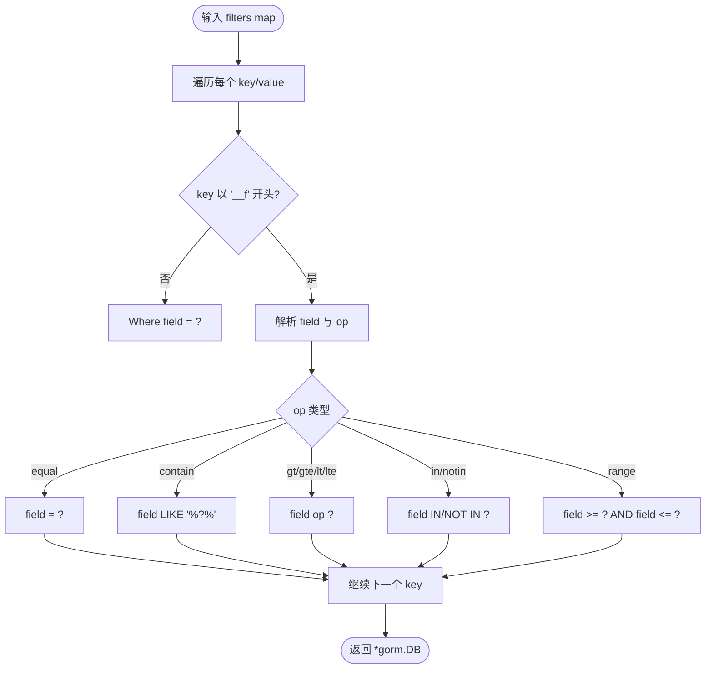
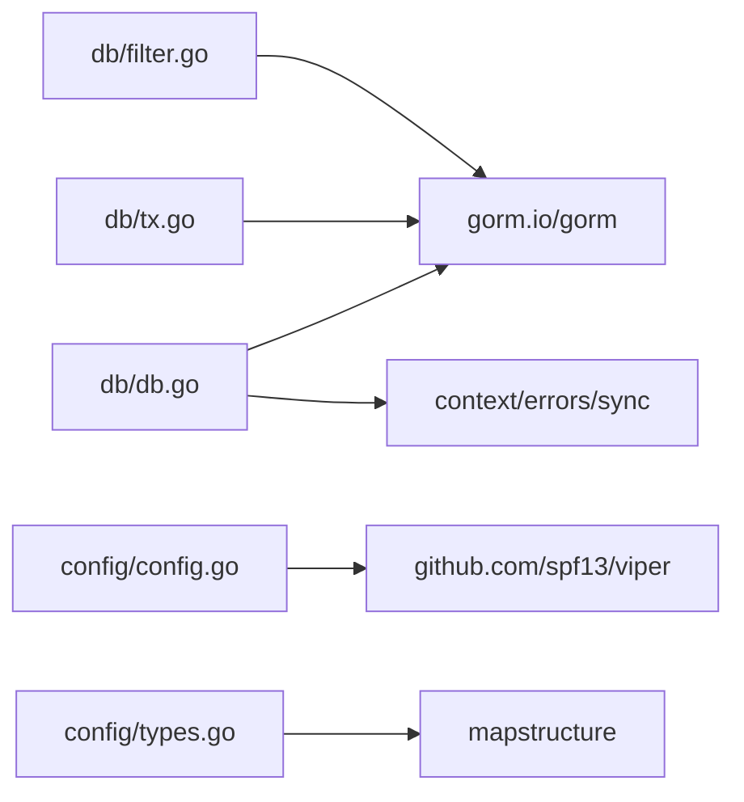

# 数据库抽象层

<cite>
**本文引用的文件**
- [db/db.go](file://db/db.go)
- [db/tx.go](file://db/tx.go)
- [db/filter.go](file://db/filter.go)
- [db/filter_test.go](file://db/filter_test.go)
- [config/config.go](file://config/config.go)
- [config/types.go](file://config/types.go)
- [README.md](file://README.md)
- [ARCHITECTURE.md](file://ARCHITECTURE.md)
</cite>

## 目录
1. [简介](#简介)
2. [项目结构](#项目结构)
3. [核心组件](#核心组件)
4. [架构总览](#架构总览)
5. [详细组件分析](#详细组件分析)
6. [依赖关系分析](#依赖关系分析)
7. [性能考虑与调优](#性能考虑与调优)
8. [故障排查指南](#故障排查指南)
9. [结论](#结论)
10. [附录：使用示例](#附录使用示例)

## 简介
本技术文档围绕 Carina 框架的数据库抽象层展开，重点说明基于 GORM 的封装设计、驱动无关的连接管理、连接池配置优化、事务管理机制（含自动传播、嵌套事务处理与错误恢复）、Filter 查询协议的完整实现（操作符、条件组合与性能优化），并提供 CRUD、复杂查询与批量处理的实践指引。同时给出性能调优建议与常见问题解决方案，帮助读者在生产环境中稳定高效地使用数据库能力。

## 项目结构
数据库相关代码集中在 db 包中，包含连接初始化、上下文事务注入、事务生命周期工具函数以及 Filter 查询协议实现；配置模块在 config 包中提供 DBConfig 等结构体，便于从配置文件与环境变量加载数据库参数。

图表来源
- [config/types.go:11-16](file://config/types.go#L11-L16)
- [config/config.go:21-60](file://config/config.go#L21-L60)
- [db/db.go:18-50](file://db/db.go#L18-L50)
- [db/tx.go:10-37](file://db/tx.go#L10-L37)
- [db/filter.go:10-61](file://db/filter.go#L10-L61)
- [db/filter_test.go:14-66](file://db/filter_test.go#L14-L66)

章节来源
- [config/types.go:11-16](file://config/types.go#L11-L16)
- [config/config.go:21-60](file://config/config.go#L21-L60)
- [db/db.go:18-50](file://db/db.go#L18-L50)
- [db/tx.go:10-37](file://db/tx.go#L10-L37)
- [db/filter.go:10-61](file://db/filter.go#L10-L61)
- [db/filter_test.go:14-66](file://db/filter_test.go#L14-L66)

## 核心组件
- 驱动无关连接管理：通过传入 gorm.Dialector 完成初始化，屏蔽具体数据库驱动差异。
- 连接池配置：暴露 Options 以设置最大空闲连接数、最大打开连接数，支持按环境调整。
- 事务上下文传播：通过 context 注入/提取事务，业务代码无需显式传递 tx。
- 事务生命周期工具：提供 WithTransaction 自动 Begin/Commit/Rollback，并捕获 panic 进行回滚。
- Filter 查询协议：将 __f-字段-操作符 形式的查询参数转换为 GORM Where 条件，支持多种操作符与范围查询。

章节来源
- [db/db.go:18-50](file://db/db.go#L18-L50)
- [db/db.go:62-91](file://db/db.go#L62-L91)
- [db/db.go:93-115](file://db/db.go#L93-L115)
- [db/tx.go:10-37](file://db/tx.go#L10-L37)
- [db/filter.go:10-61](file://db/filter.go#L10-L61)

## 架构总览
下图展示了请求进入后，如何经由中间件与框架层获取或创建事务，并在业务层通过 GetDBWithContext 自动感知事务；Filter 协议将查询参数转换为 SQL 条件，最终由 GORM 执行。

图表来源
- [db/tx.go:10-37](file://db/tx.go#L10-L37)
- [db/db.go:62-91](file://db/db.go#L62-L91)
- [db/filter.go:10-61](file://db/filter.go#L10-L61)
- [ARCHITECTURE.md:47-85](file://ARCHITECTURE.md#L47-L85)

## 详细组件分析

### 连接管理与连接池
- 驱动无关初始化：Init 接收 gorm.Dialector，内部调用 gorm.Open 并保存全局实例，确保线程安全且仅初始化一次。
- 连接池参数：Options 支持 MaxIdleConns、MaxOpenConns 与 ConnMaxLifetime（分钟）。当前实现已设置空闲与并发上限，ConnMaxLifetime 字段预留用于后续扩展。
- 访问入口：GetDB 返回全局实例；GetDBWithContext 优先返回 context 中的事务 DB，否则返回带上下文的全局 DB，使业务代码透明感知事务。

图表来源
- [config/config.go:21-60](file://config/config.go#L21-L60)
- [config/types.go:11-16](file://config/types.go#L11-L16)
- [db/db.go:18-50](file://db/db.go#L18-L50)

章节来源
- [db/db.go:18-50](file://db/db.go#L18-L50)
- [config/types.go:11-16](file://config/types.go#L11-L16)
- [config/config.go:21-60](file://config/config.go#L21-L60)

### 事务管理机制
- 上下文注入/提取：ContextWithTx 将事务放入 context；TxFromContext 从中取出；GetDBWithContext 优先使用事务 DB。
- 自动事务：WithTransaction 封装 Begin/Commit/Rollback，并在 panic 时回滚，保证一致性。
- 手动事务：BeginTx 返回新的 context 与 tx，调用方负责提交或回滚；CommitTx/RollbackTx 根据 context 是否存在事务来执行相应操作。
- 嵌套事务：当外层已有事务时，内层 Begin 会创建 savepoint 风格的嵌套事务；提交/回滚行为遵循 GORM 的嵌套事务语义。

图表来源
- [db/tx.go:10-37](file://db/tx.go#L10-L37)
- [db/db.go:62-91](file://db/db.go#L62-L91)

章节来源
- [db/db.go:62-91](file://db/db.go#L62-L91)
- [db/db.go:93-115](file://db/db.go#L93-L115)
- [db/tx.go:10-37](file://db/tx.go#L10-L37)
- [ARCHITECTURE.md:74-85](file://ARCHITECTURE.md#L74-L85)

### Filter 查询协议
- 协议格式：__f-字段-操作符=值，非 __f 前缀的键视为等值过滤。
- 支持操作符：equal、contain、gt、gte、lt、lte、in、notin、range。
- 条件组合：多次 Where 叠加形成 AND 组合。
- 性能要点：使用占位符避免拼接注入；LIKE 使用 %value% 模式；IN/NOT IN 直接传切片；range 生成 >= AND <= 条件。

图表来源
- [db/filter.go:10-61](file://db/filter.go#L10-L61)

章节来源
- [db/filter.go:10-61](file://db/filter.go#L10-L61)
- [db/filter_test.go:98-138](file://db/filter_test.go#L98-L138)

### 错误处理与恢复
- 未初始化保护：GetDB 在未初始化时 panic，强制要求先调用 Init。
- 事务异常：WithTransaction 对 fn 的错误进行回滚；panic 时也会回滚并重新抛出。
- 上下文安全：TxFromContext 对 nil context 做防御性检查，避免空指针。

章节来源
- [db/db.go:53-60](file://db/db.go#L53-L60)
- [db/db.go:93-115](file://db/db.go#L93-L115)
- [db/db.go:73-82](file://db/db.go#L73-L82)

## 依赖关系分析
- db 包依赖 GORM 与标准库 context/errors/sync。
- config 包依赖 viper 读取 YAML 与环境变量，提供 DB 配置结构。
- 测试通过 DryRun 与 fake Dialector 避免引入真实驱动，确保可移植性与稳定性。

图表来源
- [db/db.go:1-10](file://db/db.go#L1-L10)
- [db/tx.go:1-8](file://db/tx.go#L1-L8)
- [db/filter.go:1-8](file://db/filter.go#L1-L8)
- [config/config.go:1-9](file://config/config.go#L1-L9)
- [config/types.go:1-10](file://config/types.go#L1-L10)

章节来源
- [db/db.go:1-10](file://db/db.go#L1-L10)
- [db/tx.go:1-8](file://db/tx.go#L1-L8)
- [db/filter.go:1-8](file://db/filter.go#L1-L8)
- [config/config.go:1-9](file://config/config.go#L1-L9)
- [config/types.go:1-10](file://config/types.go#L1-L10)

## 性能考虑与调优
- 连接池参数
  - MaxIdleConns：建议设置为预期并发度的 1/2~1，减少握手开销。
  - MaxOpenConns：根据数据库服务器资源与连接限制合理设置，避免耗尽连接。
  - ConnMaxLifetime：预留字段，可在未来版本中用于定期回收长连接，降低连接老化问题。
- 查询优化
  - 使用 Filter 的 in/notin/range 等操作符，减少多次查询合并为单次 SQL。
  - 避免过度使用 contain（模糊匹配），必要时结合数据库索引策略。
  - 合理使用分页与只读查询，减少全表扫描。
- 事务优化
  - 尽量缩小事务范围，减少锁持有时间。
  - 批量写入时使用单事务内多条语句，提升吞吐。
  - 在高并发场景下，评估是否需要分库分表或读写分离。
- 可观测性
  - 结合 metrics/tracing 监控慢查询与连接池使用率，持续优化。

[本节为通用指导，不直接分析具体文件]

## 故障排查指南
- 未初始化错误
  - 现象：GetDB 触发 panic。
  - 原因：未在应用启动阶段调用 db.Init。
  - 解决：确保在 main 中先加载配置并调用 db.Init。
- 事务未提交/回滚
  - 现象：数据未持久化或出现脏数据。
  - 原因：未正确调用 CommitTx/RollbackTx，或在 WithTransaction 中返回错误。
  - 解决：使用 WithTransaction 包裹业务逻辑，或确保手动事务路径正确提交/回滚。
- Filter 未生效
  - 现象：查询未按预期过滤。
  - 原因：未调用 ApplyFilters 或参数名不符合协议。
  - 解决：确认传入的 filters 键符合 __f-字段-操作符 格式，并正确挂载到查询链。
- 连接池瓶颈
  - 现象：高并发下请求阻塞或超时。
  - 原因：MaxOpenConns 过小或数据库连接不足。
  - 解决：适当增大 MaxOpenConns，观察数据库侧连接数与 CPU/IO 指标。

章节来源
- [db/db.go:53-60](file://db/db.go#L53-L60)
- [db/db.go:93-115](file://db/db.go#L93-L115)
- [db/filter.go:10-61](file://db/filter.go#L10-L61)
- [config/types.go:11-16](file://config/types.go#L11-L16)

## 结论
Carina 的数据库抽象层以 GORM 为基础，提供了驱动无关的连接管理、灵活的连接池配置、完善的上下文事务机制与强大的 Filter 查询协议。通过统一的接口与约定式协议，开发者可以专注于业务逻辑，同时获得一致的事务语义与良好的可维护性。配合合理的性能调优与故障排查策略，可在生产环境中稳定运行。

[本节为总结，不直接分析具体文件]

## 附录：使用示例
以下示例展示如何在项目中集成并使用数据库抽象层，包括初始化、CRUD、复杂查询与批量处理。为避免泄露实现细节，示例以步骤与引用为主。

- 初始化与连接池
  - 加载配置：使用 config.Load 读取 YAML 与环境变量，得到 DBConfig。
  - 初始化数据库：调用 db.Init，传入对应驱动的 dialector 与 db.Options。
  - 参考路径
    - [config/config.go:21-60](file://config/config.go#L21-L60)
    - [config/types.go:11-16](file://config/types.go#L11-L16)
    - [db/db.go:18-50](file://db/db.go#L18-L50)
    - [README.md:27-74](file://README.md#L27-L74)

- 自动事务（推荐）
  - 使用 WithTransaction 包裹业务逻辑，自动处理 Begin/Commit/Rollback。
  - 参考路径
    - [db/db.go:93-115](file://db/db.go#L93-L115)

- 手动事务（灵活控制）
  - 使用 BeginTx 开启事务，将 ctx 传递给下游；结束时调用 CommitTx 或 RollbackTx。
  - 参考路径
    - [db/tx.go:10-37](file://db/tx.go#L10-L37)

- 获取 DB 句柄（自动感知事务）
  - 在业务层通过 GetDBWithContext(ctx) 获取 *gorm.DB，若存在事务则复用事务。
  - 参考路径
    - [db/db.go:62-91](file://db/db.go#L62-L91)

- Filter 查询（复杂条件）
  - 构造 filters map，调用 ApplyFilters 将查询参数转为 WHERE 条件。
  - 支持 equal/contain/gt/gte/lt/lte/in/notin/range。
  - 参考路径
    - [db/filter.go:10-61](file://db/filter.go#L10-L61)
    - [db/filter_test.go:98-138](file://db/filter_test.go#L98-L138)
    - [README.md:121-136](file://README.md#L121-L136)

- CRUD 与批量处理
  - 使用 GORM 的标准方法（Create/Save/Delete/Updates 等）在事务中执行。
  - 批量插入建议使用 GORM 的批量接口，在单事务内执行以提升性能。
  - 参考路径
    - [db/db.go:62-91](file://db/db.go#L62-L91)
    - [db/tx.go:10-37](file://db/tx.go#L10-L37)

- 事务前后回调（可选）
  - 框架支持 BeforeCommitCallback 与 AfterCommitCallback，可用于缓存失效、消息发送等。
  - 参考路径
    - [ARCHITECTURE.md:47-85](file://ARCHITECTURE.md#L47-L85)