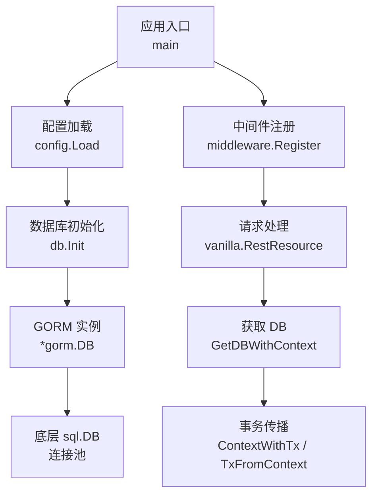
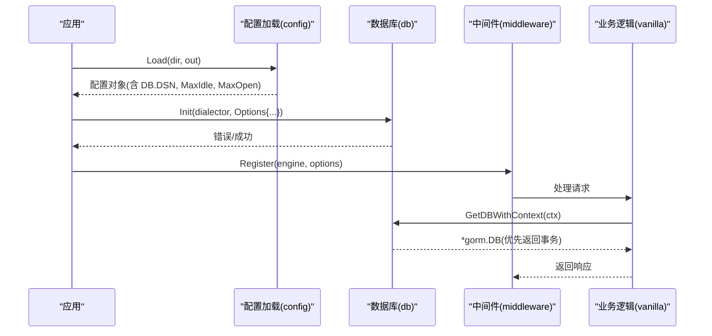
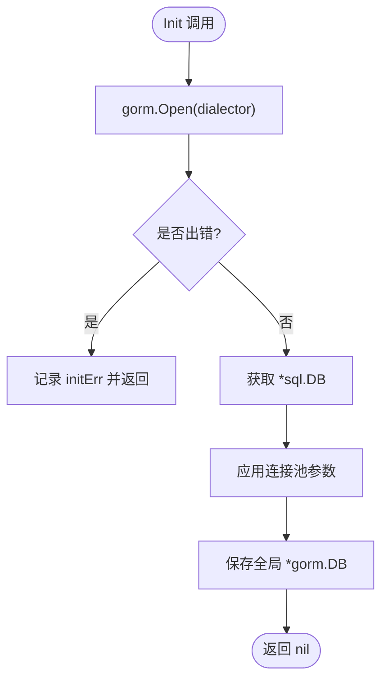
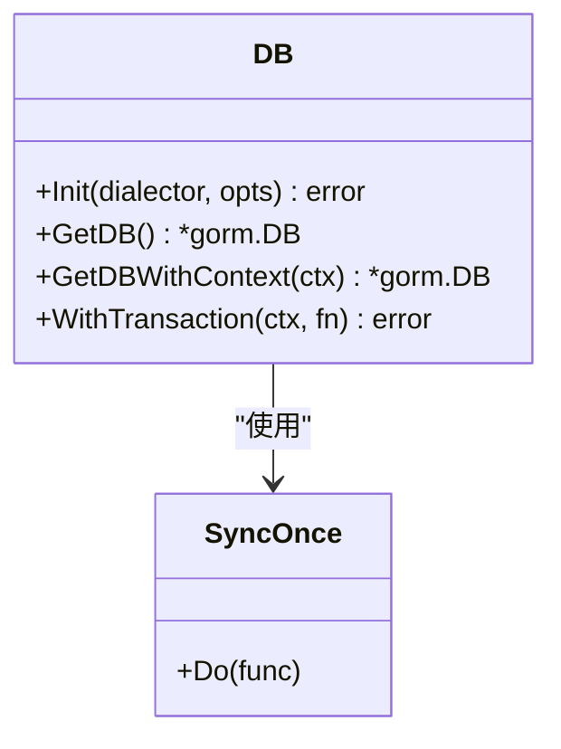
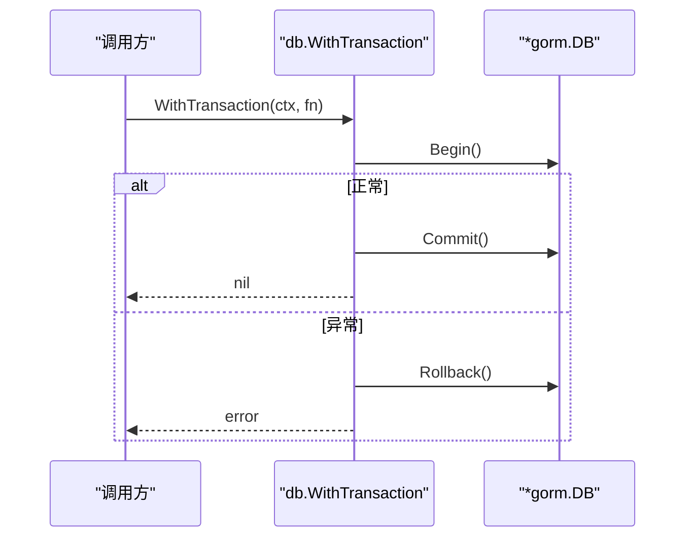
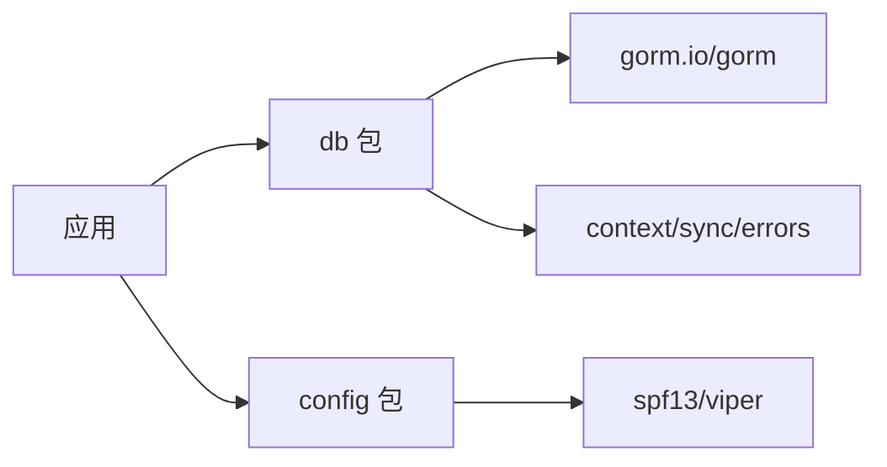

# 连接管理

<cite>
**本文引用的文件**
- [db/db.go](file://db/db.go)
- [db/tx.go](file://db/tx.go)
- [config/config.go](file://config/config.go)
- [config/types.go](file://config/types.go)
- [README.md](file://README.md)
- [ARCHITECTURE.md](file://ARCHITECTURE.md)
</cite>

## 目录
1. [简介](#简介)
2. [项目结构](#项目结构)
3. [核心组件](#核心组件)
4. [架构总览](#架构总览)
5. [详细组件分析](#详细组件分析)
6. [依赖关系分析](#依赖关系分析)
7. [性能考量与优化建议](#性能考量与优化建议)
8. [故障排查指南](#故障排查指南)
9. [结论](#结论)
10. [附录：使用示例](#附录使用示例)

## 简介
本章节面向 Carina 框架的数据库连接管理模块，聚焦于 GORM 驱动无关的连接初始化机制、全局单例设计、事务传播与上下文感知、以及连接池配置对性能的影响。文档同时提供不同数据库驱动的初始化示例、连接状态监控与故障恢复的最佳实践，帮助读者在生产环境中稳定、高效地使用数据库能力。

## 项目结构
Carina 将数据库相关能力集中在 db 包中，并通过 config 包提供统一的配置加载与类型定义；业务侧通过 README 中的快速开始示例完成基础设施初始化。整体职责清晰、耦合度低，便于扩展新的数据库驱动或中间件。

图表来源
- [README.md:27-73](file://README.md#L27-L73)
- [db/db.go:25-91](file://db/db.go#L25-L91)
- [config/config.go:11-60](file://config/config.go#L11-L60)
- [config/types.go:11-16](file://config/types.go#L11-L16)

章节来源
- [README.md:27-73](file://README.md#L27-L73)
- [db/db.go:25-91](file://db/db.go#L25-L91)
- [config/config.go:11-60](file://config/config.go#L11-L60)
- [config/types.go:11-16](file://config/types.go#L11-L16)

## 核心组件
- 驱动无关的 Init 函数：接收任意 gorm.Dialector 实现，统一创建 *gorm.DB，并可选地配置连接池参数。
- 全局单例模式：通过 sync.Once 保证初始化仅执行一次，并提供线程安全的 GetDB 访问。
- 事务传播与上下文感知：通过 context 注入/提取事务，业务代码无需显式传递 *gorm.DB。
- 便捷事务封装：WithTransaction 自动 Begin/Commit/Rollback，并在 panic 时回滚。
- 配置模型：DBConfig 提供 DSN 与连接池参数（MaxIdle、MaxOpen），由 viper 加载到应用配置。

章节来源
- [db/db.go:12-119](file://db/db.go#L12-L119)
- [db/tx.go:10-37](file://db/tx.go#L10-L37)
- [config/types.go:11-16](file://config/types.go#L11-L16)
- [config/config.go:11-60](file://config/config.go#L11-L60)

## 架构总览
下图展示了从应用启动到请求处理的完整数据流，包括配置加载、数据库初始化、事务传播与获取 DB 的过程。

图表来源
- [README.md:27-73](file://README.md#L27-L73)
- [db/db.go:25-91](file://db/db.go#L25-L91)
- [config/config.go:11-60](file://config/config.go#L11-L60)

## 详细组件分析

### 驱动无关的 Init 与 Options
- Init 接收 gorm.Dialector 接口，屏蔽 MySQL、PostgreSQL 等具体驱动差异，调用方负责构造 Dialector。
- 支持传入 Options 配置连接池：
  - MaxIdleConns：空闲连接数上限，影响并发突发时的连接建立开销。
  - MaxOpenConns：最大打开连接数，限制并发查询对数据库的压力。
  - ConnMaxLifetime：字段已预留但未在 Init 中设置，建议在后续版本中补充 SetConnMaxLifetime。
- 内部通过 db.DB() 获取底层 *sql.DB 进行连接池配置，确保与 GORM 解耦。

图表来源
- [db/db.go:25-51](file://db/db.go#L25-L51)

章节来源
- [db/db.go:18-51](file://db/db.go#L18-L51)

### 全局单例与线程安全
- 使用 sync.Once 包裹初始化逻辑，确保在多 goroutine 环境下 Init 仅执行一次。
- 全局变量 globalDB 存储 *gorm.DB，GetDB 在未初始化时 panic，避免静默失败。
- 错误通过 initErr 缓存，多次调用 Init 可复用首次错误信息，便于定位问题。

图表来源
- [db/db.go:12-60](file://db/db.go#L12-L60)

章节来源
- [db/db.go:12-60](file://db/db.go#L12-L60)

### 事务传播与上下文感知
- ContextWithTx/TxFromContext：在 context 中注入/提取事务，使业务层无需显式传递 *gorm.DB。
- GetDBWithContext：优先返回当前事务，否则返回带 context 的全局 DB，天然支持嵌套事务场景下的正确选择。
- WithTransaction：封装事务生命周期，异常时自动 Rollback，panic 时也会回滚并重新抛出。

图表来源
- [db/db.go:93-115](file://db/db.go#L93-L115)
- [db/tx.go:10-37](file://db/tx.go#L10-L37)

章节来源
- [db/db.go:62-115](file://db/db.go#L62-L115)
- [db/tx.go:10-37](file://db/tx.go#L10-L37)

### 配置模型与加载
- DBConfig 包含 DSN、MaxIdle、MaxOpen，配合 viper 的 Load 方法，支持环境变量覆盖敏感字段（如 db.dsn）。
- 推荐在应用启动时读取配置并传递给 db.Init，实现配置与连接的解耦。

章节来源
- [config/types.go:11-16](file://config/types.go#L11-L16)
- [config/config.go:11-60](file://config/config.go#L11-L60)

## 依赖关系分析
- db 包依赖 GORM 与标准库 context/sync/errors，不直接依赖任何具体数据库驱动，满足“驱动无关”的设计目标。
- config 包依赖 viper，用于 YAML 与环境变量的统一加载。
- 业务层通过 README 示例引入具体驱动（如 mysql），但框架本身保持中立。

图表来源
- [db/db.go:3-10](file://db/db.go#L3-L10)
- [config/config.go:3-9](file://config/config.go#L3-L9)
- [README.md:27-73](file://README.md#L27-L73)

章节来源
- [db/db.go:3-10](file://db/db.go#L3-L10)
- [config/config.go:3-9](file://config/config.go#L3-L9)
- [README.md:27-73](file://README.md#L27-L73)

## 性能考量与优化建议
- MaxIdleConns（空闲连接数）
  - 作用：减少高并发下频繁创建连接的开销。
  - 建议：根据峰值 QPS 与平均连接时长估算，通常设置为并发度的 1~2 倍；过高会增加内存占用。
- MaxOpenConns（最大打开连接数）
  - 作用：限制并发查询对数据库的压力，防止打满数据库连接上限。
  - 建议：参考数据库 max_connections 与资源配额，结合压测结果调优；过大可能导致数据库端拥塞。
- ConnMaxLifetime（连接最大生命周期）
  - 现状：Options 已预留该字段，但 Init 尚未调用 SetConnMaxLifetime。
  - 建议：在生产环境启用，避免长连接持有导致的会话失效或网络抖动问题；一般设置为 5~10 分钟。
- 其他建议
  - 监控连接池指标（活跃、空闲、等待队列长度）并结合告警阈值动态调整。
  - 针对读写分离或分库分表场景，按业务域拆分连接池，隔离热点路径。
  - 合理设置查询超时与重试退避，避免雪崩效应。

[本节为通用性能指导，不直接分析具体文件]

## 故障排查指南
- 未初始化错误
  - 现象：GetDB 触发 panic，提示需先调用 Init。
  - 排查：确认应用启动流程中是否先加载配置并调用 db.Init；检查 Init 返回值是否为空。
- 连接池耗尽
  - 现象：请求阻塞或超时，数据库连接数接近上限。
  - 排查：检查 MaxOpenConns 是否过小；是否存在慢查询或未释放连接；结合监控观察等待队列。
- 事务未提交/回滚
  - 现象：数据不一致或锁未释放。
  - 排查：确认是否使用 WithTransaction 或手动管理事务；检查异常路径是否正确 Rollback；关注 panic 恢复逻辑。
- 配置未生效
  - 现象：连接池参数未按预期设置。
  - 排查：确认配置文件路径与环境变量覆盖；检查 viper 绑定键名与实际配置项一致。

章节来源
- [db/db.go:53-60](file://db/db.go#L53-L60)
- [db/db.go:93-115](file://db/db.go#L93-L115)
- [config/config.go:21-60](file://config/config.go#L21-L60)

## 结论
Carina 的数据库连接管理模块以“驱动无关”为核心设计，通过 Init 统一初始化、sync.Once 保障单例与线程安全、context 传播事务，提供了简洁且健壮的数据库访问能力。配合合理的连接池配置与监控告警，可在生产环境中获得稳定高效的数据库交互体验。建议后续版本完善 ConnMaxLifetime 的设置，并增强连接池指标的观测与自动化调优。

[本节为总结性内容，不直接分析具体文件]

## 附录：使用示例
以下示例展示如何初始化不同数据库驱动并配置连接池。请根据实际项目需求替换 DSN 与驱动导入。

- MySQL
  - 步骤：
    - 在应用中导入 MySQL 驱动与对应 GORM 驱动。
    - 从配置中读取 DSN 与连接池参数。
    - 调用 db.Init(mysql.Open(cfg.DB.DSN), &db.Options{...})。
  - 参考路径：
    - [README.md:27-73](file://README.md#L27-L73)
    - [config/types.go:11-16](file://config/types.go#L11-L16)

- PostgreSQL
  - 步骤：
    - 导入 PostgreSQL 驱动与对应 GORM 驱动。
    - 从配置中读取 DSN 与连接池参数。
    - 调用 db.Init(postgres.Open(cfg.DB.DSN), &db.Options{...})。
  - 参考路径：
    - [README.md:27-73](file://README.md#L27-L73)
    - [config/types.go:11-16](file://config/types.go#L11-L16)

- 连接池参数说明
  - MaxIdleConns：空闲连接数上限，建议根据并发量与数据库资源评估。
  - MaxOpenConns：最大打开连接数，建议不超过数据库 max_connections。
  - ConnMaxLifetime：连接最大生命周期，建议启用以避免会话过期问题。
  - 参考路径：
    - [db/db.go:18-51](file://db/db.go#L18-L51)
    - [config/types.go:11-16](file://config/types.go#L11-L16)

- 事务使用
  - 推荐方式：使用 WithTransaction 自动管理事务生命周期。
  - 参考路径：
    - [db/db.go:93-115](file://db/db.go#L93-L115)
    - [db/tx.go:10-37](file://db/tx.go#L10-L37)

- 配置加载
  - 使用 config.Load 读取 YAML 与环境变量，支持敏感字段覆盖。
  - 参考路径：
    - [config/config.go:11-60](file://config/config.go#L11-L60)

章节来源
- [README.md:27-73](file://README.md#L27-L73)
- [db/db.go:18-115](file://db/db.go#L18-L115)
- [db/tx.go:10-37](file://db/tx.go#L10-L37)
- [config/config.go:11-60](file://config/config.go#L11-L60)
- [config/types.go:11-16](file://config/types.go#L11-L16)