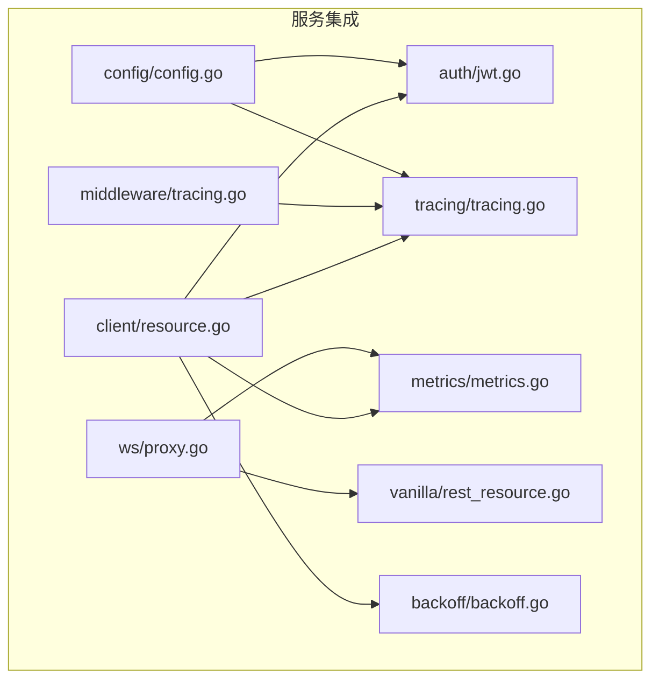
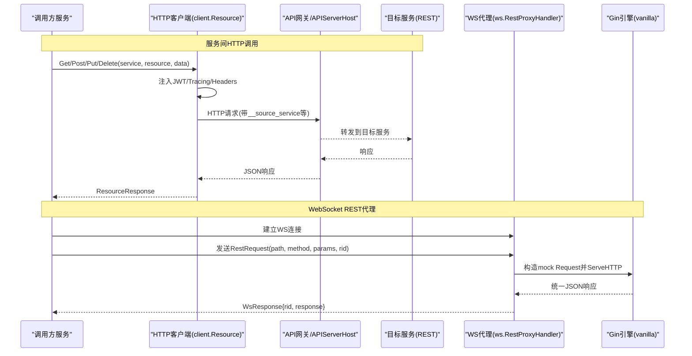
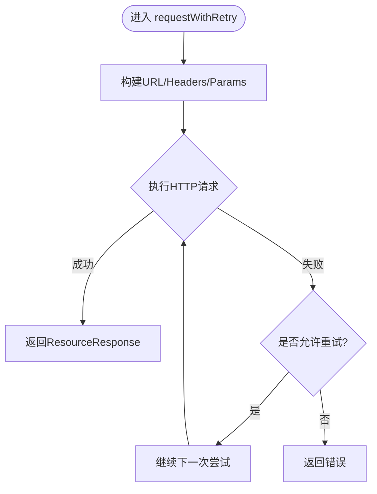
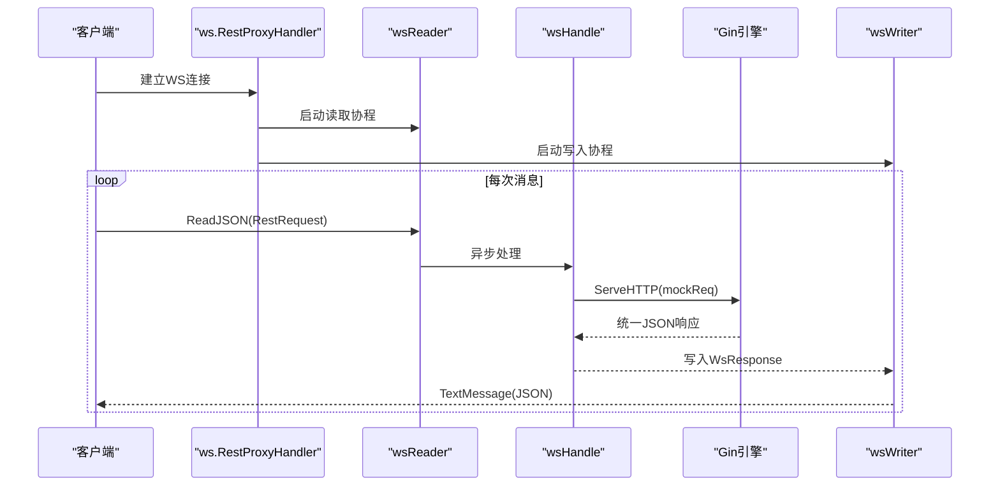
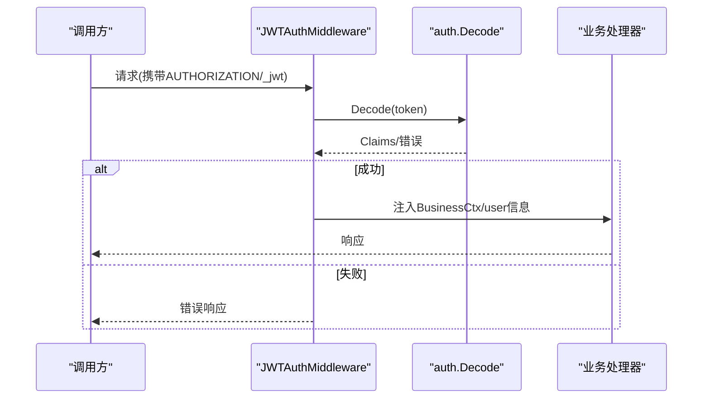
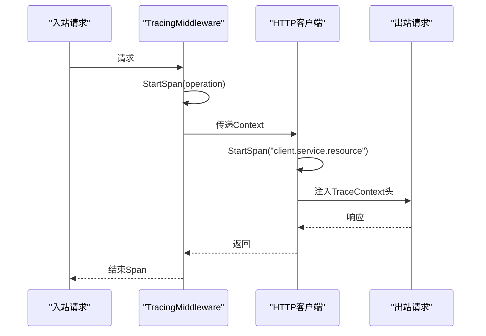
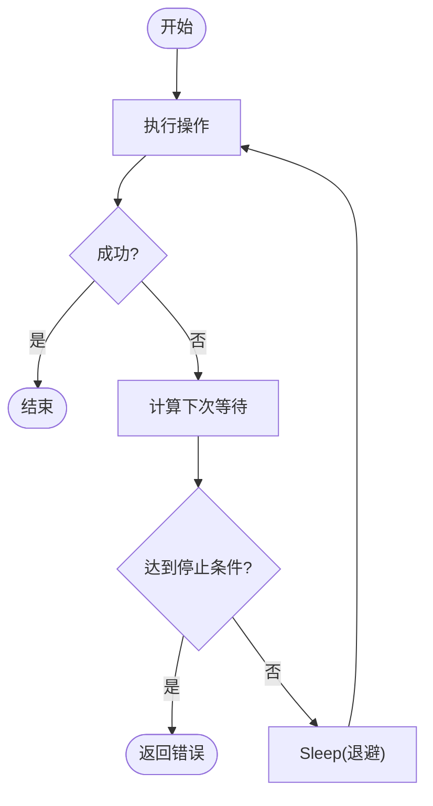
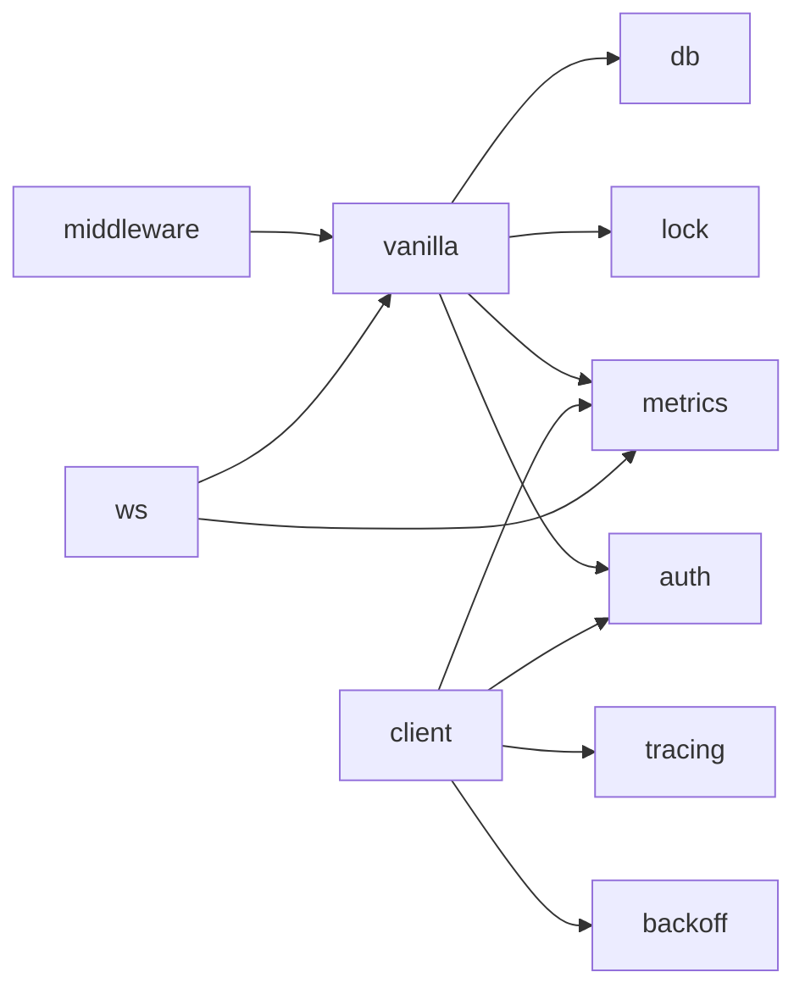

# 服务集成

<cite>
**本文引用的文件**
- [README.md](file://README.md)
- [ARCHITECTURE.md](file://ARCHITECTURE.md)
- [go.mod](file://go.mod)
- [client/resource.go](file://client/resource.go)
- [ws/proxy.go](file://ws/proxy.go)
- [auth/jwt.go](file://auth/jwt.go)
- [middleware/tracing.go](file://middleware/tracing.go)
- [tracing/tracing.go](file://tracing/tracing.go)
- [backoff/backoff.go](file://backoff/backoff.go)
- [vanilla/rest_resource.go](file://vanilla/rest_resource.go)
- [config/config.go](file://config/config.go)
- [metrics/metrics.go](file://metrics/metrics.go)
</cite>

## 目录
1. [简介](#简介)
2. [项目结构](#项目结构)
3. [核心组件](#核心组件)
4. [架构总览](#架构总览)
5. [详细组件分析](#详细组件分析)
6. [依赖关系分析](#依赖关系分析)
7. [性能考量](#性能考量)
8. [故障排查指南](#故障排查指南)
9. [结论](#结论)
10. [附录：使用示例与最佳实践](#附录使用示例与最佳实践)

## 简介
本技术文档聚焦 Carina 框架中的“服务集成”能力，围绕以下目标展开：
- 服务间 HTTP 客户端封装：JWT 透传、重试策略、链路追踪集成。
- WebSocket REST Proxy：REST over WebSocket 协议转换、消息路由与连接管理。
- 服务发现与服务注册：结合现有配置与网关模式的使用建议。
- 完整使用示例：服务间调用与实时通信的端到端流程。
- 服务治理最佳实践与故障排查指南。

Carina 基于 Gin + GORM，提供声明式资源、事务生命周期、分布式锁、Filter 查询、JWT 认证、可观测性（Prometheus + OpenTelemetry）等能力，并内置服务间调用与 WS Proxy，便于在微服务场景下快速构建稳定可靠的系统。

**章节来源**
- [README.md:1-18](file://README.md#L1-L18)
- [ARCHITECTURE.md:13-45](file://ARCHITECTURE.md#L13-L45)

## 项目结构
从模块职责看，服务集成相关的关键目录与文件如下：
- client/resource.go：服务间 HTTP 客户端，负责 JWT 透传、请求构造、重试、Tracing 注入与传播。
- ws/proxy.go：WebSocket REST Proxy，将 WS 消息转换为内部 REST 请求并回写响应。
- auth/jwt.go：JWT 编解码与 Claims 定义，供认证中间件与客户端复用。
- middleware/tracing.go：OpenTelemetry 链路追踪中间件，创建 Span 并注入 Context。
- tracing/tracing.go：OTLP HTTP 导出器初始化与 Tracer 管理。
- backoff/backoff.go：重试退避算法实现，支持指数/固定/零/停止策略。
- vanilla/rest_resource.go：RestResource 契约与生命周期，承载参数解析、事务、锁等。
- config/config.go：配置加载（Viper），支持环境变量覆盖敏感字段。
- metrics/metrics.go：Prometheus 指标注册，包含 WS 连接数、错误计数、重试计数等。

**图表来源**
- [client/resource.go:1-225](file://client/resource.go#L1-L225)
- [ws/proxy.go:1-216](file://ws/proxy.go#L1-L216)
- [auth/jwt.go:1-93](file://auth/jwt.go#L1-L93)
- [tracing/tracing.go:1-75](file://tracing/tracing.go#L1-L75)
- [middleware/tracing.go:1-21](file://middleware/tracing.go#L1-L21)
- [backoff/backoff.go:1-180](file://backoff/backoff.go#L1-L180)
- [vanilla/rest_resource.go:1-283](file://vanilla/rest_resource.go#L1-L283)
- [config/config.go:1-61](file://config/config.go#L1-L61)
- [metrics/metrics.go:1-107](file://metrics/metrics.go#L1-L107)

**章节来源**
- [ARCHITECTURE.md:13-45](file://ARCHITECTURE.md#L13-L45)

## 核心组件
本节对服务集成的核心组件进行概览说明，后续章节将深入细节。

- 服务间 HTTP 客户端（client.Resource）
  - 功能：构造目标服务 URL、注入 JWT、开启 Tracing Span、传播 TraceContext、发起 HTTP 请求、统一响应绑定。
  - 特性：默认重试次数、可禁用重试；连接池优化；超时控制。
- WebSocket REST Proxy（ws.RestProxyHandler）
  - 功能：升级 WS 连接、读取 RestRequest、通过 Gin Engine 内部派发为 REST 请求、捕获响应并通过 WS 返回。
  - 特性：读写超时、Panic 恢复、Metrics 埋点、连接数 Gauge。
- JWT 认证（auth）
  - 功能：Claims 定义、Encode/Decode、ParseUserId。
  - 集成：中间件从 Header/Query/Cookie 提取 token 并注入业务上下文。
- 链路追踪（tracing + middleware.TracingMiddleware）
  - 功能：OTLP HTTP 导出、采样率、全局 Tracer、StartSpan。
  - 集成：中间件为每个请求创建 Span；客户端在出站时注入传播头。
- 重试退避（backoff）
  - 功能：Zero/Stop/Constant/Exponential 策略；Retry/RetryNotify。
  - 集成：当前客户端使用固定次数重试，可替换为 backoff 策略以增强弹性。
- 配置与指标（config, metrics）
  - 功能：Viper 加载、环境变量覆盖；Prometheus 指标注册与使用。

**章节来源**
- [client/resource.go:18-225](file://client/resource.go#L18-L225)
- [ws/proxy.go:19-216](file://ws/proxy.go#L19-L216)
- [auth/jwt.go:11-93](file://auth/jwt.go#L11-L93)
- [middleware/tracing.go:10-21](file://middleware/tracing.go#L10-L21)
- [tracing/tracing.go:16-75](file://tracing/tracing.go#L16-L75)
- [backoff/backoff.go:10-180](file://backoff/backoff.go#L10-L180)
- [config/config.go:11-61](file://config/config.go#L11-L61)
- [metrics/metrics.go:10-107](file://metrics/metrics.go#L10-L107)

## 架构总览
下图展示了服务间调用与 WS Proxy 的整体交互：

**图表来源**
- [client/resource.go:93-225](file://client/resource.go#L93-L225)
- [ws/proxy.go:48-199](file://ws/proxy.go#L48-L199)
- [vanilla/rest_resource.go:13-44](file://vanilla/rest_resource.go#L13-L44)

**章节来源**
- [ARCHITECTURE.md:47-72](file://ARCHITECTURE.md#L47-L72)

## 详细组件分析

### 服务间 HTTP 客户端（client.Resource）
- 设计要点
  - JWT 透传：优先使用 CustomJWTToken，否则从 Context 中取 jwt 值，设置到 AUTHORIZATION 头。
  - URL 构建：service.resource → service/service/resource/，自动处理点分命名。
  - Query/Form：GET 使用 query；POST/PUT/DELETE 使用 form-urlencoded，PUT/DELETE 通过 _method 重写。
  - Tracing：StartSpan 并以 TraceContext 传播至下游。
  - 重试：默认循环 defaultRetryCount 次，可通过 DisableRetry() 关闭。
  - 连接池：自定义 http.Transport 参数，优化长连接与空闲回收。
- 数据流
  - 入参：context（含 JWT/Trace）、service、resource、data。
  - 出参：ResourceResponse（code/data/bind）。
- 复杂度
  - 时间：O(n) 遍历 data 构建参数；网络 I/O 主导。
  - 空间：O(n) 存储参数与响应体。
- 优化机会
  - 将固定次数重试升级为 backoff.ExponentialBackOff，降低雪崩风险。
  - 增加熔断/限流（如基于滑动窗口或令牌桶）。
  - 针对大响应体启用流式读取与分页。

**图表来源**
- [client/resource.go:113-126](file://client/resource.go#L113-L126)
- [client/resource.go:128-225](file://client/resource.go#L128-L225)

**章节来源**
- [client/resource.go:18-225](file://client/resource.go#L18-L225)

### WebSocket REST Proxy（ws.RestProxyHandler）
- 设计要点
  - 升级：使用 gorilla/websocket Upgrader，白名单放行 CheckOrigin。
  - 读写：readWait/writeWait/pongWait/pingPeriod 控制超时与心跳。
  - 路由：将 WS 消息 RestRequest 转为 mock http.Request，交由 Gin Engine.ServeHTTP 处理。
  - 响应：responseRecorder 捕获响应体，封装为 WsResponse 回写 WS。
  - 监控：RestwsGauge 记录连接数；RestwsErrorCounter 统计各阶段错误。
- 消息路由
  - path 规范化：确保前缀 /、后缀 /。
  - method 大写化。
  - params 解析为 url.Values，写入 Form。
- 连接管理
  - 协程分离：wsReader 读消息，wsWriter 写响应；stopRespCh/closeCh 协调退出。
  - Panic 恢复：handle/wsWriter 内 recover 并上报错误。

**图表来源**
- [ws/proxy.go:48-199](file://ws/proxy.go#L48-L199)

**章节来源**
- [ws/proxy.go:19-216](file://ws/proxy.go#L19-L216)

### JWT 透传与认证
- 服务端认证
  - 中间件从 AUTHORIZATION/_jwt query/_jwt cookie 提取 token。
  - 使用 auth.Decode 校验，失败返回统一错误。
  - 成功后注入业务上下文与 gin.Context user_id/auth_user_id/jwt_token。
- 客户端透传
  - client.Resource 从 Context 或 CustomJWTToken 获取 token，设置到 AUTHORIZATION 头。
  - 配合 Tracing 传播，保证跨服务身份与链路一致。

**图表来源**
- [middleware/jwt_auth.go:13-81](file://middleware/jwt_auth.go#L13-L81)
- [auth/jwt.go:18-93](file://auth/jwt.go#L18-L93)
- [client/resource.go:128-199](file://client/resource.go#L128-L199)

**章节来源**
- [middleware/jwt_auth.go:13-81](file://middleware/jwt_auth.go#L13-L81)
- [auth/jwt.go:11-93](file://auth/jwt.go#L11-L93)
- [client/resource.go:128-199](file://client/resource.go#L128-L199)

### 链路追踪集成（Tracing）
- 服务端
  - middleware.TracingMiddleware 为每个请求创建 Span，结束于 defer。
  - tracing.Init 配置 OTLP HTTP exporter、采样率、ServiceName。
- 客户端
  - client.request 中 StartSpan("client.service.resource")，并使用 TraceContext 传播头。
- 效果
  - 跨服务调用链可视化，便于定位慢请求与异常。

**图表来源**
- [middleware/tracing.go:10-21](file://middleware/tracing.go#L10-L21)
- [tracing/tracing.go:25-75](file://tracing/tracing.go#L25-L75)
- [client/resource.go:197-205](file://client/resource.go#L197-L205)

**章节来源**
- [middleware/tracing.go:10-21](file://middleware/tracing.go#L10-L21)
- [tracing/tracing.go:16-75](file://tracing/tracing.go#L16-L75)
- [client/resource.go:197-205](file://client/resource.go#L197-L205)

### 重试策略（Backoff）
- 现状
  - client.Resource 使用固定次数重试（defaultRetryCount=3），可通过 DisableRetry() 关闭。
- 扩展建议
  - 引入 backoff.ExponentialBackOff，按指数增长退避，避免风暴。
  - 使用 backoff.RetryNotify 接入告警与指标。
  - 区分可重试错误（网络超时、5xx）与不可重试错误（4xx）。

**图表来源**
- [backoff/backoff.go:144-180](file://backoff/backoff.go#L144-L180)

**章节来源**
- [backoff/backoff.go:10-180](file://backoff/backoff.go#L10-L180)
- [client/resource.go:113-126](file://client/resource.go#L113-L126)

### 服务发现与服务注册
- 现状
  - 代码库未包含显式的服务发现/注册组件。服务间调用通过配置 APIServerHost 与 ServiceName/Mode 完成。
- 推荐方案
  - 使用 API 网关集中暴露服务，client 仅调用网关地址。
  - 在服务侧注册健康检查与元数据（版本、环境），由网关或 Sidecar 管理。
  - 若需动态发现，可在上层引入 etcd/Nacos/K8s Service 等，并在配置层热更新 APIServerHost。

[本节为概念性说明，不直接分析具体文件]

## 依赖关系分析
- 单向依赖
  - middleware → vanilla → {db, lock, metrics, auth}
  - client → {auth, tracing, metrics, backoff}
  - ws → {vanilla, metrics}
  - tracing → otel SDK/Exporter
- 外部依赖
  - Gin/GORM/Redis/RedisLock/robfig/cron/viper/prometheus/otel/gorilla/websocket 等。

**图表来源**
- [ARCHITECTURE.md:36-45](file://ARCHITECTURE.md#L36-L45)
- [go.mod:5-20](file://go.mod#L5-L20)

**章节来源**
- [ARCHITECTURE.md:36-45](file://ARCHITECTURE.md#L36-L45)
- [go.mod:5-20](file://go.mod#L5-L20)

## 性能考量
- HTTP 客户端
  - 连接池：MaxIdleConnsPerHost/MaxIdleConns/IdleConnTimeout 已优化。
  - 超时：Dial/Read/Write 超时合理设置，避免阻塞。
  - 负载：在高并发下建议结合负载均衡与连接复用。
- WS Proxy
  - 缓冲区：Read/Write BufferSize 适中，可根据消息大小调整。
  - 超时：readWait/writeWait/pongWait/pingPeriod 平衡保活与资源占用。
  - 背压：respChan 缓冲 256，防止突发流量导致内存暴涨。
- Tracing
  - 采样率：根据 QPS 与成本调整 SampleRate，避免过大开销。
- Metrics
  - 关键指标：EndpointDuration/RemoteEndpointCallCounter/RestwsGauge/ErrorCounter。
  - 建议：结合告警阈值与大盘视图，关注 P95/P99 延迟与错误率。

[本节提供通用指导，不直接分析具体文件]

## 故障排查指南
- 认证失败
  - 现象：返回 jwt:invalid_jwt_token。
  - 排查：确认 AUTHORIZATION/_jwt 是否正确；服务端 auth.Init 是否配置；token 是否过期。
  - 参考：[middleware/jwt_auth.go:13-81](file://middleware/jwt_auth.go#L13-L81)、[auth/jwt.go:52-93](file://auth/jwt.go#L52-L93)
- WS 连接异常
  - 现象：upgrade/reader/handler/writer 错误计数上升。
  - 排查：检查 upgrader.CheckOrigin、read/write 超时、goroutine 泄漏；查看 metrics.RestwsErrorCounter。
  - 参考：[ws/proxy.go:48-148](file://ws/proxy.go#L48-L148)
- 服务间调用失败
  - 现象：client: do request/unmarshal response 错误。
  - 排查：APIServerHost 可达性；目标服务响应格式；重试策略与超时；Tracing 定位慢路径。
  - 参考：[client/resource.go:128-225](file://client/resource.go#L128-L225)
- 高延迟/超时
  - 现象：EndpointDuration 升高。
  - 排查：数据库/缓存/下游服务瓶颈；连接池耗尽；Tracing 子 span 分析。
  - 参考：[metrics/metrics.go:35-107](file://metrics/metrics.go#L35-L107)
- 配置问题
  - 现象：环境变量未生效。
  - 排查：GO_ENV 与环境文件；BindEnv 敏感字段；配置文件路径。
  - 参考：[config/config.go:11-61](file://config/config.go#L11-L61)

**章节来源**
- [middleware/jwt_auth.go:13-81](file://middleware/jwt_auth.go#L13-L81)
- [auth/jwt.go:52-93](file://auth/jwt.go#L52-L93)
- [ws/proxy.go:48-148](file://ws/proxy.go#L48-L148)
- [client/resource.go:128-225](file://client/resource.go#L128-L225)
- [metrics/metrics.go:35-107](file://metrics/metrics.go#L35-L107)
- [config/config.go:11-61](file://config/config.go#L11-L61)

## 结论
Carina 的服务集成能力以简洁、可观测、可扩展为核心：
- 服务间 HTTP 客户端提供 JWT 透传、Tracing 传播与基础重试，满足大多数微服务调用场景。
- WS Proxy 实现了 REST over WebSocket，适合前端或边缘节点与后端服务的实时通信。
- 通过配置与指标体系，可快速定位问题并进行容量规划。
- 建议在复杂场景引入更健壮的重试/熔断/服务发现机制，进一步提升稳定性。

[本节为总结性内容，不直接分析具体文件]

## 附录：使用示例与最佳实践

### 服务间调用示例
- 初始化客户端
  - 调用 Init(serviceName, serviceMode, apiServerHost) 设置全局配置。
  - 参考：[client/resource.go:39-44](file://client/resource.go#L39-L44)
- 发起调用
  - NewResource(ctx) 获取客户端实例，调用 Get/Post/Put/Delete。
  - 如需禁用重试，链式调用 DisableRetry()。
  - 参考：[client/resource.go:79-111](file://client/resource.go#L79-L111)
- 响应处理
  - IsSuccess()/Data()/Bind(...) 便捷方法。
  - 参考：[client/resource.go:46-69](file://client/resource.go#L46-L69)

**章节来源**
- [client/resource.go:39-111](file://client/resource.go#L39-L111)
- [client/resource.go:46-69](file://client/resource.go#L46-L69)

### WebSocket 实时通信示例
- 服务端挂载
  - 将 ws.RestProxyHandler 挂载到 Gin engine，用于接收 WS 连接。
  - 参考：[ws/proxy.go:48-79](file://ws/proxy.go#L48-L79)
- 客户端发送
  - 建立 WS 连接后，发送 RestRequest{path, method, params, rid}。
  - 接收 WsResponse{rid, response}。
  - 参考：[ws/proxy.go:19-31](file://ws/proxy.go#L19-L31)、[ws/proxy.go:150-199](file://ws/proxy.go#L150-L199)

**章节来源**
- [ws/proxy.go:48-79](file://ws/proxy.go#L48-L79)
- [ws/proxy.go:19-31](file://ws/proxy.go#L19-L31)
- [ws/proxy.go:150-199](file://ws/proxy.go#L150-L199)

### 服务治理最佳实践
- 认证与安全
  - 统一 JWT 签发与校验；敏感配置通过环境变量注入。
  - 参考：[auth/jwt.go:18-93](file://auth/jwt.go#L18-L93)、[config/config.go:21-61](file://config/config.go#L21-L61)
- 可观测性
  - 启用 Tracing 与 Metrics；关注 EndpointDuration、RemoteEndpointCallCounter、RestwsGauge。
  - 参考：[tracing/tracing.go:25-75](file://tracing/tracing.go#L25-L75)、[metrics/metrics.go:35-107](file://metrics/metrics.go#L35-L107)
- 可靠性
  - 合理设置超时与重试；对幂等接口启用重试；非幂等接口谨慎重试。
  - 参考：[client/resource.go:113-126](file://client/resource.go#L113-L126)、[backoff/backoff.go:144-180](file://backoff/backoff.go#L144-L180)
- 资源隔离
  - WS 连接与 HTTP 请求独立通道；必要时按租户/业务线拆分服务。
  - 参考：[ws/proxy.go:48-79](file://ws/proxy.go#L48-L79)

**章节来源**
- [auth/jwt.go:18-93](file://auth/jwt.go#L18-L93)
- [config/config.go:21-61](file://config/config.go#L21-L61)
- [tracing/tracing.go:25-75](file://tracing/tracing.go#L25-L75)
- [metrics/metrics.go:35-107](file://metrics/metrics.go#L35-L107)
- [client/resource.go:113-126](file://client/resource.go#L113-L126)
- [backoff/backoff.go:144-180](file://backoff/backoff.go#L144-L180)
- [ws/proxy.go:48-79](file://ws/proxy.go#L48-L79)