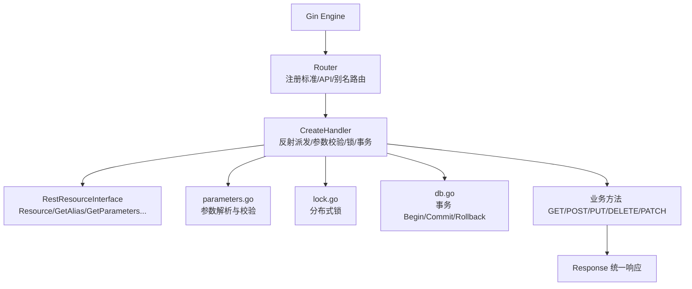
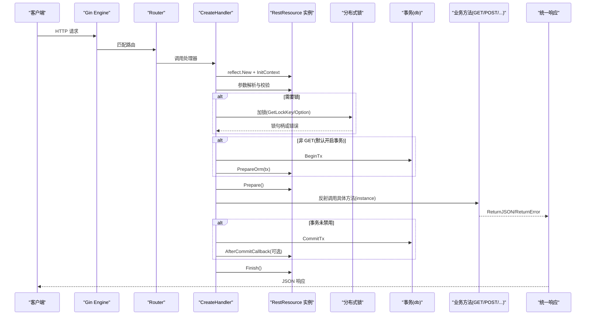
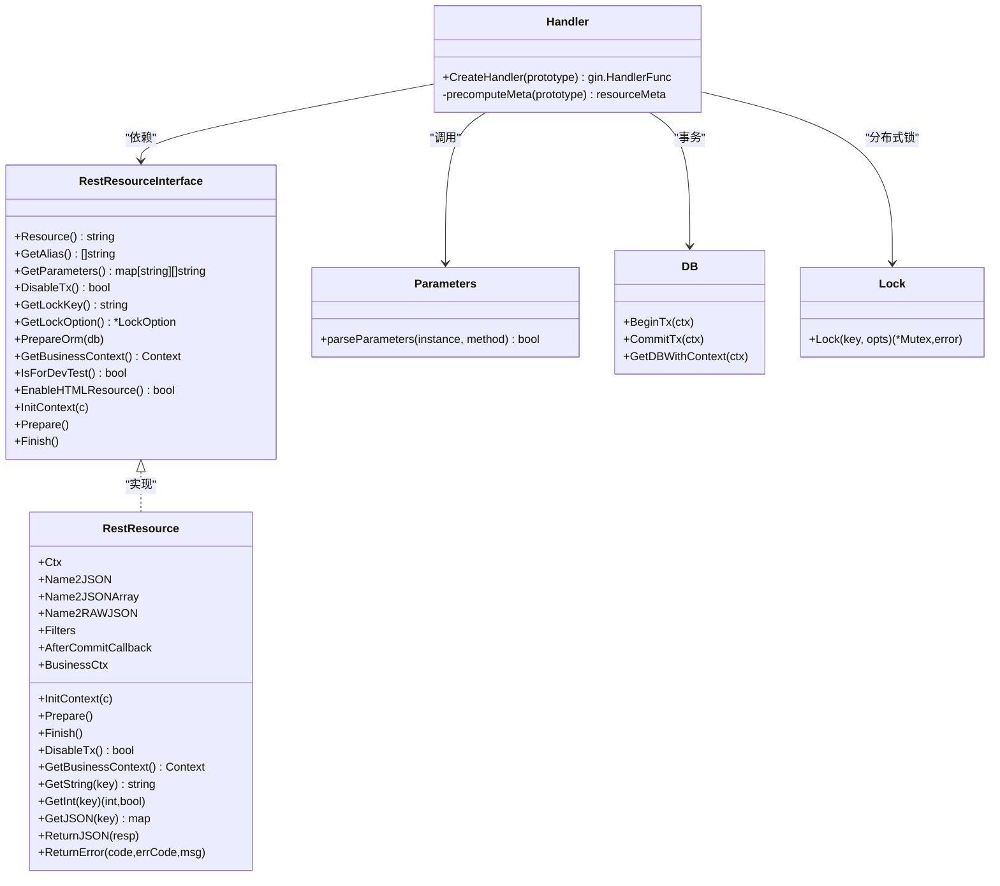

# RestResource 体系

<cite>
**本文引用的文件**
- [rest_resource.go](file://vanilla/rest_resource.go)
- [handler.go](file://vanilla/handler.go)
- [router.go](file://vanilla/router.go)
- [parameters.go](file://vanilla/parameters.go)
- [business_model.go](file://vanilla/business_model.go)
- [response.go](file://vanilla/response.go)
- [register.go](file://middleware/register.go)
- [db.go](file://db/db.go)
- [lock.go](file://lock/lock.go)
- [README.md](file://README.md)
</cite>

## 目录
1. [简介](#简介)
2. [项目结构](#项目结构)
3. [核心组件](#核心组件)
4. [架构总览](#架构总览)
5. [详细组件分析](#详细组件分析)
6. [依赖关系分析](#依赖关系分析)
7. [性能与并发特性](#性能与并发特性)
8. [故障排查指南](#故障排查指南)
9. [结论](#结论)
10. [附录：使用示例与最佳实践](#附录使用示例与最佳实践)

## 简介
本技术文档围绕 RestResource 体系展开，系统性阐述接口设计、生命周期管理、每请求实例化机制、业务上下文注入、参数解析与校验、事务与分布式锁集成等关键能力。目标是帮助开发者快速理解并正确使用该框架，编写高内聚、低耦合、并发安全的 REST 资源。

## 项目结构
RestResource 体系位于 vanilla 包中，并与 db、lock、middleware 等模块协作，形成“路由注册 → 处理器调度 → 参数校验 → 锁/事务 → 业务方法 → 提交/收尾”的完整链路。

图表来源
- [router.go:16-56](file://vanilla/router.go#L16-L56)
- [handler.go:29-141](file://vanilla/handler.go#L29-L141)
- [rest_resource.go:13-44](file://vanilla/rest_resource.go#L13-L44)
- [parameters.go:12-123](file://vanilla/parameters.go#L12-L123)
- [lock.go:51-69](file://lock/lock.go#L51-L69)
- [db.go:68-91](file://db/db.go#L68-L91)

章节来源
- [router.go:16-56](file://vanilla/router.go#L16-L56)
- [handler.go:29-141](file://vanilla/handler.go#L29-L141)

## 核心组件
- RestResourceInterface：REST 资源的契约接口，定义资源名、URL 别名、参数声明、事务开关、分布式锁、ORM 准备钩子、业务上下文获取、开发测试标记、HTML 资源开关以及 Gin 生命周期方法。
- RestResource：基类，提供默认实现、参数获取辅助方法、统一响应封装、事务提交后回调字段、业务上下文注入字段。
- CreateHandler：创建 Gin 处理器，负责每请求实例化、参数校验、分布式锁、事务管理、方法派发、指标记录与 Finish 调用。
- Router：将资源注册到 Gin，生成标准 URL、API URL 和别名 URL。
- parameters.go：根据 GetParameters() 声明解析并校验查询参数，支持 string/int/float/bool/json/json-raw/json-array 及过滤器 __f-*。
- business_model.go：业务上下文工厂、RepositoryBase/ServiceBase/EntityBase 基类，提供从 context 获取 DB 的能力。
- response.go：统一响应结构体与构造方法。
- middleware/register.go：中间件一站式注册（含 JWT 认证、Tracing、Metrics、CORS、MethodOverride、RequestLog）。
- db.go：全局数据库初始化、事务注入 context、自动感知事务的 DB 获取。
- lock.go：分布式锁抽象与 Redis/Dummy 实现。

章节来源
- [rest_resource.go:13-132](file://vanilla/rest_resource.go#L13-L132)
- [handler.go:15-170](file://vanilla/handler.go#L15-L170)
- [router.go:16-69](file://vanilla/router.go#L16-L69)
- [parameters.go:12-128](file://vanilla/parameters.go#L12-L128)
- [business_model.go:10-72](file://vanilla/business_model.go#L10-L72)
- [response.go:13-55](file://vanilla/response.go#L13-L55)
- [register.go:28-71](file://middleware/register.go#L28-L71)
- [db.go:25-119](file://db/db.go#L25-L119)
- [lock.go:11-69](file://lock/lock.go#L11-L69)

## 架构总览
下图展示了从请求进入至返回响应的完整流程，包括参数校验、分布式锁、事务、业务方法执行、提交与收尾。

图表来源
- [handler.go:42-141](file://vanilla/handler.go#L42-L141)
- [parameters.go:14-123](file://vanilla/parameters.go#L14-L123)
- [lock.go:66-69](file://lock/lock.go#L66-L69)
- [db.go:68-91](file://db/db.go#L68-L91)
- [rest_resource.go:89-132](file://vanilla/rest_resource.go#L89-L132)

## 详细组件分析

### RestResourceInterface 接口设计原理
- Resource()：返回点分格式的资源名，用于生成路由路径与元数据缓存键。
- GetAlias()：返回一组 URL 别名，便于兼容旧地址或对外暴露不同命名空间。
- GetParameters()：声明各 HTTP Method 的参数规则，支持可选参数（?前缀）与类型（string/int/float/bool/json/json-raw/json-array），由框架自动解析与校验。
- DisableTx()：控制是否关闭事务；默认 GET 关闭，其他方法开启。
- GetLockKey()/GetLockOption()：配置分布式锁 key 与选项，空 key 表示不加锁。
- PrepareOrm(db)：在事务开启前的 ORM 准备钩子，可用于设置连接属性或预加载。
- GetBusinessContext()：获取业务上下文，优先返回已注入的业务上下文，否则回退到 gin.Context.Request.Context()。
- IsForDevTest()/EnableHTMLResource()：控制开发测试资源与 HTML 资源开关。
- InitContext/Prepare/Finish：Gin 生命周期钩子，分别用于初始化上下文、预处理与收尾清理。

章节来源
- [rest_resource.go:13-44](file://vanilla/rest_resource.go#L13-L44)
- [rest_resource.go:106-132](file://vanilla/rest_resource.go#L106-L132)

### RestResource 基类与生命周期
- InitContext(c)：保存 gin.Context 并初始化参数容器（Name2JSON、Name2JSONArray、Name2RAWJSON、Filters）。
- Prepare()：默认空实现，供子类进行业务前置处理。
- Finish()：默认空实现，供子类进行后置清理。
- 默认行为：
  - DisableTx()：GET 请求默认关闭事务。
  - GetBusinessContext()：优先返回 BusinessCtx，其次 Request.Context()，最后 Background。
  - 参数获取辅助方法：GetString/GetInt/GetFloat/GetBool/GetJSON/GetJSONArray/GetIntArray/GetStringArray/GetFilters。
  - 统一响应：ReturnJSON/ReturnJSONWithCallback/ReturnError。

章节来源
- [rest_resource.go:71-132](file://vanilla/rest_resource.go#L71-L132)
- [rest_resource.go:262-278](file://vanilla/rest_resource.go#L262-L278)

### 每请求实例化与并发安全
- CreateHandler 在启动时通过 precomputeMeta 预计算资源类型、方法句柄、参数声明、锁配置等元数据，并缓存于 metaCache。
- 每个请求通过 reflect.New(resourceType) 创建独立实例，避免共享可变状态，确保并发安全。
- 元数据只读且线程安全，运行时仅访问当前请求实例字段。

章节来源
- [handler.go:29-45](file://vanilla/handler.go#L29-L45)
- [handler.go:144-170](file://vanilla/handler.go#L144-L170)

### 参数解析与校验
- parseParameters 依据 GetParameters() 声明逐条解析查询参数：
  - 可选参数以 ? 前缀标识。
  - 类型支持 string/int/float/bool/json/json-raw/json-array。
  - json 类型会存入 Name2JSON，json-array 存入 Name2JSONArray，json-raw 存入 Name2RAWJSON。
  - filters 特殊键会写入 Filters。
  - 自动识别 __f-* 过滤器键，解析操作符 in/notin/range 等。
- 校验失败时直接返回统一错误响应。

章节来源
- [parameters.go:12-123](file://vanilla/parameters.go#L12-L123)

### 事务管理与钩子
- 默认非 GET 请求开启事务；可通过 DisableTx() 覆盖。
- 事务生命周期：
  - BeginTx：在调用 Prepare 之前开启，并将事务上下文注入到 gin.Context。
  - PrepareOrm：允许在事务开启前对 ORM 进行准备。
  - CommitTx：在业务方法执行完成后提交；若失败返回统一错误响应。
  - BeforeCommitCallback：全局事务提交前回调，可在此做审计或幂等检查。
  - AfterCommitCallback：资源实例级事务提交后回调，适合发送消息或缓存更新。
- 异常保护：recover 捕获 panic 并 Rollback，再向上抛出。

章节来源
- [handler.go:74-132](file://vanilla/handler.go#L74-L132)
- [db.go:68-115](file://db/db.go#L68-L115)

### 分布式锁
- 当 GetLockKey() 返回非空字符串时，框架会在参数校验之后、事务之前尝试加锁。
- 支持自定义 LockOption（超时、重试次数等），默认使用 NewLockOption(key)。
- 加锁失败返回统一错误响应；成功则在 defer 中释放锁。
- 锁引擎支持 Redis 实现与 Dummy 实现（开发环境）。

章节来源
- [handler.go:54-72](file://vanilla/handler.go#L54-L72)
- [lock.go:51-69](file://lock/lock.go#L51-L69)

### 业务上下文 BusinessCtx 的注入与使用
- IBusinessContextFactory：项目实现此工厂，决定哪些信息注入到 context。
- SetBusinessContextFactory/GetBusinessContextFactory：设置/获取全局工厂。
- 中间件（如 JWTAuthMiddleware）在认证后将业务上下文放入 gin.Context 的指定 key。
- RestResource.GetBusinessContext()：优先返回已注入的 BusinessCtx，否则回退到 Request.Context()。
- RepositoryBase/ServiceBase/EntityBase：通过 Ctx 获取 DB，自动感知事务。

章节来源
- [business_model.go:10-72](file://vanilla/business_model.go#L10-L72)
- [rest_resource.go:123-132](file://vanilla/rest_resource.go#L123-L132)
- [register.go:28-71](file://middleware/register.go#L28-L71)

### 路由与别名
- Router 根据 Resource() 返回值生成标准路径与 API 路径，并支持别名。
- 标准路径：/account/corp/
- API 路径：/account/api/corp/
- 别名路径：通过 GetAlias() 自定义，自动补全前缀/后缀。

章节来源
- [router.go:16-56](file://vanilla/router.go#L16-L56)

## 依赖关系分析

图表来源
- [rest_resource.go:13-132](file://vanilla/rest_resource.go#L13-L132)
- [handler.go:29-170](file://vanilla/handler.go#L29-L170)
- [parameters.go:12-123](file://vanilla/parameters.go#L12-L123)
- [db.go:68-115](file://db/db.go#L68-L115)
- [lock.go:51-69](file://lock/lock.go#L51-L69)

章节来源
- [rest_resource.go:13-132](file://vanilla/rest_resource.go#L13-L132)
- [handler.go:29-170](file://vanilla/handler.go#L29-L170)

## 性能与并发特性
- 启动时预计算元数据：减少运行时反射开销，提升请求处理性能。
- 每请求独立实例：避免共享状态导致的竞争条件，天然并发安全。
- 参数解析一次性完成：按声明解析并校验，减少重复逻辑。
- 事务仅在必要时开启：默认 GET 关闭事务，降低写操作的额外成本。
- 分布式锁按需启用：仅在需要时加锁，避免不必要的阻塞。
- 指标采集：EndpointCounter/EndpointDuration 统计端点调用与耗时，便于监控与优化。

[本节为通用性能讨论，不直接分析具体文件]

## 故障排查指南
- 参数校验失败：
  - 现象：返回统一错误响应，包含 missing or invalid argument。
  - 排查：检查 GetParameters() 声明与请求参数是否匹配，注意可选参数前缀与类型。
  - 参考：[parameters.go:125-128](file://vanilla/parameters.go#L125-L128)
- 分布式锁获取失败：
  - 现象：返回 acquire_lock_failed。
  - 排查：确认 GetLockKey() 与 GetLockOption() 配置，检查 Redis 连通性与锁超时设置。
  - 参考：[handler.go:62-71](file://vanilla/handler.go#L62-L71)
- 事务提交失败：
  - 现象：返回 tx_commit_failed。
  - 排查：检查业务方法中的数据库操作是否正确，是否存在唯一约束冲突或外键约束失败。
  - 参考：[handler.go:116-132](file://vanilla/handler.go#L116-L132)
- 业务上下文为空：
  - 现象：GetBusinessContext() 返回空或无效上下文。
  - 排查：确认中间件已正确注入业务上下文，检查 JWT 认证是否跳过或失败。
  - 参考：[business_model.go:50-72](file://vanilla/business_model.go#L50-L72)

章节来源
- [parameters.go:125-128](file://vanilla/parameters.go#L125-L128)
- [handler.go:62-71](file://vanilla/handler.go#L62-L71)
- [handler.go:116-132](file://vanilla/handler.go#L116-L132)
- [business_model.go:50-72](file://vanilla/business_model.go#L50-L72)

## 结论
RestResource 体系通过清晰的接口契约、完善的生命周期管理、每请求实例化的并发安全模型，以及与事务、分布式锁、业务上下文的深度集成，提供了高效、稳定、易用的 REST 资源开发框架。开发者只需关注业务逻辑，即可快速构建高质量的微服务接口。

[本节为总结性内容，不直接分析具体文件]

## 附录：使用示例与最佳实践
- 继承 RestResource 定义资源：
  - 实现 Resource() 返回点分资源名。
  - 实现 GetParameters() 声明各方法的参数规则。
  - 根据需要实现 GetLockKey()/GetLockOption() 配置分布式锁。
  - 在业务方法中使用 GetString/GetInt/GetJSON 等辅助方法获取参数。
  - 使用 ReturnJSON/ReturnError 返回统一响应。
  - 使用 GetBusinessContext() 获取业务上下文，并通过 RepositoryBase/ServiceBase 访问数据库。
- 事务控制：
  - 默认非 GET 开启事务；如需关闭，重写 DisableTx()。
  - 使用 PrepareOrm() 在事务开启前准备 ORM。
  - 使用 AfterCommitCallback 或 ReturnJSONWithCallback 设置提交后回调。
- 过滤器查询：
  - 使用 __f-* 参数传递过滤条件，框架自动解析到 Filters。
  - 在业务层通过 ApplyFilters 组合查询条件。
- 中间件配置：
  - 使用 Register 一站式注册中间件，包括 CORS、JWT、Metrics、Tracing、RequestLog 等。
  - 通过 Options 控制功能开关与自定义中间件。

章节来源
- [README.md:76-147](file://README.md#L76-L147)
- [rest_resource.go:89-132](file://vanilla/rest_resource.go#L89-L132)
- [parameters.go:100-123](file://vanilla/parameters.go#L100-L123)
- [register.go:28-71](file://middleware/register.go#L28-L71)