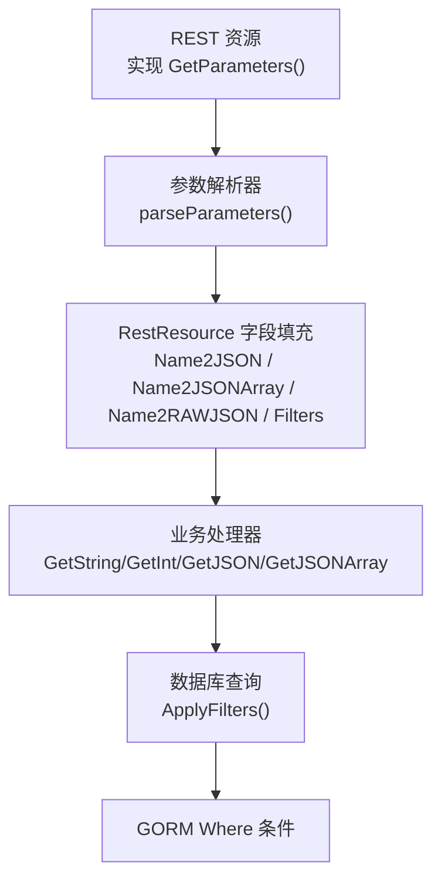
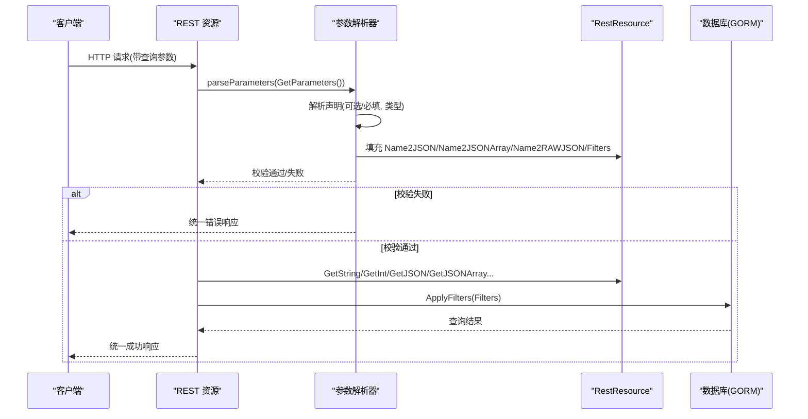
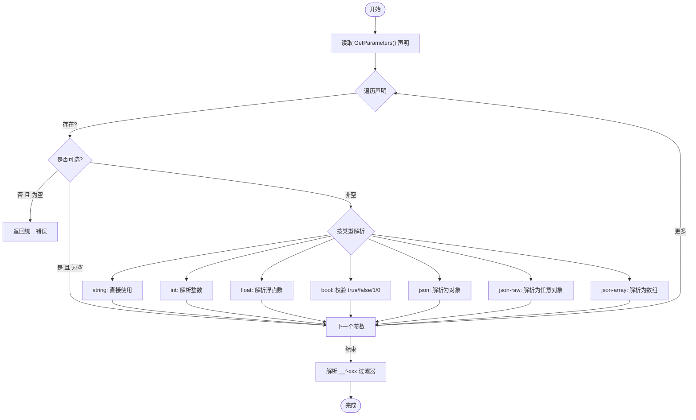
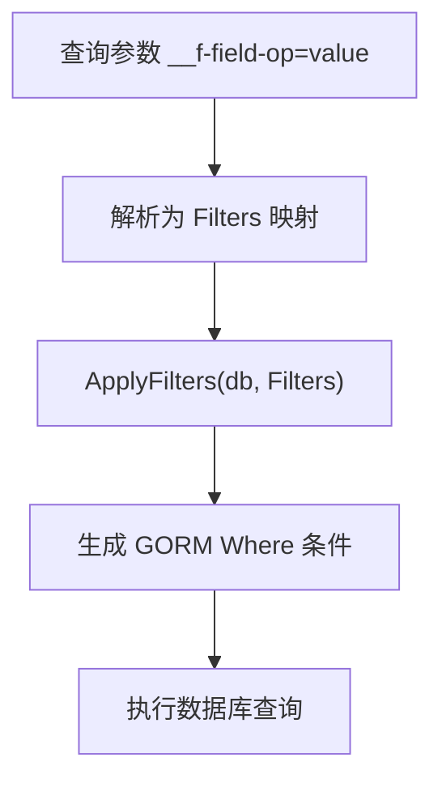
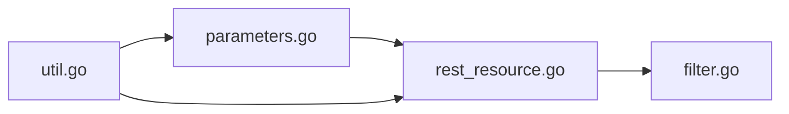

# 参数处理

<cite>
**本文引用的文件**
- [vanilla/parameters.go](file://vanilla/parameters.go)
- [vanilla/rest_resource.go](file://vanilla/rest_resource.go)
- [vanilla/util.go](file://vanilla/util.go)
- [db/filter.go](file://db/filter.go)
- [README.md](file://README.md)
</cite>

## 目录
1. [简介](#简介)
2. [项目结构](#项目结构)
3. [核心组件](#核心组件)
4. [架构总览](#架构总览)
5. [详细组件分析](#详细组件分析)
6. [依赖关系分析](#依赖关系分析)
7. [性能考量](#性能考量)
8. [故障排查指南](#故障排查指南)
9. [结论](#结论)
10. [附录](#附录)

## 简介
本技术文档围绕声明式参数校验与获取机制展开，覆盖 GetParameters() 的语法规范、支持的参数类型及转换规则、可选与必填参数的处理方式、常用参数获取方法（GetString、GetInt、GetJSON、GetJSONArray 等）的使用方式，以及过滤器 Filters 的构建与查询条件生成。同时提供错误处理与扩展点说明，帮助开发者在 REST 资源中安全、一致地处理请求参数。

## 项目结构
参数处理相关能力集中在 vanilla 包与 db 包：
- vanilla/parameters.go：解析并校验 GetParameters() 声明的参数，填充到 RestResource 的字段中。
- vanilla/rest_resource.go：定义 RestResource 基类与参数获取辅助方法（GetString、GetInt、GetJSON 等），并提供统一响应方法。
- vanilla/util.go：提供基础类型解析工具函数（parseInt、parseFloat、parseBool 等）。
- db/filter.go：将 vanilla 风格的 __f-字段-操作符 过滤器转换为 GORM Where 条件。
- README.md：包含示例用法与 Filter 协议说明。

图表来源
- [vanilla/parameters.go:14-123](file://vanilla/parameters.go#L14-L123)
- [vanilla/rest_resource.go:71-260](file://vanilla/rest_resource.go#L71-L260)
- [db/filter.go:21-61](file://db/filter.go#L21-L61)

章节来源
- [vanilla/parameters.go:14-123](file://vanilla/parameters.go#L14-L123)
- [vanilla/rest_resource.go:71-260](file://vanilla/rest_resource.go#L71-L260)
- [db/filter.go:21-61](file://db/filter.go#L21-L61)
- [README.md:76-135](file://README.md#L76-L135)

## 核心组件
- 声明式参数校验：通过 GetParameters() 返回 map[HTTP方法][]字符串声明，框架自动解析、校验并填充到 RestResource。
- 参数获取 API：RestResource 提供 GetString、GetInt、GetFloat、GetBool、GetJSON、GetJSONArray、GetIntArray、GetStringArray、GetFilters 等方法。
- 过滤器协议：__f-字段-操作符 形式的查询参数，自动转换为 GORM Where 条件。
- 错误处理：参数校验失败时返回统一错误格式，便于客户端识别。

章节来源
- [vanilla/rest_resource.go:13-44](file://vanilla/rest_resource.go#L13-L44)
- [vanilla/rest_resource.go:136-260](file://vanilla/rest_resource.go#L136-L260)
- [vanilla/parameters.go:14-123](file://vanilla/parameters.go#L14-L123)
- [db/filter.go:21-61](file://db/filter.go#L21-L61)

## 架构总览
下图展示了从声明到校验、再到数据获取与过滤的完整流程：

图表来源
- [vanilla/parameters.go:14-123](file://vanilla/parameters.go#L14-L123)
- [vanilla/rest_resource.go:136-260](file://vanilla/rest_resource.go#L136-L260)
- [db/filter.go:21-61](file://db/filter.go#L21-L61)

## 详细组件分析

### 声明式参数校验：GetParameters() 语法与行为
- 语法规范
  - 返回值类型为 map[string][]string，键为 HTTP 方法（如 "GET"、"POST"），值为该方法的参数声明列表。
  - 每个声明形如 "?id:int" 或 "name:string"：
    - "?" 前缀表示可选参数；无前缀表示必填参数。
    - ":" 后接类型名，支持 string、int、float、bool、json、json-raw、json-array。未指定类型时默认为 string。
- 解析与校验流程
  - 遍历声明，读取对应 Query 参数值。
  - 若值为空且为必填，则返回统一错误响应并终止处理。
  - 根据类型进行转换与校验：
    - string：直接保留。
    - int：尝试解析整数，失败返回错误。
    - float：尝试解析浮点数，失败返回错误。
    - bool：仅接受 true/false/1/0（不区分大小写），否则返回错误。
    - json：解析为 map[string]interface{}，若 key 为 "filters"，则写入 Filters；否则写入 Name2JSON。
    - json-raw：解析为 interface{}，写入 Name2RAWJSON。
    - json-array：解析为 []interface{}，写入 Name2JSONArray。
  - 额外处理 __f-xxx 过滤器：
    - 对以 "__f" 开头的查询键，按 "field-op" 形式解析，支持 in/notin/range 等特殊操作符，将值写入 Filters。
- 错误响应
  - 校验失败时返回统一 JSON 错误体，包含错误码与消息，便于客户端识别。

图表来源
- [vanilla/parameters.go:14-123](file://vanilla/parameters.go#L14-L123)

章节来源
- [vanilla/parameters.go:14-123](file://vanilla/parameters.go#L14-L123)

### 支持的参数类型与转换规则
- string：默认类型，无需额外校验。
- int：使用整数解析，失败视为无效参数。
- float：使用浮点数解析，失败视为无效参数。
- bool：仅接受 true/false/1/0（不区分大小写），其他值视为无效。
- json：必须为合法 JSON 对象；若参数名为 filters，则合并到 Filters；否则存入 Name2JSON。
- json-raw：必须为合法 JSON 任意类型；存入 Name2RAWJSON。
- json-array：必须为合法 JSON 数组；存入 Name2JSONArray。

章节来源
- [vanilla/parameters.go:54-97](file://vanilla/parameters.go#L54-L97)
- [vanilla/parameters.go:100-120](file://vanilla/parameters.go#L100-L120)

### 可选参数与必填参数
- 可选参数：以 "?" 前缀声明，缺失时不会报错，跳过后续处理。
- 必填参数：无前缀，缺失时立即返回统一错误响应，终止当前请求处理。

章节来源
- [vanilla/parameters.go:31-52](file://vanilla/parameters.go#L31-L52)

### 参数获取方法使用示例
以下方法均在 RestResource 上提供，用于在业务处理器中安全获取已校验的参数：
- GetString(key)：获取 string 参数。
- GetStringDefault(key, def)：获取 string 参数，缺省时返回默认值。
- GetInt(key)：获取 int 参数，返回 (值, 是否存在)。
- GetIntDefault(key, def)：获取 int 参数，缺省时返回默认值。
- GetInt64(key)：获取 int64 参数，返回 (值, 是否存在)。
- GetFloat(key)：获取 float64 参数，返回 (值, 是否存在)。
- GetBool(key)：获取 bool 参数，返回 (值, 是否存在)。
- GetJSON(key)：获取 json 对象参数，返回 map[string]interface{}。
- GetJSONArray(key)：获取 json 数组参数，返回 []interface{}。
- GetIntArray(key)：将 json 数组转为 []int（忽略无法转换的元素）。
- GetStringArray(key)：将 json 数组转为 []string（仅保留字符串元素）。
- GetFilters()：获取过滤器映射，供数据库查询使用。

使用建议：
- 对于必填参数，建议在 GetParameters() 中声明为必填，由框架保证存在性与类型正确性。
- 对于可选参数，可使用 GetStringDefault/GetIntDefault 等方法提供默认值。
- 对于复杂结构，优先使用 json/json-array 声明，并通过 GetJSON/GetJSONArray 获取。

章节来源
- [vanilla/rest_resource.go:136-260](file://vanilla/rest_resource.go#L136-L260)

### 过滤器 Filters 的使用场景与查询条件构建
- 过滤器协议
  - 查询参数形如 __f-字段-操作符=值，例如：
    - __f-name-contain=张 → 模糊匹配
    - __f-age-gt=18 → 大于
    - __f-status-in=["1","2"] → IN 列表
    - __f-created_at-range=["2024-01-01","2024-12-31"] → 范围查询
- 自动解析
  - 参数解析阶段会将 __f-xxx 形式的查询参数提取并写入 Filters。
  - 对于 in/notin/range 等操作符，值可为 JSON 数组；否则为标量值。
- 查询构建
  - 在业务层调用 db.ApplyFilters(db, r.GetFilters())，将 Filters 转换为 GORM Where 条件。
  - 支持的操作符包括 equal、contain、gt、gte、lt、lte、in、notin、range。

图表来源
- [vanilla/parameters.go:100-120](file://vanilla/parameters.go#L100-L120)
- [db/filter.go:21-61](file://db/filter.go#L21-L61)

章节来源
- [vanilla/parameters.go:100-120](file://vanilla/parameters.go#L100-L120)
- [db/filter.go:21-61](file://db/filter.go#L21-L61)
- [README.md:121-135](file://README.md#L121-L135)

### 参数验证错误处理与自定义验证器
- 内置错误处理
  - 当参数缺失或类型不合法时，框架返回统一错误响应，包含错误码与消息，便于客户端识别与提示。
- 自定义验证器
  - 可在业务处理器中基于 GetXxx 方法的结果进行二次校验，并在必要时抛出业务错误（BusinessError）或系统错误（SystemError），由上层恢复机制统一处理。
  - 也可在 GetParameters() 中增加更严格的声明（如限定枚举值），或在业务层结合过滤器进行组合校验。

章节来源
- [vanilla/parameters.go:125-128](file://vanilla/parameters.go#L125-L128)
- [vanilla/rest_resource.go:264-278](file://vanilla/rest_resource.go#L264-L278)

## 依赖关系分析
- vanilla/parameters.go 依赖 gin.Context 读取查询参数，并将解析结果写入 RestResource 的字段。
- vanilla/rest_resource.go 提供参数获取方法与统一响应方法，被业务处理器广泛使用。
- db/filter.go 依赖 GORM，将 Filters 转换为 Where 条件，供业务层查询使用。
- vanilla/util.go 提供基础类型解析工具，被 rest_resource 与 parameters 复用。

图表来源
- [vanilla/parameters.go:14-123](file://vanilla/parameters.go#L14-L123)
- [vanilla/rest_resource.go:136-260](file://vanilla/rest_resource.go#L136-L260)
- [vanilla/util.go:7-41](file://vanilla/util.go#L7-L41)
- [db/filter.go:21-61](file://db/filter.go#L21-L61)

章节来源
- [vanilla/parameters.go:14-123](file://vanilla/parameters.go#L14-L123)
- [vanilla/rest_resource.go:136-260](file://vanilla/rest_resource.go#L136-L260)
- [vanilla/util.go:7-41](file://vanilla/util.go#L7-L41)
- [db/filter.go:21-61](file://db/filter.go#L21-L61)

## 性能考量
- 参数解析仅在声明的方法范围内执行，避免不必要的开销。
- JSON 解析仅在声明为 json/json-raw/json-array 时触发，减少序列化成本。
- 过滤器转换采用字符串拼接与参数绑定，避免 SQL 注入风险并保持可读性。
- 建议在高频接口中尽量使用简单类型（string/int/float/bool）以减少解析与内存分配。

## 故障排查指南
- 常见错误
  - 必填参数缺失：检查 GetParameters() 声明是否正确，确认客户端传递了相应查询参数。
  - 类型不匹配：确保参数值符合声明类型（如 int/float/bool 的合法取值）。
  - JSON 解析失败：检查传入的 JSON 是否为合法格式。
  - 过滤器操作符不支持：确认使用的操作符在支持列表中（equal/contain/gt/gte/lt/lte/in/notin/range）。
- 定位步骤
  - 查看统一错误响应中的错误码与消息，定位具体参数与类型。
  - 在业务层打印 GetXxx 返回值，确认参数是否被正确解析与填充。
  - 检查 Filters 内容，确认 __f-xxx 参数是否被正确解析。

章节来源
- [vanilla/parameters.go:125-128](file://vanilla/parameters.go#L125-L128)
- [db/filter.go:21-61](file://db/filter.go#L21-L61)

## 结论
本参数处理系统通过声明式 GetParameters() 实现了统一的参数校验与转换，结合 RestResource 提供的丰富获取方法与过滤器协议，能够高效、安全地支撑 REST 资源的参数处理需求。开发者只需关注业务逻辑，即可享受一致的参数体验与错误处理机制。

## 附录
- 快速参考
  - 声明示例：{"GET": ["?id:int", "?uuid:string"], "POST": ["name:string", "data:json"]}
  - 过滤器示例：__f-name-contain=张&__f-age-gt=18&__f-status-in=["1","2"]
  - 获取方法：GetString/GetInt/GetFloat/GetBool/GetJSON/GetJSONArray/GetIntArray/GetStringArray/GetFilters

章节来源
- [README.md:76-135](file://README.md#L76-L135)