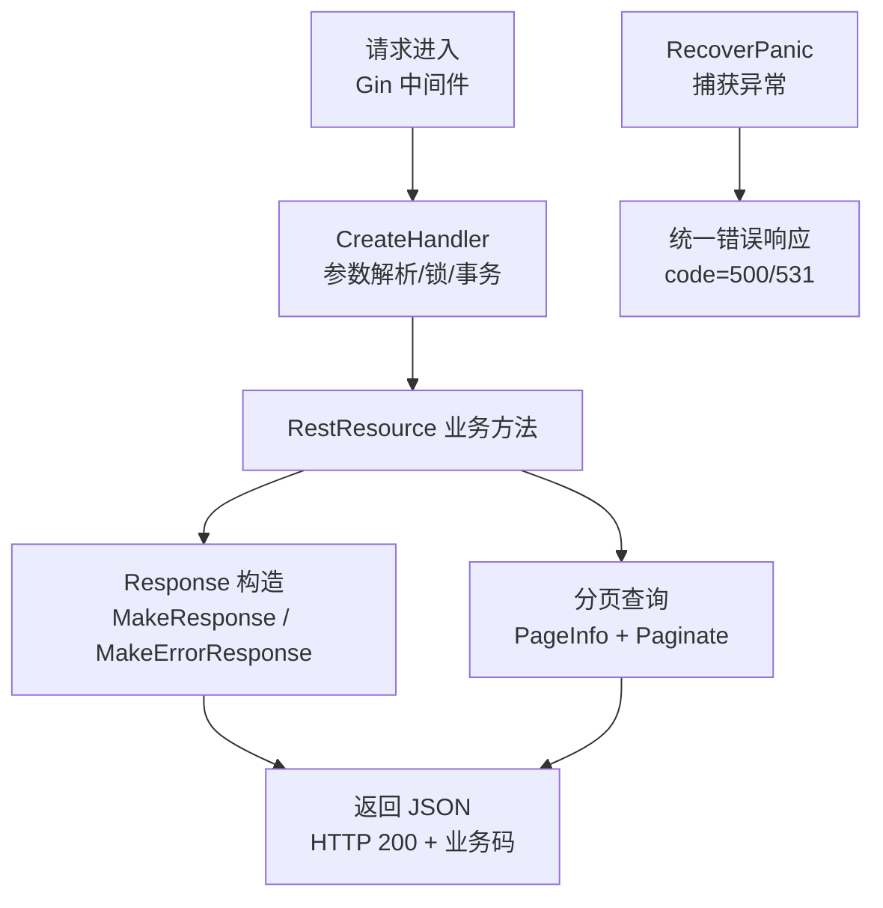
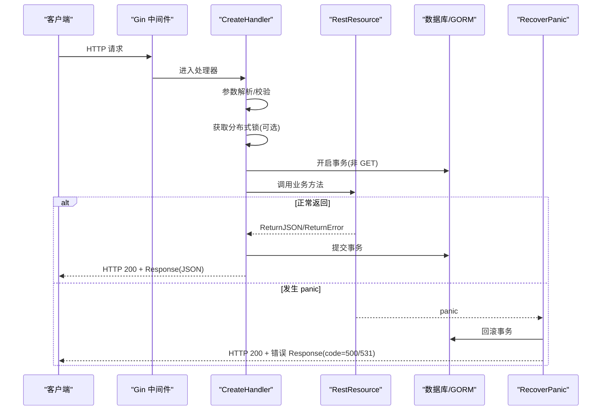
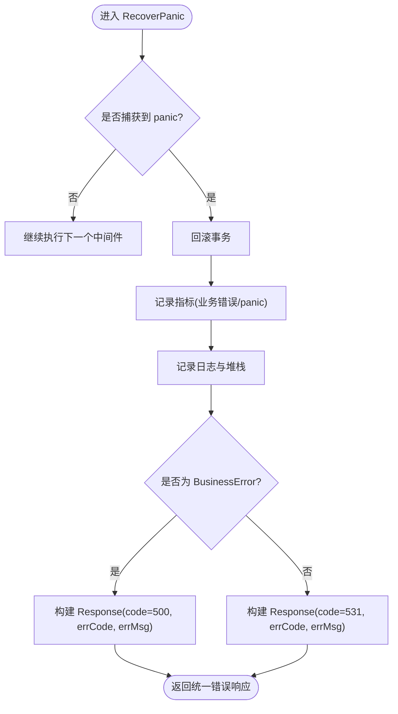
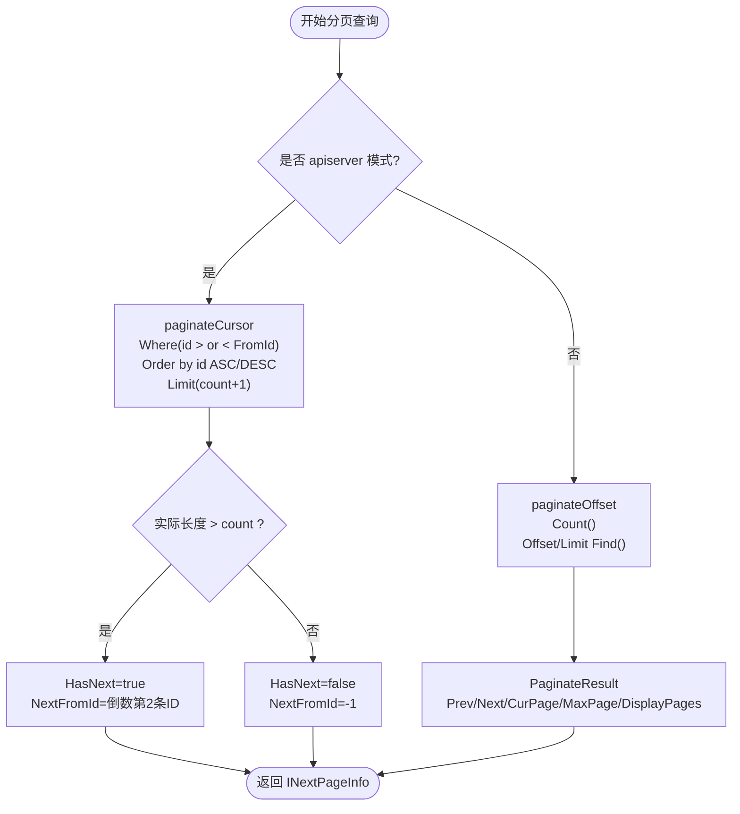
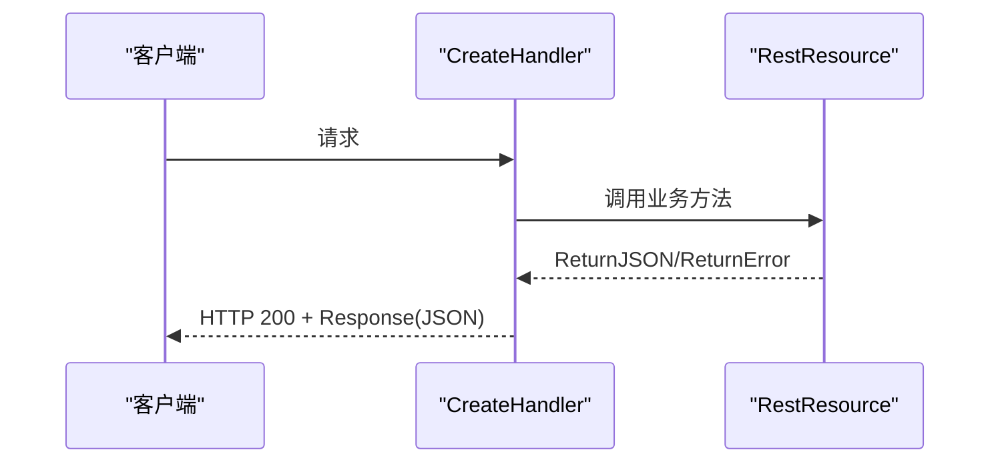
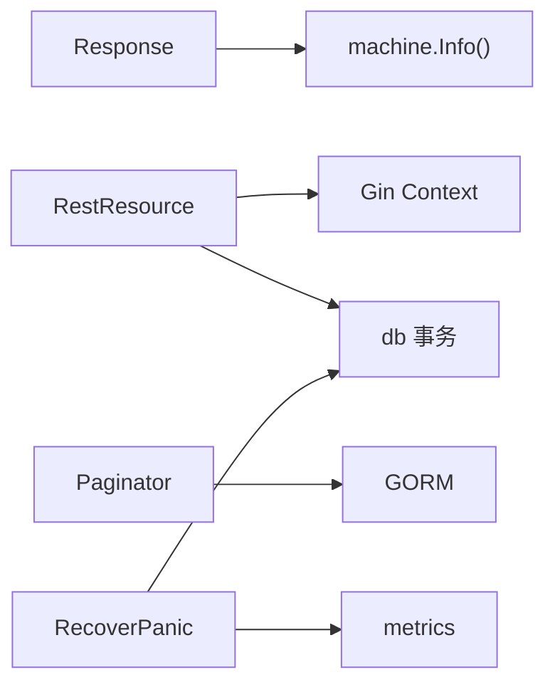

# 响应格式化

<cite>
**本文引用的文件**
- [response.go](file://vanilla/response.go)
- [error.go](file://vanilla/error.go)
- [recover.go](file://vanilla/recover.go)
- [page_info.go](file://vanilla/page_info.go)
- [paginator.go](file://vanilla/paginator.go)
- [rest_resource.go](file://vanilla/rest_resource.go)
- [handler.go](file://vanilla/handler.go)
- [util.go](file://vanilla/util.go)
- [business_model.go](file://vanilla/business_model.go)
</cite>

## 目录
1. [简介](#简介)
2. [项目结构](#项目结构)
3. [核心组件](#核心组件)
4. [架构总览](#架构总览)
5. [详细组件分析](#详细组件分析)
6. [依赖关系分析](#依赖关系分析)
7. [性能考量](#性能考量)
8. [故障排查指南](#故障排查指南)
9. [结论](#结论)
10. [附录：使用示例与最佳实践](#附录使用示例与最佳实践)

## 简介
本技术文档围绕“统一响应格式 Response”的设计与实现，系统化说明 code、errCode、errMsg、data 等字段的标准结构；解释成功与错误响应的构造方法（如 MakeResponse、MakeErrorResponse）；阐述分页响应处理（PageInfo、PaginateResult、APIServiceNextPageInfo）；提供常见场景的调用路径与示例指引；说明 HTTP 状态码与业务错误码的映射策略；并给出在不同环境下定制响应格式、以及压缩与缓存控制等高级特性的实践建议。

## 项目结构
该框架将响应相关能力集中在 vanilla 包中，核心文件职责如下：
- response.go：定义统一响应结构 Response 及构造工具函数
- error.go：定义 BusinessError 与系统/业务错误类型
- recover.go：Gin 恢复中间件，捕获 panic 并输出统一错误响应
- page_info.go：分页参数抽取与模式切换（后端页码 vs API 游标）
- paginator.go：分页查询实现（offset/limit 与 cursor）
- rest_resource.go：REST 资源基类，封装 ReturnJSON/ReturnError 等便捷方法
- handler.go：反射式路由分发，统一事务、锁、参数校验与指标记录
- util.go：基础解析工具
- business_model.go：上下文与数据库句柄获取



图表来源
- [handler.go:29-142](file://vanilla/handler.go#L29-L142)
- [response.go:13-54](file://vanilla/response.go#L13-L54)
- [page_info.go:7-62](file://vanilla/page_info.go#L7-L62)
- [paginator.go:62-135](file://vanilla/paginator.go#L62-L135)
- [recover.go:14-66](file://vanilla/recover.go#L14-L66)

章节来源
- [response.go:13-54](file://vanilla/response.go#L13-L54)
- [error.go:5-76](file://vanilla/error.go#L5-L76)
- [recover.go:14-66](file://vanilla/recover.go#L14-L66)
- [page_info.go:7-62](file://vanilla/page_info.go#L7-L62)
- [paginator.go:62-135](file://vanilla/paginator.go#L62-L135)
- [rest_resource.go:262-278](file://vanilla/rest_resource.go#L262-L278)
- [handler.go:29-142](file://vanilla/handler.go#L29-L142)

## 核心组件
- 统一响应结构 Response
  - 字段：code（业务状态码）、data（数据体）、errCode（业务错误码）、errMsg（用户可读错误信息）、innerErrMsg（内部错误信息，便于调试）、_pod（机器信息，用于定位问题）
  - 用途：所有接口统一以 JSON 形式返回，客户端通过 code 判断成功或失败，通过 errCode 进行错误分类处理
- 错误模型 BusinessError
  - 类型：业务错误（不推送监控）与系统错误（需要推送监控）
  - 行为：实现 error 接口，支持 NoPush 控制是否上报，IsNeedPush 决定上报策略
- 分页组件
  - PageInfo：分页参数（页码/游标、每页数量、方向、模式）
  - PaginateResult：经典分页结果（上一页/下一页、总页数、显示页码等）
  - APIServiceNextPageInfo：游标分页结果（是否有下一页、下一页游标）
- REST 资源基类 RestResource
  - 提供 ReturnJSON、ReturnError 等便捷方法，统一以 HTTP 200 返回业务码
  - 集成参数解析、过滤器、事务钩子等

章节来源
- [response.go:13-54](file://vanilla/response.go#L13-L54)
- [error.go:5-76](file://vanilla/error.go#L5-L76)
- [page_info.go:7-62](file://vanilla/page_info.go#L7-L62)
- [paginator.go:10-60](file://vanilla/paginator.go#L10-L60)
- [rest_resource.go:71-132](file://vanilla/rest_resource.go#L71-L132)
- [rest_resource.go:262-278](file://vanilla/rest_resource.go#L262-L278)

## 架构总览
请求从 Gin 进入，经过 CreateHandler 完成参数解析、分布式锁、事务开启、指标记录后，派发到具体业务方法。业务方法通过 RestResource.ReturnJSON/ReturnError 返回统一响应。若发生 panic，RecoverPanic 中间件会回滚事务、记录指标并返回统一错误响应。



图表来源
- [handler.go:29-142](file://vanilla/handler.go#L29-L142)
- [recover.go:14-66](file://vanilla/recover.go#L14-L66)
- [rest_resource.go:262-278](file://vanilla/rest_resource.go#L262-L278)

## 详细组件分析

### 统一响应结构 Response
- 设计要点
  - code：业务状态码，成功通常为 200，失败为自定义错误码（如 500、405 等）
  - data：成功时的数据体，可为任意类型（Map、结构体、切片等）
  - errCode：业务错误码，字符串形式，便于前端分类处理
  - errMsg：面向用户的错误提示
  - innerErrMsg：内部错误详情，便于排障
  - _pod：机器信息，辅助定位问题实例
- 构造方法
  - MakeResponse(data)：创建成功响应，默认 code=200
  - MakeResponseWithCode(code, data)：指定业务状态码的成功响应
  - MakeErrorResponse(code, errCode, errMsg, innerErrMsgs...)：构造错误响应，支持可选的内部错误信息

```mermaid
classDiagram
class Response {
+int32 Code
+interface{} Data
+string ErrCode
+string ErrMsg
+string InnerErrMsg
+map~string~interface~ MachineInfo
}
class RestResource {
+ReturnJSON(response)
+ReturnError(code, errCode, errMsg)
}
RestResource --> Response : "构造并返回"
```

图表来源
- [response.go:13-54](file://vanilla/response.go#L13-L54)
- [rest_resource.go:262-278](file://vanilla/rest_resource.go#L262-L278)

章节来源
- [response.go:13-54](file://vanilla/response.go#L13-L54)
- [rest_resource.go:262-278](file://vanilla/rest_resource.go#L262-L278)

### 错误处理与 Panic 恢复
- BusinessError
  - 区分业务错误与系统错误，支持是否需要推送监控
  - 可通过 NewBusinessError、NewSystemError、NewBusinessErrorFromError 创建
- RecoverPanic
  - 捕获 panic，回滚事务，记录指标，返回统一错误响应
  - 业务错误：code=500，携带 errCode 与 errMsg
  - 其他 panic：code=531，errCode 与 errMsg 为原始错误信息



图表来源
- [recover.go:14-66](file://vanilla/recover.go#L14-L66)
- [error.go:5-76](file://vanilla/error.go#L5-L76)

章节来源
- [recover.go:14-66](file://vanilla/recover.go#L14-L66)
- [error.go:5-76](file://vanilla/error.go#L5-L76)

### 分页响应处理
- 两种模式
  - backend 模式：基于页码与每页数量，使用 COUNT + LIMIT/OFFSET，返回 PaginateResult
  - apiserver 模式：基于游标，多取 1 条判断是否有下一页，返回 APIServiceNextPageInfo
- 参数抽取
  - ExtractPageInfoFromRequest：根据查询参数自动识别模式与参数
    - apiserver：_p_from、_p_count
    - backend：page、count_per_page
- 查询实现
  - Paginate：根据模式选择 paginateOffset 或 paginateCursor
  - paginateOffset：COUNT 计算总数，计算偏移与限制，查询数据
  - paginateCursor：按方向过滤 id，Limit(count+1)，截取前 count 条，计算 next_from_id



图表来源
- [page_info.go:36-62](file://vanilla/page_info.go#L36-L62)
- [paginator.go:62-135](file://vanilla/paginator.go#L62-L135)

章节来源
- [page_info.go:7-62](file://vanilla/page_info.go#L7-L62)
- [paginator.go:10-60](file://vanilla/paginator.go#L10-L60)
- [paginator.go:62-135](file://vanilla/paginator.go#L62-L135)

### REST 资源与响应方法
- RestResource 提供便捷方法：
  - ReturnJSON(response)：以 HTTP 200 返回统一 JSON
  - ReturnError(code, errCode, errMsg)：返回错误响应
  - ReturnJSONWithCallback(response, callback)：设置事务提交后回调
- 在 CreateHandler 中，参数解析、锁、事务、指标记录由框架统一处理，业务方法只需关注数据与响应构造



图表来源
- [rest_resource.go:262-278](file://vanilla/rest_resource.go#L262-L278)
- [handler.go:29-142](file://vanilla/handler.go#L29-L142)

章节来源
- [rest_resource.go:71-132](file://vanilla/rest_resource.go#L71-L132)
- [rest_resource.go:262-278](file://vanilla/rest_resource.go#L262-L278)
- [handler.go:29-142](file://vanilla/handler.go#L29-L142)

## 依赖关系分析
- 组件耦合
  - Response 依赖 machine.Info() 注入机器信息（用于定位问题）
  - RestResource 依赖 Gin Context 与 db 事务管理
  - Paginator 依赖 GORM 进行数据库查询
  - RecoverPanic 依赖 metrics 与 db 事务回滚
- 外部依赖
  - Gin：HTTP 框架与上下文
  - GORM：ORM 与事务
  - metrics：指标统计
  - lock：分布式锁



图表来源
- [response.go:23-38](file://vanilla/response.go#L23-L38)
- [rest_resource.go:71-132](file://vanilla/rest_resource.go#L71-L132)
- [paginator.go:62-135](file://vanilla/paginator.go#L62-L135)
- [recover.go:14-66](file://vanilla/recover.go#L14-L66)

章节来源
- [response.go:23-38](file://vanilla/response.go#L23-L38)
- [rest_resource.go:71-132](file://vanilla/rest_resource.go#L71-L132)
- [paginator.go:62-135](file://vanilla/paginator.go#L62-L135)
- [recover.go:14-66](file://vanilla/recover.go#L14-L66)

## 性能考量
- 分页优化
  - apiserver 模式采用游标分页，避免大 offset 的性能问题，适合大数据量与高并发
  - backend 模式使用 COUNT + LIMIT/OFFSET，适用于小数据集与后台管理
- 反射开销
  - CreateHandler 启动时预计算元数据，减少运行时反射成本
- 事务与锁
  - 仅在必要时开启事务（GET 默认关闭），降低锁竞争与事务开销
- 指标与可观测性
  - 通过 metrics 记录端点计数与耗时，便于性能分析与瓶颈定位

[本节为通用指导，无需特定文件引用]

## 故障排查指南
- 常见问题
  - 业务错误：检查 errCode 与 errMsg，确认业务逻辑是否正确抛出 BusinessError
  - 系统错误：查看 RecoverPanic 记录的堆栈与日志，定位 panic 原因
  - 分页异常：确认 PageInfo 模式与参数是否正确，检查数据库索引与排序字段
- 定位步骤
  - 通过 Response._pod 定位机器实例
  - 结合 metrics 与日志分析请求耗时与错误分布
  - 对分页查询，验证 where 条件与 order by 是否符合预期

章节来源
- [recover.go:14-66](file://vanilla/recover.go#L14-L66)
- [error.go:5-76](file://vanilla/error.go#L5-L76)
- [page_info.go:36-62](file://vanilla/page_info.go#L36-L62)
- [paginator.go:62-135](file://vanilla/paginator.go#L62-L135)

## 结论
本框架通过统一的 Response 结构与标准化的错误模型，实现了跨服务一致的响应格式与错误处理机制。分页组件支持两种模式以满足不同场景需求。借助 RestResource 与 CreateHandler，开发者可以专注于业务逻辑，而框架负责参数解析、事务、锁、指标与异常恢复。建议在大数据量场景优先使用游标分页，并结合指标与日志进行性能优化与问题定位。

[本节为总结，无需特定文件引用]

## 附录：使用示例与最佳实践

- 成功响应
  - 使用 MakeResponse(data) 返回数据
  - 使用 MakeResponseWithCode(code, data) 指定业务状态码
  - 通过 RestResource.ReturnJSON(response) 返回
  - 参考路径：[response.go:23-38](file://vanilla/response.go#L23-L38)、[rest_resource.go:262-278](file://vanilla/rest_resource.go#L262-L278)

- 错误响应
  - 使用 MakeErrorResponse(code, errCode, errMsg, innerErrMsgs...) 构造错误
  - 在业务逻辑中抛出 BusinessError，由 RecoverPanic 统一处理
  - 参考路径：[response.go:41-54](file://vanilla/response.go#L41-L54)、[error.go:44-76](file://vanilla/error.go#L44-L76)、[recover.go:14-66](file://vanilla/recover.go#L14-L66)

- 分页查询
  - 使用 ExtractPageInfoFromRequest(c) 获取 PageInfo
  - 调用 Paginate(db, page, container) 执行查询
  - 根据返回的 INextPageInfo 判断是否有下一页并组装数据
  - 参考路径：[page_info.go:36-62](file://vanilla/page_info.go#L36-L62)、[paginator.go:62-135](file://vanilla/paginator.go#L62-L135)

- HTTP 状态码与业务错误码映射
  - 框架统一返回 HTTP 200，业务状态通过 Response.code 表达
  - 方法不允许时返回 HTTP 405，但业务错误仍通过 code 表达
  - 参考路径：[handler.go:106-113](file://vanilla/handler.go#L106-L113)、[rest_resource.go:262-278](file://vanilla/rest_resource.go#L262-L278)

- 环境定制与扩展
  - 通过配置加载机制（config.Load）与环境变量覆盖，可在不同环境调整行为
  - 可自定义 BeforeCommitCallback 与 AfterCommitCallback，实现事务前后钩子
  - 参考路径：[config/config.go:21-60](file://config/config.go#L21-L60)、[rest_resource.go:46-69](file://vanilla/rest_resource.go#L46-L69)

- 响应压缩与缓存控制
  - 框架未内置压缩与缓存控制，建议在网关层或反向代理（如 Nginx）启用 gzip/brotli 与 Cache-Control
  - 对于静态或半静态数据，可在网关层设置缓存策略，减轻后端压力
  - 参考路径：[config/config.go:21-60](file://config/config.go#L21-L60)

- 最佳实践
  - 明确区分业务错误与系统错误，合理设置 errCode 与 errMsg
  - 大数据量分页优先使用 apiserver 模式（游标）
  - 利用 metrics 与日志进行性能监控与问题定位
  - 合理使用分布式锁，避免热点冲突

[本节为实践指导，无需特定文件引用]