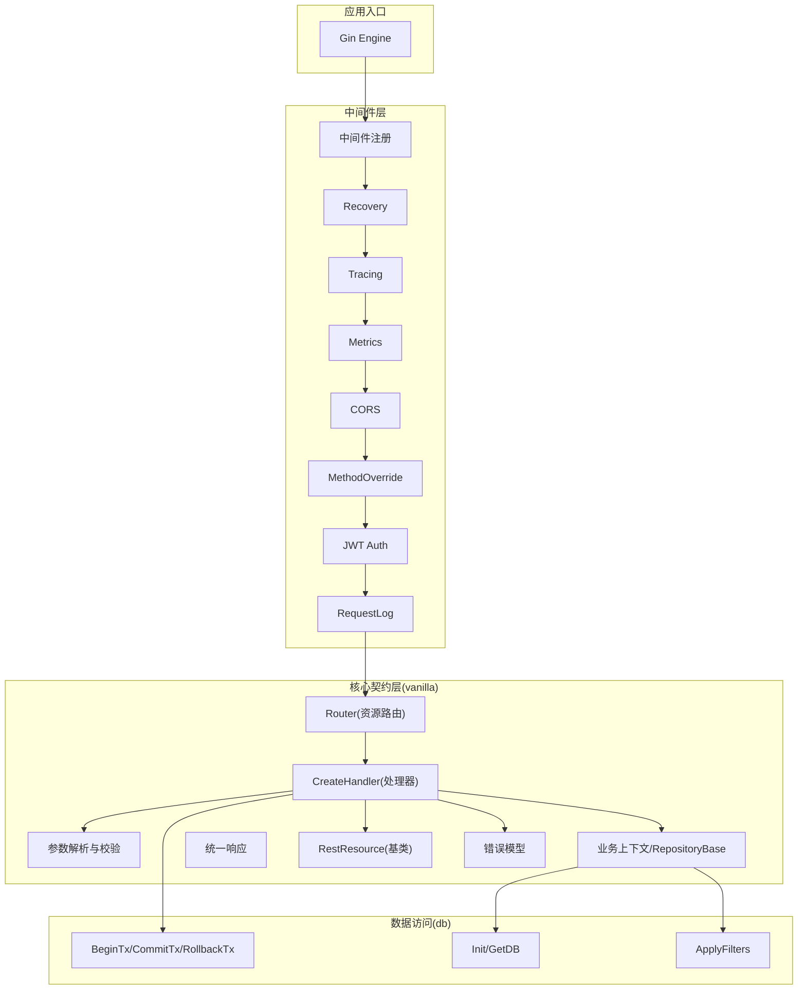
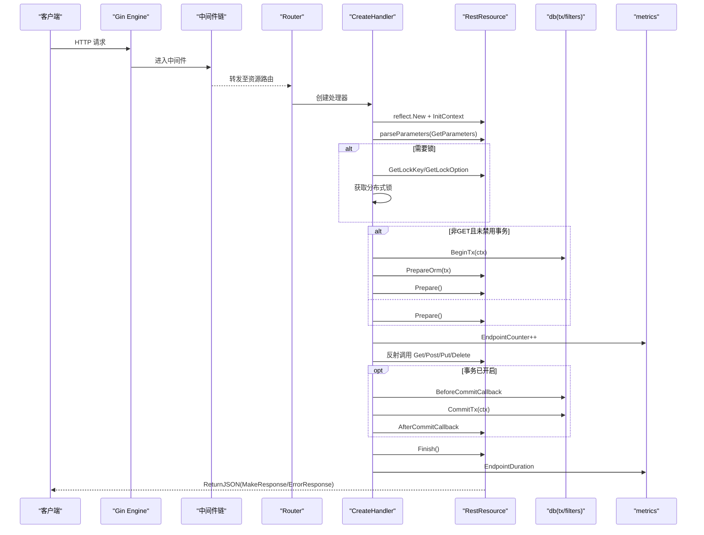
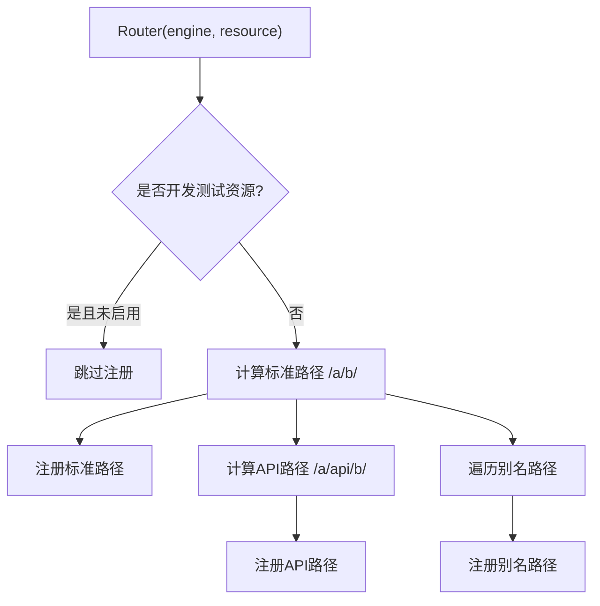
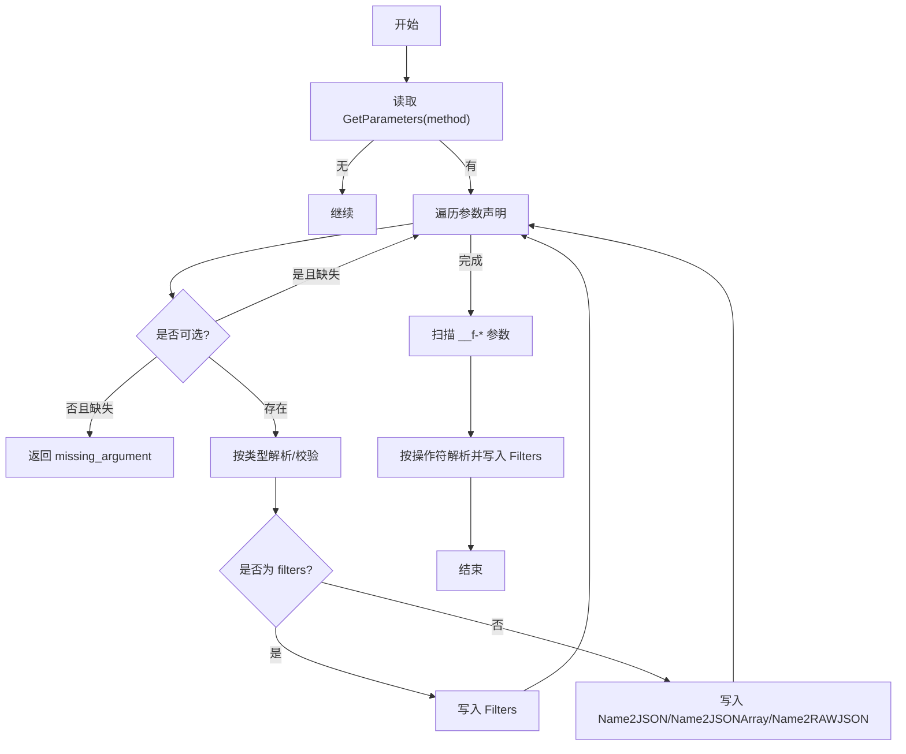
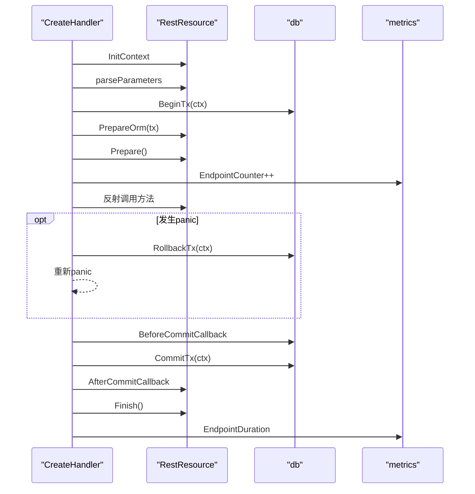
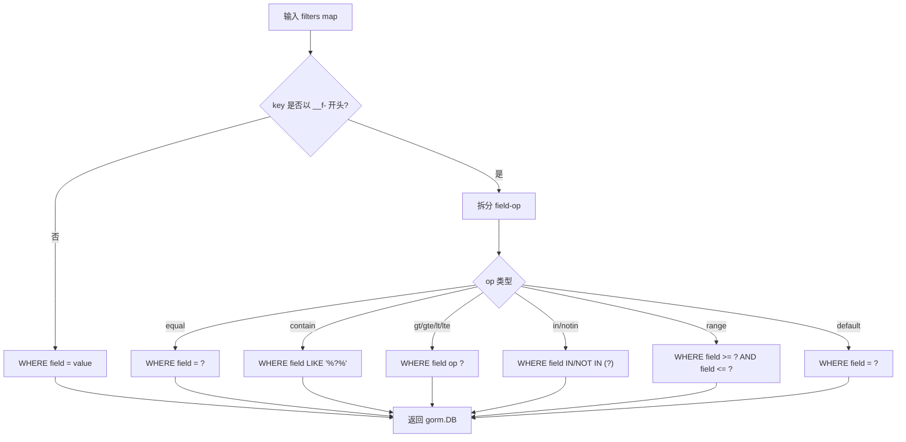
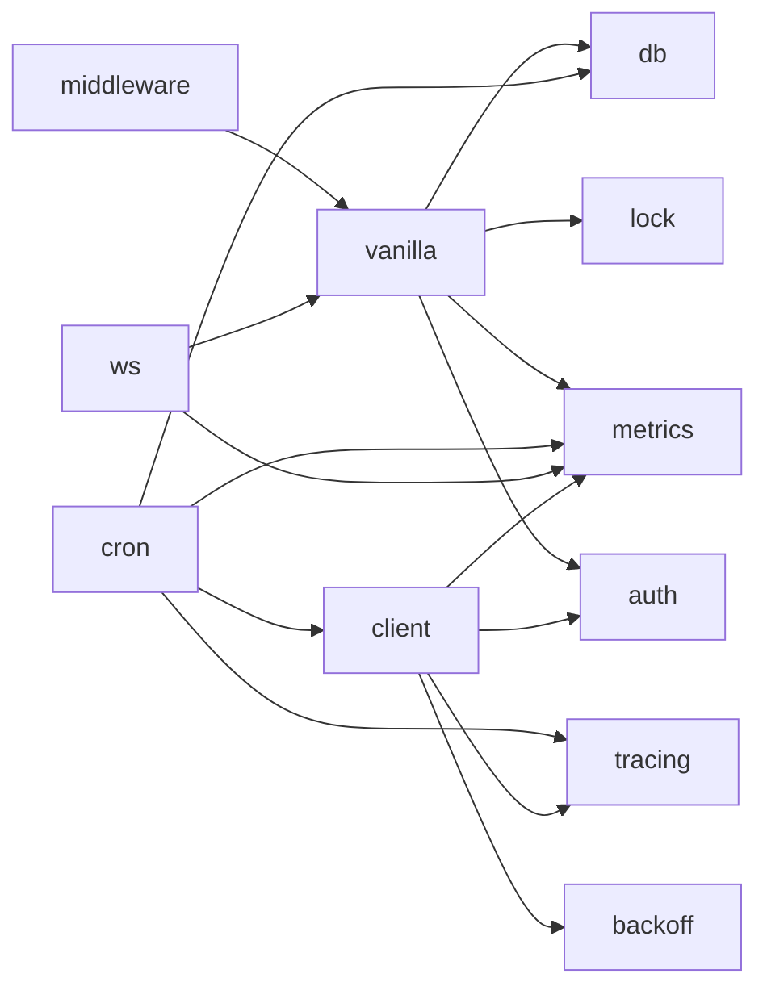

# 核心框架

<cite>
**本文引用的文件**
- [rest_resource.go](file://vanilla/rest_resource.go)
- [router.go](file://vanilla/router.go)
- [handler.go](file://vanilla/handler.go)
- [parameters.go](file://vanilla/parameters.go)
- [response.go](file://vanilla/response.go)
- [business_model.go](file://vanilla/business_model.go)
- [error.go](file://vanilla/error.go)
- [recover.go](file://vanilla/recover.go)
- [filter.go](file://db/filter.go)
- [db.go](file://db/db.go)
- [tx.go](file://db/tx.go)
- [register.go](file://middleware/register.go)
- [README.md](file://README.md)
- [ARCHITECTURE.md](file://ARCHITECTURE.md)
</cite>

## 目录
1. [简介](#简介)
2. [项目结构](#项目结构)
3. [核心组件](#核心组件)
4. [架构总览](#架构总览)
5. [详细组件分析](#详细组件分析)
6. [依赖关系分析](#依赖关系分析)
7. [性能考量](#性能考量)
8. [故障排查指南](#故障排查指南)
9. [结论](#结论)
10. [附录：使用示例与最佳实践](#附录使用示例与最佳实践)

## 简介
本技术文档围绕 Carina 核心框架的 RestResource 体系展开，系统性阐述声明式 API 定义、参数校验与转换、统一响应格式、路由注册机制；深入解释业务上下文的生命周期管理（事务自动开启/提交、panic 自动回滚）；说明 Filter 查询协议的实现原理与使用方法；并提供完整的使用示例与错误处理模式及最佳实践指导。

## 项目结构
Carina 采用分层与职责清晰的模块化设计：
- vanilla：核心契约层，包含 RestResource 接口与基类、路由注册、参数解析、统一响应、错误模型、Recovery、BusinessContext 等
- db：GORM 封装，提供驱动无关初始化、事务传播、ApplyFilters 过滤器转换
- middleware：Gin 中间件集合与一站式注册
- 其他模块：cache、lock、auth、config、cron、client、ws、tracing、metrics、snowflake、notify、lru、backoff、machine 等



图表来源
- [register.go:28-71](file://middleware/register.go#L28-L71)
- [router.go:16-64](file://vanilla/router.go#L16-L64)
- [handler.go:29-141](file://vanilla/handler.go#L29-L141)
- [parameters.go:12-123](file://vanilla/parameters.go#L12-L123)
- [db.go:25-91](file://db/db.go#L25-L91)
- [tx.go:10-37](file://db/tx.go#L10-L37)
- [filter.go:10-61](file://db/filter.go#L10-L61)

章节来源
- [ARCHITECTURE.md:12-45](file://ARCHITECTURE.md#L12-L45)
- [README.md:1-18](file://README.md#L1-L18)

## 核心组件
- RestResourceInterface/RestResource：REST 资源的契约与通用能力（参数获取、JSON 响应、错误响应、过滤器、生命周期钩子）
- Router/CreateHandler：约定式路由注册与请求派发（反射调用 Get/Post/Put/Delete），集成参数校验、分布式锁、事务管理、指标记录
- 参数解析：基于 GetParameters() 声明的强类型校验与 JSON 反序列化，支持可选参数与 filters 注入
- 统一响应：Response 结构体与 MakeResponse/MakeErrorResponse 工厂方法
- 业务上下文：IBusinessContextFactory、RepositoryBase/ServiceBase 自动感知事务
- 过滤器协议：__f-字段-操作符 到 GORM Where 条件转换
- 错误与恢复：BusinessError、RecoverPanic 中间件统一捕获并返回标准错误响应

章节来源
- [rest_resource.go:13-132](file://vanilla/rest_resource.go#L13-L132)
- [router.go:16-64](file://vanilla/router.go#L16-L64)
- [handler.go:29-141](file://vanilla/handler.go#L29-L141)
- [parameters.go:12-123](file://vanilla/parameters.go#L12-L123)
- [response.go:13-54](file://vanilla/response.go#L13-L54)
- [business_model.go:13-42](file://vanilla/business_model.go#L13-L42)
- [filter.go:10-61](file://db/filter.go#L10-L61)
- [error.go:5-76](file://vanilla/error.go#L5-L76)
- [recover.go:14-81](file://vanilla/recover.go#L14-L81)

## 架构总览
请求进入 Gin 引擎后，经过中间件链（Recovery、Tracing、Metrics、CORS、MethodOverride、JWT、Extra、RequestLog），到达 vanilla 的 Router 注册的 handler。CreateHandler 负责：
- 每请求创建独立 Resource 实例（并发安全）
- 按 GetParameters() 进行参数解析与校验
- 根据 GetLockKey() 获取分布式锁
- 根据 DisableTx() 决定是否开启事务（默认 GET 关闭）
- 调用 Prepare()、反射派发具体方法、BeforeCommitCallback、提交事务、AfterCommitCallback、Finish()
- 记录指标与耗时



图表来源
- [register.go:28-71](file://middleware/register.go#L28-L71)
- [router.go:16-64](file://vanilla/router.go#L16-L64)
- [handler.go:29-141](file://vanilla/handler.go#L29-L141)
- [parameters.go:12-123](file://vanilla/parameters.go#L12-L123)
- [db.go:25-91](file://db/db.go#L25-L91)
- [tx.go:10-37](file://db/tx.go#L10-L37)

## 详细组件分析

### RestResource 体系与声明式 API
- 接口与基类：RestResourceInterface 定义了资源名、别名、参数声明、事务开关、锁 key、PrepareOrm、业务上下文、开发测试标记、HTML 资源开关以及 Gin 生命周期钩子；RestResource 提供了默认实现与常用辅助方法（字符串/数值/布尔/JSON/数组参数获取、过滤器读取、统一响应）
- 参数声明：GetParameters() 以 map[METHOD][]string 形式声明各方法的参数，支持可选前缀 "?" 与类型 string/int/float/bool/json/json-raw/json-array
- 生命周期：InitContext/Prepare/Finish 在 handler 中按序调用；PrepareOrm 在事务内用于 ORM 准备；DisableTx 默认对 GET 关闭事务
- 并发安全：CreateHandler 通过反射为每个请求创建独立实例，避免共享状态导致的 data race

```mermaid
classDiagram
class RestResourceInterface {
+Resource() string
+GetAlias() []string
+GetParameters() map[string][]string
+DisableTx() bool
+GetLockKey() string
+GetLockOption() LockOption
+PrepareOrm(db)
+GetBusinessContext() Context
+IsForDevTest() bool
+EnableHTMLResource() bool
+InitContext(c)
+Prepare()
+Finish()
}
class RestResource {
-Ctx *gin.Context
-Name2JSON map
-Name2JSONArray map
-Name2RAWJSON map
-Filters map
-AfterCommitCallback func
-BusinessCtx Context
+InitContext(c)
+Prepare()
+Finish()
+GetString(key) string
+GetInt(key) (int,bool)
+GetFloat(key) (float64,bool)
+GetBool(key) (bool,bool)
+GetJSON(key) map
+GetJSONArray(key) []interface{}
+GetIntArray(key) []int
+GetStringArray(key) []string
+GetFilters() map
+ReturnJSON(resp)
+ReturnJSONWithCallback(resp,cb)
+ReturnError(code,errCode,msg)
}
RestResourceInterface <|.. RestResource
```

图表来源
- [rest_resource.go:13-132](file://vanilla/rest_resource.go#L13-L132)
- [rest_resource.go:134-283](file://vanilla/rest_resource.go#L134-L283)

章节来源
- [rest_resource.go:13-132](file://vanilla/rest_resource.go#L13-L132)
- [rest_resource.go:134-283](file://vanilla/rest_resource.go#L134-L283)

### 路由注册机制
- Router(engine, r)：将资源名（点分格式）转换为标准路径与 API 路径，并为所有 HTTP 方法注册同一 handler；同时支持自定义别名路径
- registerRoute：为每个路径注册 GET/POST/PUT/DELETE/PATCH
- 开发测试资源控制：可通过环境变量启用/禁用开发测试资源



图表来源
- [router.go:16-64](file://vanilla/router.go#L16-L64)

章节来源
- [router.go:16-64](file://vanilla/router.go#L16-L64)

### 参数校验与转换
- parseParameters：依据 GetParameters() 声明，从 Query 中解析参数并进行类型校验；支持可选参数 "?"；json/json-raw/json-array 会反序列化为 map/slice/raw；filters 特殊键会注入到 Filters
- 过滤器提取：URL 中以 __f- 开头的查询参数会被识别为过滤器，并根据操作符 in/notin/range 做数组解析，其余作为标量值存入 Filters
- 校验失败：直接返回统一错误响应（errCode 与 errMsg）



图表来源
- [parameters.go:12-123](file://vanilla/parameters.go#L12-L123)

章节来源
- [parameters.go:12-123](file://vanilla/parameters.go#L12-L123)

### 统一响应格式
- Response：包含 code、data、errCode、errMsg、innerErrMsg、_pod（机器信息）
- MakeResponse/MakeResponseWithCode：构造成功响应
- MakeErrorResponse：构造错误响应，支持 innerErrMsg
- RestResource.ReturnJSON/ReturnError：便捷返回统一响应

章节来源
- [response.go:13-54](file://vanilla/response.go#L13-L54)
- [rest_resource.go:262-278](file://vanilla/rest_resource.go#L262-L278)

### 事务与业务上下文生命周期
- 事务管理：CreateHandler 在非 GET 且未禁用事务时，调用 BeginTx 开启事务，注入 context；defer recover 确保 panic 时 Rollback；提交前执行全局 BeforeCommitCallback；提交后执行 AfterCommitCallback；Finish 收尾
- 业务上下文：通过 IBusinessContextFactory 注入业务上下文；RepositoryBase/ServiceBase 通过 GetDBFromContext 自动感知事务；GetBusinessContext 优先返回注入的业务上下文，否则回退到 Request Context
- 事务工具：db.WithTransaction 提供裸函数式事务封装；BeginTx/CommitTx/RollbackTx 提供细粒度控制



图表来源
- [handler.go:29-141](file://vanilla/handler.go#L29-L141)
- [tx.go:10-37](file://db/tx.go#L10-L37)
- [business_model.go:13-42](file://vanilla/business_model.go#L13-L42)

章节来源
- [handler.go:29-141](file://vanilla/handler.go#L29-L141)
- [tx.go:10-37](file://db/tx.go#L10-L37)
- [business_model.go:13-42](file://vanilla/business_model.go#L13-L42)

### Filter 查询协议
- ApplyFilters：将 __f-字段-操作符 形式的过滤器转换为 GORM Where 条件，支持 equal/contain/gt/gte/lt/lte/in/notin/range；对于非 __f 前缀的键，视为相等匹配
- 参数侧：parseParameters 会将 __f-* 查询参数解析并填充到 Filters，便于上层直接使用



图表来源
- [filter.go:10-61](file://db/filter.go#L10-L61)
- [parameters.go:100-120](file://vanilla/parameters.go#L100-L120)

章节来源
- [filter.go:10-61](file://db/filter.go#L10-L61)
- [parameters.go:100-120](file://vanilla/parameters.go#L100-L120)

### 错误处理模式与 Recovery
- BusinessError：区分业务错误与系统错误，支持是否需要推送告警
- RecoverPanic：捕获 panic，回滚事务，统计指标，输出堆栈日志，返回统一错误响应（业务错误码或系统错误码）
- 参数校验失败：直接返回统一错误响应

章节来源
- [error.go:5-76](file://vanilla/error.go#L5-L76)
- [recover.go:14-81](file://vanilla/recover.go#L14-L81)
- [parameters.go:125-128](file://vanilla/parameters.go#L125-L128)

## 依赖关系分析
- 中间件依赖 vanilla 与 db、metrics、auth 等；vanilla 依赖 db、lock、metrics；db 为叶子包；其余模块多为叶子包
- 单向依赖，避免循环耦合



图表来源
- [ARCHITECTURE.md:36-45](file://ARCHITECTURE.md#L36-L45)

章节来源
- [ARCHITECTURE.md:36-45](file://ARCHITECTURE.md#L36-L45)

## 性能考量
- 启动时预计算元数据：CreateHandler 在首次遇到资源时预计算方法句柄与参数声明，缓存于 metaCache，减少运行时反射开销
- 每请求独立实例：避免单例共享状态带来的竞争与锁开销
- 指标采集：EndpointCounter/EndpointDuration 轻量级计数与直方图观测
- 过滤器批量构建：ApplyFilters 顺序拼接 Where 条件，避免多次数据库往返
- 建议：合理设置连接池参数（MaxIdleConns/MaxOpenConns/ConnMaxLifetime），避免过大导致资源浪费或过小造成瓶颈

章节来源
- [handler.go:29-40](file://vanilla/handler.go#L29-L40)
- [db.go:18-50](file://db/db.go#L18-L50)
- [filter.go:21-61](file://db/filter.go#L21-L61)

## 故障排查指南
- 参数校验失败：检查 GetParameters() 声明与传入 Query 参数名称/类型是否一致；注意可选参数需加 "?"
- 事务未提交/未回滚：确认 DisableTx() 行为是否符合预期；检查 BeginTx/CommitTx/RollbackTx 调用链；确保 panic 被 RecoverPanic 捕获
- 过滤器不生效：确认 URL 中使用了 __f- 前缀且操作符合法；检查 parseParameters 是否正确解析 in/notin/range 为数组
- 指标异常：确认 EnableMetrics 已开启，且 metrics.EndpointCounter/EndpointDuration 已初始化
- 常见问题定位：查看 RecoverPanic 输出的堆栈日志与 errCode/errMsg，结合业务上下文快速定位

章节来源
- [parameters.go:12-123](file://vanilla/parameters.go#L12-L123)
- [recover.go:14-81](file://vanilla/recover.go#L14-L81)
- [filter.go:10-61](file://db/filter.go#L10-L61)
- [register.go:28-71](file://middleware/register.go#L28-L71)

## 结论
Carina 通过 RestResource 体系实现了声明式 API 定义、强类型参数校验、统一响应格式与约定式路由；借助 CreateHandler 将参数解析、分布式锁、事务生命周期与指标采集有机整合；Filter 协议简化了复杂查询的构建；RecoverPanic 与 BusinessError 提供了统一的错误处理与可观测性。整体架构清晰、扩展性强，适合微服务场景下的快速开发与稳定运行。

## 附录：使用示例与最佳实践

### 定义 Resource
- 继承 RestResource，实现 Resource()/GetParameters() 等方法
- 在 Get/Post/Put/Delete 中通过 GetString/GetInt/GetJSON 等获取参数，使用 ReturnJSON/ReturnError 返回响应
- 如需过滤查询，使用 GetFilters() 配合 db.ApplyFilters

章节来源
- [rest_resource.go:13-132](file://vanilla/rest_resource.go#L13-L132)
- [rest_resource.go:134-283](file://vanilla/rest_resource.go#L134-L283)
- [README.md:76-119](file://README.md#L76-L119)

### 处理请求与返回响应
- 成功：ReturnJSON(MakeResponse(data))
- 失败：ReturnError(code, errCode, errMsg) 或 panic BusinessError（由 RecoverPanic 统一处理）

章节来源
- [response.go:23-54](file://vanilla/response.go#L23-L54)
- [rest_resource.go:262-278](file://vanilla/rest_resource.go#L262-L278)
- [error.go:44-76](file://vanilla/error.go#L44-L76)
- [recover.go:14-81](file://vanilla/recover.go#L14-L81)

### 事务与上下文
- 非 GET 请求默认开启事务；可在 DisableTx() 中覆盖
- 在业务代码中使用 GetDBFromContext(ctx) 获取当前事务或全局 DB
- 使用 RepositoryBase/ServiceBase 自动感知事务

章节来源
- [handler.go:74-95](file://vanilla/handler.go#L74-L95)
- [business_model.go:13-42](file://vanilla/business_model.go#L13-L42)
- [tx.go:10-37](file://db/tx.go#L10-L37)

### Filter 查询
- 使用 __f-字段-操作符 语法传递查询条件
- 在业务层调用 db.ApplyFilters(db, r.GetFilters()) 生成 Where 条件

章节来源
- [parameters.go:100-120](file://vanilla/parameters.go#L100-L120)
- [filter.go:10-61](file://db/filter.go#L10-L61)
- [README.md:121-136](file://README.md#L121-L136)

### 中间件与注册
- 使用 middleware.Register 一站式挂载中间件，按需开启 Metrics/Tracing/JWT
- 资源路由通过 Router(engine, resource) 注册

章节来源
- [register.go:28-71](file://middleware/register.go#L28-L71)
- [router.go:16-64](file://vanilla/router.go#L16-L64)
- [README.md:43-73](file://README.md#L43-L73)