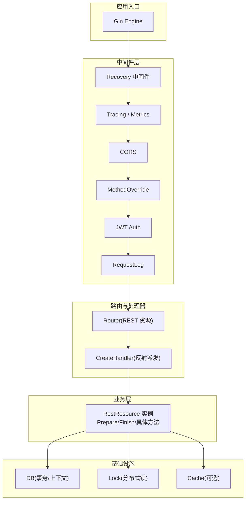
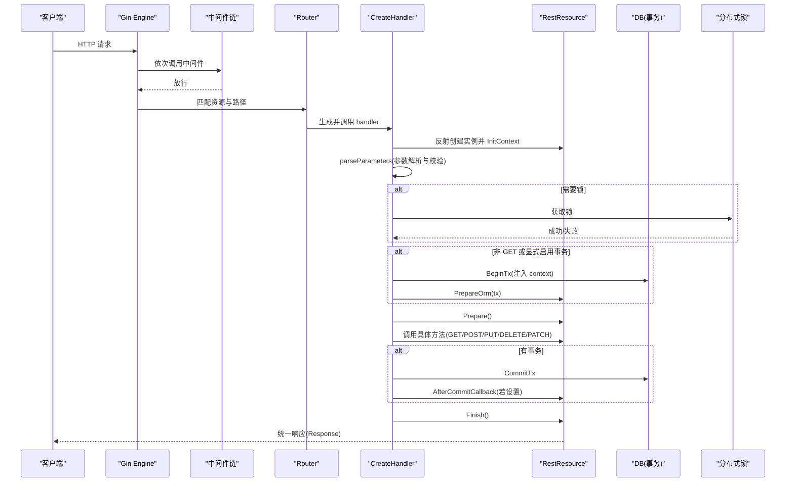
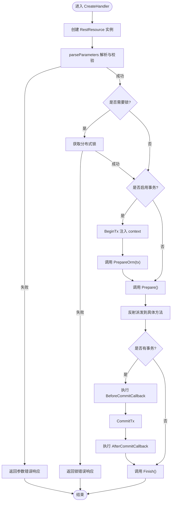
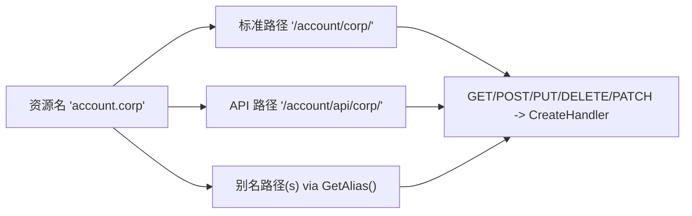
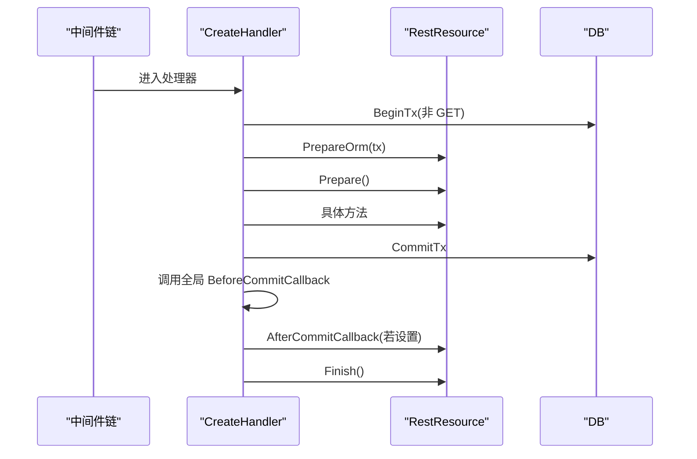
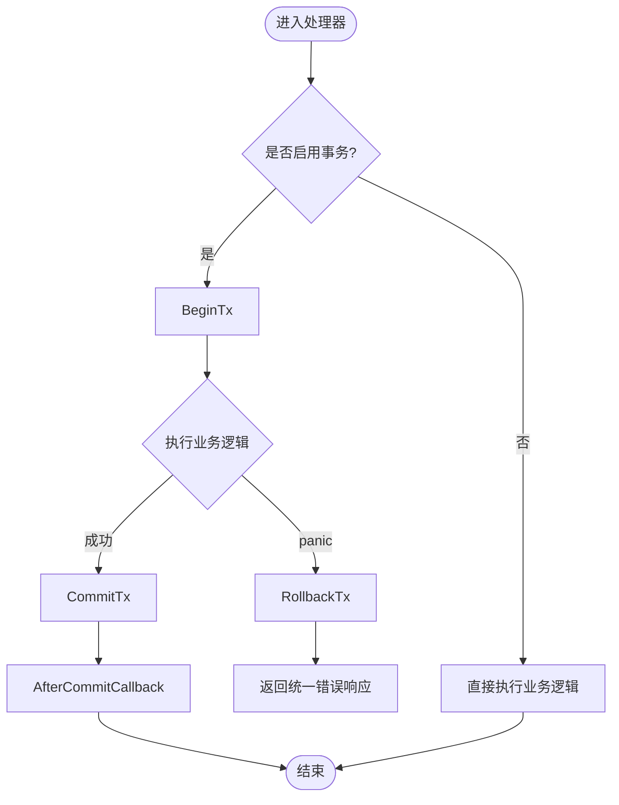
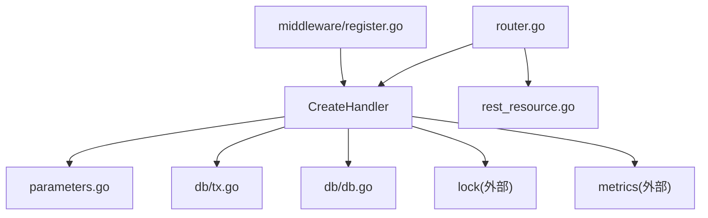

# 请求处理器

<cite>
**本文引用的文件**
- [vanilla/handler.go](file://vanilla/handler.go)
- [vanilla/router.go](file://vanilla/router.go)
- [vanilla/rest_resource.go](file://vanilla/rest_resource.go)
- [vanilla/parameters.go](file://vanilla/parameters.go)
- [vanilla/response.go](file://vanilla/response.go)
- [vanilla/recover.go](file://vanilla/recover.go)
- [middleware/register.go](file://middleware/register.go)
- [middleware/jwt_auth.go](file://middleware/jwt_auth.go)
- [middleware/cors.go](file://middleware/cors.go)
- [middleware/request_log.go](file://middleware/request_log.go)
- [db/db.go](file://db/db.go)
- [db/tx.go](file://db/tx.go)
- [README.md](file://README.md)
</cite>

## 目录
1. [简介](#简介)
2. [项目结构](#项目结构)
3. [核心组件](#核心组件)
4. [架构总览](#架构总览)
5. [详细组件分析](#详细组件分析)
6. [依赖关系分析](#依赖关系分析)
7. [性能考量](#性能考量)
8. [故障排查指南](#故障排查指南)
9. [结论](#结论)
10. [附录：示例与最佳实践](#附录示例与最佳实践)

## 简介
本技术文档聚焦于“请求处理器”的完整链路，覆盖从路由注册、请求解析、参数校验、事务管理、错误处理到中间件链执行顺序与扩展点（PrepareOrm、BeforeCommitCallback）的使用。文档同时说明 RESTful 路由模式、URL 别名支持、HTTP 方法映射，并提供实际使用建议与性能优化要点。

## 项目结构
该框架基于 Gin + GORM，提供声明式资源（RestResource）、约定式路由、统一响应、事务生命周期、分布式锁、认证中间件、可观测性能力等。关键模块职责如下：
- vanilla：资源模型、处理器、路由、参数解析、响应封装、恢复机制
- middleware：全局中间件注册与实现（CORS、JWT、日志、追踪、指标等）
- db：数据库连接、事务上下文注入、事务提交/回滚
- 其他：缓存、鉴权、指标、追踪、工具集等



图表来源
- [middleware/register.go:28-71](file://middleware/register.go#L28-L71)
- [vanilla/router.go:16-64](file://vanilla/router.go#L16-L64)
- [vanilla/handler.go:29-142](file://vanilla/handler.go#L29-L142)
- [db/db.go:25-91](file://db/db.go#L25-L91)

章节来源
- [README.md:1-18](file://README.md#L1-L18)
- [README.md:27-74](file://README.md#L27-L74)

## 核心组件
- RestResourceInterface：定义资源契约（资源名、别名、参数声明、事务开关、锁、ORM 准备钩子、生命周期等）
- RestResource：基类，提供参数获取、过滤器、响应封装、默认 DisableTx（GET 关闭事务）等
- CreateHandler：创建 Gin Handler，负责反射派发、参数解析与校验、分布式锁、事务开启/提交、钩子回调、指标记录
- Router：将资源注册为多个 URL（标准路径、API 路径、别名），并绑定所有 HTTP 方法
- 参数解析：parseParameters 根据 GetParameters 声明进行类型校验与过滤参数收集
- 事务管理：BeginTx/CommitTx/RollbackTx 通过 context 传递事务句柄
- 中间件链：Recovery、Tracing/Metrics、CORS、MethodOverride、JWT、Extra、RequestLog

章节来源
- [vanilla/rest_resource.go:13-44](file://vanilla/rest_resource.go#L13-L44)
- [vanilla/rest_resource.go:71-132](file://vanilla/rest_resource.go#L71-L132)
- [vanilla/handler.go:29-142](file://vanilla/handler.go#L29-L142)
- [vanilla/router.go:16-64](file://vanilla/router.go#L16-L64)
- [vanilla/parameters.go:12-123](file://vanilla/parameters.go#L12-L123)
- [db/tx.go:10-37](file://db/tx.go#L10-L37)
- [middleware/register.go:28-71](file://middleware/register.go#L28-L71)

## 架构总览
下图展示一次典型请求从进入 Gin 到返回响应的完整流程，包括中间件链、处理器内部步骤、事务与锁、以及回调钩子。



图表来源
- [middleware/register.go:28-71](file://middleware/register.go#L28-L71)
- [vanilla/router.go:16-64](file://vanilla/router.go#L16-L64)
- [vanilla/handler.go:29-142](file://vanilla/handler.go#L29-L142)
- [db/tx.go:10-37](file://db/tx.go#L10-L37)

## 详细组件分析

### 处理器 CreateHandler 工作流程
- 启动时预计算元数据（resourceType、方法映射、参数声明、锁 key/option、是否禁用事务）
- 每请求创建独立实例，避免共享可变状态
- 参数解析与校验：依据 GetParameters 声明，支持 string/int/float/bool/json/json-raw/json-array，自动收集 __f-* 过滤器
- 分布式锁：GetLockKey 非空则尝试加锁，失败返回统一错误
- 事务管理：DisableTx 默认对 GET 关闭；非 GET 开启事务，注入 context，调用 PrepareOrm 钩子，panic 时回滚
- 调用 Prepare -> 具体方法 -> 提交事务 -> 触发 BeforeCommitCallback -> 触发 AfterCommitCallback -> Finish
- 指标记录：EndpointCounter、EndpointDuration



图表来源
- [vanilla/handler.go:29-142](file://vanilla/handler.go#L29-L142)
- [vanilla/parameters.go:12-123](file://vanilla/parameters.go#L12-L123)
- [db/tx.go:10-37](file://db/tx.go#L10-L37)

章节来源
- [vanilla/handler.go:29-142](file://vanilla/handler.go#L29-L142)
- [vanilla/parameters.go:12-123](file://vanilla/parameters.go#L12-L123)
- [db/tx.go:10-37](file://db/tx.go#L10-L37)

### 路由注册机制
- 资源名采用点分格式（如 account.corp），Router 会生成：
  - 标准路径：/account/corp/
  - API 路径：/account/api/corp/
  - 别名路径：通过 GetAlias() 返回的任意前缀或完整路径
- 每个路径均注册 GET/POST/PUT/DELETE/PATCH 方法，由 CreateHandler 统一处理
- 开发测试资源可通过 IsForDevTest 与环境变量控制是否注册



图表来源
- [vanilla/router.go:16-64](file://vanilla/router.go#L16-L64)
- [vanilla/rest_resource.go:13-44](file://vanilla/rest_resource.go#L13-L44)

章节来源
- [vanilla/router.go:16-64](file://vanilla/router.go#L16-L64)
- [vanilla/rest_resource.go:13-44](file://vanilla/rest_resource.go#L13-L44)

### 中间件链执行顺序与钩子
- 注册顺序（由内向外）：
  1. Recovery（panic 捕获与事务回滚）
  2. Tracing（可选）
  3. Metrics（可选）
  4. CORS
  5. MethodOverride
  6. JWT Auth（可选，注入业务上下文）
  7. Extra（自定义中间件）
  8. RequestLog
- 钩子：
  - PrepareOrm：在事务开始前调用，用于 ORM 初始化或附加查询条件
  - BeforeCommitCallback：全局事务提交前回调（线程安全设置/读取）
  - AfterCommitCallback：资源级事务提交后回调（可在 ReturnJSONWithCallback 中设置）



图表来源
- [middleware/register.go:28-71](file://middleware/register.go#L28-L71)
- [vanilla/handler.go:74-132](file://vanilla/handler.go#L74-L132)
- [vanilla/rest_resource.go:46-69](file://vanilla/rest_resource.go#L46-L69)
- [db/tx.go:10-37](file://db/tx.go#L10-L37)

章节来源
- [middleware/register.go:28-71](file://middleware/register.go#L28-L71)
- [vanilla/handler.go:74-132](file://vanilla/handler.go#L74-L132)
- [vanilla/rest_resource.go:46-69](file://vanilla/rest_resource.go#L46-L69)

### 参数解析与校验
- 声明式参数：GetParameters 返回 map[METHOD][]string，支持 ? 可选前缀与类型约束
- 支持类型：string、int、float、bool、json、json-raw、json-array
- 过滤器协议：__f-字段-操作符 自动解析到 Filters，便于后续 Where 构建
- 校验失败返回统一错误响应

```mermaid
flowchart TD
S["开始解析"] --> Load["加载 GetParameters(method)"]
Load --> Loop{"遍历参数声明"}
Loop --> |存在| Type{"按类型解析"}
Type --> |string|int| Ok["通过"]
Type --> |json/json-raw/json-array| Ok
Type --> |bool| BoolOk{"合法布尔值?"}
BoolOk --> |否| Fail["返回参数错误"]
BoolOk --> |是| Ok
Loop --> |不存在且必需| Fail
Loop --> |完成| Filters["解析 __f-* 过滤器"]
Filters --> Done["完成"]
```

图表来源
- [vanilla/parameters.go:12-123](file://vanilla/parameters.go#L12-L123)

章节来源
- [vanilla/parameters.go:12-123](file://vanilla/parameters.go#L12-L123)

### 事务管理与错误处理
- 事务开启：非 GET 默认开启，GET 默认关闭（可通过 DisableTx 调整）
- 事务提交：CommitTx 提交，若失败返回统一错误
- 异常回滚：Recovery 中间件捕获 panic 并回滚事务，统计指标并返回统一错误
- 钩子：BeforeCommitCallback 在提交前执行，AfterCommitCallback 在提交后执行



图表来源
- [vanilla/handler.go:74-132](file://vanilla/handler.go#L74-L132)
- [vanilla/recover.go:14-66](file://vanilla/recover.go#L14-L66)
- [db/tx.go:10-37](file://db/tx.go#L10-L37)

章节来源
- [vanilla/handler.go:74-132](file://vanilla/handler.go#L74-L132)
- [vanilla/recover.go:14-66](file://vanilla/recover.go#L14-L66)
- [db/tx.go:10-37](file://db/tx.go#L10-L37)

### 不同 HTTP 方法的处理示例（概念性）
- GET：通常只读，默认不开启事务；可用于查询列表或详情
- POST：新增资源，开启事务；参数校验通过后写入数据库
- PUT：更新资源，开启事务；先校验再更新
- DELETE：删除资源，开启事务；先校验再删除
- PATCH：部分更新，开启事务；合并变更并持久化

注意：以上为通用实践，具体行为受 DisableTx 与资源实现影响。

章节来源
- [vanilla/rest_resource.go:115-121](file://vanilla/rest_resource.go#L115-L121)
- [vanilla/handler.go:106-113](file://vanilla/handler.go#L106-L113)

### 集成数据库操作与缓存访问
- 数据库：通过 db.GetDBWithContext(ctx) 获取当前事务或全局 DB；结合过滤器协议快速构建查询
- 缓存：在业务层按需访问缓存（例如 Redis），建议在事务外进行，避免长事务持有缓存写锁
- 推荐模式：先查缓存，未命中再查库并回填缓存；写操作先更新库再失效缓存

章节来源
- [db/db.go:84-91](file://db/db.go#L84-L91)
- [README.md:48-57](file://README.md#L48-L57)

## 依赖关系分析
- 处理器依赖：
  - 参数解析：vanilla/parameters.go
  - 事务：db/tx.go、db/db.go
  - 锁：lock（通过 RestResource 接口获取 key/option）
  - 指标：metrics（计数与耗时）
- 中间件依赖：
  - Recovery：vanilla/recover.go
  - JWT：auth 解码，注入业务上下文
  - CORS：gin-contrib/cors
  - 日志：request_log
- 路由依赖：
  - 资源契约：vanilla/rest_resource.go
  - 处理器：vanilla/handler.go



图表来源
- [vanilla/handler.go:29-142](file://vanilla/handler.go#L29-L142)
- [vanilla/router.go:16-64](file://vanilla/router.go#L16-L64)
- [middleware/register.go:28-71](file://middleware/register.go#L28-L71)

章节来源
- [vanilla/handler.go:29-142](file://vanilla/handler.go#L29-L142)
- [vanilla/router.go:16-64](file://vanilla/router.go#L16-L64)
- [middleware/register.go:28-71](file://middleware/register.go#L28-L71)

## 性能考量
- 启动时预计算：resourceMeta 与方法映射在启动时构建，减少运行时反射开销
- 每请求实例：避免共享状态，提升并发安全性
- 事务范围最小化：仅在必要时开启事务，缩短事务持有时间
- 缓存优先：读多写少场景优先走缓存，降低 DB 压力
- 指标与追踪：开启 Metrics 与 Tracing，定位瓶颈
- 连接池调优：合理配置 MaxIdleConns/MaxOpenConns/ConnMaxLifetime

章节来源
- [vanilla/handler.go:144-170](file://vanilla/handler.go#L144-L170)
- [db/db.go:25-51](file://db/db.go#L25-L51)
- [README.md:48-57](file://README.md#L48-L57)

## 故障排查指南
- 参数校验失败：检查 GetParameters 声明与传入参数类型/必填项
- 锁获取失败：确认锁 key 唯一性与锁服务可用性
- 事务提交失败：检查数据库连接与 SQL 语句，查看错误码与消息
- 异常回滚：Recovery 中间件已回滚事务并记录堆栈，定位 panic 位置
- 认证失败：检查 JWT token 来源（Header/Query/Cookie）与密钥配置

章节来源
- [vanilla/parameters.go:125-128](file://vanilla/parameters.go#L125-L128)
- [vanilla/handler.go:54-68](file://vanilla/handler.go#L54-L68)
- [vanilla/handler.go:115-132](file://vanilla/handler.go#L115-L132)
- [vanilla/recover.go:14-66](file://vanilla/recover.go#L14-L66)
- [middleware/jwt_auth.go:13-61](file://middleware/jwt_auth.go#L13-L61)

## 结论
该请求处理器通过声明式资源与约定式路由，提供了统一的参数校验、事务管理、错误处理与可观测性能力。借助中间件链与钩子机制，开发者可以灵活扩展认证、日志、追踪等功能，并以最小代价获得高可用、易维护的服务端处理能力。

## 附录：示例与最佳实践
- 资源定义与路由注册：参考 README 中的快速开始与 Resource 编写示例
- 参数声明：在 GetParameters 中明确各方法所需参数及类型，利用 ? 标记可选参数
- 过滤器：使用 __f-字段-操作符 构造复杂查询，配合 ApplyFilters 快速生成 Where 条件
- 事务与回调：在非 GET 方法中利用事务保证一致性；通过 BeforeCommitCallback/AfterCommitCallback 执行额外逻辑（如消息发送、缓存失效）
- 错误处理：统一使用 MakeErrorResponse 或 ReturnError 返回结构化错误；业务异常使用 BusinessError 抛出并由 Recovery 捕获
- 性能优化：开启缓存、缩小事务范围、合理配置连接池、启用指标与追踪

章节来源
- [README.md:27-74](file://README.md#L27-L74)
- [README.md:76-135](file://README.md#L76-L135)
- [vanilla/response.go:13-55](file://vanilla/response.go#L13-L55)
- [vanilla/recover.go:14-66](file://vanilla/recover.go#L14-L66)