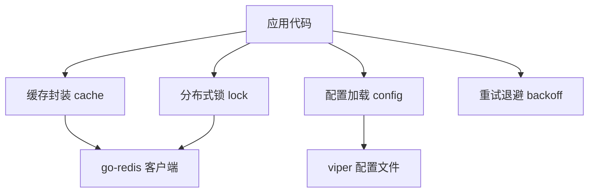
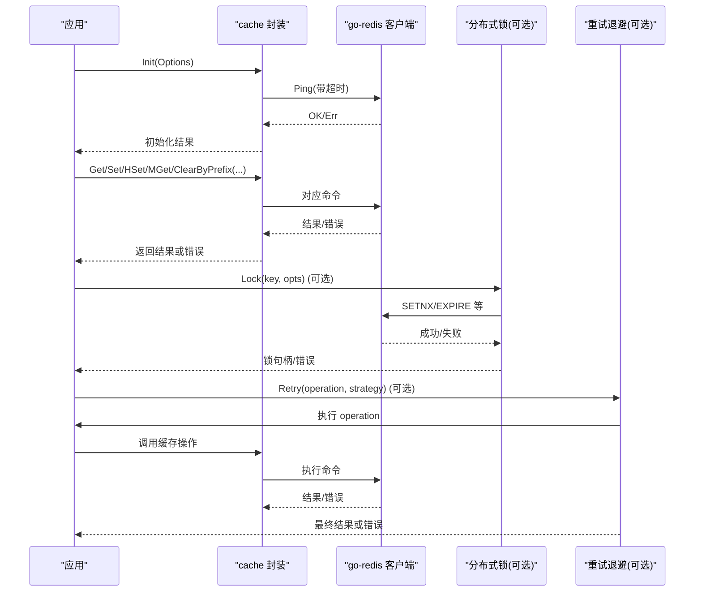
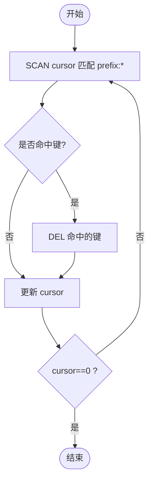
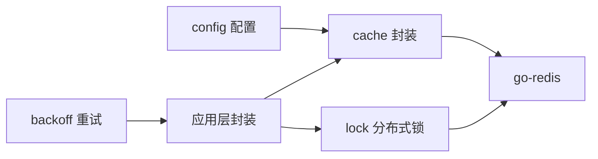

# 缓存系统

<cite>
**本文引用的文件**
- [cache/redis.go](file://cache/redis.go)
- [config/config.go](file://config/config.go)
- [config/types.go](file://config/types.go)
- [backoff/backoff.go](file://backoff/backoff.go)
- [lock/lock.go](file://lock/lock.go)
- [ARCHITECTURE.md](file://ARCHITECTURE.md)
- [README.md](file://README.md)
</cite>

## 目录
1. [简介](#简介)
2. [项目结构](#项目结构)
3. [核心组件](#核心组件)
4. [架构总览](#架构总览)
5. [详细组件分析](#详细组件分析)
6. [依赖关系分析](#依赖关系分析)
7. [性能考虑](#性能考虑)
8. [故障排查指南](#故障排查指南)
9. [结论](#结论)
10. [附录：使用示例与最佳实践](#附录使用示例与最佳实践)

## 简介
本技术文档围绕 Carina 的 Redis 缓存封装展开，系统性说明其设计理念、实现细节与使用方式。内容涵盖连接初始化、常用数据结构操作（字符串、哈希、列表、集合等）、批量操作优化、前缀清理能力、错误重试与超时处理思路、缓存一致性策略以及性能调优建议。文档同时提供可落地的使用示例路径与排障要点，帮助读者在生产环境中稳定高效地使用缓存。

## 项目结构
Carina 将缓存作为独立叶子模块，通过 go-redis 提供简洁的 API，并与配置、分布式锁、重试退避等模块协同工作。整体职责划分清晰，便于扩展与维护。



图表来源
- [cache/redis.go:1-123](file://cache/redis.go#L1-L123)
- [config/config.go:1-61](file://config/config.go#L1-L61)
- [lock/lock.go:1-69](file://lock/lock.go#L1-L69)
- [backoff/backoff.go:1-180](file://backoff/backoff.go#L1-L180)

章节来源
- [ARCHITECTURE.md:13-45](file://ARCHITECTURE.md#L13-L45)
- [README.md:27-74](file://README.md#L27-L74)

## 核心组件
- 全局 Redis 客户端封装：提供 Init、Client、Get/Set/SetEx/Delete/Exists/Incr/Decr/HSet/HGet/HGetAll/MGet/ClearByPrefix 等方法，屏蔽底层 go-redis 调用细节。
- 配置模型：RedisConfig 描述地址、密码、DB；Base 聚合各子系统配置，支持环境变量覆盖。
- 分布式锁：基于 redsync 的 RedisLock，可与缓存配合实现强一致场景。
- 重试退避：通用 BackOff 接口与指数退避实现，可用于上层对缓存操作的增强封装。

章节来源
- [cache/redis.go:13-123](file://cache/redis.go#L13-L123)
- [config/types.go:18-23](file://config/types.go#L18-L23)
- [config/config.go:21-61](file://config/config.go#L21-L61)
- [lock/lock.go:14-69](file://lock/lock.go#L14-L69)
- [backoff/backoff.go:10-180](file://backoff/backoff.go#L10-L180)

## 架构总览
下图展示了从应用到 Redis 的关键交互路径，包括初始化、读写、批量清理与锁协作点。



图表来源
- [cache/redis.go:20-117](file://cache/redis.go#L20-L117)
- [lock/lock.go:27-69](file://lock/lock.go#L27-L69)
- [backoff/backoff.go:144-180](file://backoff/backoff.go#L144-L180)

## 详细组件分析

### Redis 客户端封装设计
- 单例客户端：模块内维护全局 *redis.Client，通过 Init 完成创建与连通性校验（Ping），未初始化时 Client() 会 panic，强制要求先初始化。
- 上下文与超时：所有对外方法均接受 context.Context，便于上层统一控制超时、取消与追踪。Init 内部使用固定超时进行 Ping。
- 数据模型映射：封装了字符串、哈希、计数器等常用操作，简化业务调用。
- 批量与清理：提供 MGet 批量读取与 ClearByPrefix 按前缀扫描并删除的能力，适合发布/版本化场景下的缓存失效。

章节来源
- [cache/redis.go:11-41](file://cache/redis.go#L11-L41)
- [cache/redis.go:43-117](file://cache/redis.go#L43-L117)

#### 类图（概念）
```mermaid
classDiagram
class Options {
+string Address
+string Password
+int DB
}
class CacheAPI {
+Init(opts) error
+Client() *redis.Client
+Get(ctx,key) string,error
+Set(ctx,key,value,duration) error
+SetEx(ctx,key,value,seconds) error
+Delete(ctx,keys...) error
+Exists(ctx,keys...) int64,error
+Incr(ctx,key) int64,error
+Decr(ctx,key) int64,error
+HSet(ctx,key,values...) error
+HGet(ctx,key,field) string,error
+HGetAll(ctx,key) map[string]string,error
+MGet(ctx,keys...) []interface{},error
+ClearByPrefix(ctx,prefix) error
+IsInitialized() bool
}
Options <.. CacheAPI : "用于初始化"
```

图表来源
- [cache/redis.go:13-123](file://cache/redis.go#L13-L123)

### 连接池管理
- 当前实现直接复用 go-redis 默认连接池参数。若需自定义连接池大小、空闲连接数、最大连接数、连接超时等，可在 Init 中传入更丰富的 redis.Options（例如 DialTimeout、PoolSize、PoolTimeout、IdleTimeout 等）。
- 建议在多实例部署下根据 QPS 与延迟目标评估连接池大小，避免连接耗尽导致请求排队。

章节来源
- [cache/redis.go:20-33](file://cache/redis.go#L20-L33)

### 错误重试机制与超时处理
- 当前封装层未内置重试逻辑，但提供了 context.Context 以支持上层统一超时与取消。
- 可结合 backoff 包提供的指数退避策略，对关键读/写操作进行重试封装，提升在瞬时网络抖动时的鲁棒性。
- 建议：
  - 对幂等读操作（如 Get/HGet）采用有限次数的指数退避重试。
  - 对写操作（Set/HSet）谨慎重试，确保业务幂等或在事务边界内。
  - 为所有外部 IO 设置合理的超时时间，避免长尾阻塞。

章节来源
- [backoff/backoff.go:10-180](file://backoff/backoff.go#L10-L180)
- [cache/redis.go:20-41](file://cache/redis.go#L20-L41)

### 常用缓存操作
- 字符串：Get/Set/SetEx/Delete/Exists/Incr/Decr
- 哈希：HSet/HGet/HGetAll
- 批量：MGet
- 列表/集合：可通过 go-redis 原生命令访问（本封装未暴露专用方法，可直接通过 Client() 获取底层客户端调用）

章节来源
- [cache/redis.go:43-96](file://cache/redis.go#L43-L96)

### 批量操作的性能优化策略
- 使用 MGet 减少往返次数，降低网络开销。
- 对于写入密集型场景，可结合 pipeline/batch 模式（通过 go-redis 客户端）合并多条命令，再统一提交。
- 注意：pipeline 不保证原子性，如需原子性请使用 Lua 脚本或事务。

章节来源
- [cache/redis.go:93-96](file://cache/redis.go#L93-L96)

### 前缀清理功能的实现原理
- 使用 SCAN 命令按前缀匹配键空间，分批获取匹配的 key，然后逐批 DEL 删除。
- 优点：不会阻塞 Redis 主线程过久；缺点：SCAN 是近似遍历，极端情况下可能遗漏并发新增的键，需要结合业务容忍度或二次清理。



图表来源
- [cache/redis.go:98-117](file://cache/redis.go#L98-L117)

章节来源
- [cache/redis.go:98-117](file://cache/redis.go#L98-L117)

### 缓存一致性策略
- 读多写少：推荐“先更新数据库，再删除缓存”的策略，避免脏读。
- 强一致场景：结合分布式锁（lock）在写路径加锁，保证同一时刻只有一个写者；读路径可选择加锁或允许短暂不一致。
- 热点 Key 保护：对高并发读可使用本地 LRU 缓存（lru）做二级缓存，配合短 TTL 与失效广播。

章节来源
- [lock/lock.go:27-69](file://lock/lock.go#L27-L69)
- [ARCHITECTURE.md:13-45](file://ARCHITECTURE.md#L13-L45)

### 性能调优建议
- 连接池：根据并发与延迟目标调整 PoolSize、DialTimeout、PoolTimeout、IdleTimeout。
- 超时：为所有 IO 设置合理超时，避免雪崩。
- 批量：优先使用 MGet/Pipeline/Lua 脚本减少 RTT。
- 过期：合理设置 TTL，避免热键长期驻留；必要时使用前缀清理做批量失效。
- 监控：结合 metrics/tracing 观察命中率、延迟与错误率。

[本节为通用指导，无需特定文件引用]

## 依赖关系分析
- cache 仅依赖 go-redis，属于叶子模块，无内部耦合。
- config 提供 Redis 配置项与环境变量覆盖能力。
- lock 通过 redsync 与 go-redis 集成，可与 cache 组合使用。
- backoff 提供通用重试策略，可被上层封装复用。



图表来源
- [config/types.go:18-23](file://config/types.go#L18-L23)
- [config/config.go:21-61](file://config/config.go#L21-L61)
- [cache/redis.go:1-123](file://cache/redis.go#L1-L123)
- [lock/lock.go:1-69](file://lock/lock.go#L1-L69)
- [backoff/backoff.go:1-180](file://backoff/backoff.go#L1-L180)

章节来源
- [ARCHITECTURE.md:36-45](file://ARCHITECTURE.md#L36-L45)

## 性能考虑
- 连接与超时：为 Init 增加连接池与超时参数，避免连接风暴与长尾。
- 批量与流水线：高频读取用 MGet，写入用 Pipeline 或 Lua 脚本。
- 热点与穿透：结合本地 LRU 与布隆过滤器（可选）降低热点与空值穿透。
- 失效策略：短 TTL + 主动失效（前缀清理）+ 被动刷新（缓存未命中回源）。
- 观测性：接入 metrics 与 tracing，关注命中率、P95/P99 延迟与错误率。

[本节为通用指导，无需特定文件引用]

## 故障排查指南
- 未初始化 Panic：调用 Client() 前必须调用 Init，否则会触发 panic。检查启动流程是否正确初始化缓存。
- 连接失败：Init 内部会 Ping 验证连接，失败会返回错误。检查地址、密码、DB 及网络可达性。
- 超时与重试：为调用方设置合适的 context 超时；对关键路径使用 backoff 重试。
- 前缀清理耗时：Scan 在大键空间下可能较慢，建议在低峰期执行或分片清理。
- 一致性冲突：写路径加锁，读路径按需加锁或容忍短暂不一致。

章节来源
- [cache/redis.go:20-41](file://cache/redis.go#L20-L41)
- [backoff/backoff.go:144-180](file://backoff/backoff.go#L144-L180)
- [lock/lock.go:27-69](file://lock/lock.go#L27-L69)

## 结论
Carina 的缓存封装以简洁、安全、可扩展为目标，提供常用数据结构操作与批量清理能力，并通过 context 支持统一的超时与取消。结合分布式锁与重试退避，可满足大多数生产场景的一致性、可用性与性能需求。建议在实际部署中完善连接池、超时、监控与一致性策略，以获得更稳健的表现。

[本节为总结，无需特定文件引用]

## 附录：使用示例与最佳实践

### 初始化与基本读写
- 初始化：参考快速开始中的初始化步骤，加载配置后调用 cache.Init。
- 字符串读写：使用 Get/Set/SetEx/Delete/Exists。
- 哈希读写：使用 HSet/HGet/HGetAll。
- 计数器：使用 Incr/Decr。
- 批量读取：使用 MGet。

章节来源
- [README.md:27-74](file://README.md#L27-L74)
- [cache/redis.go:43-96](file://cache/redis.go#L43-L96)

### 过期时间与缓存失效
- 设置过期：SetEx 指定秒级过期；Set 使用 time.Duration。
- 主动失效：使用 ClearByPrefix 按前缀批量删除，适用于版本发布或租户隔离场景。
- 被动刷新：缓存未命中时回源数据库并回填，设置合理 TTL。

章节来源
- [cache/redis.go:48-56](file://cache/redis.go#L48-L56)
- [cache/redis.go:98-117](file://cache/redis.go#L98-L117)

### 列表与集合操作
- 当前封装未暴露列表/集合专用方法，可通过 Client() 获取底层 go-redis 客户端，直接调用 LPush/RPush/SAdd 等命令。
- 建议：对复杂数据结构操作，封装为业务方法，保持与字符串/哈希一致的调用风格。

章节来源
- [cache/redis.go:35-41](file://cache/redis.go#L35-L41)

### 错误重试与超时
- 超时：所有方法接受 context.Context，调用方可设置超时与取消。
- 重试：使用 backoff 的指数退避策略对关键读/写进行重试封装，注意幂等性。

章节来源
- [backoff/backoff.go:144-180](file://backoff/backoff.go#L144-L180)
- [cache/redis.go:20-41](file://cache/redis.go#L20-L41)

### 缓存一致性策略
- 写路径：先更新数据库，再删除缓存；在高并发写场景加分布式锁。
- 读路径：可加锁保证强一致，或允许短暂不一致以提升吞吐。
- 热点保护：结合本地 LRU 缓存与短 TTL 降低热点压力。

章节来源
- [lock/lock.go:27-69](file://lock/lock.go#L27-L69)
- [ARCHITECTURE.md:13-45](file://ARCHITECTURE.md#L13-L45)

### 配置与环境变量
- 使用 config.Load 加载 YAML 配置，并通过环境变量覆盖敏感字段（如 REDIS_ADDRESS、REDIS_PASSWORD）。
- Base 结构包含 RedisConfig，便于集中管理。

章节来源
- [config/config.go:21-61](file://config/config.go#L21-L61)
- [config/types.go:18-23](file://config/types.go#L18-L23)