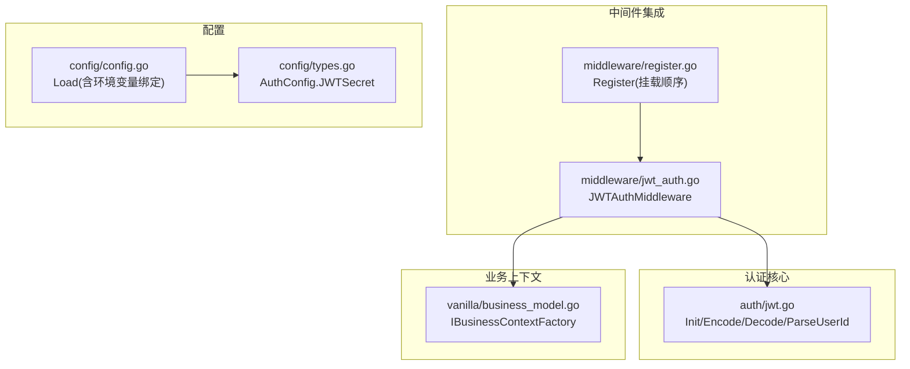
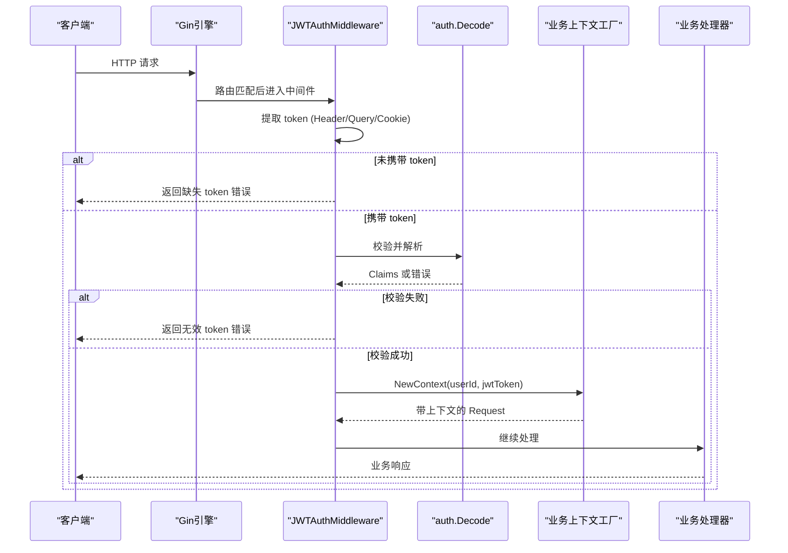
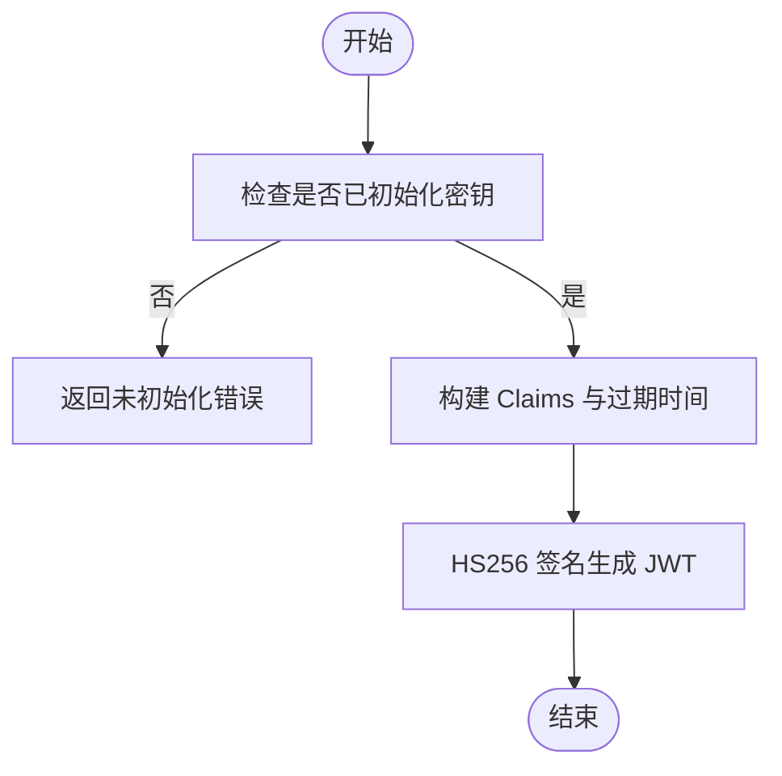
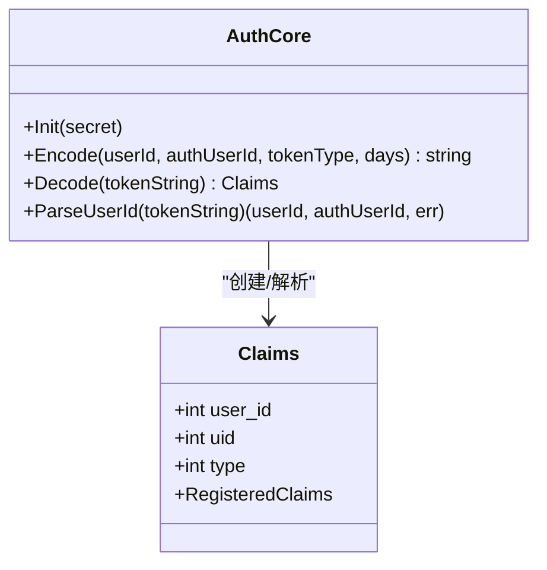
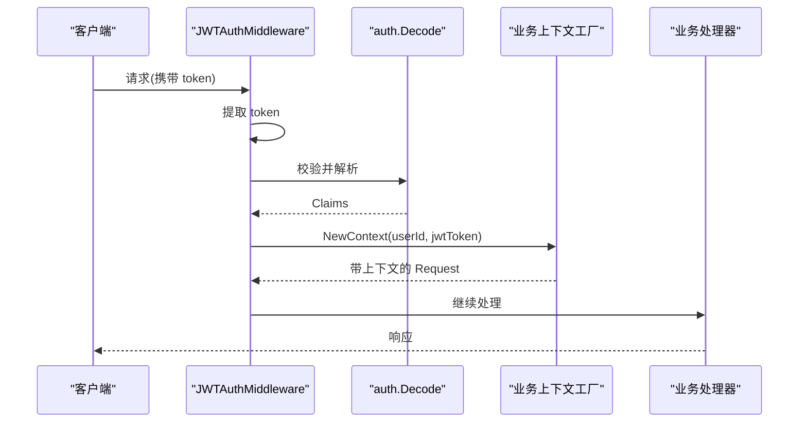
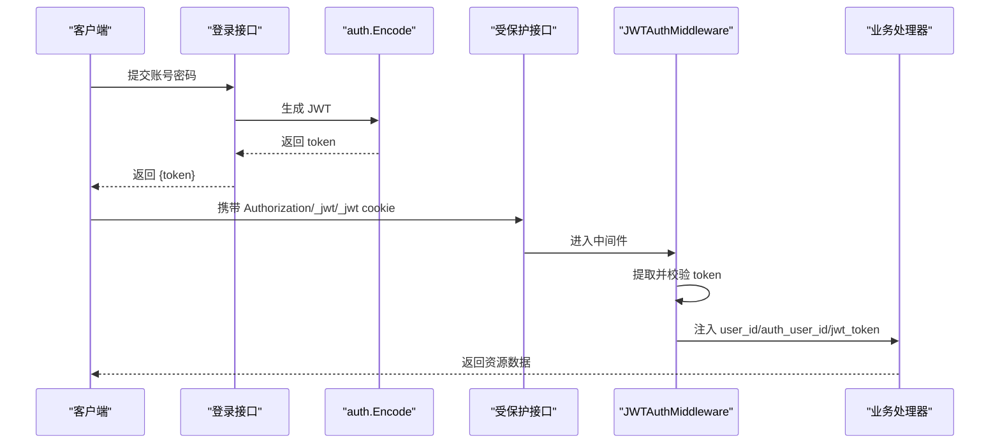
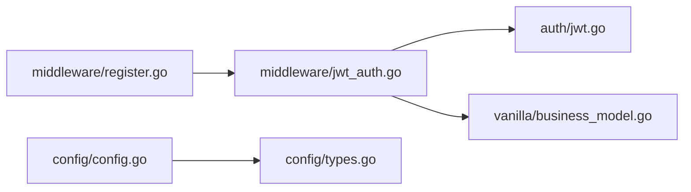

# 认证授权

<cite>
**本文引用的文件**
- [auth/jwt.go](file://auth/jwt.go)
- [middleware/jwt_auth.go](file://middleware/jwt_auth.go)
- [middleware/register.go](file://middleware/register.go)
- [config/config.go](file://config/config.go)
- [config/types.go](file://config/types.go)
- [vanilla/business_model.go](file://vanilla/business_model.go)
- [README.md](file://README.md)
- [ARCHITECTURE.md](file://ARCHITECTURE.md)
</cite>

## 目录
1. [简介](#简介)
2. [项目结构](#项目结构)
3. [核心组件](#核心组件)
4. [架构总览](#架构总览)
5. [详细组件分析](#详细组件分析)
6. [依赖关系分析](#依赖关系分析)
7. [性能与扩展性](#性能与扩展性)
8. [故障排查指南](#故障排查指南)
9. [结论](#结论)
10. [附录](#附录)

## 简介
本文件面向 Carina 框架的认证授权子系统，聚焦 JWT 令牌的生命周期管理（生成、验证、解码）、Claims 结构设计（userId、authUserId、tokenType）与多类型用户支持机制，并给出完整的认证流程示例与安全配置建议。该子系统通过中间件在请求进入业务逻辑前完成身份校验与上下文注入，使业务代码无需关心鉴权细节。

## 项目结构
Carina 将认证能力拆分为“核心编解码”和“Gin 中间件集成”两部分：
- auth 包：提供 JWT 密钥初始化、令牌生成、解析与 Claims 定义。
- middleware 包：提供 JWTAuthMiddleware，负责从请求中提取 token、调用 auth.Decode 校验，并将用户信息注入 gin.Context 与业务上下文。
- config 包：提供统一配置加载，敏感字段（如 auth.jwt_secret）支持环境变量覆盖。
- vanilla 包：提供业务上下文工厂接口，允许项目自定义上下文内容。

图表来源
- [auth/jwt.go:18-92](file://auth/jwt.go#L18-L92)
- [middleware/jwt_auth.go:13-80](file://middleware/jwt_auth.go#L13-L80)
- [middleware/register.go:28-71](file://middleware/register.go#L28-L71)
- [config/config.go:21-59](file://config/config.go#L21-L59)
- [config/types.go:25-28](file://config/types.go#L25-L28)
- [vanilla/business_model.go:50-66](file://vanilla/business_model.go#L50-L66)

章节来源
- [README.md:1-154](file://README.md#L1-L154)
- [ARCHITECTURE.md:12-45](file://ARCHITECTURE.md#L12-L45)

## 核心组件
- JWT 核心（auth/jwt.go）
  - Init：设置全局 HMAC-SHA256 密钥。
  - Encode：根据 userId、authUserId、tokenType 与有效期生成 JWT。
  - Decode：解析并校验 JWT，返回 Claims；对过期与非法 token 返回明确错误。
  - ParseUserId：按 tokenType 解析出 userId/authUserId，用于不同用户类型的权限判定。
- 认证中间件（middleware/jwt_auth.go）
  - 支持从 AUTHORIZATION header、_jwt query 参数、_jwt cookie 提取 token。
  - 失败时返回统一错误响应；成功时将 user_id、auth_user_id、jwt_token 注入 gin.Context，并通过业务上下文工厂注入到请求 context。
- 配置（config）
  - Load 支持环境变量覆盖敏感字段，包括 auth.jwt_secret。
  - AuthConfig 暴露 jwt_secret 供应用启动时读取并初始化 auth.Init。
- 业务上下文（vanilla/business_model.go）
  - IBusinessContextFactory 允许项目自定义 NewContext，将 userId 与 jwtToken 等放入请求 context，便于后续服务间调用或审计。

章节来源
- [auth/jwt.go:18-92](file://auth/jwt.go#L18-L92)
- [middleware/jwt_auth.go:13-80](file://middleware/jwt_auth.go#L13-L80)
- [config/config.go:21-59](file://config/config.go#L21-L59)
- [config/types.go:25-28](file://config/types.go#L25-L28)
- [vanilla/business_model.go:50-66](file://vanilla/business_model.go#L50-L66)

## 架构总览
下图展示了从请求进入、JWT 提取与校验、到业务上下文注入的完整链路。

图表来源
- [middleware/jwt_auth.go:16-61](file://middleware/jwt_auth.go#L16-L61)
- [auth/jwt.go:52-74](file://auth/jwt.go#L52-L74)
- [vanilla/business_model.go:50-66](file://vanilla/business_model.go#L50-L66)

## 详细组件分析

### JWT 令牌生命周期
- 生成（Encode）
  - 输入：userId、authUserId、tokenType、days（默认 365）。
  - 输出：HS256 签名的 JWT 字符串。
  - 关键点：必须预先调用 Init 设置密钥；未设置会返回错误。
- 验证（Decode）
  - 使用 HS256 与全局密钥校验签名与有效期。
  - 区分过期与非法 token 的错误类型，便于上层统一处理。
- 解码（ParseUserId）
  - 根据 tokenType 决定返回 userId/authUserId 的策略：
    - 用户类型（type=1）：返回 UserId 与 AuthUserId。
    - 服务类型（type=2）：仅返回 AuthUserId，userId 置零。
    - 企业类型（type=3）：返回 UserId 与 AuthUserId。
- 刷新策略说明
  - 当前实现未内置刷新令牌（Refresh Token）机制。可通过业务层在接近过期时重新调用 Encode 签发新令牌，并在客户端侧替换旧令牌。

图表来源
- [auth/jwt.go:18-50](file://auth/jwt.go#L18-L50)

章节来源
- [auth/jwt.go:18-92](file://auth/jwt.go#L18-L92)

### Claims 结构与多类型用户
- Claims 字段
  - user_id：业务用户 ID（对用户登录场景有意义）。
  - uid：认证主体 ID（可用于跨系统标识或代理场景）。
  - type：令牌类型，区分用户/服务/企业三类主体。
  - RegisteredClaims：标准声明（exp、iat 等），由底层库维护。
- 多类型用户支持
  - 通过 type 字段区分不同主体，并在 ParseUserId 中差异化返回 userId/authUserId，从而在业务层进行细粒度权限控制。
- 扩展方式
  - 如需新增字段，可在 Claims 中追加自定义字段，并在 Encode 中填充；注意保持向后兼容。
  - 若需引入更复杂的权限信息，可结合业务上下文工厂将额外信息注入请求 context。

图表来源
- [auth/jwt.go:23-29](file://auth/jwt.go#L23-L29)
- [auth/jwt.go:18-92](file://auth/jwt.go#L18-L92)

章节来源
- [auth/jwt.go:23-92](file://auth/jwt.go#L23-L92)

### 认证中间件与上下文注入
- 提取 token 优先级
  - AUTHORIZATION header > _jwt query > _jwt cookie。
- 失败处理
  - 缺失 token：返回统一错误码与消息。
  - 无效 token：返回统一错误码与消息。
- 成功路径
  - 将 user_id、auth_user_id、jwt_token 写入 gin.Context。
  - 通过业务上下文工厂将 userId 与 jwtToken 注入请求 context，供后续服务调用或审计使用。

图表来源
- [middleware/jwt_auth.go:16-61](file://middleware/jwt_auth.go#L16-L61)
- [vanilla/business_model.go:50-66](file://vanilla/business_model.go#L50-L66)

章节来源
- [middleware/jwt_auth.go:16-80](file://middleware/jwt_auth.go#L16-L80)
- [middleware/register.go:28-71](file://middleware/register.go#L28-L71)

### 完整认证流程示例（登录、鉴权、获取用户信息）
- 登录接口
  - 校验用户名/密码成功后，调用 auth.Encode 生成 JWT，返回给客户端。
  - 建议在服务端记录最近一次签发时间与设备指纹（可选），以便后续刷新或吊销。
- 鉴权中间件
  - 所有受保护接口注册 JWTAuthMiddleware，自动校验 token。
  - 未携带或无效 token 直接返回错误，不进入业务逻辑。
- 获取用户信息
  - 业务处理器可从 gin.Context 读取 user_id、auth_user_id，或通过业务上下文工厂提供的上下文获取。
  - 如需服务间调用，可将 jwtToken 透传到下游服务，保证身份链一致。

图表来源
- [auth/jwt.go:31-50](file://auth/jwt.go#L31-L50)
- [middleware/jwt_auth.go:16-61](file://middleware/jwt_auth.go#L16-L61)

章节来源
- [auth/jwt.go:31-50](file://auth/jwt.go#L31-L50)
- [middleware/jwt_auth.go:16-61](file://middleware/jwt_auth.go#L16-L61)

## 依赖关系分析
- 中间件依赖 auth 包进行令牌校验，并通过 vanilla 的业务上下文工厂注入上下文。
- 配置模块通过 viper 加载 YAML 与环境变量，敏感字段（如 auth.jwt_secret）支持环境变量覆盖。
- 整体依赖方向遵循单向原则，避免循环依赖。

图表来源
- [middleware/jwt_auth.go:1-11](file://middleware/jwt_auth.go#L1-L11)
- [middleware/register.go:28-71](file://middleware/register.go#L28-L71)
- [config/config.go:21-59](file://config/config.go#L21-L59)
- [config/types.go:25-28](file://config/types.go#L25-L28)

章节来源
- [ARCHITECTURE.md:36-45](file://ARCHITECTURE.md#L36-L45)

## 性能与扩展性
- 性能特性
  - JWT 校验为无状态计算，开销低；适合高并发场景。
  - 中间件在请求早期执行，失败快速返回，减少后续处理成本。
- 扩展点
  - 业务上下文工厂：可注入更多身份信息（如角色、租户、设备信息等）。
  - 令牌刷新：可在业务层实现 Refresh Token 机制，结合 Redis 存储刷新令牌与黑名单。
  - 权限模型：基于 tokenType 与 Claims 中的自定义字段，实现 RBAC/ABAC 等策略。

[本节为通用指导，不直接分析具体文件]

## 故障排查指南
- 常见错误
  - 未初始化密钥：调用 auth.Init 前尝试 Encode/Decode 会返回错误。
  - 缺失 token：中间件检测到无 token 时返回统一错误。
  - 无效 token：签名错误或格式不正确时返回统一错误。
  - 令牌过期：Decode 会返回专门的过期错误，便于前端提示刷新。
- 定位步骤
  - 确认应用启动时已通过配置加载并调用 auth.Init。
  - 检查请求是否正确携带 token（Header/Query/Cookie）。
  - 核对服务端与客户端使用的密钥是否一致。
  - 查看日志中错误码与消息，定位是缺失、无效还是过期。

章节来源
- [auth/jwt.go:18-21](file://auth/jwt.go#L18-L21)
- [auth/jwt.go:52-74](file://auth/jwt.go#L52-L74)
- [middleware/jwt_auth.go:33-47](file://middleware/jwt_auth.go#L33-L47)

## 结论
Carina 的认证授权子系统以简洁、无状态的 JWT 为核心，配合 Gin 中间件实现统一的身份校验与上下文注入。通过 Claims 的多类型支持与业务上下文工厂的扩展点，既能满足用户/服务/企业等多主体场景，又便于未来扩展更丰富的权限模型与审计能力。建议在生产环境中严格管理密钥、合理设置令牌有效期，并结合业务层实现刷新与吊销策略。

[本节为总结性内容，不直接分析具体文件]

## 附录

### 安全配置建议
- 密钥管理
  - 使用强随机密钥，并通过环境变量注入（auth.jwt_secret），避免硬编码。
  - 定期轮换密钥；轮换期间可短暂容忍新旧密钥共存，但需谨慎评估风险。
- 令牌过期策略
  - 默认有效期较长（如 365 天），生产环境建议缩短至合理范围（如 7~30 天）。
  - 结合业务层实现刷新令牌机制，提升安全性与用户体验。
- 权限控制模式
  - 基于 tokenType 区分主体类型，结合 Claims 中的自定义字段实现细粒度权限控制。
  - 在服务间调用时透传 jwtToken，确保身份链一致与可追溯。

章节来源
- [config/config.go:28-32](file://config/config.go#L28-L32)
- [config/types.go:25-28](file://config/types.go#L25-L28)
- [auth/jwt.go:31-50](file://auth/jwt.go#L31-L50)
- [middleware/jwt_auth.go:16-61](file://middleware/jwt_auth.go#L16-L61)