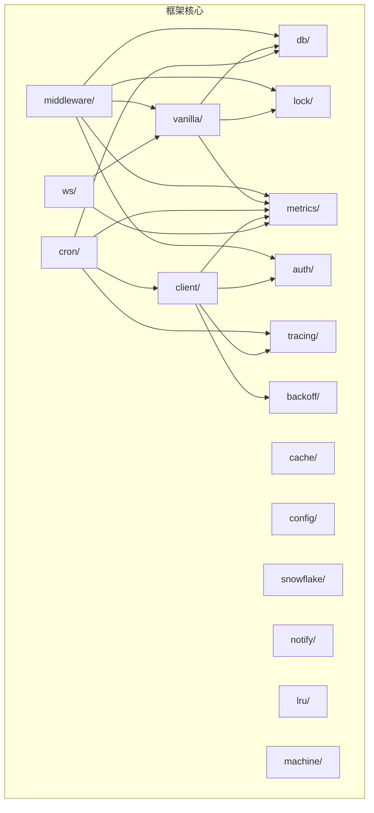
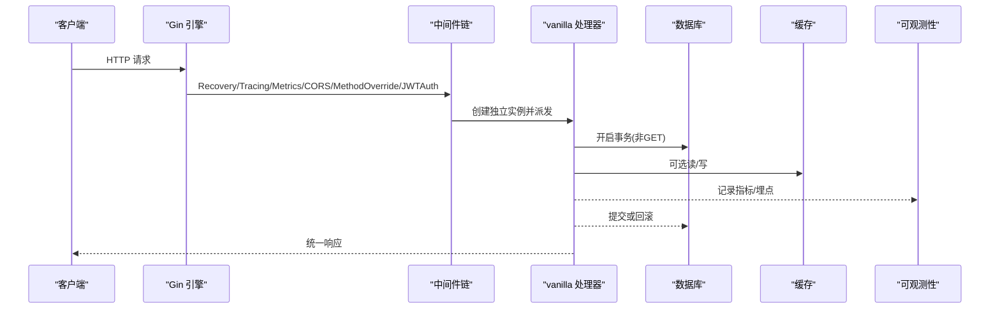
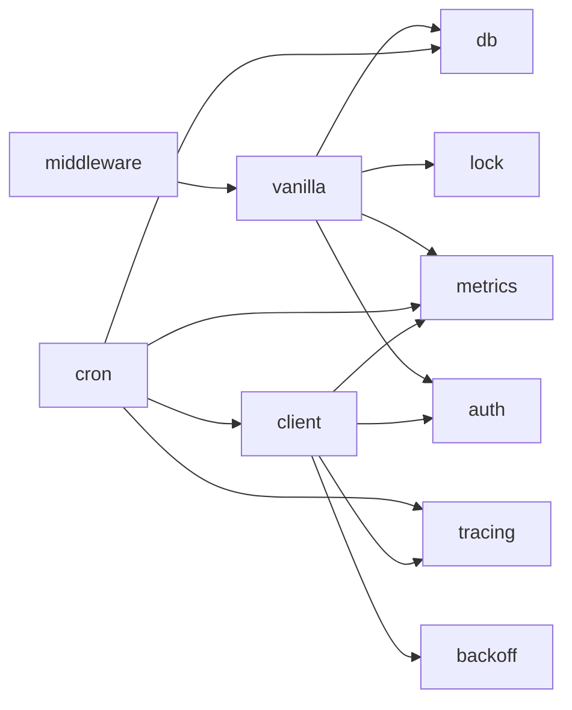

# 部署指南

<cite>
**本文引用的文件**
- [README.md](file://README.md)
- [ARCHITECTURE.md](file://ARCHITECTURE.md)
- [go.mod](file://go.mod)
- [.github/workflows/ci.yml](file://.github/workflows/ci.yml)
- [.github/workflows/compat.yml](file://.github/workflows/compat.yml)
- [config/config.go](file://config/config.go)
- [config/types.go](file://config/types.go)
- [metrics/metrics.go](file://metrics/metrics.go)
- [tracing/tracing.go](file://tracing/tracing.go)
- [notify/dingbot.go](file://notify/dingbot.go)
</cite>

## 目录
1. [简介](#简介)
2. [项目结构](#项目结构)
3. [核心组件](#核心组件)
4. [架构总览](#架构总览)
5. [详细组件分析](#详细组件分析)
6. [依赖分析](#依赖分析)
7. [性能考虑](#性能考虑)
8. [故障排查指南](#故障排查指南)
9. [结论](#结论)
10. [附录](#附录)

## 简介
本指南面向在生产环境部署基于 Carina 框架的微服务应用。内容涵盖：
- 生产部署要求（Go 版本、依赖管理、系统资源）
- 容器化方案（镜像构建与多阶段优化建议）
- CI/CD 流水线配置（自动化测试、代码质量、发布流程）
- 环境配置最佳实践（环境变量、配置中心、密钥管理）
- 监控告警、日志收集与性能调优建议
- 故障排查与常见问题解决方案

## 项目结构
Carina 是一个基于 Gin + GORM 的微服务基础框架，提供声明式路由、事务生命周期、分布式锁、Filter 查询、JWT 认证、Cron 任务、WebSocket REST Proxy、可观测性（Prometheus + OpenTelemetry）等能力。模块职责清晰，依赖方向单向，便于在复杂系统中稳定集成。

图示来源
- [ARCHITECTURE.md:12-45](file://ARCHITECTURE.md#L12-L45)

章节来源
- [ARCHITECTURE.md:12-45](file://ARCHITECTURE.md#L12-L45)

## 核心组件
- 配置加载：支持 YAML 配置文件与环境变量覆盖，敏感字段通过环境变量注入。
- 数据库：GORM 封装，支持事务传播与 Filter 查询。
- 缓存：Redis 客户端封装，支持前缀清理等常用操作。
- 分布式锁：redsync 实现，支持 dummy 模式用于本地开发。
- 认证：JWT 编解码与上下文注入。
- 可观测性：Prometheus 指标与 OpenTelemetry 链路追踪。
- 通知：钉钉机器人告警。

章节来源
- [config/config.go:11-60](file://config/config.go#L11-L60)
- [config/types.go:3-53](file://config/types.go#L3-L53)
- [metrics/metrics.go:10-107](file://metrics/metrics.go#L10-L107)
- [tracing/tracing.go:18-75](file://tracing/tracing.go#L18-L75)
- [notify/dingbot.go:18-133](file://notify/dingbot.go#L18-L133)

## 架构总览
请求生命周期包含中间件链、参数校验、分布式锁、事务、处理器执行与响应返回。该流程确保并发安全、错误恢复与可观测性。

图示来源
- [ARCHITECTURE.md:47-72](file://ARCHITECTURE.md#L47-L72)

章节来源
- [ARCHITECTURE.md:47-72](file://ARCHITECTURE.md#L47-L72)

## 详细组件分析

### 配置与环境变量
- 配置加载顺序：先启用环境变量优先，再读取基础配置文件，随后按 GO_ENV 合并环境覆盖文件；敏感字段显式绑定环境变量。
- 支持的配置项包括服务器、数据库、Redis、认证、追踪、分布式锁等。
- 生产建议：
  - 使用环境变量注入敏感信息（DSN、密码、JWT Secret）。
  - 通过 GO_ENV 切换不同环境的配置覆盖文件。
  - 将配置集中到配置中心时，可在启动前将配置中心内容落盘为 YAML 供框架加载。

章节来源
- [config/config.go:11-60](file://config/config.go#L11-L60)
- [config/types.go:3-53](file://config/types.go#L3-L53)

### 可观测性（指标与追踪）
- Prometheus 指标：端点请求计数、耗时、调用来源、Panic、业务错误、重试、WebSocket 连接数与错误、LRU 缓存操作等。
- OpenTelemetry 追踪：支持 OTLP HTTP 导出器，采样率可配置，支持服务名与传播头。
- 生产建议：
  - 暴露 /metrics 端点给 Prometheus 抓取。
  - 配置 OTLP Endpoint 与采样率，避免高负载下追踪开销过大。
  - 结合日志与追踪 ID 进行问题定位。

章节来源
- [metrics/metrics.go:10-107](file://metrics/metrics.go#L10-L107)
- [tracing/tracing.go:18-75](file://tracing/tracing.go#L18-L75)

### 告警通知
- 钉钉机器人：支持 Token、BotName、Mode、PlatformName、APIURL、超时等配置。
- 生产建议：
  - 设置 Mode=deploy 以在生产发送告警。
  - 合理设置 Timeout，避免阻塞主流程。
  - 对关键事件（Panic、业务错误、重试）触发告警。

章节来源
- [notify/dingbot.go:18-133](file://notify/dingbot.go#L18-L133)

### 依赖管理与 Go 版本
- 最低要求：Go 1.21+（README 中说明），当前 go.mod 指定 Go 1.22。
- 依赖管理：使用 Go Modules，建议在 CI 中缓存依赖以提升构建速度。
- 生产建议：
  - 锁定依赖版本（go.sum），定期审计依赖漏洞。
  - 根据业务需要引入具体数据库驱动（框架不内置）。

章节来源
- [README.md:19-25](file://README.md#L19-L25)
- [go.mod:1-20](file://go.mod#L1-L20)

### CI/CD 流水线
- 自动化测试：构建、vet、带竞态检测的单元测试与覆盖率收集。
- 代码质量：静态检查（staticcheck）。
- 兼容性检查：针对下游项目的矩阵化兼容测试（可启用）。
- 发布流程建议：
  - PR 必须通过 CI 才能合并。
  - 打 Tag 后触发构建镜像并发布制品。
  - 使用缓存加速 Go 依赖下载。

章节来源
- [.github/workflows/ci.yml:1-32](file://.github/workflows/ci.yml#L1-L32)
- [.github/workflows/compat.yml:1-49](file://.github/workflows/compat.yml#L1-L49)

## 依赖分析
- 直接依赖：Gin、GORM、Redis、JWT、Websocket、Prometheus、OpenTelemetry、Cron、Viper 等。
- 间接依赖：网络、加密、JSON、工具库等。
- 依赖方向：middleware → vanilla → {db, lock, metrics, auth}；其余包多为叶子包，降低耦合。

图示来源
- [ARCHITECTURE.md:36-45](file://ARCHITECTURE.md#L36-L45)

章节来源
- [ARCHITECTURE.md:36-45](file://ARCHITECTURE.md#L36-L45)

## 性能考虑
- 数据库连接池：根据 QPS 调整 MaxIdle/MaxOpen，避免连接不足或过多。
- 缓存策略：合理使用 Redis 与内存 LRU，注意 TTL 与命中率。
- 追踪采样：生产环境适当降低采样率以减少开销。
- 中间件开关：按需启用 CORS、Metrics、Tracing，减少不必要的处理。
- 资源限制：为容器设置 CPU/内存限制，防止抖动。
- 日志级别：生产使用 info/warn/error，避免 verbose 日志影响吞吐。

[本节为通用指导，不直接分析具体文件]

## 故障排查指南
- 配置加载失败：检查配置文件路径、GO_ENV 是否生效、敏感环境变量是否正确注入。
- 数据库连接异常：核对 DSN、连接池参数、网络连通性与权限。
- Redis 连接异常：核对地址、密码、DB 号与网络策略。
- JWT 认证失败：确认 JWT Secret 一致，Token 格式正确。
- 追踪不可用：检查 OTLP Endpoint 可达性与采样率配置。
- 告警未送达：确认钉钉 Token、Mode、APIURL 与超时设置。
- 性能问题：查看 Prometheus 指标（请求量、耗时、错误率）、追踪链路定位瓶颈。

章节来源
- [config/config.go:11-60](file://config/config.go#L11-L60)
- [metrics/metrics.go:10-107](file://metrics/metrics.go#L10-L107)
- [tracing/tracing.go:18-75](file://tracing/tracing.go#L18-L75)
- [notify/dingbot.go:18-133](file://notify/dingbot.go#L18-L133)

## 结论
Carina 提供了完善的微服务基础设施，适合在生产环境中快速构建高可用、可观测、易维护的服务。通过合理的配置管理、容器化部署、CI/CD 流水线以及监控告警体系，可以显著提升交付效率与运行稳定性。

[本节为总结，不直接分析具体文件]

## 附录

### 生产环境部署要求
- Go 版本：建议使用 1.21+（README 要求），当前 go.mod 指定 1.22。
- 依赖管理：使用 Go Modules，锁定版本并定期审计。
- 系统资源：根据 QPS 与延迟目标评估 CPU/内存，预留 GC 与系统开销。
- 网络与安全：最小化端口暴露，启用 TLS，严格访问控制。

章节来源
- [README.md:19-25](file://README.md#L19-L25)
- [go.mod:1-20](file://go.mod#L1-L20)

### 容器化部署方案（建议）
- 多阶段构建：第一阶段编译二进制，第二阶段仅拷贝二进制与必要运行时文件，减小镜像体积。
- 非 root 用户运行：提升安全性。
- 健康检查：实现 /health 或 /ready 端点，配合编排平台进行存活与就绪探测。
- 配置注入：通过环境变量或挂载 ConfigMap/Secret 注入配置与密钥。
- 日志输出：输出到 stdout/stderr，由平台统一收集。

[本节为通用建议，不直接分析具体文件]

### CI/CD 流水线配置（建议）
- 分支策略：main/master 保护分支，PR 必须通过 CI。
- 构建缓存：缓存 Go 模块与构建产物。
- 测试覆盖：保留覆盖率报告，设定阈值。
- 静态检查：集成 staticcheck 或其他 linter。
- 发布流程：Tag 触发构建镜像、推送仓库、更新制品库与文档。

章节来源
- [.github/workflows/ci.yml:1-32](file://.github/workflows/ci.yml#L1-L32)
- [.github/workflows/compat.yml:1-49](file://.github/workflows/compat.yml#L1-L49)

### 环境配置最佳实践
- 环境变量管理：敏感字段通过环境变量注入（DSN、密码、JWT Secret）。
- 配置中心集成：启动前拉取配置并落盘为 YAML，交由框架加载。
- 密钥管理：使用平台提供的 Secret 管理，避免硬编码。
- 环境隔离：不同环境使用不同的 GO_ENV 与覆盖文件。

章节来源
- [config/config.go:11-60](file://config/config.go#L11-L60)
- [config/types.go:3-53](file://config/types.go#L3-L53)

### 监控告警配置
- Prometheus：暴露 /metrics，采集端点请求、耗时、错误、重试、WebSocket 连接等指标。
- OpenTelemetry：配置 OTLP Endpoint 与采样率，打通链路追踪。
- 钉钉告警：配置 Token、Mode、APIURL，对关键事件发送告警。

章节来源
- [metrics/metrics.go:10-107](file://metrics/metrics.go#L10-L107)
- [tracing/tracing.go:18-75](file://tracing/tracing.go#L18-L75)
- [notify/dingbot.go:18-133](file://notify/dingbot.go#L18-L133)

### 日志收集与性能调优
- 日志：结构化输出，包含 trace_id、resource、method、status 等关键字段。
- 性能：调整连接池、缓存策略、追踪采样率；避免 N+1 查询与大对象传输。
- 容量规划：压测确定资源上限，设置弹性伸缩策略。

[本节为通用指导，不直接分析具体文件]