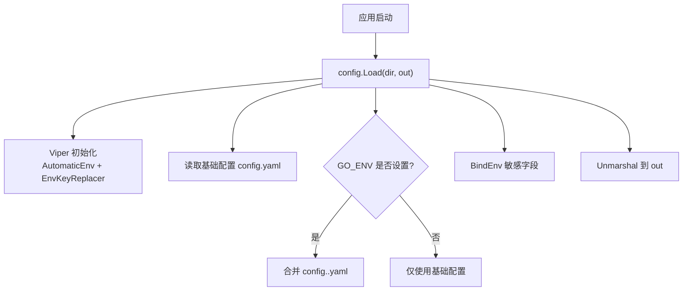
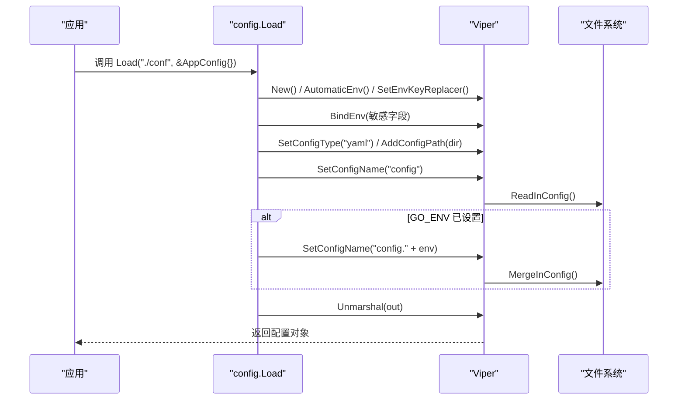
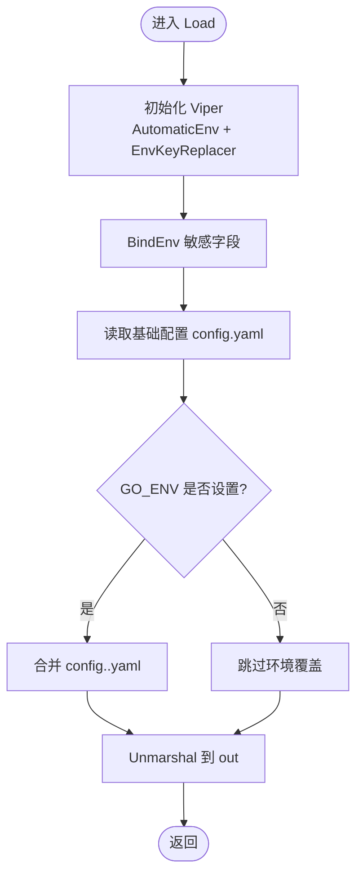
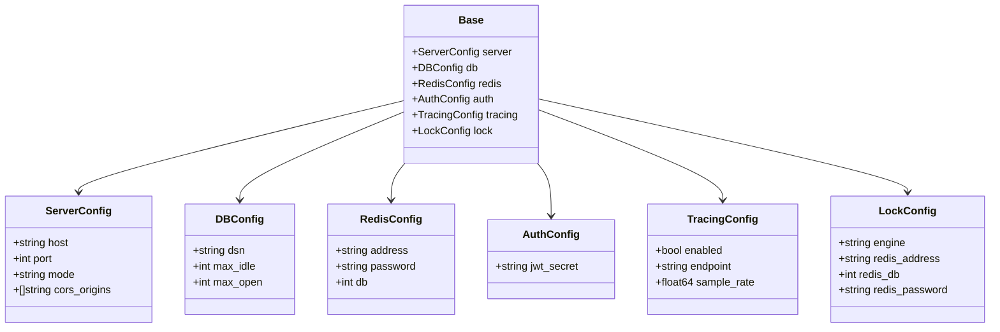
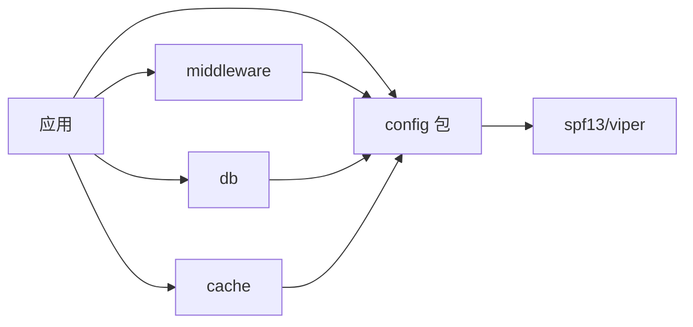

# 配置管理

<cite>
**本文引用的文件**
- [config/config.go](file://config/config.go)
- [config/types.go](file://config/types.go)
- [README.md](file://README.md)
- [ARCHITECTURE.md](file://ARCHITECTURE.md)
</cite>

## 目录
1. [简介](#简介)
2. [项目结构](#项目结构)
3. [核心组件](#核心组件)
4. [架构总览](#架构总览)
5. [详细组件分析](#详细组件分析)
6. [依赖关系分析](#依赖关系分析)
7. [性能考量](#性能考量)
8. [故障排查指南](#故障排查指南)
9. [结论](#结论)
10. [附录](#附录)

## 简介
本技术文档聚焦 Carina 的配置管理系统，围绕 Viper 配置加载器的实现原理、Base 通用配置基座的设计、敏感字段的安全绑定与覆盖策略、以及多环境配置最佳实践进行系统化说明。文档同时提供完整的使用示例路径，帮助读者快速上手定义配置结构、加载配置并访问配置值。

## 项目结构
Carina 将配置相关能力集中在 config 包中：
- config/config.go：基于 Viper 的配置文件加载器，负责环境变量优先、多文件合并、敏感字段绑定与反序列化。
- config/types.go：定义框架通用配置结构（服务、数据库、Redis、认证、追踪、分布式锁等），并提供 Base 通用配置基座供业务项目内嵌扩展。

图表来源
- [config/config.go:21-59](file://config/config.go#L21-L59)

章节来源
- [config/config.go:1-61](file://config/config.go#L1-L61)
- [config/types.go:1-54](file://config/types.go#L1-L54)
- [ARCHITECTURE.md:23-23](file://ARCHITECTURE.md#L23-L23)

## 核心组件
- Viper 配置加载器 Load：封装了环境变量优先、多 YAML 文件合并、敏感字段绑定与结构化反序列化的完整流程。
- Base 通用配置基座：聚合 Server、DB、Redis、Auth、Tracing、Lock 等子配置，作为业务 AppConfig 的内嵌基类，便于统一加载与扩展。

章节来源
- [config/config.go:11-20](file://config/config.go#L11-L20)
- [config/types.go:45-53](file://config/types.go#L45-L53)

## 架构总览
配置加载的生命周期如下：
- 启动时创建 Viper 实例，启用 AutomaticEnv 并设置环境变量键替换规则，确保点号分隔的配置键能映射为下划线分隔的环境变量。
- 显式 BindEnv 敏感字段，使其可被环境变量覆盖。
- 读取基础配置文件 config.yaml；若存在 GO_ENV，则合并对应环境的配置文件 config.<env>.yaml。
- 最终通过 Unmarshal 将配置映射到目标结构体（通常为业务 AppConfig，内嵌 Base）。

图表来源
- [config/config.go:21-59](file://config/config.go#L21-L59)

章节来源
- [config/config.go:21-59](file://config/config.go#L21-L59)

## 详细组件分析

### Viper 配置加载器（Load）
- 环境变量优先：在读取任何配置前启用 AutomaticEnv，并通过 SetEnvKeyReplacer 将配置键中的“.”替换为“_”，从而支持如 DB_DSN、REDIS_ADDRESS 等环境变量覆盖。
- 敏感字段绑定：对 db.dsn、redis.address、redis.password、auth.jwt_secret 等敏感项显式 BindEnv，确保这些字段可通过环境变量注入，避免硬编码或明文写入配置文件。
- 多文件合并：先读取基础配置 config.yaml，再根据 GO_ENV 合并 config.<env>.yaml；当环境文件不存在时容忍错误并提示，保证基础配置可用。
- 结构化反序列化：通过 Unmarshal 将最终配置映射到传入的结构体指针（通常为业务 AppConfig）。

图表来源
- [config/config.go:21-59](file://config/config.go#L21-L59)

章节来源
- [config/config.go:21-59](file://config/config.go#L21-L59)

### Base 通用配置基座
- 设计目的：提供框架级通用配置结构，业务项目可在本地 AppConfig 中内嵌 Base 并追加业务专属字段，实现“框架通用 + 业务扩展”的统一配置模型。
- 包含的子配置：
  - Server：服务监听地址、端口、运行模式、CORS 白名单。
  - DB：数据源连接串、连接池大小等。
  - Redis：地址、密码、库号。
  - Auth：JWT 密钥。
  - Tracing：是否启用、OTLP 端点、采样率。
  - Lock：分布式锁引擎选择及 Redis 参数。
- 映射约定：所有字段均通过 mapstructure tag 指定 YAML/JSON 键名，确保与配置文件一致。

图表来源
- [config/types.go:3-53](file://config/types.go#L3-L53)

章节来源
- [config/types.go:3-53](file://config/types.go#L3-L53)

### 敏感字段安全绑定与环境变量覆盖
- 受保护字段：db.dsn、redis.address、redis.password、auth.jwt_secret。
- 覆盖方式：通过环境变量（如 DB_DSN、REDIS_ADDRESS、REDIS_PASSWORD、AUTH_JWT_SECRET）进行覆盖，优先级高于配置文件。
- 原因：避免将敏感信息以明文形式写入配置文件，提升安全性与运维灵活性。

章节来源
- [config/config.go:24-32](file://config/config.go#L24-L32)

### 配置热更新支持
- 当前实现：Load 为一次性加载，不支持运行时热更新。
- 建议：如需热更新，可在现有 Load 基础上增加 Watcher 机制（例如监听配置文件变更并重新 Unmarshal），但需确保并发安全与状态一致性。该能力不在当前代码范围内。

[本节为概念性说明，不直接分析具体文件]

### 使用示例（定义配置结构、加载配置、访问配置值）
- 定义 AppConfig：在业务项目中定义 AppConfig 结构，内嵌 config.Base，并追加业务专属字段。
- 加载配置：在 main 中调用 config.Load("./conf", &AppConfig{})。
- 访问配置值：通过 cfg.Server.*、cfg.DB.*、cfg.Redis.*、cfg.Auth.* 等路径访问。

参考示例位置
- [README.md:27-74](file://README.md#L27-L74)

章节来源
- [README.md:27-74](file://README.md#L27-L74)

### 多环境配置最佳实践
- 基础配置：将通用默认值放在 config.yaml。
- 环境覆盖：按环境拆分 config.dev.yaml、config.prod.yaml 等，通过 GO_ENV 控制加载。
- 敏感信息：通过环境变量注入，不要放入配置文件。
- 容错处理：环境文件缺失时仅打印提示，不影响基础配置加载。

章节来源
- [config/config.go:37-54](file://config/config.go#L37-L54)

### 配置迁移指南
- 新增字段：在 types.go 中新增结构体字段并添加 mapstructure tag，保持向后兼容。
- 重命名字段：保留旧字段一段时间并标记废弃，逐步迁移至新字段。
- 环境变量命名：遵循“配置键用点号，环境变量以下划线分隔”的规则，如 REDIS_ADDRESS。
- 版本策略：遵循 Semver，Breaking change 需 major 版本升级。

章节来源
- [config/types.go:3-53](file://config/types.go#L3-L53)
- [README.md:137-147](file://README.md#L137-L147)

## 依赖关系分析
- config 包为叶子包，不依赖 carina 内部其他包，职责单一且稳定。
- 对外依赖：spf13/viper，用于配置加载与合并。
- 使用方：应用启动流程、中间件、缓存、数据库等模块通过 AppConfig 获取配置。

图表来源
- [ARCHITECTURE.md:23-23](file://ARCHITECTURE.md#L23-L23)
- [config/config.go:8-8](file://config/config.go#L8-L8)

章节来源
- [ARCHITECTURE.md:36-45](file://ARCHITECTURE.md#L36-L45)
- [config/config.go:8-8](file://config/config.go#L8-L8)

## 性能考量
- 加载时机：配置在应用启动阶段一次性加载，避免运行时重复解析带来的开销。
- 环境变量优先：减少配置文件体积与敏感信息暴露风险，提高部署灵活性。
- 多文件合并：仅在启动时执行一次 MergeInConfig，影响可控。
- 反序列化：Unmarshal 到结构体后，后续访问为内存读取，性能良好。

[本节提供一般性指导，不直接分析具体文件]

## 故障排查指南
- 基础配置文件缺失：ReadInConfig 失败会返回错误，检查 "./conf/config.yaml" 是否存在且格式正确。
- 环境配置文件缺失：MergeInConfig 失败会被容忍并打印提示，确认 GO_ENV 是否正确设置。
- 环境变量未生效：确认 AutomaticEnv 已启用且环境变量命名符合“点号转下划线”的规则；检查敏感字段是否通过 BindEnv 绑定。
- 反序列化失败：Unmarshal 失败通常由类型不匹配或缺少必要字段引起，核对结构体字段与 YAML 键名是否一致。

章节来源
- [config/config.go:37-58](file://config/config.go#L37-L58)

## 结论
Carina 的配置管理以 Viper 为核心，实现了“环境变量优先、多文件合并、敏感字段安全绑定、结构化反序列化”的一体化加载流程。Base 通用配置基座为业务项目提供了统一的配置模型，便于扩展与维护。通过合理的环境变量管理与多环境配置策略，可在保障安全性的同时提升部署灵活性。对于需要热更新的场景，可在现有基础上引入 Watcher 机制以实现运行时配置刷新。

[本节总结性内容，不直接分析具体文件]

## 附录
- 快速开始与使用示例请参考 README 中的 main 示例。
- 架构与模块职责请参考 ARCHITECTURE.md。

章节来源
- [README.md:27-74](file://README.md#L27-L74)
- [ARCHITECTURE.md:12-34](file://ARCHITECTURE.md#L12-L34)