# 项目概述

<cite>
**本文引用的文件**
- [README.md](file://README.md)
- [ARCHITECTURE.md](file://ARCHITECTURE.md)
- [go.mod](file://go.mod)
- [vanilla/rest_resource.go](file://vanilla/rest_resource.go)
- [vanilla/router.go](file://vanilla/router.go)
- [middleware/register.go](file://middleware/register.go)
- [db/tx.go](file://db/tx.go)
- [db/filter.go](file://db/filter.go)
- [lock/lock.go](file://lock/lock.go)
- [auth/jwt.go](file://auth/jwt.go)
- [cron/cron.go](file://cron/cron.go)
- [ws/proxy.go](file://ws/proxy.go)
- [client/resource.go](file://client/resource.go)
- [config/config.go](file://config/config.go)
</cite>

## 目录
1. [简介](#简介)
2. [项目结构](#项目结构)
3. [核心组件](#核心组件)
4. [架构总览](#架构总览)
5. [详细组件分析](#详细组件分析)
6. [依赖关系分析](#依赖关系分析)
7. [性能考量](#性能考量)
8. [故障排查指南](#故障排查指南)
9. [结论](#结论)
10. [附录：快速开始与版本策略](#附录快速开始与版本策略)

## 简介
Carina 是基于 Gin + GORM 的微服务基础框架，完整移植并增强 vanilla（beego fork）已验证的微服务能力。其设计目标是在保持约定式、声明式开发体验的同时，修复原版在事务、并发安全与回滚判据上的缺陷，并提供可观测性、分布式锁、JWT 认证、服务间调用、Cron 任务框架与 WebSocket REST Proxy 等能力。

- 架构选择：Gin 提供高性能 HTTP 路由与中间件生态；GORM 提供驱动无关的 ORM 抽象与事务支持。
- 移植背景：将 vanilla 的 RestResource、参数校验、统一响应、Filter 查询、分页、BusinessContext 等契约迁移到 Gin/GORM，并以每请求实例化解决并发 data race 问题。
- 关键特性：RestResource 体系、自动事务生命周期、分布式锁、Filter 协议、JWT 认证、服务间调用、Cron 任务、WebSocket REST Proxy、Prometheus 指标与 OpenTelemetry 追踪。

**章节来源**
- [README.md:1-18](file://README.md#L1-L18)
- [ARCHITECTURE.md:1-11](file://ARCHITECTURE.md#L1-L11)

## 项目结构
框架采用“契约层 + 中间件 + 基础设施”的分层组织方式：
- vanilla：核心契约层（RestResource、路由注册、参数校验、响应、错误、分页、Filter 提取、BusinessContext 契约）
- middleware：Gin 中间件集合与一站式挂载
- db：GORM 封装（Init、事务传播、ApplyFilters）
- lock：分布式锁接口与 Redis/Dummy 实现
- auth：JWT 编解码与 Claims
- config：Viper 配置加载器与 Base 通用配置基座
- cron：基于 robfig/cron 的任务框架（事务、Recovery、重试）
- client：服务间 HTTP 客户端（JWT 透传、重试、tracing）
- ws：WebSocket REST Proxy（通过 WS 通道派发内部 REST 请求）
- tracing/metrics/snowflake/lru/backoff/notify/machine：可观测性与工具集

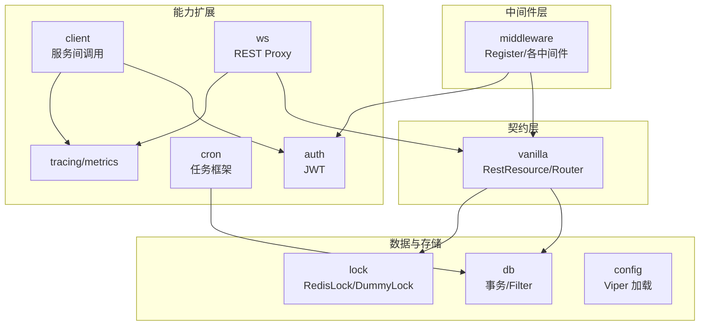

**图表来源**
- [ARCHITECTURE.md:12-45](file://ARCHITECTURE.md#L12-L45)
- [vanilla/router.go:16-64](file://vanilla/router.go#L16-L64)
- [middleware/register.go:28-71](file://middleware/register.go#L28-L71)

**章节来源**
- [ARCHITECTURE.md:12-45](file://ARCHITECTURE.md#L12-L45)

## 核心组件
- RestResource 体系：声明式参数校验、约定式路由、统一响应格式、每请求独立实例保证并发安全。
- 事务生命周期：非 GET 请求自动 Begin/Commit，panic 触发 Rollback；RepositoryBase.DB() 自动感知上下文事务。
- 分布式锁：ILock 接口 + RedisLock/DummyLock；资源级锁声明与裸路由锁中间件。
- Filter 查询协议：__f-字段-操作符 自动转 GORM Where，支持 equal/contain/gt/gte/lt/lte/in/notin/range。
- JWT 认证：token 编解码、业务上下文注入、类型区分（user/service/corp）。
- 服务间调用：HTTP 客户端带 JWT 透传、重试、OpenTelemetry 追踪。
- Cron 任务框架：事务、Recovery、重试策略一体化，支持 only-run 模式。
- WebSocket REST Proxy：WS 通道接收请求，内部复用 Gin Engine 处理并返回统一响应。
- 可观测性：Prometheus metrics 与 OpenTelemetry tracing 初始化与埋点。

**章节来源**
- [README.md:5-17](file://README.md#L5-L17)
- [ARCHITECTURE.md:47-104](file://ARCHITECTURE.md#L47-L104)

## 架构总览
请求进入后经过中间件链（Recovery → Tracing → Metrics → CORS → MethodOverride → JWTAuth → Extra → RequestLog），再由 vanilla 创建处理器完成参数解析、锁获取、事务开启、Prepare/Finish 钩子、反射派发方法、提交前/后回调与 Finish。

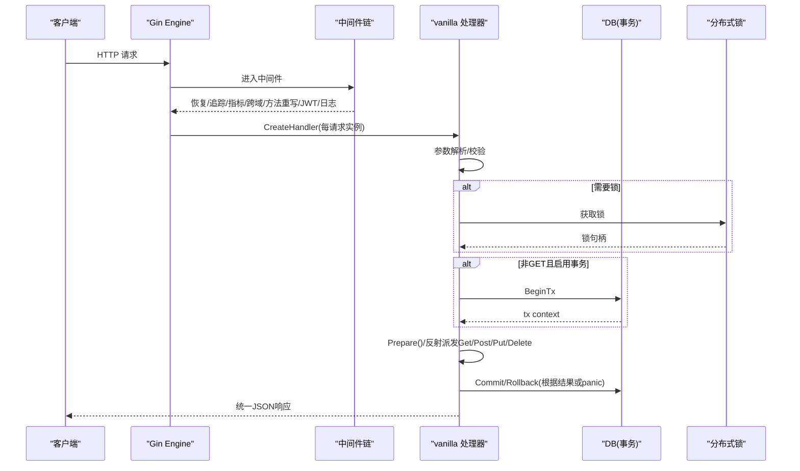

**图表来源**
- [ARCHITECTURE.md:47-72](file://ARCHITECTURE.md#L47-L72)
- [middleware/register.go:28-71](file://middleware/register.go#L28-L71)
- [db/tx.go:10-37](file://db/tx.go#L10-L37)
- [vanilla/rest_resource.go:71-132](file://vanilla/rest_resource.go#L71-L132)

## 详细组件分析

### RestResource 体系与路由
- 接口契约：RestResourceInterface 定义 Resource/GetParameters/DisableTx/GetLockKey/PrepareOrm/GetBusinessContext 等，确保框架稳定契约。
- 每请求实例：避免 vanilla 单例导致的 data race，启动时预计算元数据缓存。
- 路由生成：Router 为每个资源生成标准 URL 与 API URL，并支持别名。
- 参数与响应：内置 GetString/GetInt/GetJSON 等方法与 ReturnJSON/ReturnError 统一响应。

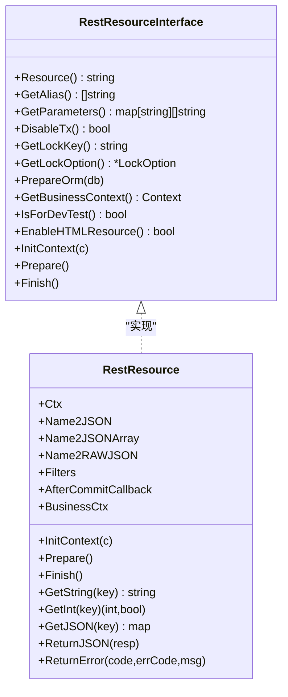

**图表来源**
- [vanilla/rest_resource.go:13-44](file://vanilla/rest_resource.go#L13-L44)
- [vanilla/rest_resource.go:71-132](file://vanilla/rest_resource.go#L71-L132)
- [vanilla/rest_resource.go:264-278](file://vanilla/rest_resource.go#L264-L278)

**章节来源**
- [vanilla/rest_resource.go:13-132](file://vanilla/rest_resource.go#L13-L132)
- [vanilla/router.go:16-64](file://vanilla/router.go#L16-L64)

### 事务生命周期管理
- 自动事务：非 GET 请求默认开启事务；panic 触发 rollback。
- 事务传播：BeginTx 将事务注入 request context；RepositoryBase.DB() 从 context 取 tx 或回退全局 DB。
- 裸场景：db.WithTransaction(ctx, fn) 用于非 handler 场景。

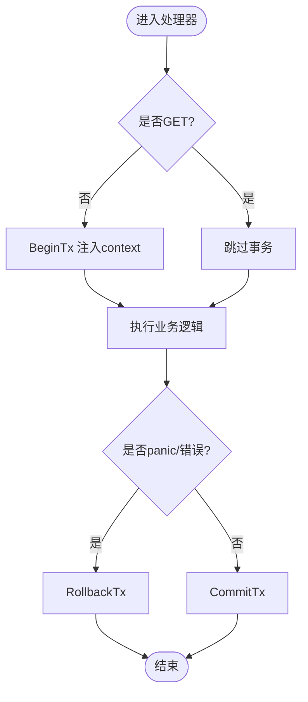

**图表来源**
- [ARCHITECTURE.md:74-87](file://ARCHITECTURE.md#L74-L87)
- [db/tx.go:10-37](file://db/tx.go#L10-L37)

**章节来源**
- [ARCHITECTURE.md:74-87](file://ARCHITECTURE.md#L74-L87)
- [db/tx.go:10-37](file://db/tx.go#L10-L37)

### 分布式锁
- ILock 接口：Lock(key, opts...) 返回 Mutex；支持 RedisLock 与 DummyLock。
- 资源级锁：RestResource.GetLockKey() 非空时自动加锁；也可使用裸路由锁中间件。
- 选项：超时、尝试次数等由 LockOption 控制。

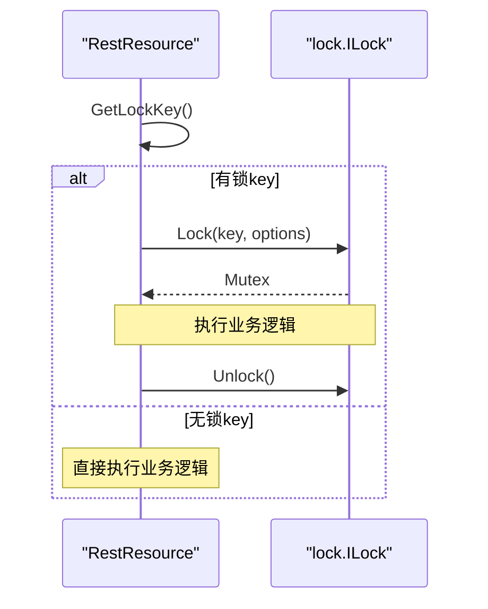

**图表来源**
- [lock/lock.go:14-49](file://lock/lock.go#L14-L49)
- [vanilla/rest_resource.go:25-30](file://vanilla/rest_resource.go#L25-L30)

**章节来源**
- [lock/lock.go:14-69](file://lock/lock.go#L14-L69)
- [vanilla/rest_resource.go:25-30](file://vanilla/rest_resource.go#L25-L30)

### Filter 查询协议
- 协议：__f-字段-操作符 形式，如 __f-name-contain、__f-age-gt、__f-status-in。
- 转换：ApplyFilters 将过滤器转为 GORM Where 条件，支持多种操作符与范围查询。

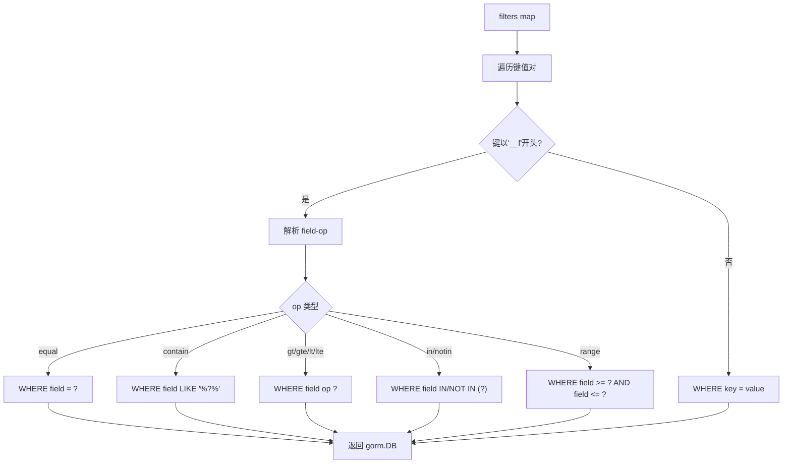

**图表来源**
- [db/filter.go:10-61](file://db/filter.go#L10-L61)

**章节来源**
- [db/filter.go:10-61](file://db/filter.go#L10-L61)

### JWT 认证
- 密钥初始化：auth.Init(secret) 设置全局 HMAC-SHA256 密钥。
- Claims：包含 userId、authUserId、type（user/service/corp）。
- 编解码：Encode/Decode 支持过期校验与签名方法检查；ParseUserId 按类型解析用户ID。

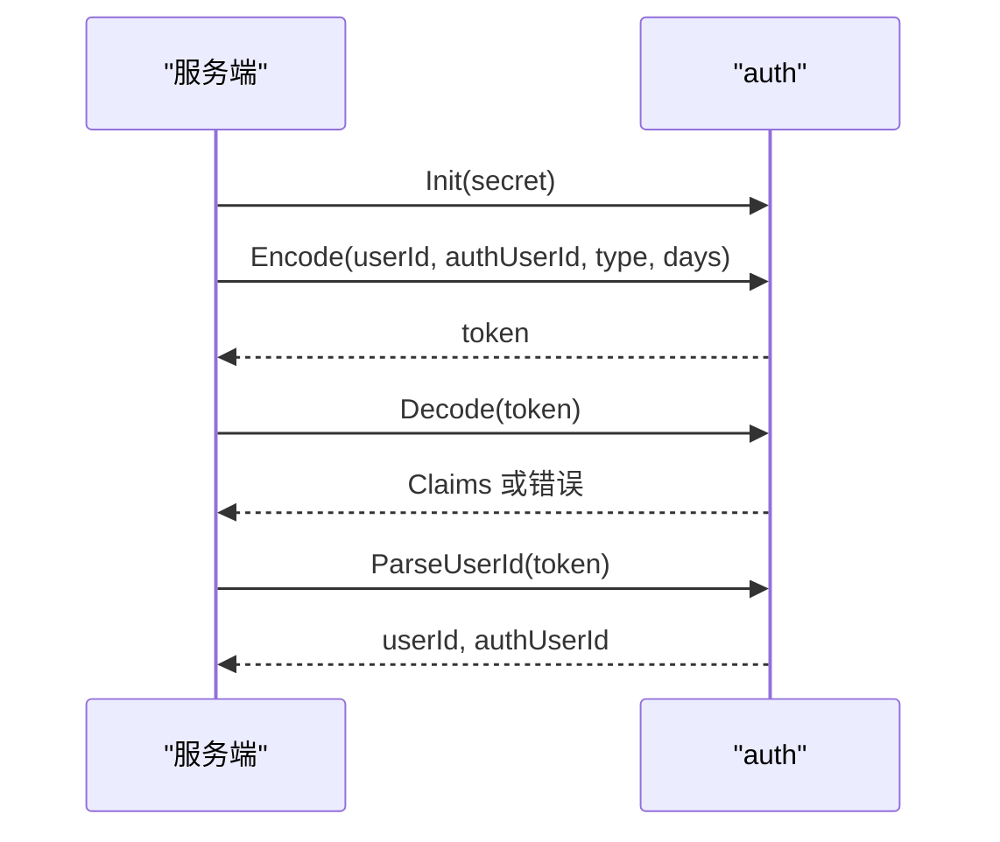

**图表来源**
- [auth/jwt.go:18-92](file://auth/jwt.go#L18-L92)

**章节来源**
- [auth/jwt.go:18-92](file://auth/jwt.go#L18-L92)

### 服务间调用
- 客户端：Resource 持有 context（含 JWT token + tracing span），发起 HTTP 调用。
- 功能：JWT 透传、重试（默认3次）、OpenTelemetry 追踪传播、URL 构造与参数编码。
- 配置：Init(serviceName, serviceMode, apiServerHost) 设置全局信息。

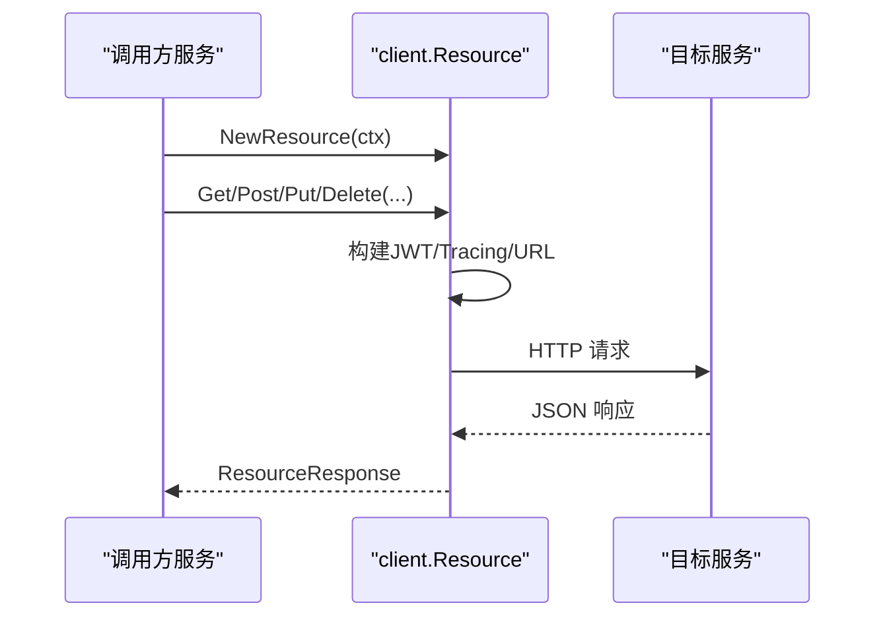

**图表来源**
- [client/resource.go:39-44](file://client/resource.go#L39-L44)
- [client/resource.go:71-126](file://client/resource.go#L71-L126)
- [client/resource.go:128-224](file://client/resource.go#L128-L224)

**章节来源**
- [client/resource.go:39-224](file://client/resource.go#L39-L224)

### Cron 任务框架
- 接口：TaskInterface 定义 Run/GetName/IsEnableTx。
- 包装：taskWrapper 统一处理 tracing、事务、Recovery、日志与耗时统计。
- 注册：RegisterTask/RegisterFunc 支持对象与函数式任务；OnlyRun 标记唯一运行任务。
- 启动：StartCronTasks 启动所有任务；StopCronTasks 简化为进程退出停止。

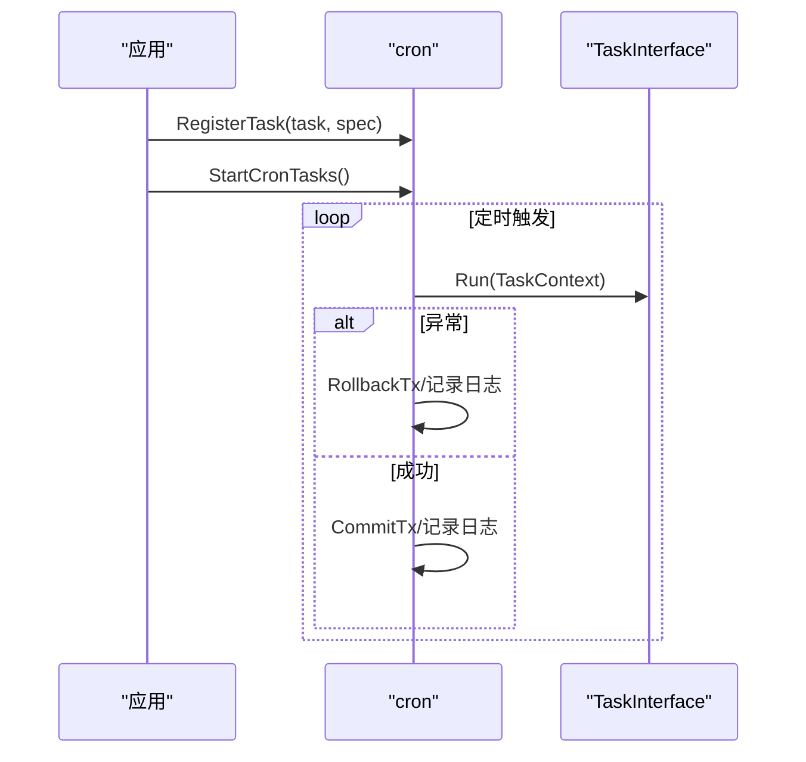

**图表来源**
- [cron/cron.go:16-24](file://cron/cron.go#L16-L24)
- [cron/cron.go:67-116](file://cron/cron.go#L67-L116)
- [cron/cron.go:118-182](file://cron/cron.go#L118-L182)

**章节来源**
- [cron/cron.go:16-182](file://cron/cron.go#L16-L182)

### WebSocket REST Proxy
- 功能：通过 WebSocket 通道接收 REST 请求，内部复用 Gin Engine 处理，并将统一响应经 WS 返回。
- 流程：升级连接 → 读取 JSON 请求 → 构造 mock http.Request → ServeHTTP → 捕获响应 → 写回 WS。
- 可观测性：错误计数与活跃连接数指标。

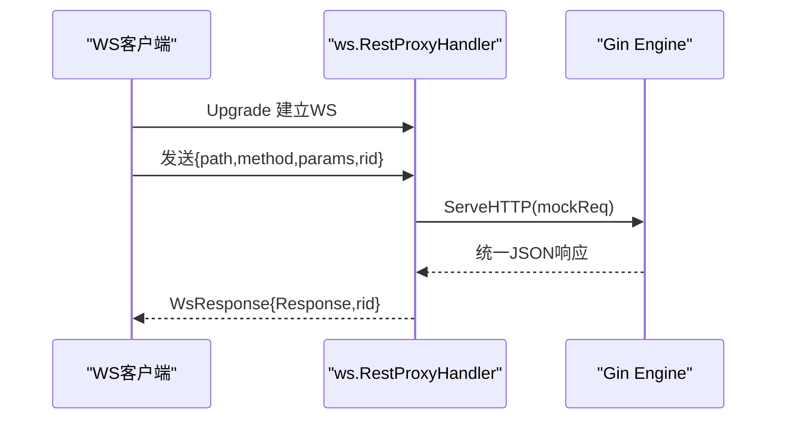

**图表来源**
- [ws/proxy.go:48-79](file://ws/proxy.go#L48-L79)
- [ws/proxy.go:150-199](file://ws/proxy.go#L150-L199)

**章节来源**
- [ws/proxy.go:48-216](file://ws/proxy.go#L48-L216)

### 中间件与配置
- 中间件注册：Register 一站式挂载 Recovery/Tracing/Metrics/CORS/MethodOverride/JWTAuth/Extra/RequestLog。
- 配置加载：Load 支持环境变量覆盖与环境配置文件合并，敏感字段显式绑定。

**章节来源**
- [middleware/register.go:7-71](file://middleware/register.go#L7-L71)
- [config/config.go:11-60](file://config/config.go#L11-L60)

## 依赖关系分析
- 单向依赖：middleware → vanilla → {db, lock, metrics, auth}；cron → {db, client, tracing, metrics}；ws → {vanilla, metrics}；client → {auth, tracing, metrics, backoff}。
- 外部依赖：Gin、GORM、redsync、JWT、gorilla/websocket、Prometheus、OpenTelemetry、Viper、robfig/cron、go-redis。

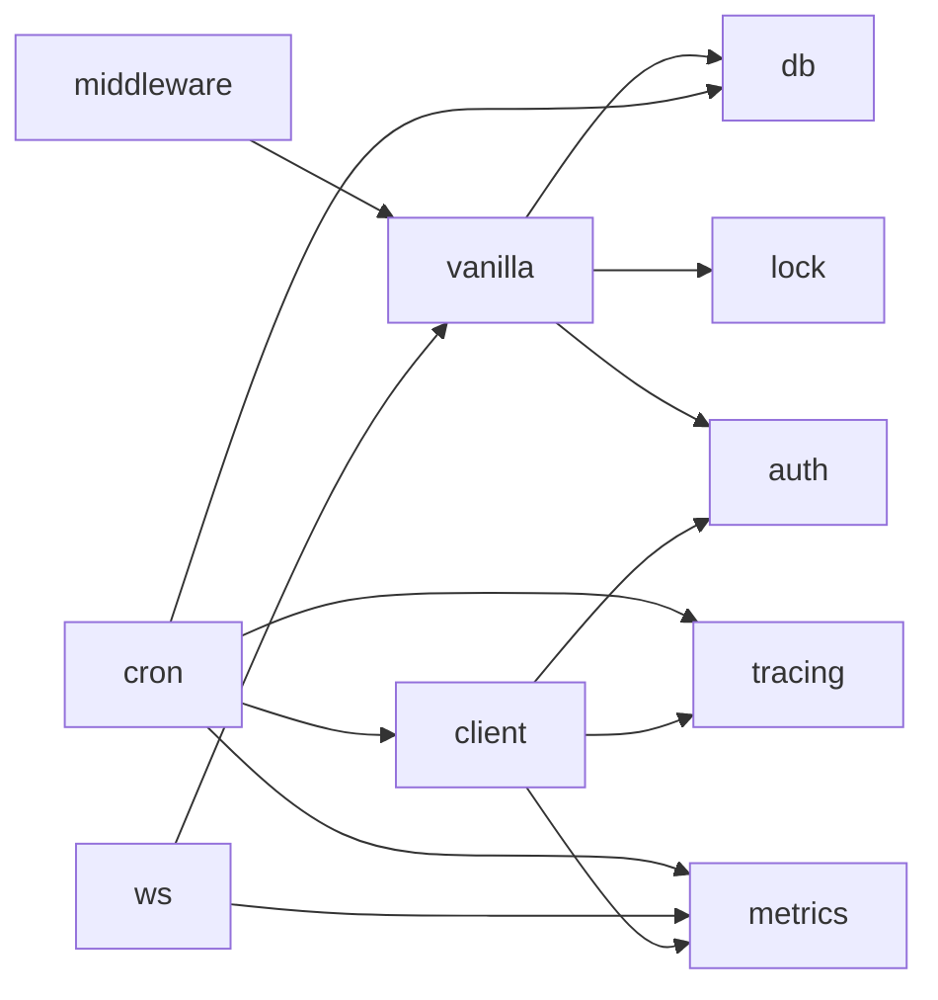

**图表来源**
- [ARCHITECTURE.md:36-45](file://ARCHITECTURE.md#L36-L45)
- [go.mod:5-20](file://go.mod#L5-L20)

**章节来源**
- [ARCHITECTURE.md:36-45](file://ARCHITECTURE.md#L36-L45)
- [go.mod:5-20](file://go.mod#L5-L20)

## 性能考量
- 每请求实例化 RestResource 避免共享状态竞争，提升并发安全性。
- 事务仅在非 GET 请求开启，减少读多写少场景的开销。
- 分布式锁支持超时与重试次数，避免长时间阻塞。
- 服务间调用使用连接池与合理超时，降低网络抖动影响。
- 可观测性指标与链路追踪便于定位瓶颈。

[本节为通用性能建议，不直接分析具体文件]

## 故障排查指南
- 事务未生效：确认非 GET 请求且 EnableTx=true；检查 RepositoryBase.DB() 是否正确从 context 获取事务。
- 锁冲突：检查 GetLockKey 返回值与 LockOption 超时/重试设置；确认 Redis 连通性。
- JWT 失败：确认 auth.Init 已调用且密钥一致；检查 token 是否过期或签名方法不符。
- Filter 无效：确认参数名遵循 __f-字段-操作符 规范；检查操作符是否在支持列表内。
- Cron 任务异常：查看 taskWrapper 日志输出；确认 IsEnableTx 与数据库连接正常。
- WS Proxy 错误：关注 metrics 的错误计数器与日志；检查路径与方法规范化。

**章节来源**
- [ARCHITECTURE.md:47-104](file://ARCHITECTURE.md#L47-L104)
- [db/tx.go:10-37](file://db/tx.go#L10-L37)
- [lock/lock.go:27-69](file://lock/lock.go#L27-L69)
- [auth/jwt.go:18-92](file://auth/jwt.go#L18-L92)
- [db/filter.go:10-61](file://db/filter.go#L10-L61)
- [cron/cron.go:67-116](file://cron/cron.go#L67-L116)
- [ws/proxy.go:48-216](file://ws/proxy.go#L48-L216)

## 结论
Carina 以 Gin + GORM 为基础，将 vanilla 的微服务能力系统化地迁移并增强，提供了稳定的契约边界、完善的中间件生态与可观测性支撑。通过 RestResource 体系、自动事务、分布式锁、Filter 协议、JWT、服务间调用、Cron 与 WS Proxy，开发者可以快速构建高可用、易维护的微服务。框架遵循 Semver 与 Options 模式，保障向后兼容与平滑升级。

[本节为总结性内容，不直接分析具体文件]

## 附录：快速开始与版本策略

### 安装要求与依赖管理
- Go 版本：1.21+（模块声明为 1.22，建议使用 1.21+ 以兼容）
- 依赖：框架不引入任何 DB 驱动，需项目自行 require mysql/postgres 等驱动
- 安装：go get github.com/suna0/carina@latest

**章节来源**
- [README.md:19-26](file://README.md#L19-L26)
- [go.mod:1-4](file://go.mod#L1-L4)

### 基本使用示例
- 初始化：加载配置、初始化 DB/Redis、创建 Gin Engine 并注册中间件、注册资源路由、启动服务
- 编写 Resource：继承 RestResource，实现 Resource/GetParameters/Get 等方法，使用 ReturnJSON 返回统一响应
- Filter 查询：使用 __f-字段-操作符 参数并通过 ApplyFilters 转换为 GORM Where

**章节来源**
- [README.md:27-135](file://README.md#L27-L135)

### 版本策略与兼容性
- 遵循 Semver：bug 修复 patch、新增能力 minor、破坏性变更 major
- public API 从 Deprecated 到删除至少跨 2 个 minor 版本
- Options 模式保证新能力零值默认行为，不改已有行为
- 兼容性 CI 与 go.work 联动保障下游构建与测试

**章节来源**
- [README.md:137-147](file://README.md#L137-L147)
- [ARCHITECTURE.md:115-121](file://ARCHITECTURE.md#L115-L121)